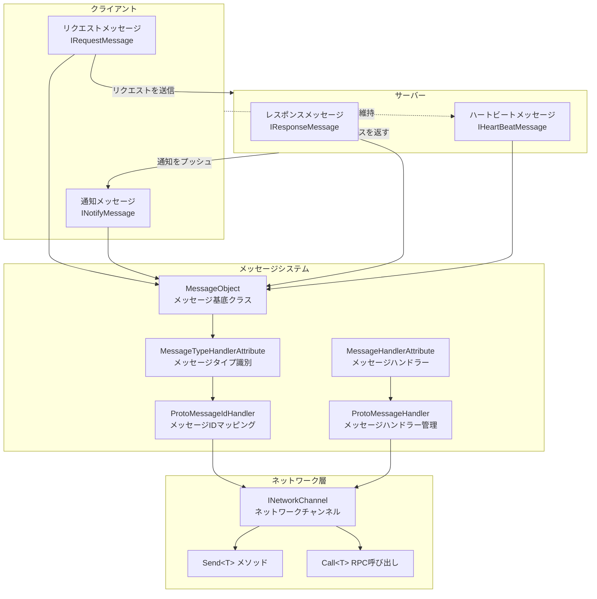
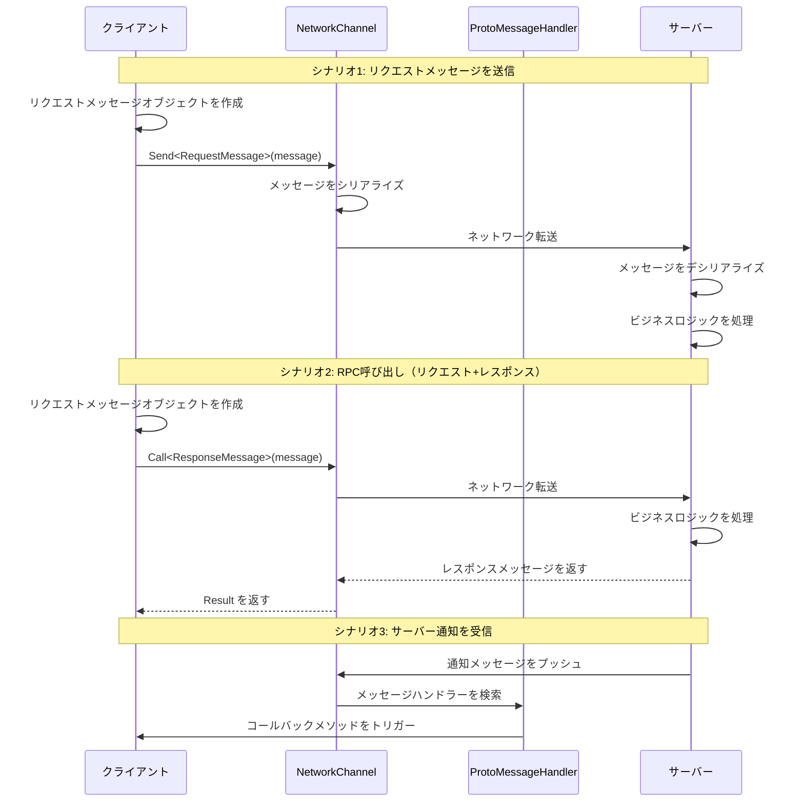

# メッセージタイプ

メッセージタイプは、GameFrameX ネットワークフレームワークにおいてクライアントとサーバー間の通信データ構造を定義するためのシステムです。メッセージタイプにより、開発者はリクエストメッセージ、レスポンスメッセージ、通知メッセージ、ハートビートメッセージを定義でき、信頼性の高いネットワーク通信を実現します。

## 概要

GameFrameX ネットワークフレームワークはメッセージベースの通信モードを採用しており、すべてのネットワーク転送データはメッセージオブジェクトとしてカプセル化されます。フレームワークは完全なメッセージタイプ体系を提供し、以下をサポートします：

- **リクエストメッセージ (Request)**：クライアントからサーバーへのリクエスト
- **レスポンスメッセージ (Response)**：サーバーからクライアントへのリクエストへの応答
- **通知メッセージ (Notify)**：サーバーがクライアントに積極的にプッシュするメッセージ
- **ハートビートメッセージ (HeartBeat)**：接続を維持するための軽量メッセージ

メッセージタイプシステムは `MessageObject` 基底クラスに基づいて構築され、JSON と Protobuf の2つのシリアライズ方式をサポートし、`MessageTypeHandlerAttribute` と組み合わせて各メッセージ类型に一意のメッセージ ID を割り当てます。

## アーキテクチャ



### メッセージ流转フロー



## コアコンセプト

### MessageObject - メッセージ基底クラス

すべてのネットワークメッセージは `MessageObject` 基底クラスを継承する必要があります。このクラスは一意の ID 生成とシリアライズサポートを提供します。

> Source: [MessageObject.cs](https://github.com/GameFrameX/com.gameframex.unity.network/blob/main/Runtime/Network/Base/MessageObject.cs#L1-L56)

```csharp
public class MessageObject : IReference
{
    /// <summary>
    /// メッセージユニーク番号
    /// </summary>
    public int UniqueId { get; private set; }

    protected MessageObject()
    {
        UpdateUniqueId();
    }

    /// <summary>
    /// 一意のコードを更新
    /// </summary>
    public void UpdateUniqueId()
    {
        UniqueId = Utility.IdGenerator.GetNextUniqueIntId();
    }

    /// <summary>
    /// 参照をクリア
    /// </summary>
    public virtual void Clear()
    {
    }
}
```

### メッセージタイプインターフェース

フレームワークは4つのコアインターフェースを定義して異なるタイプのメッセージを区別します：

| インターフェース | 用途 | 説明 |
|------|------|------|
| `IRequestMessage` | リクエストメッセージ | クライアントからサーバーへのリクエスト |
| `IResponseMessage` | レスポンスメッセージ | サーバーからクライアントへのレスポンス、ErrorCode プロパティを含む |
| `INotifyMessage` | 通知メッセージ | サーバーがクライアントに積極的にプッシュするメッセージ |
| `IHeartBeatMessage` | ハートビートメッセージ | 接続を維持するための軽量メッセージ |

> Source: [IRequestMessage.cs](https://github.com/GameFrameX/com.gameframex.unity.network/blob/main/Runtime/Network/Base/IRequestMessage.cs#L1-L9)
> Source: [IResponseMessage.cs](https://github.com/GameFrameX/com.gameframex.unity.network/blob/main/Runtime/Network/Base/IResponseMessage.cs#L1-L13)
> Source: [INotifyMessage.cs](https://github.com/GameFrameX/com.gameframex.unity.network/blob/main/Runtime/Network/Base/INotifyMessage.cs#L1-L9)
> Source: [IHeartBeatMessage.cs](https://github.com/GameFrameX/com.gameframex.unity.network/blob/main/Runtime/Network/Base/IHeartBeatMessage.cs#L1-L9)

### MessageTypeHandlerAttribute - メッセージタイプ識別

メッセージクラスの一意の ID をマークするために使用します。この属性はメッセージIDマッピングシステムのコアであり、`ProtoMessageIdHandler` と組み合わせてメッセージIDとタイプの双向マッピングを実現します。

> Source: [MessageTypeHandlerAttribute.cs](https://github.com/GameFrameX/com.gameframex.unity.network/blob/main/Runtime/Network/Base/MessageTypeHandlerAttribute.cs#L1-L27)

### MessageHandlerAttribute - メッセージハンドラー

特定のメッセージタイプを処理するコールバックメソッドをマークするために使用されます。この属性により、開発者は宣言的にメッセージハンドラーを登録できます。

> Source: [MessageHandlerAttribute.cs](https://github.com/GameFrameX/com.gameframex.unity.network/blob/main/Runtime/Network/Base/MessageHandlerAttribute.cs#L1-L196)

## 使用例

### リクエストメッセージを定義する

クライアントからサーバーへ送信するリクエストメッセージを定義します：

```csharp
using GameFrameX.Network.Runtime;

#if ENABLE_GAME_FRAME_X_PROTOBUF
using ProtoBuf;
#endif

#if ENABLE_GAME_FRAME_X_PROTOBUF
[ProtoContract]
#endif
[MessageTypeHandler(1)]  // メッセージIDは1
public class C2S_LoginRequest : MessageObject, IRequestMessage
{
#if ENABLE_GAME_FRAME_X_PROTOBUF
    [ProtoMember(1)]
#endif
    public string UserName { get; set; }

#if ENABLE_GAME_FRAME_X_PROTOBUF
    [ProtoMember(2)]
#endif
    public string Password { get; set; }
}
```

### レスポンスメッセージを定義する

サーバーからクライアントへのレスポンスメッセージを定義します：

```csharp
#if ENABLE_GAME_FRAME_X_PROTOBUF
[ProtoContract]
#endif
[MessageTypeHandler(101)]  // メッセージIDは101
public class S2C_LoginResponse : MessageObject, IResponseMessage
{
#if ENABLE_GAME_FRAME_X_PROTOBUF
    [ProtoMember(1)]
#endif
    public int ErrorCode { get; set; }

#if ENABLE_GAME_FRAME_X_PROTOBUF
    [ProtoMember(2)]
#endif
    public string Token { get; set; }

#if ENABLE_GAME_FRAME_X_PROTOBUF
    [ProtoMember(3)]
#endif
    public long UserId { get; set; }
}
```

### 通知メッセージを定義する

サーバーがクライアントに積極的にプッシュする通知メッセージを定義します：

```csharp
#if ENABLE_GAME_FRAME_X_PROTOBUF
[ProtoContract]
#endif
[MessageTypeHandler(201)]  // メッセージIDは201
public class S2C_NoticeNotify : MessageObject, INotifyMessage
{
#if ENABLE_GAME_FRAME_X_PROTOBUF
    [ProtoMember(1)]
#endif
    public string Title { get; set; }

#if ENABLE_GAME_FRAME_X_PROTOBUF
    [ProtoMember(2)]
#endif
    public string Content { get; set; }
}
```

### ハートビートメッセージを定義する

接続を維持するためのハートビートメッセージを定義します：

```csharp
#if ENABLE_GAME_FRAME_X_PROTOBUF
[ProtoContract]
#endif
[MessageTypeHandler(10001)]  // メッセージIDは10001
public class HeartBeatMessage : MessageObject, IHeartBeatMessage
{
#if ENABLE_GAME_FRAME_X_PROTOBUF
    [ProtoMember(1)]
#endif
    public long Timestamp { get; set; }
}
```

### メッセージハンドラーを登録する

`MessageHandlerAttribute` を使用して、サーバーからプッシュされたメッセージを受信するメッセージハンドラーを登録します：

```csharp
public class NetworkMessageHandler : IMessageHandler
{
    public void Register()
    {
        ProtoMessageHandler.Add(this);
    }

    [MessageHandler(typeof(S2C_LoginResponse), nameof(OnLoginResponse))]
    private void OnLoginResponse(S2C_LoginResponse message)
    {
        if (message.ErrorCode == 0)
        {
            UnityEngine.Debug.Log($"ログイン成功! UserId: {message.UserId}");
        }
        else
        {
            UnityEngine.Debug.LogError($"ログイン失敗! ErrorCode: {message.ErrorCode}");
        }
    }

    [MessageHandler(typeof(S2C_NoticeNotify), nameof(OnNoticeNotify))]
    private void OnNoticeNotify(S2C_NoticeNotify message)
    {
        UnityEngine.Debug.Log($"通知を受信: {message.Title} - {message.Content}");
    }
}
```

### メッセージを送信する

`INetworkChannel` を通じてメッセージを送信します：

```csharp
// 通常のリクエストメッセージを送信
var loginRequest = new C2S_LoginRequest
{
    UserName = "player1",
    Password = "password123"
};
networkChannel.Send(loginRequest);

// RPCリクエストを送信してレスポンスを待機
var loginRequest2 = new C2S_LoginRequest
{
    UserName = "player1",
    Password = "password123"
};
var response = await networkChannel.Call<S2C_LoginResponse>(loginRequest2);
if (response.ErrorCode == 0)
{
    UnityEngine.Debug.Log($"RPC呼び出し成功! Token: {response.Token}");
}
```

> Source: [INetworkChannel.cs](https://github.com/GameFrameX/com.gameframex.unity.network/blob/main/Runtime/Network/Interface/INetworkChannel.cs#L228-L241)

## ProtoMessageIdHandler - メッセージIDマッピング管理

`ProtoMessageIdHandler` はすべてのメッセージタイプとメッセージID間のマッピング関係を管理します。プログラム起動時に、`Init` メソッドを呼び出してすべてのメッセージタイプをスキャンして登録する必要があります。

> Source: [ProtoMessageIdHandler.cs](https://github.com/GameFrameX/com.gameframex.unity.network/blob/main/Runtime/Network/Network/ProtoMessageIdHandler.cs#L1-L170)

### メッセージIDマッピングを初期化する

```csharp
// プログラム起動時に呼び出す
var assembly = typeof(C2S_LoginRequest).Assembly;
ProtoMessageIdHandler.Init(assembly);
```

`Init` メソッドは自動的にプログラム集中で `MessageTypeHandlerAttribute` を持つすべてのタイプをスキャンし、実装されたインターフェースに応じて対応するマッピング辞書に追加します：

- `IRequestMessage` を実装 → リクエストメッセージ辞書に追加
- `IResponseMessage` を実装 → レスポンスメッセージ辞書に追加
- `INotifyMessage` を実装 → レスポンスメッセージ辞書に追加（通知メッセージはレスポンスメッセージチャネルでも受信）
- `IHeartBeatMessage` を実装 → ハートビートメッセージリストに追加

## ProtoMessageHandler - メッセージハンドラー管理

`ProtoMessageHandler` はメッセージハンドラーの登録と呼び出しを管理します。

> Source: [ProtoMessageHandler.cs](https://github.com/GameFrameX/com.gameframex.unity.network/blob/main/Runtime/Network/Network/ProtoMessageHandler.cs#L1-L144)

### メッセージハンドラーを登録する

```csharp
var messageHandler = new NetworkMessageHandler();
ProtoMessageHandler.Add(messageHandler);
```

### メッセージハンドラーを移除する

```csharp
ProtoMessageHandler.Remove(messageHandler);
```

## API リファレンス

### MessageObject

すべてのメッセージの基底クラス。

**プロパティ：**
| プロパティ | タイプ | 説明 |
|------|------|------|
| UniqueId | int | メッセージユニーク識別子 |

**メソッド：**
| メソッド | 返すタイプ | 説明 |
|------|----------|------|
| UpdateUniqueId() | void | メッセージの一意のIDを更新 |
| SetUpdateUniqueId(int uniqueId) | void | メッセージの一意のIDを設定 |
| Clear() | void | 参照リソースをクリア |

### MessageTypeHandlerAttribute

メッセージクラスをマークして一意のメッセージIDを割り当てます。

**コンストラクター：**
```csharp
public MessageTypeHandlerAttribute(int messageId)
```

**プロパティ：**
| プロパティ | タイプ | 説明 |
|------|------|------|
| MessageId | int | メッセージの一意のID |

### MessageHandlerAttribute

メッセージ処理メソッドをマークするために使用されます。

**コンストラクター：**
```csharp
public MessageHandlerAttribute(Type message, string invokeMethodName)
```

**パラメータ：**
- `message` (Type): MessageObject を継承し、INotifyMessage を実装するメッセージタイプ
- `invokeMethodName` (string): メッセージを処理するメソッド名

### ProtoMessageHandler

メッセージハンドラーの登録と呼び出しを管理します。

**メソッド：**
| メソッド | 説明 |
|------|------|
| Add(IMessageHandler) | メッセージハンドラーを登録 |
| Remove(IMessageHandler) | メッセージハンドラーを移除 |

### ProtoMessageIdHandler

メッセージIDとタイプの双向マッピングを管理します。

**メソッド：**
| メソッド | 返すタイプ | 説明 |
|------|----------|------|
| Init(Assembly) | void | メッセージIDマッピングを初期化 |
| GetReqTypeById(int) | Type | メッセージIDに応じてリクエストタイプを取得 |
| GetReqMessageIdByType(Type) | int | タイプに応じてリクエストメッセージIDを取得 |
| GetRespTypeById(int) | Type | メッセージIDに応じてレスポンスタイプを取得 |
| GetRespMessageIdByType(Type) | int | タイプに応じてレスポンスメッセージIDを取得 |
| IsHeartbeat(Type) | bool | ハートビートメッセージタイプかどうかを判断 |

### INetworkChannel

ネットワークチャンネルインターフェース、メッセージ送信機能を提供します。

**メソッド：**
| メソッド | 説明 |
|------|------|
| `Send<T>`(T messageObject) | メッセージをサーバーに送信 |
| `Call<TResult>`(MessageObject, bool) | RPCリクエストを送信してレスポンスを待機 |

## 関連リンク

- [ネットワークマネージャー](./4-core-concepts.1-network-manager) - NetworkManager を使用してネットワーク接続を作成和管理する方法の詳細
- [ネットワークチャンネル](./4-core-concepts.2-network-channel) - ネットワークチャンネルの設定とメッセージ処理の詳細
- [パケットハンドラー](./4-core-concepts.4-packet-handlers) - データパケットの処理フローの詳細
- [ハートビート](./5-heartbeat) - ハートビートメッセージの動作原理の詳細
- [イベントシステム](./6-events) - ネットワークイベント処理の詳細
- [RPC リモート呼び出し](./8-rpc) - RPC 呼び出しの詳しい使用方法
