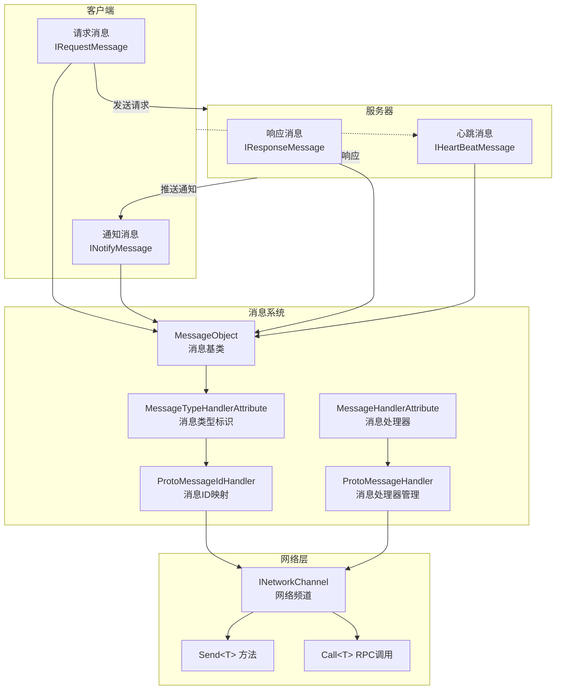
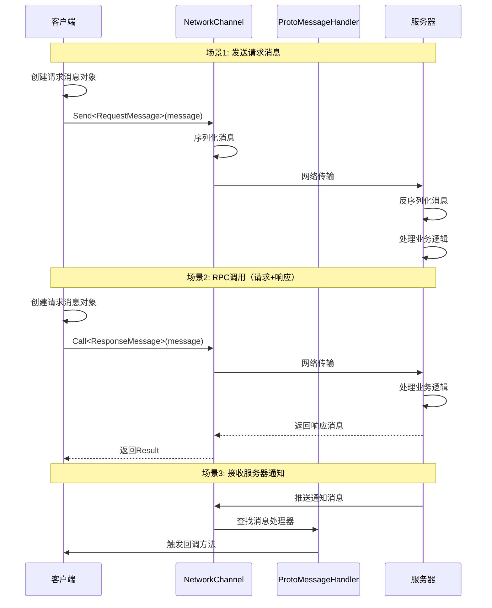

# メッセージタイプ

メッセージタイプ是 GameFrameX 网络フレームワーク中用于定義客户端与服务器之间通信数据结构的系统。通过メッセージタイプ，開発者〜できます定義请求メッセージ、响应メッセージ、通知メッセージ和心跳メッセージ，以実装可靠的网络通信。

## 概要

GameFrameX 网络フレームワーク采用基于メッセージ的通信モード，所有网络传输的数据都被カプセル化为メッセージ对象。フレームワーク提供します一套完全な的メッセージタイプ体系，サポート：

- **请求メッセージ (Request)**：客户端发送给服务器的请求
- **响应メッセージ (Response)**：服务器对客户端请求的回应
- **通知メッセージ (Notify)**：服务器主动推送给客户端的メッセージ
- **心跳メッセージ (HeartBeat)**：用于保持连接活跃的轻量级メッセージ

メッセージタイプ系统基于 `MessageObject` 基底クラスビルド，サポート JSON 和 Protobuf 两种シリアライズ方法，配合 `MessageTypeHandlerAttribute` 〜できます为每种メッセージ分配唯一的メッセージ ID。

## アーキテクチャ



### メッセージ流转フロー



## コアコンセプト

### MessageObject - メッセージ基底クラス

所有网络メッセージ都〜しなければなりません継承 `MessageObject` 基底クラス。このクラス提供します唯一 ID 生成和シリアライズサポート。

> Source: [MessageObject.cs](https://github.com/GameFrameX/com.gameframex.unity.network/blob/main/Runtime/Network/Base/MessageObject.cs#L1-L56)

```csharp
public class MessageObject : IReference
{
    /// <summary>
    /// 消息唯一编号
    /// </summary>
    public int UniqueId { get; private set; }

    protected MessageObject()
    {
        UpdateUniqueId();
    }

    /// <summary>
    /// 更新唯一编码
    /// </summary>
    public void UpdateUniqueId()
    {
        UniqueId = Utility.IdGenerator.GetNextUniqueIntId();
    }

    /// <summary>
    /// 清理引用
    /// </summary>
    public virtual void Clear()
    {
    }
}
```

### メッセージタイプインターフェース

フレームワーク定義了四个コアインターフェース来区分不同タイプ的メッセージ：

| インターフェース | 用途 | 説明 |
|------|------|------|
| `IRequestMessage` | 请求メッセージ | 客户端发送给服务器的请求 |
| `IResponseMessage` | 响应メッセージ | 服务器返す给客户端的响应，パッケージ含 ErrorCode プロパティ |
| `INotifyMessage` | 通知メッセージ | 服务器主动推送给客户端的メッセージ |
| `IHeartBeatMessage` | 心跳メッセージ | 用于保持连接活跃的轻量级メッセージ |

> Source: [IRequestMessage.cs](https://github.com/GameFrameX/com.gameframex.unity.network/blob/main/Runtime/Network/Base/IRequestMessage.cs#L1-L9)
> Source: [IResponseMessage.cs](https://github.com/GameFrameX/com.gameframex.unity.network/blob/main/Runtime/Network/Base/IResponseMessage.cs#L1-L13)
> Source: [INotifyMessage.cs](https://github.com/GameFrameX/com.gameframex.unity.network/blob/main/Runtime/Network/Base/INotifyMessage.cs#L1-L9)
> Source: [IHeartBeatMessage.cs](https://github.com/GameFrameX/com.gameframex.unity.network/blob/main/Runtime/Network/Base/IHeartBeatMessage.cs#L1-L9)

### MessageTypeHandlerAttribute - メッセージタイプ标识

用于标记メッセージ类的唯一 ID。该プロパティ是メッセージID映射系统的コア，配合 `ProtoMessageIdHandler` 実装メッセージID与タイプ的双向映射。

> Source: [MessageTypeHandlerAttribute.cs](https://github.com/GameFrameX/com.gameframex.unity.network/blob/main/Runtime/Network/Base/MessageTypeHandlerAttribute.cs#L1-L27)

### MessageHandlerAttribute - メッセージ処理器

用于标记処理特定メッセージタイプ的コールバックメソッド。通过该プロパティ，開発者〜できます声明式地登録メッセージ処理器。

> Source: [MessageHandlerAttribute.cs](https://github.com/GameFrameX/com.gameframex.unity.network/blob/main/Runtime/Network/Base/MessageHandlerAttribute.cs#L1-L196)

## 使用例

### 定義请求メッセージ

定義一个客户端发送给服务器的请求メッセージ：

```csharp
using GameFrameX.Network.Runtime;

#if ENABLE_GAME_FRAME_X_PROTOBUF
using ProtoBuf;
#endif

#if ENABLE_GAME_FRAME_X_PROTOBUF
[ProtoContract]
#endif
[MessageTypeHandler(1)]  // 消息ID为1
public class C2S_LoginRequest : MessageObject, IRequestMessage
{
#if ENABLE_GAME_FRAME_X_PROTOBUF
    [ProtoMember(1)]
#endif
    public string UserName { get; set; }

#if ENABLE_GAME_FRAME_X_PROTOBUF
    [ProtoMember(2)]
#endif
    public string Password { get; set; }
}
```

### 定義响应メッセージ

定義服务器返す给客户端的响应メッセージ：

```csharp
#if ENABLE_GAME_FRAME_X_PROTOBUF
[ProtoContract]
#endif
[MessageTypeHandler(101)]  // 消息ID为101
public class S2C_LoginResponse : MessageObject, IResponseMessage
{
#if ENABLE_GAME_FRAME_X_PROTOBUF
    [ProtoMember(1)]
#endif
    public int ErrorCode { get; set; }

#if ENABLE_GAME_FRAME_X_PROTOBUF
    [ProtoMember(2)]
#endif
    public string Token { get; set; }

#if ENABLE_GAME_FRAME_X_PROTOBUF
    [ProtoMember(3)]
#endif
    public long UserId { get; set; }
}
```

### 定義通知メッセージ

定義服务器主动推送给客户端的通知メッセージ：

```csharp
#if ENABLE_GAME_FRAME_X_PROTOBUF
[ProtoContract]
#endif
[MessageTypeHandler(201)]  // 消息ID为201
public class S2C_NoticeNotify : MessageObject, INotifyMessage
{
#if ENABLE_GAME_FRAME_X_PROTOBUF
    [ProtoMember(1)]
#endif
    public string Title { get; set; }

#if ENABLE_GAME_FRAME_X_PROTOBUF
    [ProtoMember(2)]
#endif
    public string Content { get; set; }
}
```

### 定義心跳メッセージ

定義用于保持连接活跃的心跳メッセージ：

```csharp
#if ENABLE_GAME_FRAME_X_PROTOBUF
[ProtoContract]
#endif
[MessageTypeHandler(10001)]  // 消息ID为10001
public class HeartBeatMessage : MessageObject, IHeartBeatMessage
{
#if ENABLE_GAME_FRAME_X_PROTOBUF
    [ProtoMember(1)]
#endif
    public long Timestamp { get; set; }
}
```

### 登録メッセージ処理器

使用 `MessageHandlerAttribute` 登録メッセージ処理器来受信服务器推送的メッセージ：

```csharp
public class NetworkMessageHandler : IMessageHandler
{
    public void Register()
    {
        ProtoMessageHandler.Add(this);
    }

    [MessageHandler(typeof(S2C_LoginResponse), nameof(OnLoginResponse))]
    private void OnLoginResponse(S2C_LoginResponse message)
    {
        if (message.ErrorCode == 0)
        {
            UnityEngine.Debug.Log($"登录成功! UserId: {message.UserId}");
        }
        else
        {
            UnityEngine.Debug.LogError($"登录失败! ErrorCode: {message.ErrorCode}");
        }
    }

    [MessageHandler(typeof(S2C_NoticeNotify), nameof(OnNoticeNotify))]
    private void OnNoticeNotify(S2C_NoticeNotify message)
    {
        UnityEngine.Debug.Log($"收到通知: {message.Title} - {message.Content}");
    }
}
```

### 发送メッセージ

通过 `INetworkChannel` 发送メッセージ：

```csharp
// 发送普通请求消息
var loginRequest = new C2S_LoginRequest
{
    UserName = "player1",
    Password = "password123"
};
networkChannel.Send(loginRequest);

// 发送RPC请求并等待响应
var loginRequest2 = new C2S_LoginRequest
{
    UserName = "player1",
    Password = "password123"
};
var response = await networkChannel.Call<S2C_LoginResponse>(loginRequest2);
if (response.ErrorCode == 0)
{
    UnityEngine.Debug.Log($"RPC调用成功! Token: {response.Token}");
}
```

> Source: [INetworkChannel.cs](https://github.com/GameFrameX/com.gameframex.unity.network/blob/main/Runtime/Network/Interface/INetworkChannel.cs#L228-L241)

## ProtoMessageIdHandler - メッセージID映射管理

`ProtoMessageIdHandler` 负责管理所有メッセージタイプ与メッセージID之间的映射关系。在程序启动时，〜する必要があります呼び出し `Init` メソッド来扫描并登録所有メッセージタイプ。

> Source: [ProtoMessageIdHandler.cs](https://github.com/GameFrameX/com.gameframex.unity.network/blob/main/Runtime/Network/Network/ProtoMessageIdHandler.cs#L1-L170)

### 初期化メッセージID映射

```csharp
// 在程序启动时调用
var assembly = typeof(C2S_LoginRequest).Assembly;
ProtoMessageIdHandler.Init(assembly);
```

`Init` メソッド会自动扫描アセンブリ中所有带有 `MessageTypeHandlerAttribute` 的タイプ，并根据其実装的インターフェース将其追加到对应的映射字典中：

- 実装 `IRequestMessage` → 追加到请求メッセージ字典
- 実装 `IResponseMessage` → 追加到响应メッセージ字典
- 実装 `INotifyMessage` → 追加到响应メッセージ字典（通知メッセージ也通过响应メッセージ通道受信）
- 実装 `IHeartBeatMessage` → 追加到心跳メッセージ列表

## ProtoMessageHandler - メッセージ処理器管理

`ProtoMessageHandler` 负责管理メッセージ処理器的登録和呼び出し。

> Source: [ProtoMessageHandler.cs](https://github.com/GameFrameX/com.gameframex.unity.network/blob/main/Runtime/Network/Network/ProtoMessageHandler.cs#L1-L144)

### 登録メッセージ処理器

```csharp
var messageHandler = new NetworkMessageHandler();
ProtoMessageHandler.Add(messageHandler);
```

### 移除メッセージ処理器

```csharp
ProtoMessageHandler.Remove(messageHandler);
```

## API リファレンス

### MessageObject

所有メッセージ的基底クラス。

**プロパティ：**
| プロパティ | タイプ | 説明 |
|------|------|------|
| UniqueId | int | メッセージ唯一标识符 |

**メソッド：**
| メソッド | 返すタイプ | 説明 |
|------|----------|------|
| UpdateUniqueId() | void | アップデートメッセージ的唯一ID |
| SetUpdateUniqueId(int uniqueId) | void | 設定メッセージ的唯一ID |
| Clear() | void | 清理参照リソース |

### MessageTypeHandlerAttribute

用于标记メッセージ类并分配唯一メッセージID。

**コンストラクタ：**
```csharp
public MessageTypeHandlerAttribute(int messageId)
```

**プロパティ：**
| プロパティ | タイプ | 説明 |
|------|------|------|
| MessageId | int | メッセージ的唯一ID |

### MessageHandlerAttribute

用于标记メッセージ処理メソッド。

**コンストラクタ：**
```csharp
public MessageHandlerAttribute(Type message, string invokeMethodName)
```

**パラメータ：**
- `message` (Type): 継承自 MessageObject 并実装 INotifyMessage 的メッセージタイプ
- `invokeMethodName` (string): 処理メッセージ的メソッド名称

### ProtoMessageHandler

管理メッセージ処理器的登録和呼び出し。

**メソッド：**
| メソッド | 説明 |
|------|------|
| Add(IMessageHandler) | 登録メッセージ処理器 |
| Remove(IMessageHandler) | 移除メッセージ処理器 |

### ProtoMessageIdHandler

管理メッセージID与タイプ的双向映射。

**メソッド：**
| メソッド | 返すタイプ | 説明 |
|------|----------|------|
| Init(Assembly) | void | 初期化メッセージID映射 |
| GetReqTypeById(int) | Type | 根据メッセージID取得请求タイプ |
| GetReqMessageIdByType(Type) | int | 根据タイプ取得请求メッセージID |
| GetRespTypeById(int) | Type | 根据メッセージID取得响应タイプ |
| GetRespMessageIdByType(Type) | int | 根据タイプ取得响应メッセージID |
| IsHeartbeat(Type) | bool | 判断是否为心跳メッセージタイプ |

### INetworkChannel

网络频道インターフェース，提供メッセージ发送機能。

**メソッド：**
| メソッド | 説明 |
|------|------|
| Send<T>(T messageObject) | 发送メッセージ到服务器 |
| Call<TResult>(MessageObject, bool) | 发送RPC请求并等待响应 |

## 関連リンク

- [网络マネージャー](./4-core-concepts.1-network-manager) - 理解する如何使用 NetworkManager 作成和管理网络连接
- [网络频道](./4-core-concepts.2-network-channel) - 深入理解する网络频道的設定和メッセージ処理
- [数据パッケージ処理器](./4-core-concepts.4-packet-handlers) - 理解する数据パッケージ的処理フロー
- [心跳机制](./5-heartbeat) - 理解する心跳メッセージ的工作原理
- [イベント系统](./6-events) - 理解する网络イベント処理
- [RPC 远程呼び出し](./8-rpc) - 理解する RPC 呼び出し的詳細用法
