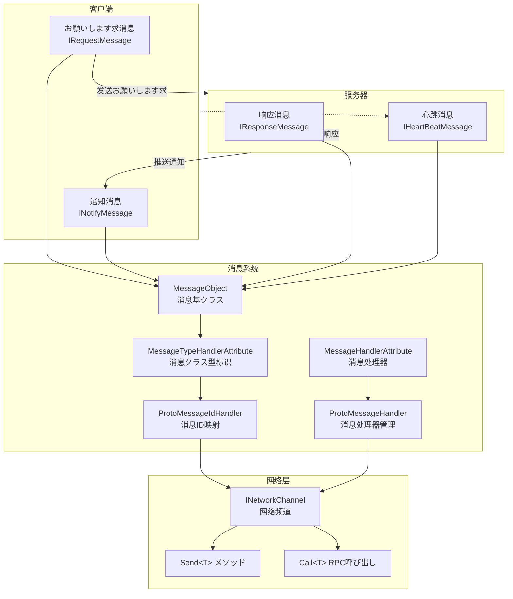
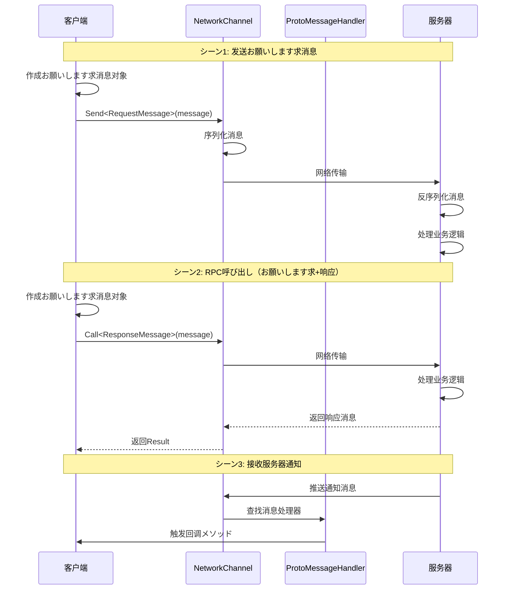

# 消息クラス型

消息クラス型是 GameFrameX 网络フレームワーク中に使用定义客户端与服务器之间通信数据结构的系统。を通じて消息クラス型，開発者可能定义お願いします求消息、响应消息、通知消息和心跳消息，以実装可靠的网络通信。

## 概要

GameFrameX 网络フレームワーク采用基づく消息的通信模式，所有网络传输的数据都被封装为消息对象。フレームワーク提供します一套完整的消息クラス型体系，サポート：

- **お願いします求消息 (Request)**：客户端发送给服务器的お願いします求
- **响应消息 (Response)**：服务器对客户端お願いします求的回应
- **通知消息 (Notify)**：服务器主动推送给客户端的消息
- **心跳消息 (HeartBeat)**：に使用保持连接活跃的轻量级消息

消息クラス型系统基づく `MessageObject` 基クラス构建，サポート JSON 和 Protobuf 两种序列化方法，配合 `MessageTypeHandlerAttribute` 可能为每种消息分配唯一的消息 ID。

## 架构



### 消息流转フロー



## コアコンセプト

### MessageObject - 消息基クラス

所有网络消息都必須继承 `MessageObject` 基クラス。该クラス提供します唯一 ID 生成和序列化サポート。

> Source: [MessageObject.cs](https://github.com/GameFrameX/com.gameframex.unity.network/blob/main/Runtime/Network/Base/MessageObject.cs#L1-L56)

```csharp
public class MessageObject : IReference
{
    /// <summary>
    /// 消息唯一编号
    /// </summary>
    public int UniqueId { get; private set; }

    protected MessageObject()
    {
        UpdateUniqueId();
    }

    /// <summary>
    /// 更新唯一编码
    /// </summary>
    public void UpdateUniqueId()
    {
        UniqueId = Utility.IdGenerator.GetNextUniqueIntId();
    }

    /// <summary>
    /// 清理引用
    /// </summary>
    public virtual void Clear()
    {
    }
}
```

### 消息クラス型インターフェース

フレームワーク定义了四个コアインターフェース来区分不同クラス型的消息：

| インターフェース | 用途 | 説明 |
|------|------|------|
| `IRequestMessage` | お願いします求消息 | 客户端发送给服务器的お願いします求 |
| `IResponseMessage` | 响应消息 | 服务器返回给客户端的响应，包含 ErrorCode プロパティ |
| `INotifyMessage` | 通知消息 | 服务器主动推送给客户端的消息 |
| `IHeartBeatMessage` | 心跳消息 | に使用保持连接活跃的轻量级消息 |

> Source: [IRequestMessage.cs](https://github.com/GameFrameX/com.gameframex.unity.network/blob/main/Runtime/Network/Base/IRequestMessage.cs#L1-L9)
> Source: [IResponseMessage.cs](https://github.com/GameFrameX/com.gameframex.unity.network/blob/main/Runtime/Network/Base/IResponseMessage.cs#L1-L13)
> Source: [INotifyMessage.cs](https://github.com/GameFrameX/com.gameframex.unity.network/blob/main/Runtime/Network/Base/INotifyMessage.cs#L1-L9)
> Source: [IHeartBeatMessage.cs](https://github.com/GameFrameX/com.gameframex.unity.network/blob/main/Runtime/Network/Base/IHeartBeatMessage.cs#L1-L9)

### MessageTypeHandlerAttribute - 消息クラス型标识

に使用标记消息クラス的唯一 ID。该プロパティ是消息ID映射系统的コア，配合 `ProtoMessageIdHandler` 実装消息ID与クラス型的双向映射。

> Source: [MessageTypeHandlerAttribute.cs](https://github.com/GameFrameX/com.gameframex.unity.network/blob/main/Runtime/Network/Base/MessageTypeHandlerAttribute.cs#L1-L27)

### MessageHandlerAttribute - 消息处理器

に使用标记处理特定消息クラス型的回调メソッド。を通じて该プロパティ，開発者可能声明式地注册消息处理器。

> Source: [MessageHandlerAttribute.cs](https://github.com/GameFrameX/com.gameframex.unity.network/blob/main/Runtime/Network/Base/MessageHandlerAttribute.cs#L1-L196)

## 使用例

### 定义お願いします求消息

定义一个客户端发送给服务器的お願いします求消息：

```csharp
using GameFrameX.Network.Runtime;

#if ENABLE_GAME_FRAME_X_PROTOBUF
using ProtoBuf;
#endif

#if ENABLE_GAME_FRAME_X_PROTOBUF
[ProtoContract]
#endif
[MessageTypeHandler(1)]  // 消息ID为1
public class C2S_LoginRequest : MessageObject, IRequestMessage
{
#if ENABLE_GAME_FRAME_X_PROTOBUF
    [ProtoMember(1)]
#endif
    public string UserName { get; set; }

#if ENABLE_GAME_FRAME_X_PROTOBUF
    [ProtoMember(2)]
#endif
    public string Password { get; set; }
}
```

### 定义响应消息

定义服务器返回给客户端的响应消息：

```csharp
#if ENABLE_GAME_FRAME_X_PROTOBUF
[ProtoContract]
#endif
[MessageTypeHandler(101)]  // 消息ID为101
public class S2C_LoginResponse : MessageObject, IResponseMessage
{
#if ENABLE_GAME_FRAME_X_PROTOBUF
    [ProtoMember(1)]
#endif
    public int ErrorCode { get; set; }

#if ENABLE_GAME_FRAME_X_PROTOBUF
    [ProtoMember(2)]
#endif
    public string Token { get; set; }

#if ENABLE_GAME_FRAME_X_PROTOBUF
    [ProtoMember(3)]
#endif
    public long UserId { get; set; }
}
```

### 定义通知消息

定义服务器主动推送给客户端的通知消息：

```csharp
#if ENABLE_GAME_FRAME_X_PROTOBUF
[ProtoContract]
#endif
[MessageTypeHandler(201)]  // 消息ID为201
public class S2C_NoticeNotify : MessageObject, INotifyMessage
{
#if ENABLE_GAME_FRAME_X_PROTOBUF
    [ProtoMember(1)]
#endif
    public string Title { get; set; }

#if ENABLE_GAME_FRAME_X_PROTOBUF
    [ProtoMember(2)]
#endif
    public string Content { get; set; }
}
```

### 定义心跳消息

定义に使用保持连接活跃的心跳消息：

```csharp
#if ENABLE_GAME_FRAME_X_PROTOBUF
[ProtoContract]
#endif
[MessageTypeHandler(10001)]  // 消息ID为10001
public class HeartBeatMessage : MessageObject, IHeartBeatMessage
{
#if ENABLE_GAME_FRAME_X_PROTOBUF
    [ProtoMember(1)]
#endif
    public long Timestamp { get; set; }
}
```

### 注册消息处理器

使用 `MessageHandlerAttribute` 注册消息处理器来接收服务器推送的消息：

```csharp
public class NetworkMessageHandler : IMessageHandler
{
    public void Register()
    {
        ProtoMessageHandler.Add(this);
    }

    [MessageHandler(typeof(S2C_LoginResponse), nameof(OnLoginResponse))]
    private void OnLoginResponse(S2C_LoginResponse message)
    {
        if (message.ErrorCode == 0)
        {
            UnityEngine.Debug.Log($"登录成功! UserId: {message.UserId}");
        }
        else
        {
            UnityEngine.Debug.LogError($"登录失败! ErrorCode: {message.ErrorCode}");
        }
    }

    [MessageHandler(typeof(S2C_NoticeNotify), nameof(OnNoticeNotify))]
    private void OnNoticeNotify(S2C_NoticeNotify message)
    {
        UnityEngine.Debug.Log($"收到通知: {message.Title} - {message.Content}");
    }
}
```

### 发送消息

を通じて `INetworkChannel` 发送消息：

```csharp
// 发送普通お願いします求消息
var loginRequest = new C2S_LoginRequest
{
    UserName = "player1",
    Password = "password123"
};
networkChannel.Send(loginRequest);

// 发送RPCお願いします求并等待响应
var loginRequest2 = new C2S_LoginRequest
{
    UserName = "player1",
    Password = "password123"
};
var response = await networkChannel.Call<S2C_LoginResponse>(loginRequest2);
if (response.ErrorCode == 0)
{
    UnityEngine.Debug.Log($"RPC呼び出し成功! Token: {response.Token}");
}
```

> Source: [INetworkChannel.cs](https://github.com/GameFrameX/com.gameframex.unity.network/blob/main/Runtime/Network/Interface/INetworkChannel.cs#L228-L241)

## ProtoMessageIdHandler - 消息ID映射管理

`ProtoMessageIdHandler` 负责管理所有消息クラス型与消息ID之间的映射关系。在程序启动时，必要呼び出し `Init` メソッド来扫描并注册所有消息クラス型。

> Source: [ProtoMessageIdHandler.cs](https://github.com/GameFrameX/com.gameframex.unity.network/blob/main/Runtime/Network/Network/ProtoMessageIdHandler.cs#L1-L170)

### 初期化消息ID映射

```csharp
// 在程序启动时呼び出し
var assembly = typeof(C2S_LoginRequest).Assembly;
ProtoMessageIdHandler.Init(assembly);
```

`Init` メソッド会自动扫描程序集中所有带有 `MessageTypeHandlerAttribute` 的クラス型，并に基づいて其実装的インターフェース将其添加到对应的映射字典中：

- 実装 `IRequestMessage` → 添加到お願いします求消息字典
- 実装 `IResponseMessage` → 添加到响应消息字典
- 実装 `INotifyMessage` → 添加到响应消息字典（通知消息也を通じて响应消息通道接收）
- 実装 `IHeartBeatMessage` → 添加到心跳消息列表

## ProtoMessageHandler - 消息处理器管理

`ProtoMessageHandler` 负责管理消息处理器的注册和呼び出し。

> Source: [ProtoMessageHandler.cs](https://github.com/GameFrameX/com.gameframex.unity.network/blob/main/Runtime/Network/Network/ProtoMessageHandler.cs#L1-L144)

### 注册消息处理器

```csharp
var messageHandler = new NetworkMessageHandler();
ProtoMessageHandler.Add(messageHandler);
```

### 移除消息处理器

```csharp
ProtoMessageHandler.Remove(messageHandler);
```

## API 参考

### MessageObject

所有消息的基クラス。

**プロパティ：**
| プロパティ | クラス型 | 説明 |
|------|------|------|
| UniqueId | int | 消息唯一标识符 |

**メソッド：**
| メソッド | 返回クラス型 | 説明 |
|------|----------|------|
| UpdateUniqueId() | void | 更新消息的唯一ID |
| SetUpdateUniqueId(int uniqueId) | void | 設定消息的唯一ID |
| Clear() | void | 清理引用リソース |

### MessageTypeHandlerAttribute

に使用标记消息クラス并分配唯一消息ID。

**构造函数：**
```csharp
public MessageTypeHandlerAttribute(int messageId)
```

**プロパティ：**
| プロパティ | クラス型 | 説明 |
|------|------|------|
| MessageId | int | 消息的唯一ID |

### MessageHandlerAttribute

に使用标记消息处理メソッド。

**构造函数：**
```csharp
public MessageHandlerAttribute(Type message, string invokeMethodName)
```

**参数：**
- `message` (Type): を継承 MessageObject 并実装 INotifyMessage 的消息クラス型
- `invokeMethodName` (string): 处理消息的メソッド名称

### ProtoMessageHandler

管理消息处理器的注册和呼び出し。

**メソッド：**
| メソッド | 説明 |
|------|------|
| Add(IMessageHandler) | 注册消息处理器 |
| Remove(IMessageHandler) | 移除消息处理器 |

### ProtoMessageIdHandler

管理消息ID与クラス型的双向映射。

**メソッド：**
| メソッド | 返回クラス型 | 説明 |
|------|----------|------|
| Init(Assembly) | void | 初期化消息ID映射 |
| GetReqTypeById(int) | Type | に基づいて消息ID取得お願いします求クラス型 |
| GetReqMessageIdByType(Type) | int | に基づいてクラス型取得お願いします求消息ID |
| GetRespTypeById(int) | Type | に基づいて消息ID取得响应クラス型 |
| GetRespMessageIdByType(Type) | int | に基づいてクラス型取得响应消息ID |
| IsHeartbeat(Type) | bool | 判断是否为心跳消息クラス型 |

### INetworkChannel

网络频道インターフェース，提供消息发送機能。

**メソッド：**
| メソッド | 説明 |
|------|------|
| Send<T>(T messageObject) | 发送消息到服务器 |
| Call<TResult>(MessageObject, bool) | 发送RPCお願いします求并等待响应 |

## 関連リンク

- [网络管理器](./4-core-concepts.1-network-manager) - 了解如何使用 NetworkManager 作成和管理网络连接
- [网络频道](./4-core-concepts.2-network-channel) - 深入了解网络频道的配置和消息处理
- [数据包处理器](./4-core-concepts.4-packet-handlers) - 了解数据包的处理フロー
- [心跳机制](./5-heartbeat) - 了解心跳消息的工作原理
- [イベント系统](./6-events) - 了解网络イベント处理
- [RPC 远程呼び出し](./8-rpc) - 了解 RPC 呼び出し的详细用法
