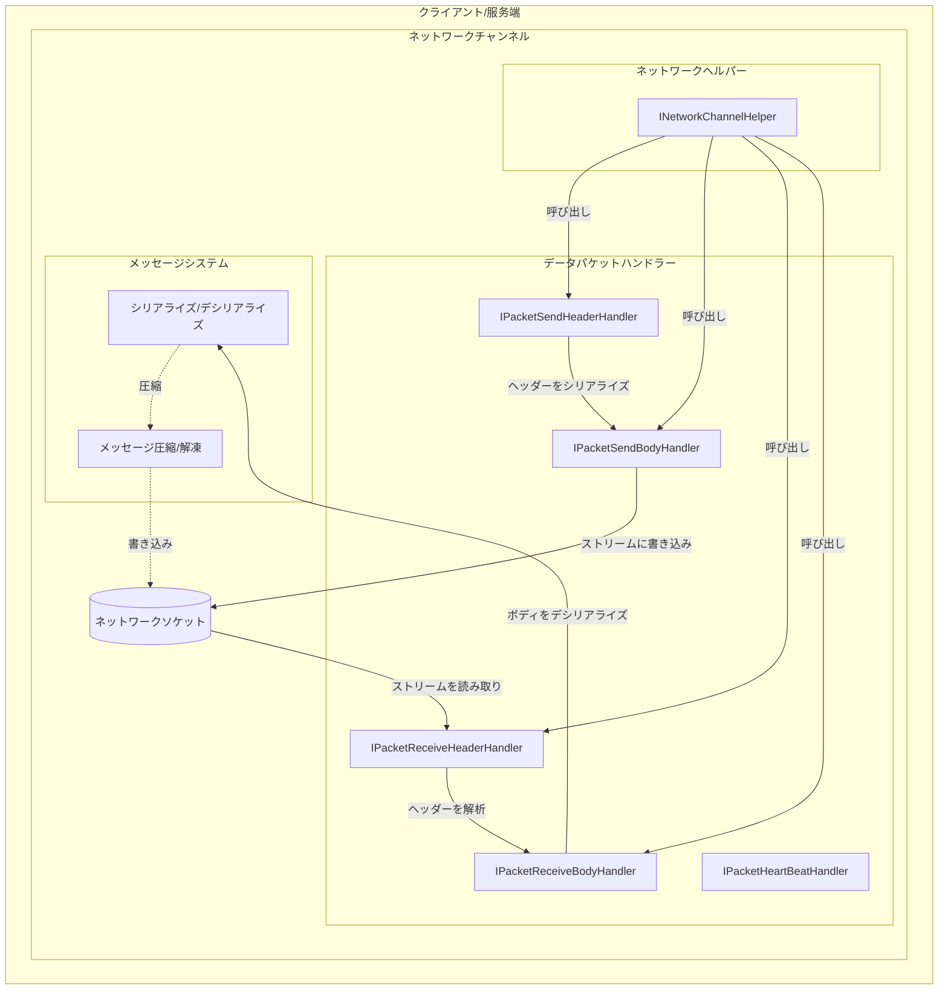
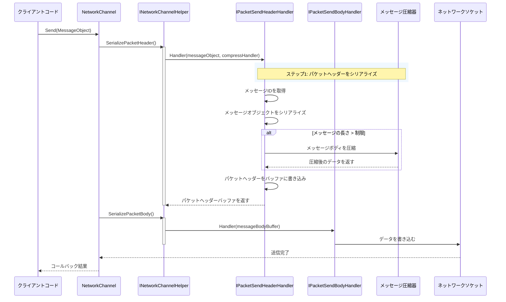
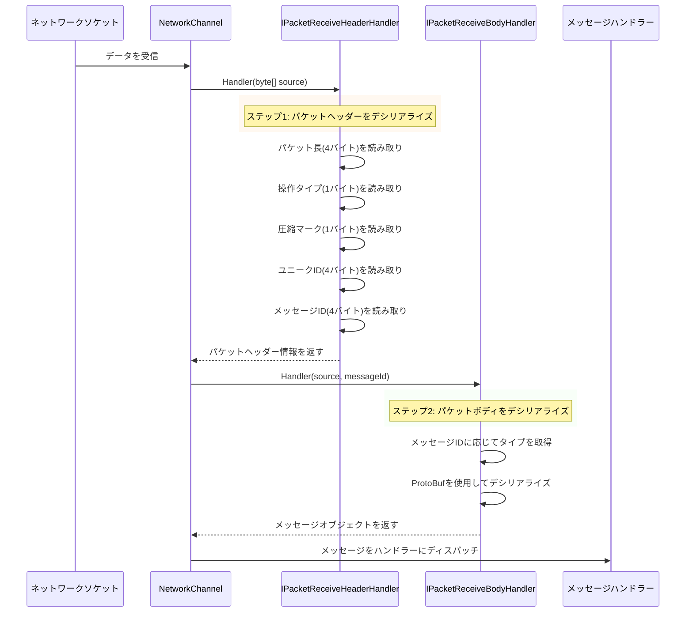

# パケットハンドラー

パケットハンドラーは GameFrameX ネットワークライブラリのコアコンポーネントであり、ネットワークメッセージのシリアライズとデシリアライズを担当します。它们は应用層のメッセージオブジェクトをネットワークバイトストリーム（送信時）に変換し、受信したバイトストリームをメッセージオブジェクト（受信時）に変換します。

## 概要

ネットワーク通信では、データは特定のフォーマットで処理されてネットワーク内で传输される必要があります。パケットハンドラーはこの职责を担う重要なコンポーネントであり、ネットワークメッセージの構造と解析方法を定義し、開発者がビジネスロジックに集中できるようにし、低レベルのネットワーク通信の詳細を心配しないようにします。

GameFrameX ネットワークライブラリは5種類のデータパケットハンドラーを 提供します：
- **送信パケットヘッダーハンドラー**：メッセージヘッダー情報のシリアライズを担当
- **送信パケットボディハンドラー**：メッセージボディ内容のシリアライズを担当
- **受信パケットヘッダーハンドラー**：メッセージヘッダー情報のデシリアライズを担当
- **受信パケットボディハンドラー**：メッセージボディ内容のデシリアライズを担当
- **ハートビートパケットハンドラー**：ハートビート検出関連するロジックを担当

## アーキテクチャ



上图は、データパケットハンドラーがネットワーク通信における核心的な位置を示しています。彼らはネットワークヘルパー（INetworkChannelHelper）を通じて呼び出され、メッセージのシリアライズとデシリアライズを完了します。

## メッセージ送信フロー

クライアントがメッセージを送信する必要がある場合、データパケットハンドラーは特定の順序でメッセージオブジェクトを処理します：



送信フローは2つの主要な段階に分かれます：
1. **パケットヘッダーシリアライズ**：送信パケットヘッダーハンドラーが最初に呼び出され、メッセージのタイプ情報（メッセージID）を取得し、メッセージオブジェクトをバイト配列にシリアライズし、設定に応じて圧縮するかどうかを決定し、パケットヘッダー情報（パケット長、操作タイプ、圧縮マーク、ユニークID、メッセージID）を書き込みます
2. **パケットボディシリアライズ**：送信パケットボディハンドラーが処理好的なパケットボディデータを対象ストリームに書き込みます

## メッセージ受信フロー

ネットワークからデータを受信すると、データパケットハンドラーはバイトストリームを逆方向に処理し、メッセージオブジェクトに変換します：



受信フローもまた2つの段階に分かれます：
1. **パケットヘッダーデシリアライズ**：受信パケットヘッダーハンドラーがバイトストリームからパケット長、操作タイプ、圧縮マーク、ユニークID、メッセージIDなどの情報を解析します
2. **パケットボディデシリアライズ**：受信パケットボディハンドラーがメッセージIDに応じて対応するメッセージタイプを見つけ、ProtoBufを使用してメッセージオブジェクトにデシリアライズします

## インターフェース定義

### IPacketHandler

マーキングインターフェース、すべてのデータパケットハンドラーはこのインターフェースを実装する必要があります：

```csharp
namespace GameFrameX.Network.Runtime
{
    public interface IPacketHandler
    {
    }
}
```
> Source: [IPacketHandler.cs](https://github.com/GameFrameX/com.gameframex.unity.network/blob/main/Runtime/Network/Interface/IPacketHandler.cs#L3-L5)

### IPacketSendHeaderHandler

送信パケットヘッダーハンドラーインターフェース、メッセージヘッダーのシリアライズを担当：

```csharp
public interface IPacketSendHeaderHandler
{
    /// メッセージパケットヘッダーの長さ
    ushort PacketHeaderLength { get; }

    /// ネットワークメッセージパケットプロトコル番号を取得
    int Id { get; }

    /// ネットワークメッセージパケットの長さを取得
    uint PacketLength { get; }

    /// メッセージ内容を圧縮するかどうか
    bool IsZip { get; }

    /// メッセージのの長さがこの値を超えると圧縮を有効化。この値は圧縮器を設定 때 にのみ有効
    uint LimitCompressLength { get; }

    /// メッセージを処理
    bool Handler<T>(T messageObject, IMessageCompressHandler messageCompressHandler, 
        MemoryStream destination, out byte[] messageBodyBuffer) where T : MessageObject;
}
```
> Source: [IPacketSendHeaderHandler.cs](https://github.com/GameFrameX/com.gameframex.unity.network/blob/main/Runtime/Network/Interface/IPacketSendHeaderHandler.cs#L8-L45)

### IPacketSendBodyHandler

送信パケットボディハンドラーインターフェース、メッセージボディを対象ストリームに書き込みます：

```csharp
public interface IPacketSendBodyHandler
{
    /// メッセージボディを処理
    bool Handler(byte[] messageBodyBuffer, MemoryStream destination);
}
```
> Source: [IPacketSendBodyHandler.cs](https://github.com/GameFrameX/com.gameframex.unity.network/blob/main/Runtime/Network/Interface/IPacketSendBodyHandler.cs#L39-L48)

### IPacketReceiveHeaderHandler

受信パケットヘッダーハンドラーインターフェース、メッセージヘッダーのデシリアライズを担当：

```csharp
public interface IPacketReceiveHeaderHandler
{
    /// ネットワークメッセージパケットの長さを取得
    uint PacketLength { get; }

    /// メッセージパケットヘッダーの長さ
    ushort PacketHeaderLength { get; }

    /// ネットワークメッセージパケットプロトコル番号を取得
    int Id { get; }

    /// メッセージユニーク番号
    int UniqueId { get; }

    /// メッセージ操作タイプ
    byte OperationType { get; }

    /// 圧縮マーク
    byte ZipFlag { get; }

    /// メッセージパケットを処理
    bool Handler(object source);
}
```
> Source: [IPacketReceiveHeaderHandler.cs](https://github.com/GameFrameX/com.gameframex.unity.network/blob/main/Runtime/Network/Interface/IPacketReceiveHeaderHandler.cs#L37-L75)

### IPacketReceiveBodyHandler

受信パケットボディハンドラーインターフェース、メッセージボディのデシリアライズを担当：

```csharp
public interface IPacketReceiveBodyHandler
{
    /// ネットワークメッセージパケットを処理関数
    bool Handler<T>(byte[] source, int messageId, out T messageObject) where T : MessageObject;
}
```
> Source: [IPacketReceiveBodyHandler.cs](https://github.com/GameFrameX/com.gameframex.unity.network/blob/main/Runtime/Network/Interface/IPacketReceiveBodyHandler.cs#L6-L15)

### IPacketHeartBeatHandler

ハートビートパケットハンドラーインターフェース、ハートビートメッセージの生成と処理を担当：

```csharp
public interface IPacketHeartBeatHandler
{
    /// 每次ハートビートの間隔
    float HeartBeatInterval { get; }

    /// ハートビート丢失 回触发ネットワーク切断
    int MissHeartBeatCountByClose { get; }

    /// ハンドラー
    MessageObject Handler();
}
```
> Source: [IPacketHeartBeatHandler.cs](https://github.com/GameFrameX/com.gameframex.unity.network/blob/main/Runtime/Network/Interface/IPacketHeartBeatHandler.cs#L6-L23)

## デフォルト実装

### DefaultPacketSendHeaderHandler

デフォルトの送信パケットヘッダーハンドラー、完全なパケットヘッダーシリアライズロジックを実装：

```csharp
public class DefaultPacketSendHeaderHandler : IPacketSendHeaderHandler, IPacketHandler
{
    private const int NetPacketLength = sizeof(uint);
    private const int NetCmdIdLength = sizeof(int);
    private const int NetOperationTypeLength = sizeof(byte);
    private const int NetZipFlagLength = sizeof(byte);
    private const int NetUniqueIdLength = sizeof(int);

    public ushort PacketHeaderLength { get; }
    public int Id { get; private set; }
    public uint PacketLength { get; private set; }
    public bool IsZip { get; private set; }
    public virtual uint LimitCompressLength { get; } = 512;

    private int m_Offset;
    private readonly byte[] m_CachedByte;

    public DefaultPacketSendHeaderHandler()
    {
        PacketHeaderLength = NetPacketLength + NetOperationTypeLength + 
            NetZipFlagLength + NetUniqueIdLength + NetCmdIdLength;
        m_CachedByte = new byte[PacketHeaderLength];
    }

    public bool Handler<T>(T messageObject, IMessageCompressHandler messageCompressHandler, 
        MemoryStream destination, out byte[] messageBodyBuffer) where T : MessageObject
    {
        m_Offset = 0;
        var messageType = messageObject.GetType();
        Id = ProtoMessageIdHandler.GetReqMessageIdByType(messageType);
        messageBodyBuffer = SerializerHelper.Serialize(messageObject);
        
        // 長さに応じて圧縮するかを決定
        if (messageCompressHandler != null && messageBodyBuffer.Length > LimitCompressLength)
        {
            IsZip = true;
            messageBodyBuffer = messageCompressHandler.Handler(messageBodyBuffer);
        }
        else
        {
            IsZip = false;
        }

        var messageLength = messageBodyBuffer.Length;
        PacketLength = (uint)(PacketHeaderLength + messageLength);
        
        // パケットヘッダーデータを書き込む
        m_CachedByte.WriteUInt(PacketLength, ref m_Offset);
        m_CachedByte.WriteByte((byte)(ProtoMessageIdHandler.IsHeartbeat(messageType) ? 1 : 4), ref m_Offset);
        m_CachedByte.WriteByte((byte)(IsZip ? 1 : 0), ref m_Offset);
        m_CachedByte.WriteInt(messageObject.UniqueId, ref m_Offset);
        m_CachedByte.WriteInt(Id, ref m_Offset);
        destination.Write(m_CachedByte, 0, PacketHeaderLength);
        return true;
    }
}
```
> Source: [DefaultPacketSendHeaderHandler.cs](https://github.com/GameFrameX/com.gameframex.unity.network/blob/main/Runtime/Network/Helper/DefaultPacketSendHeaderHandler.cs#L11-L114)

### DefaultPacketReceiveHeaderHandler

デフォルトの受信パケットヘッダーハンドラー、完全なパケットヘッダー解析ロジックを実装：

```csharp
public sealed class DefaultPacketReceiveHeaderHandler : IPacketReceiveHeaderHandler, IPacketHandler
{
    public uint PacketLength { get; private set; }
    public int Id { get; private set; }
    public int UniqueId { get; private set; }
    public byte OperationType { get; private set; }
    public byte ZipFlag { get; private set; }
    public ushort PacketHeaderLength { get; } = 14; // 4+1+1+4+4

    public bool Handler(object source)
    {
        byte[] reader = source as byte[];
        if (reader == null)
        {
            return false;
        }

        int offset = 0;
        PacketLength = reader.ReadUInt(ref offset);
        OperationType = reader.ReadByte(ref offset);
        ZipFlag = reader.ReadByte(ref offset);
        UniqueId = reader.ReadInt(ref offset);
        Id = reader.ReadInt(ref offset);
        return true;
    }
}
```
> Source: [DefaultPacketReceiveHeaderHandler.cs](https://github.com/GameFrameX/com.gameframex.unity.network/blob/main/Runtime/Network/Helper/DefaultPacketReceiveHeaderHandler.cs#L9-L64)

### DefaultPacketSendBodyHandler

デフォルトの送信パケットボディハンドラー、メッセージボディを対象ストリームに書き込みます：

```csharp
public sealed class DefaultPacketSendBodyHandler : IPacketSendBodyHandler, IPacketHandler
{
    public bool Handler(byte[] messageBodyBuffer, MemoryStream destination)
    {
        destination.Write(messageBodyBuffer, 0, messageBodyBuffer.Length);
        return true;
    }
}
```
> Source: [DefaultPacketSendBodyHandler.cs](https://github.com/GameFrameX/com.gameframex.unity.network/blob/main/Runtime/Network/Helper/DefaultPacketSendBodyHandler.cs#L9-L16)

### DefaultPacketReceiveBodyHandler

デフォルトの受信パケットボディハンドラー、ProtoBufを使用してメッセージをデシリアライズします：

```csharp
public sealed class DefaultPacketReceiveBodyHandler : IPacketReceiveBodyHandler, IPacketHandler
{
    public bool Handler<T>(byte[] source, int messageId, out T messageObject) where T : MessageObject
    {
        var messageType = ProtoMessageIdHandler.GetRespTypeById(messageId);
        messageObject = (T)SerializerHelper.Deserialize(source, messageType);
        return true;
    }
}
```
> Source: [DefaultPacketReceiveBodyHandler.cs](https://github.com/GameFrameX/com.gameframex.unity.network/blob/main/Runtime/Network/Helper/DefaultPacketReceiveBodyHandler.cs#L9-L17)

### BasePacketHeartBeatHandler

デフォルトハートビートパケットハンドラー基底クラス：

```csharp
public class BasePacketHeartBeatHandler : IPacketHeartBeatHandler, IPacketHandler
{
    public virtual float HeartBeatInterval
    {
        get { return 5; }
    }

    public virtual int MissHeartBeatCountByClose { get; } = 5;

    public virtual MessageObject Handler()
    {
        throw new System.NotImplementedException();
    }
}
```
> Source: [DefaultPacketHeartBeatHandler.cs](https://github.com/GameFrameX/com.gameframex.unity.network/blob/main/Runtime/Network/Helper/DefaultPacketHeartBeatHandler.cs#L7-L26)

## カスタムデータパケットハンドラー

デフォルトのハンドラーが要件を満たせない場合、開発者はカスタムデータパケットハンドラーを作成できます。カスタムハンドラーは対応するインターフェースを実装し、`IPacketHandler` マーキングインターフェースを継承する必要があります。

### カスタム受信パケットヘッダーハンドラーを作成する

```csharp
using UnityEngine;
using GameFrameX.Network.Runtime;
using GameFrameX.Runtime;

[UnityEngine.Scripting.Preserve]
public sealed class CustomPacketReceiveHeaderHandler : IPacketReceiveHeaderHandler, IPacketHandler
{
    public uint PacketLength { get; private set; }
    public ushort PacketHeaderLength { get; } = 14;
    public int Id { get; private set; }
    public int UniqueId { get; private set; }
    public byte OperationType { get; private set; }
    public byte ZipFlag { get; private set; }

    public bool Handler(object source)
    {
        // カスタム解析ロジック
        byte[] reader = source as byte[];
        if (reader == null || reader.Length < PacketHeaderLength)
        {
            return false;
        }

        // カスタム解析実装...
        return true;
    }
}
```

### カスタムハートビートパケットハンドラーを作成する

```csharp
using UnityEngine;
using GameFrameX.Network.Runtime;

[UnityEngine.Scripting.Preserve]
public sealed class CustomHeartBeatHandler : BasePacketHeartBeatHandler
{
    // ハートビート間隔を10秒に設定
    public override float HeartBeatInterval => 10;

    // 5回の丢失後に接続を切断
    public override int MissHeartBeatCountByClose => 5;

    public override MessageObject Handler()
    {
        // カスタムハートビートメッセージオブジェクトを返す
        return new C2SHeartBeat();
    }
}
```

## 設定オプション

データパケットハンドナーの動作は以下の方法で設定できます：

| 設定項目 | タイプ | デフォルト値 | 説明 |
|--------|------|--------|------|
| LimitCompressLength | uint | 512 | この長さを超えるとメッセージ圧縮を有効化 |
| HeartBeatInterval | float | 5.0 | ハートビートパケット送信間隔（秒） |
| MissHeartBeatCountByClose | int | 5 | ハートビート丢失回数上限、超えると接続を切断 |

## 関連リンク

- [ネットワークマネージャー](./4-core-concepts.1-network-manager)
- [ネットワークチャンネル](./4-core-concepts.2-network-channel)
- [メッセージタイプ](./4-core-concepts.3-message-types)
- [ハートビート](./5-heartbeat)
- [メッセージ圧縮](./7-message-compression)
