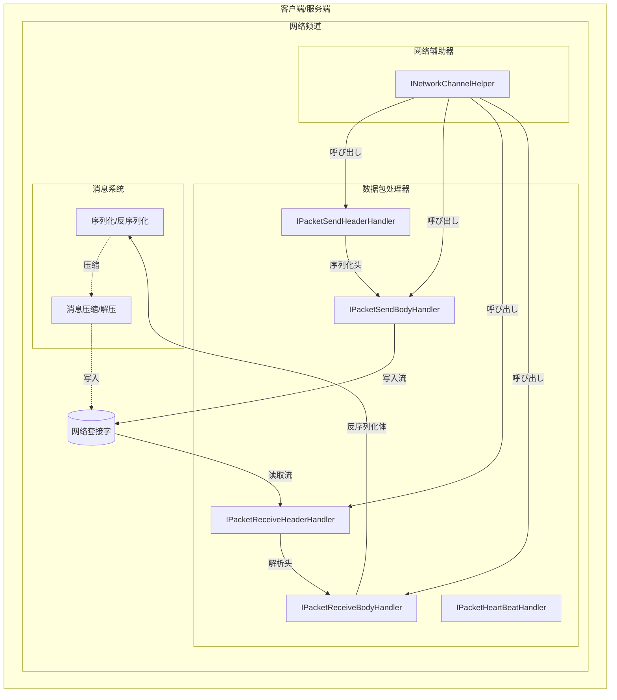

# 数据包处理器

数据包处理器是 GameFrameX 网络库的コアコンポーネント，负责网络消息的序列化和反序列化操作。它们将应用层的消息对象转换为网络字节流（发送时），并将接收到的字节流转换回消息对象（接收时）。

## 概要

在网络通信中，数据必要经过特定的格式处理才能在网络中传输。数据包处理器正是承担这一职责的关键コンポーネント，它们定义了网络消息的结构和解析方法，使得開発者可能专注于业务逻辑而无需关心底层网络通信细节。

GameFrameX 网络库提供します五クラス数据包处理器：
- **发送包头处理器**：负责序列化消息头部信息
- **发送包体处理器**：负责序列化消息体内容
- **接收包头处理器**：负责反序列化消息头部信息
- **接收包体处理器**：负责反序列化消息体内容
- **心跳包处理器**：负责处理心跳检测関連逻辑

## 架构



上图展示了数据包处理器在网络通信中的コア位置。它们を通じて网络辅助器（INetworkChannelHelper）被呼び出し，完成消息的序列化和反序列化工作。

## 消息发送フロー

当客户端必要发送消息时，数据包处理器按照特定的顺序处理消息对象：


发送フロー分为两个主要阶段：
1. **包头序列化**：发送包头处理器首先被呼び出し，它取得消息的クラス型信息（消息ID），将消息对象序列化为字节数组，に基づいて配置决定是否压缩，然后写入包头信息（包长度、操作クラス型、压缩标记、唯一ID、消息ID）
2. **包体序列化**：发送包体处理器将处理好的包体数据写入目标流

## 消息接收フロー

当从网络接收到数据时，数据包处理器反向处理字节流，将其转换为消息对象：


接收フロー同样分为两个阶段：
1. **包头反序列化**：接收包头处理器从字节流中解析出包长度、操作クラス型、压缩标记、唯一ID和消息ID等信息
2. **包体反序列化**：接收包体处理器に基づいて消息ID找到对应的消息クラス型，使用 ProtoBuf 反序列化为消息对象

## インターフェース定义

### IPacketHandler

标记インターフェース，所有数据包处理器都必要実装此インターフェース：

```csharp
namespace GameFrameX.Network.Runtime
{
    public interface IPacketHandler
    {
    }
}
```
> Source: [IPacketHandler.cs](https://github.com/GameFrameX/com.gameframex.unity.network/blob/main/Runtime/Network/Interface/IPacketHandler.cs#L3-L5)

### IPacketSendHeaderHandler

发送包头处理器インターフェース，负责序列化消息头部：

```csharp
public interface IPacketSendHeaderHandler
{
    /// 消息包头长度
    ushort PacketHeaderLength { get; }

    /// 取得网络消息包协议编号
    int Id { get; }

    /// 取得网络消息包长度
    uint PacketLength { get; }

    /// 是否压缩消息内容
    bool IsZip { get; }

    /// 超过消息的长度超过该值的时候启用压缩.该值 必須在設定压缩器的时候才生效
    uint LimitCompressLength { get; }

    /// 处理消息
    bool Handler<T>(T messageObject, IMessageCompressHandler messageCompressHandler, 
        MemoryStream destination, out byte[] messageBodyBuffer) where T : MessageObject;
}
```
> Source: [IPacketSendHeaderHandler.cs](https://github.com/GameFrameX/com.gameframex.unity.network/blob/main/Runtime/Network/Interface/IPacketSendHeaderHandler.cs#L8-L45)

### IPacketSendBodyHandler

发送包体处理器インターフェース，负责将消息体写入目标流：

```csharp
public interface IPacketSendBodyHandler
{
    /// 处理消息体
    bool Handler(byte[] messageBodyBuffer, MemoryStream destination);
}
```
> Source: [IPacketSendBodyHandler.cs](https://github.com/GameFrameX/com.gameframex.unity.network/blob/main/Runtime/Network/Interface/IPacketSendBodyHandler.cs#L39-L48)

### IPacketReceiveHeaderHandler

接收包头处理器インターフェース，负责反序列化消息头部：

```csharp
public interface IPacketReceiveHeaderHandler
{
    /// 取得网络消息包长度
    uint PacketLength { get; }

    /// 消息包头长度
    ushort PacketHeaderLength { get; }

    /// 取得网络消息包协议编号
    int Id { get; }

    /// 消息唯一编号
    int UniqueId { get; }

    /// 消息操作クラス型
    byte OperationType { get; }

    /// 压缩标记
    byte ZipFlag { get; }

    /// 消息包处理
    bool Handler(object source);
}
```
> Source: [IPacketReceiveHeaderHandler.cs](https://github.com/GameFrameX/com.gameframex.unity.network/blob/main/Runtime/Network/Interface/IPacketReceiveHeaderHandler.cs#L37-L75)

### IPacketReceiveBodyHandler

接收包体处理器インターフェース，负责反序列化消息体：

```csharp
public interface IPacketReceiveBodyHandler
{
    /// 网络消息包处理函数
    bool Handler<T>(byte[] source, int messageId, out T messageObject) where T : MessageObject;
}
```
> Source: [IPacketReceiveBodyHandler.cs](https://github.com/GameFrameX/com.gameframex.unity.network/blob/main/Runtime/Network/Interface/IPacketReceiveBodyHandler.cs#L6-L15)

### IPacketHeartBeatHandler

心跳包处理器インターフェース，负责心跳消息的生成和处理：

```csharp
public interface IPacketHeartBeatHandler
{
    /// 每次心跳的间隔
    float HeartBeatInterval { get; }

    /// 几次心跳丢失触发断开网络
    int MissHeartBeatCountByClose { get; }

    /// 处理器
    MessageObject Handler();
}
```
> Source: [IPacketHeartBeatHandler.cs](https://github.com/GameFrameX/com.gameframex.unity.network/blob/main/Runtime/Network/Interface/IPacketHeartBeatHandler.cs#L6-L23)

## 默认実装

### DefaultPacketSendHeaderHandler

默认发送包头处理器実装了完整的包头序列化逻辑：

```csharp
public class DefaultPacketSendHeaderHandler : IPacketSendHeaderHandler, IPacketHandler
{
    private const int NetPacketLength = sizeof(uint);
    private const int NetCmdIdLength = sizeof(int);
    private const int NetOperationTypeLength = sizeof(byte);
    private const int NetZipFlagLength = sizeof(byte);
    private const int NetUniqueIdLength = sizeof(int);

    public ushort PacketHeaderLength { get; }
    public int Id { get; private set; }
    public uint PacketLength { get; private set; }
    public bool IsZip { get; private set; }
    public virtual uint LimitCompressLength { get; } = 512;

    private int m_Offset;
    private readonly byte[] m_CachedByte;

    public DefaultPacketSendHeaderHandler()
    {
        PacketHeaderLength = NetPacketLength + NetOperationTypeLength + 
            NetZipFlagLength + NetUniqueIdLength + NetCmdIdLength;
        m_CachedByte = new byte[PacketHeaderLength];
    }

    public bool Handler<T>(T messageObject, IMessageCompressHandler messageCompressHandler, 
        MemoryStream destination, out byte[] messageBodyBuffer) where T : MessageObject
    {
        m_Offset = 0;
        var messageType = messageObject.GetType();
        Id = ProtoMessageIdHandler.GetReqMessageIdByType(messageType);
        messageBodyBuffer = SerializerHelper.Serialize(messageObject);
        
        // に基づいて长度决定是否压缩
        if (messageCompressHandler != null && messageBodyBuffer.Length > LimitCompressLength)
        {
            IsZip = true;
            messageBodyBuffer = messageCompressHandler.Handler(messageBodyBuffer);
        }
        else
        {
            IsZip = false;
        }

        var messageLength = messageBodyBuffer.Length;
        PacketLength = (uint)(PacketHeaderLength + messageLength);
        
        // 写入包头数据
        m_CachedByte.WriteUInt(PacketLength, ref m_Offset);
        m_CachedByte.WriteByte((byte)(ProtoMessageIdHandler.IsHeartbeat(messageType) ? 1 : 4), ref m_Offset);
        m_CachedByte.WriteByte((byte)(IsZip ? 1 : 0), ref m_Offset);
        m_CachedByte.WriteInt(messageObject.UniqueId, ref m_Offset);
        m_CachedByte.WriteInt(Id, ref m_Offset);
        destination.Write(m_CachedByte, 0, PacketHeaderLength);
        return true;
    }
}
```
> Source: [DefaultPacketSendHeaderHandler.cs](https://github.com/GameFrameX/com.gameframex.unity.network/blob/main/Runtime/Network/Helper/DefaultPacketSendHeaderHandler.cs#L11-L114)

### DefaultPacketReceiveHeaderHandler

默认接收包头处理器実装了完整的包头解析逻辑：

```csharp
public sealed class DefaultPacketReceiveHeaderHandler : IPacketReceiveHeaderHandler, IPacketHandler
{
    public uint PacketLength { get; private set; }
    public int Id { get; private set; }
    public int UniqueId { get; private set; }
    public byte OperationType { get; private set; }
    public byte ZipFlag { get; private set; }
    public ushort PacketHeaderLength { get; } = 14; // 4+1+1+4+4

    public bool Handler(object source)
    {
        byte[] reader = source as byte[];
        if (reader == null)
        {
            return false;
        }

        int offset = 0;
        PacketLength = reader.ReadUInt(ref offset);
        OperationType = reader.ReadByte(ref offset);
        ZipFlag = reader.ReadByte(ref offset);
        UniqueId = reader.ReadInt(ref offset);
        Id = reader.ReadInt(ref offset);
        return true;
    }
}
```
> Source: [DefaultPacketReceiveHeaderHandler.cs](https://github.com/GameFrameX/com.gameframex.unity.network/blob/main/Runtime/Network/Helper/DefaultPacketReceiveHeaderHandler.cs#L9-L64)

### DefaultPacketSendBodyHandler

默认发送包体处理器，将消息体写入目标流：

```csharp
public sealed class DefaultPacketSendBodyHandler : IPacketSendBodyHandler, IPacketHandler
{
    public bool Handler(byte[] messageBodyBuffer, MemoryStream destination)
    {
        destination.Write(messageBodyBuffer, 0, messageBodyBuffer.Length);
        return true;
    }
}
```
> Source: [DefaultPacketSendBodyHandler.cs](https://github.com/GameFrameX/com.gameframex.unity.network/blob/main/Runtime/Network/Helper/DefaultPacketSendBodyHandler.cs#L9-L16)

### DefaultPacketReceiveBodyHandler

默认接收包体处理器，使用 ProtoBuf 反序列化消息：

```csharp
public sealed class DefaultPacketReceiveBodyHandler : IPacketReceiveBodyHandler, IPacketHandler
{
    public bool Handler<T>(byte[] source, int messageId, out T messageObject) where T : MessageObject
    {
        var messageType = ProtoMessageIdHandler.GetRespTypeById(messageId);
        messageObject = (T)SerializerHelper.Deserialize(source, messageType);
        return true;
    }
}
```
> Source: [DefaultPacketReceiveBodyHandler.cs](https://github.com/GameFrameX/com.gameframex.unity.network/blob/main/Runtime/Network/Helper/DefaultPacketReceiveBodyHandler.cs#L9-L17)

### BasePacketHeartBeatHandler

默认心跳包处理器基クラス：

```csharp
public class BasePacketHeartBeatHandler : IPacketHeartBeatHandler, IPacketHandler
{
    public virtual float HeartBeatInterval
    {
        get { return 5; }
    }

    public virtual int MissHeartBeatCountByClose { get; } = 5;

    public virtual MessageObject Handler()
    {
        throw new System.NotImplementedException();
    }
}
```
> Source: [DefaultPacketHeartBeatHandler.cs](https://github.com/GameFrameX/com.gameframex.unity.network/blob/main/Runtime/Network/Helper/DefaultPacketHeartBeatHandler.cs#L7-L26)

## 自定义数据包处理器

如果默认的处理器无法满足需求，開発者可能作成自定义的数据包处理器。自定义处理器必要実装相应的インターフェース并继承 `IPacketHandler` 标记インターフェース。

### 作成自定义接收包头处理器

```csharp
using UnityEngine;
using GameFrameX.Network.Runtime;
using GameFrameX.Runtime;

[UnityEngine.Scripting.Preserve]
public sealed class CustomPacketReceiveHeaderHandler : IPacketReceiveHeaderHandler, IPacketHandler
{
    public uint PacketLength { get; private set; }
    public ushort PacketHeaderLength { get; } = 14;
    public int Id { get; private set; }
    public int UniqueId { get; private set; }
    public byte OperationType { get; private set; }
    public byte ZipFlag { get; private set; }

    public bool Handler(object source)
    {
        // 自定义解析逻辑
        byte[] reader = source as byte[];
        if (reader == null || reader.Length < PacketHeaderLength)
        {
            return false;
        }

        // 自定义解析実装...
        return true;
    }
}
```

### 作成自定义心跳包处理器

```csharp
using UnityEngine;
using GameFrameX.Network.Runtime;

[UnityEngine.Scripting.Preserve]
public sealed class CustomHeartBeatHandler : BasePacketHeartBeatHandler
{
    // 設定心跳间隔为10秒
    public override float HeartBeatInterval => 10;

    // 設定丢失5次心跳后断开连接
    public override int MissHeartBeatCountByClose => 5;

    public override MessageObject Handler()
    {
        // 返回自定义的心跳消息对象
        return new C2SHeartBeat();
    }
}
```

## 設定选项

数据包处理器的行为可能を通じて以下方法进行配置：

| 配置项 | クラス型 | 默认值 | 説明 |
|--------|------|--------|------|
| LimitCompressLength | uint | 512 | 超过此长度时启用消息压缩 |
| HeartBeatInterval | float | 5.0 | 心跳包发送间隔（秒） |
| MissHeartBeatCountByClose | int | 5 | 丢失心跳次数上限，超过则断开连接 |

## 関連リンク

- [网络管理器](./4-core-concepts.1-network-manager)
- [网络频道](./4-core-concepts.2-network-channel)
- [消息クラス型](./4-core-concepts.3-message-types)
- [心跳机制](./5-heartbeat)
- [消息压缩](./7-message-compression)
