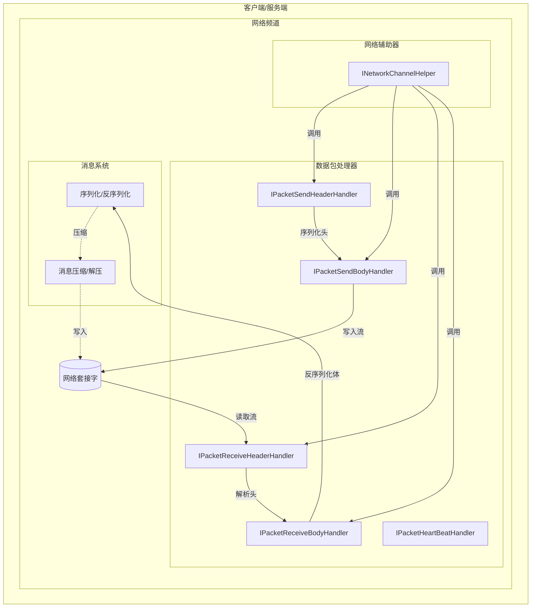
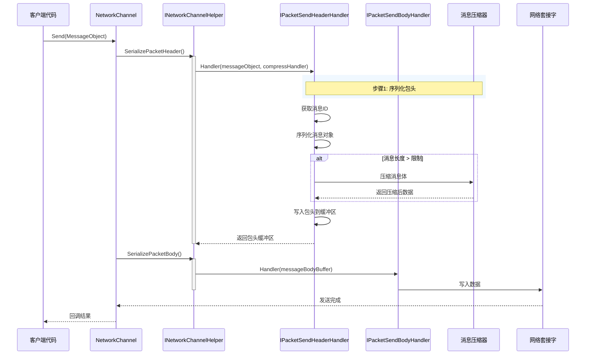
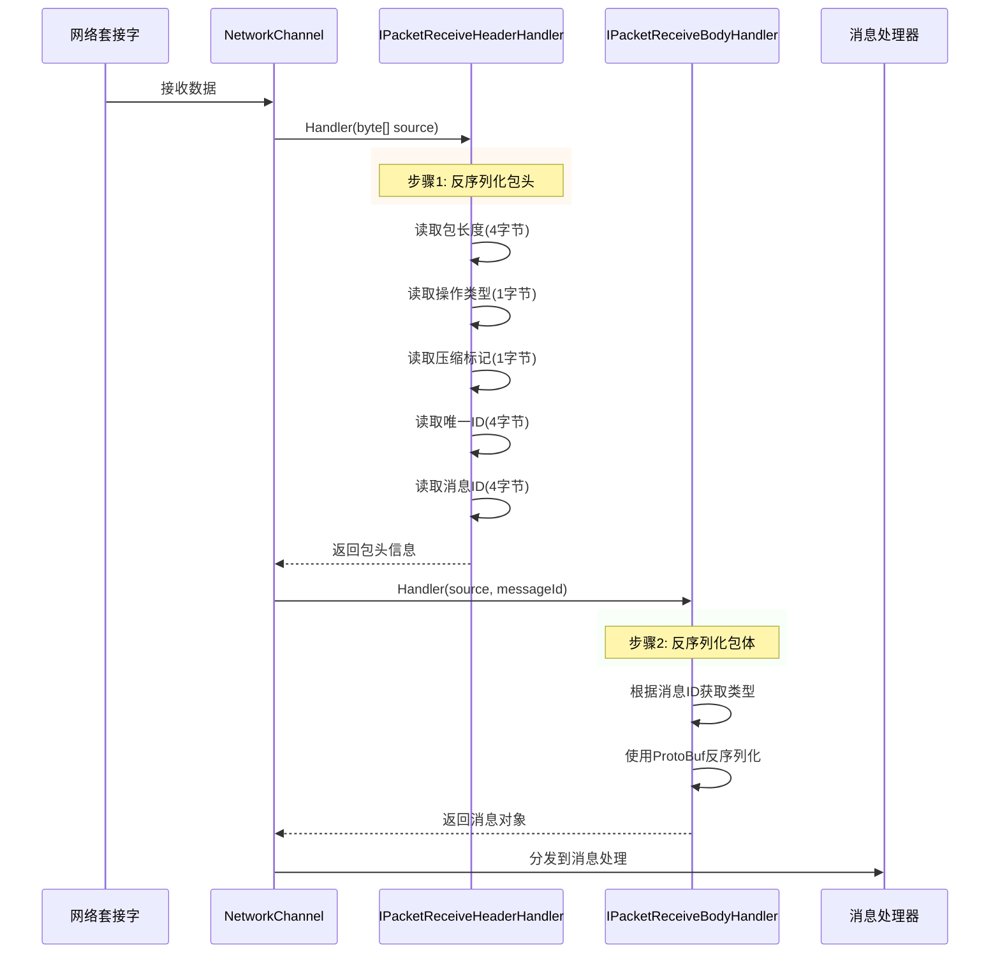

# 数据パッケージ処理器

数据パッケージ処理器是 GameFrameX 网络库的コアコンポーネント，负责网络メッセージ的シリアライズ和反シリアライズ操作。它们将应用层的メッセージ对象转换为网络字节流（发送时），并将受信到的字节流转换回メッセージ对象（受信时）。

## 概要

在网络通信中，数据〜する必要があります经过特定的フォーマット処理才能在网络中传输。数据パッケージ処理器正是承担这一职责的关键コンポーネント，它们定義了网络メッセージ的结构和解析方法，使得開発者〜できます专注于业务逻辑而无需关心底层网络通信细节。

GameFrameX 网络库提供します五类数据パッケージ処理器：
- **发送パッケージ头処理器**：负责シリアライズメッセージ头部情報
- **发送パッケージ体処理器**：负责シリアライズメッセージ体内容
- **受信パッケージ头処理器**：负责反シリアライズメッセージ头部情報
- **受信パッケージ体処理器**：负责反シリアライズメッセージ体内容
- **心跳パッケージ処理器**：负责処理心跳检测相关逻辑

## アーキテクチャ



上图表示了数据パッケージ処理器在网络通信中的コア位置。它们通过网络辅助器（INetworkChannelHelper）被呼び出し，完成メッセージ的シリアライズ和反シリアライズ工作。

## メッセージ发送フロー

当客户端〜する必要があります发送メッセージ时，数据パッケージ処理器按照特定的顺序処理メッセージ对象：



发送フロー分为两个主なフェーズ：
1. **パッケージ头シリアライズ**：发送パッケージ头処理器まず被呼び出し，它取得メッセージ的タイプ情報（メッセージID），将メッセージ对象シリアライズ为字节数组，根据設定决定是否压缩，次に写入パッケージ头情報（パッケージ长度、操作タイプ、压缩标记、唯一ID、メッセージID）
2. **パッケージ体シリアライズ**：发送パッケージ体処理器将処理好的パッケージ体数据写入目标流

## メッセージ受信フロー

当从网络受信到数据时，数据パッケージ処理器反向処理字节流，将其转换为メッセージ对象：



受信フロー同样分为两个フェーズ：
1. **パッケージ头反シリアライズ**：受信パッケージ头処理器从字节流中解析出パッケージ长度、操作タイプ、压缩标记、唯一ID和メッセージID等情報
2. **パッケージ体反シリアライズ**：受信パッケージ体処理器根据メッセージID找到对应的メッセージタイプ，使用 ProtoBuf 反シリアライズ为メッセージ对象

## インターフェース定義

### IPacketHandler

标记インターフェース，所有数据パッケージ処理器都〜する必要があります実装此インターフェース：

```csharp
namespace GameFrameX.Network.Runtime
{
    public interface IPacketHandler
    {
    }
}
```
> Source: [IPacketHandler.cs](https://github.com/GameFrameX/com.gameframex.unity.network/blob/main/Runtime/Network/Interface/IPacketHandler.cs#L3-L5)

### IPacketSendHeaderHandler

发送パッケージ头処理器インターフェース，负责シリアライズメッセージ头部：

```csharp
public interface IPacketSendHeaderHandler
{
    /// 消息包头长度
    ushort PacketHeaderLength { get; }

    /// 获取网络消息包协议编号
    int Id { get; }

    /// 获取网络消息包长度
    uint PacketLength { get; }

    /// 是否压缩消息内容
    bool IsZip { get; }

    /// 超过消息的长度超过该值的时候启用压缩.该值 必须在设置压缩器的时候才生效
    uint LimitCompressLength { get; }

    /// 处理消息
    bool Handler<T>(T messageObject, IMessageCompressHandler messageCompressHandler, 
        MemoryStream destination, out byte[] messageBodyBuffer) where T : MessageObject;
}
```
> Source: [IPacketSendHeaderHandler.cs](https://github.com/GameFrameX/com.gameframex.unity.network/blob/main/Runtime/Network/Interface/IPacketSendHeaderHandler.cs#L8-L45)

### IPacketSendBodyHandler

发送パッケージ体処理器インターフェース，负责将メッセージ体写入目标流：

```csharp
public interface IPacketSendBodyHandler
{
    /// 处理消息体
    bool Handler(byte[] messageBodyBuffer, MemoryStream destination);
}
```
> Source: [IPacketSendBodyHandler.cs](https://github.com/GameFrameX/com.gameframex.unity.network/blob/main/Runtime/Network/Interface/IPacketSendBodyHandler.cs#L39-L48)

### IPacketReceiveHeaderHandler

受信パッケージ头処理器インターフェース，负责反シリアライズメッセージ头部：

```csharp
public interface IPacketReceiveHeaderHandler
{
    /// 获取网络消息包长度
    uint PacketLength { get; }

    /// 消息包头长度
    ushort PacketHeaderLength { get; }

    /// 获取网络消息包协议编号
    int Id { get; }

    /// 消息唯一编号
    int UniqueId { get; }

    /// 消息操作类型
    byte OperationType { get; }

    /// 压缩标记
    byte ZipFlag { get; }

    /// 消息包处理
    bool Handler(object source);
}
```
> Source: [IPacketReceiveHeaderHandler.cs](https://github.com/GameFrameX/com.gameframex.unity.network/blob/main/Runtime/Network/Interface/IPacketReceiveHeaderHandler.cs#L37-L75)

### IPacketReceiveBodyHandler

受信パッケージ体処理器インターフェース，负责反シリアライズメッセージ体：

```csharp
public interface IPacketReceiveBodyHandler
{
    /// 网络消息包处理函数
    bool Handler<T>(byte[] source, int messageId, out T messageObject) where T : MessageObject;
}
```
> Source: [IPacketReceiveBodyHandler.cs](https://github.com/GameFrameX/com.gameframex.unity.network/blob/main/Runtime/Network/Interface/IPacketReceiveBodyHandler.cs#L6-L15)

### IPacketHeartBeatHandler

心跳パッケージ処理器インターフェース，负责心跳メッセージ的生成和処理：

```csharp
public interface IPacketHeartBeatHandler
{
    /// 每次心跳的间隔
    float HeartBeatInterval { get; }

    /// 几次心跳丢失触发断开网络
    int MissHeartBeatCountByClose { get; }

    /// 处理器
    MessageObject Handler();
}
```
> Source: [IPacketHeartBeatHandler.cs](https://github.com/GameFrameX/com.gameframex.unity.network/blob/main/Runtime/Network/Interface/IPacketHeartBeatHandler.cs#L6-L23)

## デフォルト実装

### DefaultPacketSendHeaderHandler

デフォルト发送パッケージ头処理器実装了完全な的パッケージ头シリアライズ逻辑：

```csharp
public class DefaultPacketSendHeaderHandler : IPacketSendHeaderHandler, IPacketHandler
{
    private const int NetPacketLength = sizeof(uint);
    private const int NetCmdIdLength = sizeof(int);
    private const int NetOperationTypeLength = sizeof(byte);
    private const int NetZipFlagLength = sizeof(byte);
    private const int NetUniqueIdLength = sizeof(int);

    public ushort PacketHeaderLength { get; }
    public int Id { get; private set; }
    public uint PacketLength { get; private set; }
    public bool IsZip { get; private set; }
    public virtual uint LimitCompressLength { get; } = 512;

    private int m_Offset;
    private readonly byte[] m_CachedByte;

    public DefaultPacketSendHeaderHandler()
    {
        PacketHeaderLength = NetPacketLength + NetOperationTypeLength + 
            NetZipFlagLength + NetUniqueIdLength + NetCmdIdLength;
        m_CachedByte = new byte[PacketHeaderLength];
    }

    public bool Handler<T>(T messageObject, IMessageCompressHandler messageCompressHandler, 
        MemoryStream destination, out byte[] messageBodyBuffer) where T : MessageObject
    {
        m_Offset = 0;
        var messageType = messageObject.GetType();
        Id = ProtoMessageIdHandler.GetReqMessageIdByType(messageType);
        messageBodyBuffer = SerializerHelper.Serialize(messageObject);
        
        // 根据长度决定是否压缩
        if (messageCompressHandler != null && messageBodyBuffer.Length > LimitCompressLength)
        {
            IsZip = true;
            messageBodyBuffer = messageCompressHandler.Handler(messageBodyBuffer);
        }
        else
        {
            IsZip = false;
        }

        var messageLength = messageBodyBuffer.Length;
        PacketLength = (uint)(PacketHeaderLength + messageLength);
        
        // 写入包头数据
        m_CachedByte.WriteUInt(PacketLength, ref m_Offset);
        m_CachedByte.WriteByte((byte)(ProtoMessageIdHandler.IsHeartbeat(messageType) ? 1 : 4), ref m_Offset);
        m_CachedByte.WriteByte((byte)(IsZip ? 1 : 0), ref m_Offset);
        m_CachedByte.WriteInt(messageObject.UniqueId, ref m_Offset);
        m_CachedByte.WriteInt(Id, ref m_Offset);
        destination.Write(m_CachedByte, 0, PacketHeaderLength);
        return true;
    }
}
```
> Source: [DefaultPacketSendHeaderHandler.cs](https://github.com/GameFrameX/com.gameframex.unity.network/blob/main/Runtime/Network/Helper/DefaultPacketSendHeaderHandler.cs#L11-L114)

### DefaultPacketReceiveHeaderHandler

デフォルト受信パッケージ头処理器実装了完全な的パッケージ头解析逻辑：

```csharp
public sealed class DefaultPacketReceiveHeaderHandler : IPacketReceiveHeaderHandler, IPacketHandler
{
    public uint PacketLength { get; private set; }
    public int Id { get; private set; }
    public int UniqueId { get; private set; }
    public byte OperationType { get; private set; }
    public byte ZipFlag { get; private set; }
    public ushort PacketHeaderLength { get; } = 14; // 4+1+1+4+4

    public bool Handler(object source)
    {
        byte[] reader = source as byte[];
        if (reader == null)
        {
            return false;
        }

        int offset = 0;
        PacketLength = reader.ReadUInt(ref offset);
        OperationType = reader.ReadByte(ref offset);
        ZipFlag = reader.ReadByte(ref offset);
        UniqueId = reader.ReadInt(ref offset);
        Id = reader.ReadInt(ref offset);
        return true;
    }
}
```
> Source: [DefaultPacketReceiveHeaderHandler.cs](https://github.com/GameFrameX/com.gameframex.unity.network/blob/main/Runtime/Network/Helper/DefaultPacketReceiveHeaderHandler.cs#L9-L64)

### DefaultPacketSendBodyHandler

デフォルト发送パッケージ体処理器，将メッセージ体写入目标流：

```csharp
public sealed class DefaultPacketSendBodyHandler : IPacketSendBodyHandler, IPacketHandler
{
    public bool Handler(byte[] messageBodyBuffer, MemoryStream destination)
    {
        destination.Write(messageBodyBuffer, 0, messageBodyBuffer.Length);
        return true;
    }
}
```
> Source: [DefaultPacketSendBodyHandler.cs](https://github.com/GameFrameX/com.gameframex.unity.network/blob/main/Runtime/Network/Helper/DefaultPacketSendBodyHandler.cs#L9-L16)

### DefaultPacketReceiveBodyHandler

デフォルト受信パッケージ体処理器，使用 ProtoBuf 反シリアライズメッセージ：

```csharp
public sealed class DefaultPacketReceiveBodyHandler : IPacketReceiveBodyHandler, IPacketHandler
{
    public bool Handler<T>(byte[] source, int messageId, out T messageObject) where T : MessageObject
    {
        var messageType = ProtoMessageIdHandler.GetRespTypeById(messageId);
        messageObject = (T)SerializerHelper.Deserialize(source, messageType);
        return true;
    }
}
```
> Source: [DefaultPacketReceiveBodyHandler.cs](https://github.com/GameFrameX/com.gameframex.unity.network/blob/main/Runtime/Network/Helper/DefaultPacketReceiveBodyHandler.cs#L9-L17)

### BasePacketHeartBeatHandler

デフォルト心跳パッケージ処理器基底クラス：

```csharp
public class BasePacketHeartBeatHandler : IPacketHeartBeatHandler, IPacketHandler
{
    public virtual float HeartBeatInterval
    {
        get { return 5; }
    }

    public virtual int MissHeartBeatCountByClose { get; } = 5;

    public virtual MessageObject Handler()
    {
        throw new System.NotImplementedException();
    }
}
```
> Source: [DefaultPacketHeartBeatHandler.cs](https://github.com/GameFrameX/com.gameframex.unity.network/blob/main/Runtime/Network/Helper/DefaultPacketHeartBeatHandler.cs#L7-L26)

## 自定義数据パッケージ処理器

もしデフォルト的処理器无法满足需求，開発者〜できます作成自定義的数据パッケージ処理器。自定義処理器〜する必要があります実装相应的インターフェース并継承 `IPacketHandler` 标记インターフェース。

### 作成自定義受信パッケージ头処理器

```csharp
using UnityEngine;
using GameFrameX.Network.Runtime;
using GameFrameX.Runtime;

[UnityEngine.Scripting.Preserve]
public sealed class CustomPacketReceiveHeaderHandler : IPacketReceiveHeaderHandler, IPacketHandler
{
    public uint PacketLength { get; private set; }
    public ushort PacketHeaderLength { get; } = 14;
    public int Id { get; private set; }
    public int UniqueId { get; private set; }
    public byte OperationType { get; private set; }
    public byte ZipFlag { get; private set; }

    public bool Handler(object source)
    {
        // 自定义解析逻辑
        byte[] reader = source as byte[];
        if (reader == null || reader.Length < PacketHeaderLength)
        {
            return false;
        }

        // 自定义解析实现...
        return true;
    }
}
```

### 作成自定義心跳パッケージ処理器

```csharp
using UnityEngine;
using GameFrameX.Network.Runtime;

[UnityEngine.Scripting.Preserve]
public sealed class CustomHeartBeatHandler : BasePacketHeartBeatHandler
{
    // 设置心跳间隔为10秒
    public override float HeartBeatInterval => 10;

    // 设置丢失5次心跳后断开连接
    public override int MissHeartBeatCountByClose => 5;

    public override MessageObject Handler()
    {
        // 返回自定义的心跳消息对象
        return new C2SHeartBeat();
    }
}
```

## 設定オプション

数据パッケージ処理器的行为〜できます通过以下方法进行設定：

| 設定项 | タイプ | デフォルト值 | 説明 |
|--------|------|--------|------|
| LimitCompressLength | uint | 512 | 超过此长度时启用メッセージ压缩 |
| HeartBeatInterval | float | 5.0 | 心跳パッケージ发送间隔（秒） |
| MissHeartBeatCountByClose | int | 5 | 丢失心跳次数上限，超过则断开连接 |

## 関連リンク

- [网络マネージャー](./4-core-concepts.1-network-manager)
- [网络频道](./4-core-concepts.2-network-channel)
- [メッセージタイプ](./4-core-concepts.3-message-types)
- [心跳机制](./5-heartbeat)
- [メッセージ压缩](./7-message-compression)
