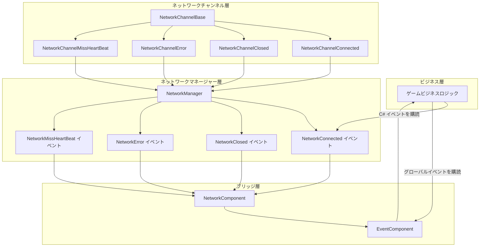
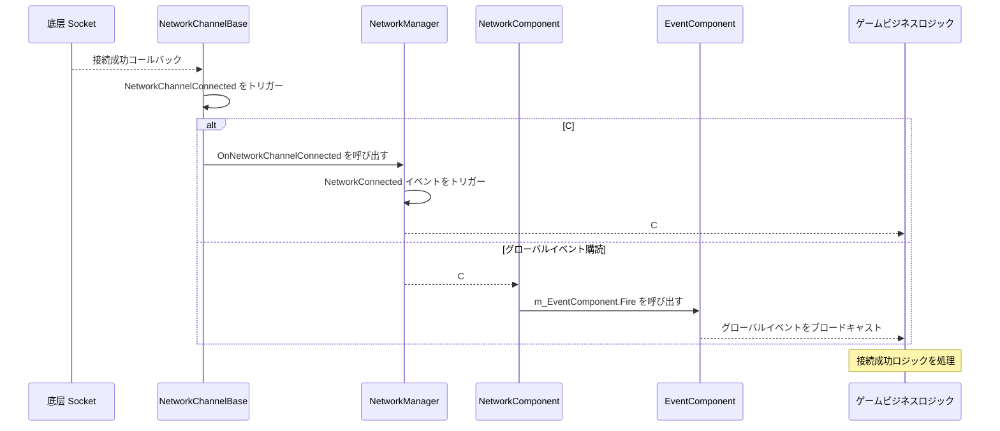

# イベントシステム

GameFrameX Unity Network モジュールは完全なイベントシステムを提供し、ネットワーク接続状態の変化、エラーの発生、ハートビートの丢失など、重要なネットワークイベントを通知します。このイベントシステムは二層アーキテクチャを採用し、C# ネイティブイベントと GameFrameX のグローバルイベントシステムの両方をサポートしています。

## 概要

ネットワークイベントシステムは GameFrameX Unity Network モジュールのコアコンポーネントの一つであり、ネットワークロジックとビジネスロジックを分離し、開発者が灵活に各种のネットワーク状態変化に応答できるようにします。イベントシステムの設計は以下の原則に従っています：

- **分離設計**：ネットワーク底层はイベントを通じて上层に状態変化を通知し、ビジネス層はイベントの購読によってネットワーク状態を処理します
- **二重サポート**：C# ネイティブイベント делегат と GameFrameX グローバルイベントシステムの両方をサポートします
- **オブジェクト再利用**：オブジェクトプール技術を使用してイベントパラメータを管理し、メモリ割り当て开销を減少させます

イベントシステムはゲーム開発において特に重要であり、ネットワークコアコードを変更せずに、离线再接続、掉線ヒント、ハートビート異常処理などの機能をゲームに追加できます。

## アーキテクチャ

GameFrameX Unity Network のイベントシステムは二層アーキテクチャ設計を採用しており、この設計は使いやすさと柔軟性のバランスを取っています。



### アーキテクチャの説明

**ネットワークチャンネル層（NetworkChannelBase）** はネットワークイベントの発信源です。底层 Socket 接続が成功、断开、エラーが発生、またはハートビートが丢失すると、NetworkChannelBase は対応する Action  делегатをトリガーします。

**ネットワークマネージャーレイヤー（NetworkManager）** は NetworkChannelBase の内部イベントを購読し、これらのイベントを公開発の C# イベント（event）に変換します。このレイヤーは開発者が直接やり取りする主要なインターフェースです。

**ブリッジ層（NetworkComponent）** は C# イベントシステムと GameFrameX グローバルイベントシステム間のブリッジとして機能します。C# イベントの直接購読方法を提供するだけでなく、EventComponent を通じてグローバルイベント購読者能力も提供します。

## イベントタイプ

GameFrameX Unity Network モジュールは4つのコアネットワークイベントを定義しており、各イベントにはイベント関連データを携带する対応する EventArgs クラスがあります。

### NetworkConnectedEventArgs - 接続成功イベント

ネットワーク接続が正常に確立されたときにこのイベントがトリガーされます。このイベント наиболее распространенный сетевой событийの1つであり、通常はゲームのログイン、サーバー時間の取得などの subsequent 操作をトリガーするために使用されます。

```csharp
using GameFrameX.Network.Runtime;

// イベントパラメータプロパティの説明
public sealed class NetworkConnectedEventArgs : GameEventArgs
{
    // イベントユニーク識別子
    public static readonly string EventId = typeof(NetworkConnectedEventArgs).FullName;

    // ネットワーク接続成功イベント番号を取得
    public override string Id => EventId;

    // ネットワークチャンネルを取得 - このイベントをトリガーしたチャンネルオブジェクト
    public INetworkChannel NetworkChannel { get; private set; }

    // ユーザー定義データを取得 - Connect メソッドに渡された userData パラメータ
    public object UserData { get; private set; }
}
```

> Source: [NetworkConnectedEventArgs.cs](https://github.com/GameFrameX/com.gameframex.unity.network/blob/main/Runtime/EventArgs/NetworkConnectedEventArgs.cs#L41-L97)

### NetworkClosedEventArgs - 接続关闭イベント

ネットワーク接続が閉じられたときにこのイベントがトリガーされます。このイベントには关闭原因とエラーコードが携带され、通常の关闭か异常断开かを判断するために使用できます。

```csharp
public sealed class NetworkClosedEventArgs : GameEventArgs
{
    // イベントユニーク識別子
    public static readonly string EventId = typeof(NetworkClosedEventArgs).FullName;

    // ネットワークチャンネルを取得
    public INetworkChannel NetworkChannel { get; private set; }

    // 閉じる理由を取得
    // 可能な値：Normal, Timeout, Dispose, ConnectClose, ConnectAddressError, ConnectAddressExceptionError, MissHeartBeat
    public string Reason { get; private set; }

    // エラーコードを取得
    public ushort ErrorCode { get; private set; }
}
```

> Source: [NetworkClosedEventArgs.cs](https://github.com/GameFrameX/com.gameframex.unity.network/blob/main/Runtime/EventArgs/NetworkClosedEventArgs.cs#L41-L103)

### NetworkErrorEventArgs - ネットワークエラーイベント

ネットワークエラーが発生したときにこのイベントがトリガーされます。このイベントには、应用層エラーコードと底层 Socket エラーコードを含む 풍부なエラー情報が提供されます。

```csharp
public sealed class NetworkErrorEventArgs : GameEventArgs
{
    // イベントユニーク識別子
    public static readonly string EventId = typeof(NetworkErrorEventArgs).FullName;

    // ネットワークチャンネルを取得
    public INetworkChannel NetworkChannel { get; private set; }

    // 应用層エラーコードを取得
    // 列挙値：Unknown, AddressFamilyError, SocketError, ConnectError, SendError, ReceiveError, SerializeError, DeserializePacketHeaderError, DeserializePacketError, MissHeartBeatError, DisposeError
    public NetworkErrorCode ErrorCode { get; private set; }

    // 底层 Socket エラーコードを取得
    public SocketError SocketErrorCode { get; private set; }

    // エラーメッセージを取得
    public string ErrorMessage { get; private set; }
}
```

> Source: [NetworkErrorEventArgs.cs](https://github.com/GameFrameX/com.gameframex.unity.network/blob/main/Runtime/EventArgs/NetworkErrorEventArgs.cs#L42-L116)

### NetworkMissHeartBeatEventArgs - ハートビート丢失イベント

ハートビートパケットの丢失がある回数に達するとこのイベントがトリガーされます。このイベントを使用して、より精细な离线再接続ロジックを実装できます。たとえば、3回のハートビートが丢失したときにネットワーク不稳定プロンプトをユーザーに表示します。

```csharp
public sealed class NetworkMissHeartBeatEventArgs : GameEventArgs
{
    // イベントユニーク識別子
    public static readonly string EventId = typeof(NetworkMissHeartBeatEventArgs).FullName;

    // ネットワークチャンネルを取得
    public INetworkChannel NetworkChannel { get; private set; }

    // ハートビートパケットが既に丢失された回数を取得
    // 丢失回数が MissHeartBeatCountByClose（デフォルト 10 回）を超えると、接続は自動的に閉じられます
    public int MissCount { get; private set; }
}
```

> Source: [NetworkMissHeartBeatEventArgs.cs](https://github.com/GameFrameX/com.gameframex.unity.network/blob/main/Runtime/EventArgs/NetworkMissHeartBeatEventArgs.cs#L41-L97)

## イベントフロー

ネットワークイベントの完全フローは複数のコンポーネントの协作にも関わります。このフローを理解することは、イベントシステムを使用して信頼性の高いネットワーク機能を構築するのに役立ちます。



### イベントトリガータイミング

| イベントタイプ | トリガータイミング | 後続の動作 |
|---------|---------|---------|
| NetworkConnected | TCP 接続が正常に確立された後 | ログインリクエストまたはサーバー時間の取得を送信できます |
| NetworkClosed | 接続が断开されたとき（通常/异常） | リソースを清理し、再接続ロジックをトリガーします |
| NetworkError | ネットワークエラーが発生したとき | ログを記録し、接続の断开をトリガーする可能性があります |
| NetworkMissHeartBeat | ハートビートパケットが丢失されたとき | UI プロンプトを更新し、接続の断开をトリガーする可能性があります |

## 使用例

### 方法一：C# ネイティブイベントを使用

C# ネイティブイベント最も直接的なイベント購読方法であり、シンプルなネットワークイベント処理シナリオに適しています。

```csharp
using GameFrameX.Network.Runtime;
using UnityEngine;

public class NetworkExample : MonoBehaviour
{
    private INetworkManager networkManager;
    private INetworkChannel channel;

    private void Start()
    {
        // ネットワークマネージャーを取得
        networkManager = GameFrameworkEntry.GetModule<INetworkManager>();
        
        // ネットワークイベントを購読
        networkManager.NetworkConnected += OnNetworkConnected;
        networkManager.NetworkClosed += OnNetworkClosed;
        networkManager.NetworkError += OnNetworkError;
        networkManager.NetworkMissHeartBeat += OnNetworkMissHeartBeat;
        
        // ネットワークチャンネルを作成
        var helper = new DefaultNetworkChannelHelper();
        channel = networkManager.CreateNetworkChannel("GameServer", helper, 5000);
        
        // サーバーに接続
        channel.Connect(new Uri("tcp://127.0.0.1:8888"));
    }

    private void OnNetworkConnected(object sender, NetworkConnectedEventArgs e)
    {
        Debug.Log($"接続成功！チャンネル: {e.NetworkChannel.Name}, ユーザーデータ: {e.UserData}");
    }

    private void OnNetworkClosed(object sender, NetworkClosedEventArgs e)
    {
        Debug.Log($"接続关闭！理由: {e.Reason}, エラーコード: {e.ErrorCode}");
    }

    private void OnNetworkError(object sender, NetworkErrorEventArgs e)
    {
        Debug.LogError($"ネットワークエラー！エラーコード: {e.ErrorCode}, Socketエラー: {e.SocketErrorCode}, メッセージ: {e.ErrorMessage}");
    }

    private void OnNetworkMissHeartBeat(object sender, NetworkMissHeartBeatEventArgs e)
    {
        Debug.LogWarning($"ハートビート丢失！回数: {e.MissCount}");
    }

    private void OnDestroy()
    {
        // イベントの購読を解除
        if (networkManager != null)
        {
            networkManager.NetworkConnected -= OnNetworkConnected;
            networkManager.NetworkClosed -= OnNetworkClosed;
            networkManager.NetworkError -= OnNetworkError;
            networkManager.NetworkMissHeartBeat -= OnNetworkMissHeartBeat;
        }
    }
}
```

> Source: [NetworkManager.cs](https://github.com/GameFrameX/com.gameframex.unity.network/blob/main/Runtime/Network/Network/NetworkManager.cs#L261-L311)

### 方法二：NetworkComponent を使用してグローバルイベントを購読

NetworkComponent は GameFrameX EventComponent との統合を提供し、グローバルイベントを購読してネットワーク状態の変化を処理できます。この方法はモジュール間通信が必要なシナリオにより適しています。

```csharp
using GameFrameX.Event.Runtime;
using GameFrameX.Network.Runtime;
using UnityEngine;

public class GlobalEventExample : MonoBehaviour
{
    private EventComponent eventComponent;

    private void Start()
    {
        // イベントコンポーネントを取得
        eventComponent = GameEntry.GetComponent<EventComponent>();
        
        // グローバルイベントを購読
        eventComponent.Subscribe(NetworkConnectedEventArgs.EventId, OnNetworkConnected);
        eventComponent.Subscribe(NetworkClosedEventArgs.EventId, OnNetworkClosed);
        eventComponent.Subscribe(NetworkErrorEventArgs.EventId, OnNetworkError);
        eventComponent.Subscribe(NetworkMissHeartBeatEventArgs.EventId, OnNetworkMissHeartBeat);
    }

    private void OnNetworkConnected(object sender, GameEventArgs e)
    {
        var args = e as NetworkConnectedEventArgs;
        Debug.Log($"グローバルイベント - 接続成功！チャンネル: {args.NetworkChannel.Name}");
    }

    private void OnNetworkClosed(object sender, GameEventArgs e)
    {
        var args = e as NetworkClosedEventArgs;
        Debug.Log($"グローバルイベント - 接続关闭！理由: {args.Reason}");
    }

    private void OnNetworkError(object sender, GameEventArgs e)
    {
        var args = e as NetworkErrorEventArgs;
        Debug.LogError($"グローバルイベント - ネットワークエラー: {args.ErrorMessage}");
    }

    private void OnNetworkMissHeartBeat(object sender, GameEventArgs e)
    {
        var args = e as NetworkMissHeartBeatEventArgs;
        Debug.LogWarning($"グローバルイベント - ハートビート丢失回数: {args.MissCount}");
    }

    private void OnDestroy()
    {
        // グローバルイベントの購読を解除
        if (eventComponent != null)
        {
            eventComponent.Unsubscribe(NetworkConnectedEventArgs.EventId, OnNetworkConnected);
            eventComponent.Unsubscribe(NetworkClosedEventArgs.EventId, OnNetworkClosed);
            eventComponent.Unsubscribe(NetworkErrorEventArgs.EventId, OnNetworkError);
            eventComponent.Unsubscribe(NetworkMissHeartBeatEventArgs.EventId, OnNetworkMissHeartBeat);
        }
    }
}
```

> Source: [NetworkComponent.cs](https://github.com/GameFrameX/com.gameframex.unity.network/blob/main/Runtime/Network/NetworkComponent.cs#L196-L214)

### 方法三：NetworkComponent イベントプロパティを使用

NetworkComponent は NetworkManager と同じイベントプロパティを直接公開しており、Unity エディターの Inspector またはスクリプトで直接購読できます。

```csharp
public class DirectSubscribeExample : MonoBehaviour
{
    private NetworkComponent networkComponent;

    private void Start()
    {
        // NetworkComponent から直接イベントを購読
        networkComponent = GetComponent<NetworkComponent>();
        networkComponent.NetworkConnected += OnConnected;
        networkComponent.NetworkClosed += OnClosed;
    }

    private void OnConnected(object sender, NetworkConnectedEventArgs e)
    {
        Debug.Log("接続成功");
    }

    private void OnClosed(object sender, NetworkClosedEventArgs e)
    {
        Debug.Log($"接続关闭: {e.Reason}");
    }
}
```

> Source: [NetworkComponent.cs](https://github.com/GameFrameX/com.gameframex.unity.network/blob/main/Runtime/Network/NetworkComponent.cs#L109-L112)

## エラーコードリファレンス

### NetworkCloseReason - 閉じる理由

| 定数 | 説明 |
|-----|------|
| Normal | 正常に閉じる |
| Timeout | タイムアウトで閉じる |
| Dispose | リソース解放で閉じる |
| ConnectClose | 接続を閉じる |
| ConnectAddressError | 接続アドレスエラーで閉じる |
| ConnectAddressExceptionError | 接続アドレス例外エラーで閉じる |
| MissHeartBeat | ハートビート丢失で閉じる |

> Source: [NetworkErrorCode.cs](https://github.com/GameFrameX/com.gameframex.unity.network/blob/main/Runtime/Network/Base/NetworkErrorCode.cs#L34-L74)

### NetworkErrorCode - エラーコード

| 値 | 説明 |
|---|------|
| Unknown | 未知のエラー |
| AddressFamilyError | アドレス族エラー |
| SocketError | Socket エラー |
| ConnectError | 接続エラー |
| SendError | 送信エラー |
| ReceiveError | 受信エラー |
| SerializeError | シリアライズエラー |
| DeserializePacketHeaderError | パケットヘッダーのデシリアライズエラー |
| DeserializePacketError | パケットのデシリアライズエラー |
| MissHeartBeatError | ハートビート丢失エラー |
| DisposeError | リソース解放エラー |

> Source: [NetworkErrorCode.cs](https://github.com/GameFrameX/com.gameframex.unity.network/blob/main/Runtime/Network/Base/NetworkErrorCode.cs#L76-L137)

## ベストプラクティス

### イベント購読の提案

1. **適切な位置で購読**：ゲームの開始またはネットワークモジュールの初期化時にイベントを購読し、ゲームの終了またはシーン切り替え時に購読を解除します
2. **弱い参照を使用**：特定のシナリオでは弱い参照パターンを使用して考慮し、メモリリークを避けます
3. **例外処理を追加**：イベント処理コールバックに適切な例外処理を追加し、単一のイベント処理エラーがシステム全体に影響しないようにします
4. **時間のかかる操作を回避**：イベントコールバックで時間のかかる操作を実行しないようにします。複雑なロジックを処理する必要がある場合は、メッセージキューを非同期的に使用することを検討してください

### 离线再接続の例

以下はイベントシステムを使用して离线再接続を実装する例です：

```csharp
public class ReconnectExample : MonoBehaviour
{
    private INetworkManager networkManager;
    private int reconnectAttempts = 0;
    private const int MaxReconnectAttempts = 3;
    private string serverAddress = "tcp://127.0.0.1:8888";

    private void Start()
    {
        networkManager = GameFrameworkEntry.GetModule<INetworkManager>();
        networkManager.NetworkClosed += OnNetworkClosed;
        networkManager.NetworkConnected += OnNetworkConnected;
        
        Connect();
    }

    private void Connect()
    {
        var helper = new DefaultNetworkChannelHelper();
        var channel = networkManager.CreateNetworkChannel("GameServer", helper, 5000);
        channel.Connect(new Uri(serverAddress));
    }

    private void OnNetworkConnected(object sender, NetworkConnectedEventArgs e)
    {
        reconnectAttempts = 0;
        Debug.Log("接続成功、ゲームを開始");
    }

    private void OnNetworkClosed(object sender, NetworkClosedEventArgs e)
    {
        // 再接続が必要かどうかを確認
        if (e.Reason != NetworkCloseReason.Normal && reconnectAttempts < MaxReconnectAttempts)
        {
            reconnectAttempts++;
            Debug.Log($"接続が断开されました、{reconnectAttempts} 秒後に再接続を試みます...");
            Invoke(nameof(Connect), 3f);
        }
    }
}
```

## 関連リンク

- [ネットワークマネージャー](./4-core-concepts.1-network-manager) - NetworkManager の完全な API を理解する
- [ネットワークチャンネル](./4-core-concepts.2-network-channel) - ネットワークチャンネルの概念と使用を理解する
- [ハートビート](./5-heartbeat) - ハートビート検出の動作原理を理解する
- [RPC リモート呼び出し](./8-rpc) - RPC 呼び出しとイベントの配合使用を理解する
- [イベントシステム（GameFrameX Core）](https://github.com/GameFrameX/com.gameframex.unity.event) - GameFrameX グローバルイベントシステムについて詳細に理解する
