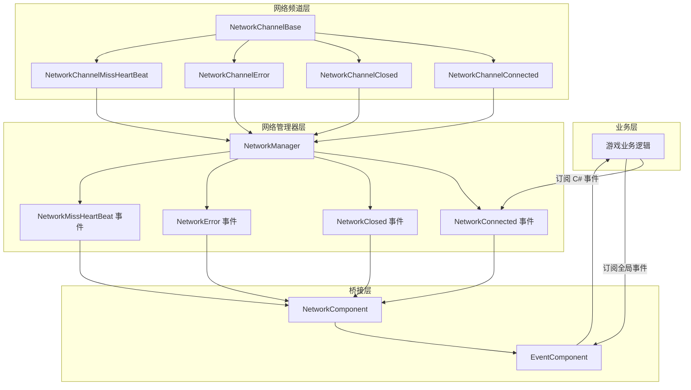
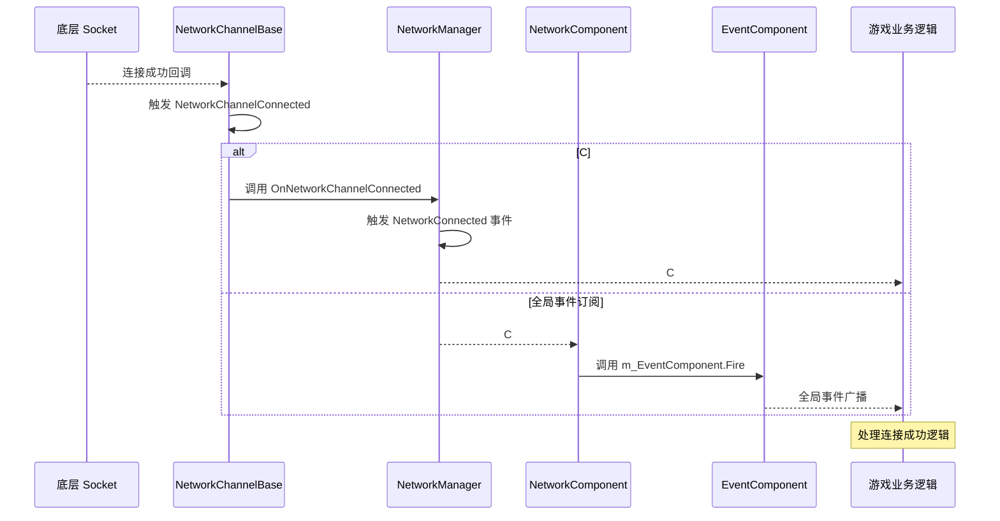

# イベント系统

GameFrameX Unity Network モジュール提供します完全な的イベント系统，用于通知网络连接ステータス变化、エラー发生および心跳丢失等关键网络イベント。该イベント系统采用双层アーキテクチャ，既サポート C# 原生イベント，也集成了 GameFrameX 的全局イベント系统。

## 概要

网络イベント系统是 GameFrameX Unity Network モジュール的コアコンポーネント之一，它解耦了网络逻辑与业务逻辑，使開発者〜できます柔軟地响应各种网络ステータス变化。イベント系统設計遵循以下原则：

- **解耦設計**：网络底层通过イベント向上层通知ステータス变化，业务层通过購読イベント来処理网络ステータス
- **双重サポート**：同時にサポート C# 原生イベントデリゲート和 GameFrameX 全局イベント系统
- **对象复用**：使用对象池技术管理イベントパラメータ，减少内存分配开销

イベント系统在游戏开发中尤为重要な，因为它允许您在不変更网络コアコード的情况下，为游戏追加断线重连、掉线ヒント、心跳例外処理等機能。

## アーキテクチャ

GameFrameX Unity Network 的イベント系统采用双层アーキテクチャ設計，这种設計兼顾了易用性和柔軟性。



### アーキテクチャ説明

**网络频道层（NetworkChannelBase）** 是网络イベント的发源地。当底层 Socket 连接成功、断开、发生エラー或心跳丢失时，NetworkChannelBase 会トリガー相应的 Action デリゲート。

**网络マネージャー层（NetworkManager）** 購読了 NetworkChannelBase 的内部イベント，次に将这些イベント转换为公开的 C# イベント（event）。这一层是開発者直接交互的主なインターフェース。

**桥接层（NetworkComponent）** 充当了 C# イベント系统和 GameFrameX 全局イベント系统之间的桥梁。它既提供します C# イベント的直接購読方法，也通过 EventComponent 提供します全局イベント購読能力。

## イベントタイプ

GameFrameX Unity Network モジュール定義了四种コア网络イベント，每种イベント都有对应的 EventArgs 类来携带イベント相关数据。

### NetworkConnectedEventArgs - 连接成功イベント

当网络连接成功建立时トリガー此イベント。该イベント是最常用的网络イベント之一，通常用于トリガー游戏登录、取得服务器时间等后续操作。

```csharp
using GameFrameX.Network.Runtime;

// 事件参数属性说明
public sealed class NetworkConnectedEventArgs : GameEventArgs
{
    // 事件唯一标识符
    public static readonly string EventId = typeof(NetworkConnectedEventArgs).FullName;

    // 获取网络连接成功事件编号
    public override string Id => EventId;

    // 获取网络频道 - 触发此事件的频道对象
    public INetworkChannel NetworkChannel { get; private set; }

    // 获取用户自定义数据 - Connect 方法传入的 userData 参数
    public object UserData { get; private set; }
}
```

> Source: [NetworkConnectedEventArgs.cs](https://github.com/GameFrameX/com.gameframex.unity.network/blob/main/Runtime/EventArgs/NetworkConnectedEventArgs.cs#L41-L97)

### NetworkClosedEventArgs - 连接閉じるイベント

当网络连接閉じる时トリガー此イベント。该イベント携带閉じる原因和エラー码，可用于判断是正常閉じる还是例外断开。

```csharp
public sealed class NetworkClosedEventArgs : GameEventArgs
{
    // 事件唯一标识符
    public static readonly string EventId = typeof(NetworkClosedEventArgs).FullName;

    // 获取网络频道
    public INetworkChannel NetworkChannel { get; private set; }

    // 获取关闭原因
    // 可能的值：Normal, Timeout, Dispose, ConnectClose, ConnectAddressError, ConnectAddressExceptionError, MissHeartBeat
    public string Reason { get; private set; }

    // 获取错误码
    public ushort ErrorCode { get; private set; }
}
```

> Source: [NetworkClosedEventArgs.cs](https://github.com/GameFrameX/com.gameframex.unity.network/blob/main/Runtime/EventArgs/NetworkClosedEventArgs.cs#L41-L103)

### NetworkErrorEventArgs - 网络エラーイベント

当网络发生エラー时トリガー此イベント。该イベント提供します丰富的エラー情報，含みます应用层エラー码和底层 Socket エラー码。

```csharp
public sealed class NetworkErrorEventArgs : GameEventArgs
{
    // 事件唯一标识符
    public static readonly string EventId = typeof(NetworkErrorEventArgs).FullName;

    // 获取网络频道
    public INetworkChannel NetworkChannel { get; private set; }

    // 获取应用层错误码
    // 枚举值：Unknown, AddressFamilyError, SocketError, ConnectError, SendError, ReceiveError, SerializeError, DeserializePacketHeaderError, DeserializePacketError, MissHeartBeatError, DisposeError
    public NetworkErrorCode ErrorCode { get; private set; }

    // 获取底层 Socket 错误码
    public SocketError SocketErrorCode { get; private set; }

    // 获取错误信息
    public string ErrorMessage { get; private set; }
}
```

> Source: [NetworkErrorEventArgs.cs](https://github.com/GameFrameX/com.gameframex.unity.network/blob/main/Runtime/EventArgs/NetworkErrorEventArgs.cs#L42-L116)

### NetworkMissHeartBeatEventArgs - 心跳丢失イベント

当心跳パッケージ丢失达到一定次数时トリガー此イベント。该イベント可用于実装更细粒度的断线重连逻辑，例えば在丢失 3 次心跳时ヒントユーザー网络不稳定。

```csharp
public sealed class NetworkMissHeartBeatEventArgs : GameEventArgs
{
    // 事件唯一标识符
    public static readonly string EventId = typeof(NetworkMissHeartBeatEventArgs).FullName;

    // 获取网络频道
    public INetworkChannel NetworkChannel { get; private set; }

    // 获取心跳包已丢失次数
    // 当丢失次数超过 MissHeartBeatCountByClose（默认 10 次）时，连接将被自动关闭
    public int MissCount { get; private set; }
}
```

> Source: [NetworkMissHeartBeatEventArgs.cs](https://github.com/GameFrameX/com.gameframex.unity.network/blob/main/Runtime/EventArgs/NetworkMissHeartBeatEventArgs.cs#L41-L97)

## イベントフロー

网络イベント的完全なフロー涉及多个コンポーネント的协作。理解这个フロー有助于您更好地使用イベント系统来ビルド可靠的网络機能。



### イベントトリガー时机

| イベントタイプ | トリガー时机 | 后续动作 |
|---------|---------|---------|
| NetworkConnected | 成功建立 TCP 连接后 | 可发送登录请求或取得服务器时间 |
| NetworkClosed | 连接断开时（正常/例外） | 清理リソース，トリガー重连逻辑 |
| NetworkError | 发生网络エラー时 | 记录ログ，〜の可能性がありますトリガー断开连接 |
| NetworkMissHeartBeat | 心跳パッケージ丢失时 | アップデート UI ヒント，〜の可能性がありますトリガー断开连接 |

## 使用例

### 方法一：使用 C# 原生イベント

C# 原生イベント是最直接的イベント購読方法，适合シンプル的网络イベント処理シーン。

```csharp
using GameFrameX.Network.Runtime;
using UnityEngine;

public class NetworkExample : MonoBehaviour
{
    private INetworkManager networkManager;
    private INetworkChannel channel;

    private void Start()
    {
        // 获取网络管理器
        networkManager = GameFrameworkEntry.GetModule<INetworkManager>();
        
        // 订阅网络事件
        networkManager.NetworkConnected += OnNetworkConnected;
        networkManager.NetworkClosed += OnNetworkClosed;
        networkManager.NetworkError += OnNetworkError;
        networkManager.NetworkMissHeartBeat += OnNetworkMissHeartBeat;
        
        // 创建网络频道
        var helper = new DefaultNetworkChannelHelper();
        channel = networkManager.CreateNetworkChannel("GameServer", helper, 5000);
        
        // 连接到服务器
        channel.Connect(new Uri("tcp://127.0.0.1:8888"));
    }

    private void OnNetworkConnected(object sender, NetworkConnectedEventArgs e)
    {
        Debug.Log($"连接成功！频道: {e.NetworkChannel.Name}, 用户数据: {e.UserData}");
    }

    private void OnNetworkClosed(object sender, NetworkClosedEventArgs e)
    {
        Debug.Log($"连接关闭！原因: {e.Reason}, 错误码: {e.ErrorCode}");
    }

    private void OnNetworkError(object sender, NetworkErrorEventArgs e)
    {
        Debug.LogError($"网络错误！错误码: {e.ErrorCode}, Socket错误: {e.SocketErrorCode}, 消息: {e.ErrorMessage}");
    }

    private void OnNetworkMissHeartBeat(object sender, NetworkMissHeartBeatEventArgs e)
    {
        Debug.LogWarning($"心跳丢失！次数: {e.MissCount}");
    }

    private void OnDestroy()
    {
        // 取消订阅事件
        if (networkManager != null)
        {
            networkManager.NetworkConnected -= OnNetworkConnected;
            networkManager.NetworkClosed -= OnNetworkClosed;
            networkManager.NetworkError -= OnNetworkError;
            networkManager.NetworkMissHeartBeat -= OnNetworkMissHeartBeat;
        }
    }
}
```

> Source: [NetworkManager.cs](https://github.com/GameFrameX/com.gameframex.unity.network/blob/main/Runtime/Network/Network/NetworkManager.cs#L261-L311)

### 方法二：使用 NetworkComponent 購読全局イベント

NetworkComponent 提供します与 GameFrameX EventComponent 的集成，您〜できます通过購読全局イベント来処理网络ステータス变化。这种方法更适合〜する必要があります跨モジュール通信的シーン。

```csharp
using GameFrameX.Event.Runtime;
using GameFrameX.Network.Runtime;
using UnityEngine;

public class GlobalEventExample : MonoBehaviour
{
    private EventComponent eventComponent;

    private void Start()
    {
        // 获取事件组件
        eventComponent = GameEntry.GetComponent<EventComponent>();
        
        // 订阅全局事件
        eventComponent.Subscribe(NetworkConnectedEventArgs.EventId, OnNetworkConnected);
        eventComponent.Subscribe(NetworkClosedEventArgs.EventId, OnNetworkClosed);
        eventComponent.Subscribe(NetworkErrorEventArgs.EventId, OnNetworkError);
        eventComponent.Subscribe(NetworkMissHeartBeatEventArgs.EventId, OnNetworkMissHeartBeat);
    }

    private void OnNetworkConnected(object sender, GameEventArgs e)
    {
        var args = e as NetworkConnectedEventArgs;
        Debug.Log($"全局事件 - 连接成功！频道: {args.NetworkChannel.Name}");
    }

    private void OnNetworkClosed(object sender, GameEventArgs e)
    {
        var args = e as NetworkClosedEventArgs;
        Debug.Log($"全局事件 - 连接关闭！原因: {args.Reason}");
    }

    private void OnNetworkError(object sender, GameEventArgs e)
    {
        var args = e as NetworkErrorEventArgs;
        Debug.LogError($"全局事件 - 网络错误: {args.ErrorMessage}");
    }

    private void OnNetworkMissHeartBeat(object sender, GameEventArgs e)
    {
        var args = e as NetworkMissHeartBeatEventArgs;
        Debug.LogWarning($"全局事件 - 心跳丢失次数: {args.MissCount}");
    }

    private void OnDestroy()
    {
        // 取消订阅全局事件
        if (eventComponent != null)
        {
            eventComponent.Unsubscribe(NetworkConnectedEventArgs.EventId, OnNetworkConnected);
            eventComponent.Unsubscribe(NetworkClosedEventArgs.EventId, OnNetworkClosed);
            eventComponent.Unsubscribe(NetworkErrorEventArgs.EventId, OnNetworkError);
            eventComponent.Unsubscribe(NetworkMissHeartBeatEventArgs.EventId, OnNetworkMissHeartBeat);
        }
    }
}
```

> Source: [NetworkComponent.cs](https://github.com/GameFrameX/com.gameframex.unity.network/blob/main/Runtime/Network/NetworkComponent.cs#L196-L214)

### 方法三：使用 NetworkComponent イベントプロパティ

NetworkComponent 也直接暴露了与 NetworkManager 相同的イベントプロパティ，方便在 Unity エディタ中通过 Inspector 或脚本直接購読。

```csharp
public class DirectSubscribeExample : MonoBehaviour
{
    private NetworkComponent networkComponent;

    private void Start()
    {
        // 直接从 NetworkComponent 订阅事件
        networkComponent = GetComponent<NetworkComponent>();
        networkComponent.NetworkConnected += OnConnected;
        networkComponent.NetworkClosed += OnClosed;
    }

    private void OnConnected(object sender, NetworkConnectedEventArgs e)
    {
        Debug.Log("连接成功");
    }

    private void OnClosed(object sender, NetworkClosedEventArgs e)
    {
        Debug.Log($"连接关闭: {e.Reason}");
    }
}
```

> Source: [NetworkComponent.cs](https://github.com/GameFrameX/com.gameframex.unity.network/blob/main/Runtime/Network/NetworkComponent.cs#L109-L112)

## エラー码リファレンス

### NetworkCloseReason - 閉じる原因

| 常量 | 説明 |
|-----|------|
| Normal | 正常閉じる |
| Timeout | 超时閉じる |
| Dispose | リソース解放閉じる |
| ConnectClose | 连接閉じる |
| ConnectAddressError | 连接地址エラー閉じる |
| ConnectAddressExceptionError | 连接地址例外エラー閉じる |
| MissHeartBeat | 心跳丢失閉じる |

> Source: [NetworkErrorCode.cs](https://github.com/GameFrameX/com.gameframex.unity.network/blob/main/Runtime/Network/Base/NetworkErrorCode.cs#L34-L74)

### NetworkErrorCode - エラー码

| 值 | 説明 |
|---|------|
| Unknown | 未知エラー |
| AddressFamilyError | 地址族エラー |
| SocketError | Socket エラー |
| ConnectError | 连接エラー |
| SendError | 发送エラー |
| ReceiveError | 受信エラー |
| SerializeError | シリアライズエラー |
| DeserializePacketHeaderError | 反シリアライズメッセージパッケージ头エラー |
| DeserializePacketError | 反シリアライズメッセージパッケージエラー |
| MissHeartBeatError | 心跳丢失エラー |
| DisposeError | リソース解放エラー |

> Source: [NetworkErrorCode.cs](https://github.com/GameFrameX/com.gameframex.unity.network/blob/main/Runtime/Network/Base/NetworkErrorCode.cs#L76-L137)

## ベストプラクティス

### イベント購読お勧め

1. **在合适的位置購読**：在游戏开始或网络モジュール初期化时購読イベント，在游戏结束或シーン切换时取消購読
2. **使用弱参照**：在某些シーン下〜できます考虑使用弱参照モード，避免内存泄漏
3. **例外処理**：在イベント処理コールバック中追加适当的例外処理，避免单个イベント処理エラー影响整个系统
4. **避免耗时操作**：イベントコールバック中避免执行耗时操作，如需処理複雑逻辑，考虑使用メッセージ队列异步処理

### 断线重连例

以下は使用イベント系统実装断线重连的例：

```csharp
public class ReconnectExample : MonoBehaviour
{
    private INetworkManager networkManager;
    private int reconnectAttempts = 0;
    private const int MaxReconnectAttempts = 3;
    private string serverAddress = "tcp://127.0.0.1:8888";

    private void Start()
    {
        networkManager = GameFrameworkEntry.GetModule<INetworkManager>();
        networkManager.NetworkClosed += OnNetworkClosed;
        networkManager.NetworkConnected += OnNetworkConnected;
        
        Connect();
    }

    private void Connect()
    {
        var helper = new DefaultNetworkChannelHelper();
        var channel = networkManager.CreateNetworkChannel("GameServer", helper, 5000);
        channel.Connect(new Uri(serverAddress));
    }

    private void OnNetworkConnected(object sender, NetworkConnectedEventArgs e)
    {
        reconnectAttempts = 0;
        Debug.Log("连接成功，开始游戏");
    }

    private void OnNetworkClosed(object sender, NetworkClosedEventArgs e)
    {
        // 检查是否需要重连
        if (e.Reason != NetworkCloseReason.Normal && reconnectAttempts < MaxReconnectAttempts)
        {
            reconnectAttempts++;
            Debug.Log($"连接断开，{reconnectAttempts} 秒后尝试重连...");
            Invoke(nameof(Connect), 3f);
        }
    }
}
```

## 関連リンク

- [网络マネージャー](./4-core-concepts.1-network-manager) - 理解する NetworkManager 的完全な API
- [网络频道](./4-core-concepts.2-network-channel) - 理解する网络频道的コンセプト和使用
- [心跳机制](./5-heartbeat) - 理解する心跳检测的工作原理
- [RPC 远程呼び出し](./8-rpc) - 理解する RPC 呼び出し与イベント的配合使用
- [イベント系统（GameFrameX Core）](https://github.com/GameFrameX/com.gameframex.unity.event) - 理解する更多关于 GameFrameX 全局イベント系统
