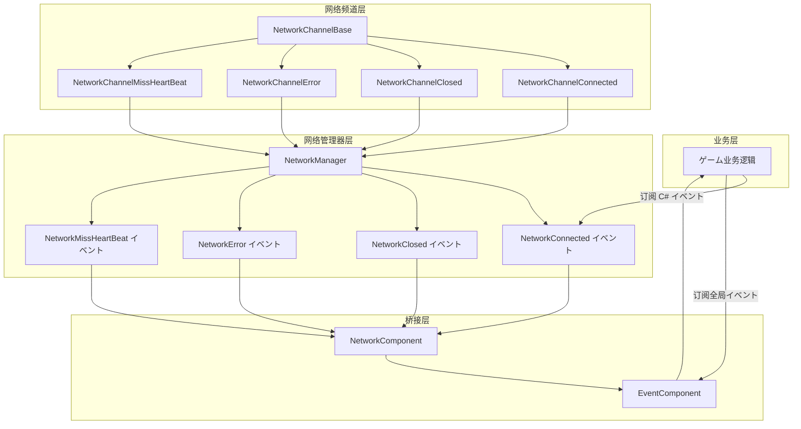
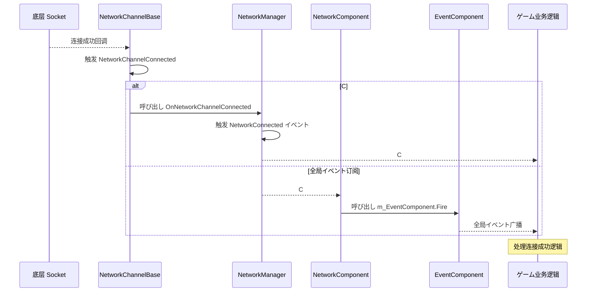

# イベント系统

GameFrameX Unity Network 模块提供します完整的イベント系统，に使用通知网络连接ステータス变化、错误发生以及心跳丢失等关键网络イベント。该イベント系统采用双层架构，既サポート C# 原生イベント，也集成了 GameFrameX 的全局イベント系统。

## 概要

网络イベント系统是 GameFrameX Unity Network 模块的コアコンポーネント之一，它解耦了网络逻辑与业务逻辑，使開発者可能灵活地响应各种网络ステータス变化。イベント系统设计遵循以下原则：

- **解耦设计**：网络底层を通じてイベント向上层通知ステータス变化，业务层を通じて订阅イベント来处理网络ステータス
- **双重サポート**：同时サポート C# 原生イベント委托和 GameFrameX 全局イベント系统
- **对象复用**：使用オブジェクトプール技术管理イベント参数，减少内存分配开销

イベント系统在ゲーム开发中尤为重要，因为它允许您在不修改网络コア代码的情况下，为ゲーム添加断线重连、掉线ヒント、心跳異常处理等機能。

## 架构

GameFrameX Unity Network 的イベント系统采用双层アーキテクチャ設計，这种设计兼顾了易用性和灵活性。



### 架构説明

**网络频道层（NetworkChannelBase）** 是网络イベント的发源地。当底层 Socket 连接成功、断开、发生错误或心跳丢失时，NetworkChannelBase 会触发相应的 Action 委托。

**网络管理器层（NetworkManager）** 订阅了 NetworkChannelBase 的内部イベント，然后将这些イベント转换为公开的 C# イベント（event）。这一层是開発者直接交互的主要インターフェース。

**桥接层（NetworkComponent）** 充当了 C# イベント系统和 GameFrameX 全局イベント系统之间的桥梁。它既提供します C# イベント的直接订阅方法，也を通じて EventComponent 提供します全局イベント订阅能力。

## イベントクラス型

GameFrameX Unity Network 模块定义了四种コア网络イベント，每种イベント都有对应的 EventArgs クラス来携带イベント関連数据。

### NetworkConnectedEventArgs - 连接成功イベント

当网络连接成功建立时触发此イベント。该イベント是最常用的网络イベント之一，通常に使用触发ゲーム登录、取得服务器时间等后续操作。

```csharp
using GameFrameX.Network.Runtime;

// イベント参数プロパティ説明
public sealed class NetworkConnectedEventArgs : GameEventArgs
{
    // イベント唯一标识符
    public static readonly string EventId = typeof(NetworkConnectedEventArgs).FullName;

    // 取得网络连接成功イベント编号
    public override string Id => EventId;

    // 取得网络频道 - 触发此イベント的频道对象
    public INetworkChannel NetworkChannel { get; private set; }

    // 取得用户自定义数据 - Connect メソッド传入的 userData 参数
    public object UserData { get; private set; }
}
```

> Source: [NetworkConnectedEventArgs.cs](https://github.com/GameFrameX/com.gameframex.unity.network/blob/main/Runtime/EventArgs/NetworkConnectedEventArgs.cs#L41-L97)

### NetworkClosedEventArgs - 连接关闭イベント

当网络连接关闭时触发此イベント。该イベント携带关闭原因和错误码，可に使用判断是正常关闭还是異常断开。

```csharp
public sealed class NetworkClosedEventArgs : GameEventArgs
{
    // イベント唯一标识符
    public static readonly string EventId = typeof(NetworkClosedEventArgs).FullName;

    // 取得网络频道
    public INetworkChannel NetworkChannel { get; private set; }

    // 取得关闭原因
    // 可能的值：Normal, Timeout, Dispose, ConnectClose, ConnectAddressError, ConnectAddressExceptionError, MissHeartBeat
    public string Reason { get; private set; }

    // 取得错误码
    public ushort ErrorCode { get; private set; }
}
```

> Source: [NetworkClosedEventArgs.cs](https://github.com/GameFrameX/com.gameframex.unity.network/blob/main/Runtime/EventArgs/NetworkClosedEventArgs.cs#L41-L103)

### NetworkErrorEventArgs - 网络错误イベント

当网络发生错误时触发此イベント。该イベント提供します丰富的错误信息，包括应用层错误码和底层 Socket 错误码。

```csharp
public sealed class NetworkErrorEventArgs : GameEventArgs
{
    // イベント唯一标识符
    public static readonly string EventId = typeof(NetworkErrorEventArgs).FullName;

    // 取得网络频道
    public INetworkChannel NetworkChannel { get; private set; }

    // 取得应用层错误码
    // 枚举值：Unknown, AddressFamilyError, SocketError, ConnectError, SendError, ReceiveError, SerializeError, DeserializePacketHeaderError, DeserializePacketError, MissHeartBeatError, DisposeError
    public NetworkErrorCode ErrorCode { get; private set; }

    // 取得底层 Socket 错误码
    public SocketError SocketErrorCode { get; private set; }

    // 取得错误信息
    public string ErrorMessage { get; private set; }
}
```

> Source: [NetworkErrorEventArgs.cs](https://github.com/GameFrameX/com.gameframex.unity.network/blob/main/Runtime/EventArgs/NetworkErrorEventArgs.cs#L42-L116)

### NetworkMissHeartBeatEventArgs - 心跳丢失イベント

当心跳包丢失达到一定次数时触发此イベント。该イベント可に使用実装更细粒度的断线重连逻辑，例如在丢失 3 次心跳时ヒント用户网络不稳定。

```csharp
public sealed class NetworkMissHeartBeatEventArgs : GameEventArgs
{
    // イベント唯一标识符
    public static readonly string EventId = typeof(NetworkMissHeartBeatEventArgs).FullName;

    // 取得网络频道
    public INetworkChannel NetworkChannel { get; private set; }

    // 取得心跳包已丢失次数
    // 当丢失次数超过 MissHeartBeatCountByClose（默认 10 次）时，连接将被自动关闭
    public int MissCount { get; private set; }
}
```

> Source: [NetworkMissHeartBeatEventArgs.cs](https://github.com/GameFrameX/com.gameframex.unity.network/blob/main/Runtime/EventArgs/NetworkMissHeartBeatEventArgs.cs#L41-L97)

## イベントフロー

网络イベント的完整フロー涉及多个コンポーネント的协作。理解这个フロー有助于您更好地使用イベント系统来构建可靠的网络機能。



### イベント触发时机

| イベントクラス型 | 触发时机 | 后续动作 |
|---------|---------|---------|
| NetworkConnected | 成功建立 TCP 连接后 | 可发送登录お願いします求或取得服务器时间 |
| NetworkClosed | 连接断开时（正常/異常） | 清理リソース，触发重连逻辑 |
| NetworkError | 发生网络错误时 | 记录日志，可能触发断开连接 |
| NetworkMissHeartBeat | 心跳包丢失时 | 更新 UI ヒント，可能触发断开连接 |

## 使用例

### メソッド一：使用 C# 原生イベント

C# 原生イベント是最直接的イベント订阅方法，适合简单的网络イベント处理シーン。

```csharp
using GameFrameX.Network.Runtime;
using UnityEngine;

public class NetworkExample : MonoBehaviour
{
    private INetworkManager networkManager;
    private INetworkChannel channel;

    private void Start()
    {
        // 取得网络管理器
        networkManager = GameFrameworkEntry.GetModule<INetworkManager>();
        
        // 订阅网络イベント
        networkManager.NetworkConnected += OnNetworkConnected;
        networkManager.NetworkClosed += OnNetworkClosed;
        networkManager.NetworkError += OnNetworkError;
        networkManager.NetworkMissHeartBeat += OnNetworkMissHeartBeat;
        
        // 作成网络频道
        var helper = new DefaultNetworkChannelHelper();
        channel = networkManager.CreateNetworkChannel("GameServer", helper, 5000);
        
        // 连接到服务器
        channel.Connect(new Uri("tcp://127.0.0.1:8888"));
    }

    private void OnNetworkConnected(object sender, NetworkConnectedEventArgs e)
    {
        Debug.Log($"连接成功！频道: {e.NetworkChannel.Name}, 用户数据: {e.UserData}");
    }

    private void OnNetworkClosed(object sender, NetworkClosedEventArgs e)
    {
        Debug.Log($"连接关闭！原因: {e.Reason}, 错误码: {e.ErrorCode}");
    }

    private void OnNetworkError(object sender, NetworkErrorEventArgs e)
    {
        Debug.LogError($"网络错误！错误码: {e.ErrorCode}, Socket错误: {e.SocketErrorCode}, 消息: {e.ErrorMessage}");
    }

    private void OnNetworkMissHeartBeat(object sender, NetworkMissHeartBeatEventArgs e)
    {
        Debug.LogWarning($"心跳丢失！次数: {e.MissCount}");
    }

    private void OnDestroy()
    {
        // 取消订阅イベント
        if (networkManager != null)
        {
            networkManager.NetworkConnected -= OnNetworkConnected;
            networkManager.NetworkClosed -= OnNetworkClosed;
            networkManager.NetworkError -= OnNetworkError;
            networkManager.NetworkMissHeartBeat -= OnNetworkMissHeartBeat;
        }
    }
}
```

> Source: [NetworkManager.cs](https://github.com/GameFrameX/com.gameframex.unity.network/blob/main/Runtime/Network/Network/NetworkManager.cs#L261-L311)

### メソッド二：使用 NetworkComponent 订阅全局イベント

NetworkComponent 提供します与 GameFrameX EventComponent 的集成，您可能を通じて订阅全局イベント来处理网络ステータス变化。这种方法更适合必要跨模块通信的シーン。

```csharp
using GameFrameX.Event.Runtime;
using GameFrameX.Network.Runtime;
using UnityEngine;

public class GlobalEventExample : MonoBehaviour
{
    private EventComponent eventComponent;

    private void Start()
    {
        // 取得イベントコンポーネント
        eventComponent = GameEntry.GetComponent<EventComponent>();
        
        // 订阅全局イベント
        eventComponent.Subscribe(NetworkConnectedEventArgs.EventId, OnNetworkConnected);
        eventComponent.Subscribe(NetworkClosedEventArgs.EventId, OnNetworkClosed);
        eventComponent.Subscribe(NetworkErrorEventArgs.EventId, OnNetworkError);
        eventComponent.Subscribe(NetworkMissHeartBeatEventArgs.EventId, OnNetworkMissHeartBeat);
    }

    private void OnNetworkConnected(object sender, GameEventArgs e)
    {
        var args = e as NetworkConnectedEventArgs;
        Debug.Log($"全局イベント - 连接成功！频道: {args.NetworkChannel.Name}");
    }

    private void OnNetworkClosed(object sender, GameEventArgs e)
    {
        var args = e as NetworkClosedEventArgs;
        Debug.Log($"全局イベント - 连接关闭！原因: {args.Reason}");
    }

    private void OnNetworkError(object sender, GameEventArgs e)
    {
        var args = e as NetworkErrorEventArgs;
        Debug.LogError($"全局イベント - 网络错误: {args.ErrorMessage}");
    }

    private void OnNetworkMissHeartBeat(object sender, GameEventArgs e)
    {
        var args = e as NetworkMissHeartBeatEventArgs;
        Debug.LogWarning($"全局イベント - 心跳丢失次数: {args.MissCount}");
    }

    private void OnDestroy()
    {
        // 取消订阅全局イベント
        if (eventComponent != null)
        {
            eventComponent.Unsubscribe(NetworkConnectedEventArgs.EventId, OnNetworkConnected);
            eventComponent.Unsubscribe(NetworkClosedEventArgs.EventId, OnNetworkClosed);
            eventComponent.Unsubscribe(NetworkErrorEventArgs.EventId, OnNetworkError);
            eventComponent.Unsubscribe(NetworkMissHeartBeatEventArgs.EventId, OnNetworkMissHeartBeat);
        }
    }
}
```

> Source: [NetworkComponent.cs](https://github.com/GameFrameX/com.gameframex.unity.network/blob/main/Runtime/Network/NetworkComponent.cs#L196-L214)

### メソッド三：使用 NetworkComponent イベントプロパティ

NetworkComponent 也直接暴露了与 NetworkManager 相同的イベントプロパティ，方便在 Unity 编辑器中を通じて Inspector 或脚本直接订阅。

```csharp
public class DirectSubscribeExample : MonoBehaviour
{
    private NetworkComponent networkComponent;

    private void Start()
    {
        // 直接从 NetworkComponent 订阅イベント
        networkComponent = GetComponent<NetworkComponent>();
        networkComponent.NetworkConnected += OnConnected;
        networkComponent.NetworkClosed += OnClosed;
    }

    private void OnConnected(object sender, NetworkConnectedEventArgs e)
    {
        Debug.Log("连接成功");
    }

    private void OnClosed(object sender, NetworkClosedEventArgs e)
    {
        Debug.Log($"连接关闭: {e.Reason}");
    }
}
```

> Source: [NetworkComponent.cs](https://github.com/GameFrameX/com.gameframex.unity.network/blob/main/Runtime/Network/NetworkComponent.cs#L109-L112)

## 错误码参考

### NetworkCloseReason - 关闭原因

| 常量 | 説明 |
|-----|------|
| Normal | 正常关闭 |
| Timeout | 超时关闭 |
| Dispose | リソース释放关闭 |
| ConnectClose | 连接关闭 |
| ConnectAddressError | 连接地址错误关闭 |
| ConnectAddressExceptionError | 连接地址異常错误关闭 |
| MissHeartBeat | 心跳丢失关闭 |

> Source: [NetworkErrorCode.cs](https://github.com/GameFrameX/com.gameframex.unity.network/blob/main/Runtime/Network/Base/NetworkErrorCode.cs#L34-L74)

### NetworkErrorCode - 错误码

| 值 | 説明 |
|---|------|
| Unknown | 未知错误 |
| AddressFamilyError | 地址族错误 |
| SocketError | Socket 错误 |
| ConnectError | 连接错误 |
| SendError | 发送错误 |
| ReceiveError | 接收错误 |
| SerializeError | 序列化错误 |
| DeserializePacketHeaderError | 反序列化消息包头错误 |
| DeserializePacketError | 反序列化消息包错误 |
| MissHeartBeatError | 心跳丢失错误 |
| DisposeError | リソース释放错误 |

> Source: [NetworkErrorCode.cs](https://github.com/GameFrameX/com.gameframex.unity.network/blob/main/Runtime/Network/Base/NetworkErrorCode.cs#L76-L137)

## 最佳实践

### イベント订阅建议

1. **在合适的位置订阅**：在ゲーム开始或网络模块初期化时订阅イベント，在ゲーム结束或シーン切换时取消订阅
2. **使用弱引用**：在某些シーン下可能考虑使用弱引用模式，避免内存泄漏
3. **異常处理**：在イベント处理回调中添加适当的異常处理，避免单个イベント处理错误影响整个系统
4. **避免耗时操作**：イベント回调中避免执行耗时操作，如需处理复杂逻辑，考虑使用消息队列异步处理

### 断线重连示例

以下は使用イベント系统実装断线重连的示例：

```csharp
public class ReconnectExample : MonoBehaviour
{
    private INetworkManager networkManager;
    private int reconnectAttempts = 0;
    private const int MaxReconnectAttempts = 3;
    private string serverAddress = "tcp://127.0.0.1:8888";

    private void Start()
    {
        networkManager = GameFrameworkEntry.GetModule<INetworkManager>();
        networkManager.NetworkClosed += OnNetworkClosed;
        networkManager.NetworkConnected += OnNetworkConnected;
        
        Connect();
    }

    private void Connect()
    {
        var helper = new DefaultNetworkChannelHelper();
        var channel = networkManager.CreateNetworkChannel("GameServer", helper, 5000);
        channel.Connect(new Uri(serverAddress));
    }

    private void OnNetworkConnected(object sender, NetworkConnectedEventArgs e)
    {
        reconnectAttempts = 0;
        Debug.Log("连接成功，开始ゲーム");
    }

    private void OnNetworkClosed(object sender, NetworkClosedEventArgs e)
    {
        // 检查是否必要重连
        if (e.Reason != NetworkCloseReason.Normal && reconnectAttempts < MaxReconnectAttempts)
        {
            reconnectAttempts++;
            Debug.Log($"连接断开，{reconnectAttempts} 秒后尝试重连...");
            Invoke(nameof(Connect), 3f);
        }
    }
}
```

## 関連リンク

- [网络管理器](./4-core-concepts.1-network-manager) - 了解 NetworkManager 的完整 API
- [网络频道](./4-core-concepts.2-network-channel) - 了解网络频道的概念和使用
- [心跳机制](./5-heartbeat) - 了解心跳检测的工作原理
- [RPC 远程呼び出し](./8-rpc) - 了解 RPC 呼び出し与イベント的配合使用
- [イベント系统（GameFrameX Core）](https://github.com/GameFrameX/com.gameframex.unity.event) - 了解更多关于 GameFrameX 全局イベント系统
