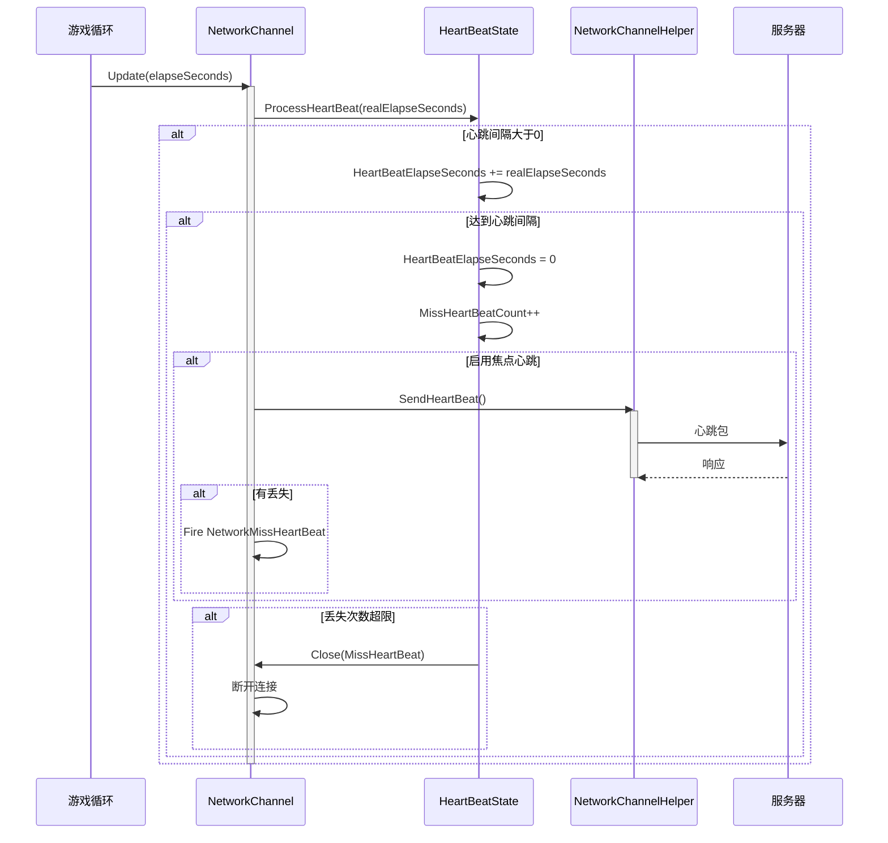

# 心跳机制

心跳机制是网络通信中用于检测连接存活ステータス的重要な機能。通过定期发送心跳パッケージ，可および时发现网络中断或对端不可达的情况，从而采取相应的処理措施。

## 概要

GameFrameX 网络モジュール提供します一套完全な的心跳机制，主な含みます以下機能：

1. **定期心跳检测**：客户端按固定间隔向服务器发送心跳パッケージ
2. **丢失检测**：服务器端检测心跳丢失次数，超过阈值时主动断开连接
3. **应用焦点控制**：サポート根据应用程序是否获得焦点来控制心跳发送
4. **イベント通知**：心跳丢失时トリガーイベント，便于上层逻辑処理

心跳机制的コア設計理念是：**保活（Keep-Alive）**。在长连接通信中，由于 TCP 协议的半閉じる特性，连接双方〜の可能性があります无法及时感知对端すでに离线。心跳机制通过定期交换轻量级メッセージ，確認してください双方都能及时发现连接ステータス例外。

## アーキテクチャ設計

心跳机制涉及多个コアコンポーネント，协同完成连接保活機能：


### コンポーネント职责

| コンポーネント | 职责 | 关键プロパティ/メソッド |
|------|------|--------------|
| `HeartBeatState` | 管理心跳ステータス数据 | `HeartBeatElapseSeconds`、`MissHeartBeatCount`、`Reset()` |
| `IPacketHeartBeatHandler` | 定義心跳メッセージ処理器インターフェース | `HeartBeatInterval`、`MissHeartBeatCountByClose`、`Handler()` |
| `BasePacketHeartBeatHandler` | 心跳処理器的デフォルト実装 | デフォルト心跳间隔5秒，丢失5次トリガー断开 |
| `ProcessHeartBeat()` | コア心跳処理逻辑 | 检测超时、发送心跳、トリガー断开 |
| `NetworkMissHeartBeatEventArgs` | 心跳丢失イベントパラメータ | `NetworkChannel`、`MissCount` |

## コアフロー

心跳机制的コア処理フロー如下：



### 処理ステップ详解

1. **时间累加**：每帧アップデート时，将时间增量累加到心跳流逝时间
2. **发送判断**：当流逝时间超过心跳间隔时，トリガー心跳发送
3. **メッセージ发送**：呼び出し `IPacketHeartBeatHandler.Handler()` 取得心跳メッセージ并发送
4. **丢失计数**：发送心跳后，增加丢失计数
5. **イベントトリガー**：もし存在丢失，トリガー `NetworkMissHeartBeat` イベント
6. **断开判断**：当丢失次数超过阈值时，閉じる连接

## 使用例

### 基本設定

在作成网络频道时，心跳処理器会自动登録：

```csharp
// 创建网络频道时会自动使用默认的心跳处理器
var networkChannel = networkManager.CreateNetworkChannel("GameServer", networkChannelHelper, 5000);

// 默认配置：
// - 心跳间隔：30秒
// - 丢失阈值：10次
```
> Source: [NetworkManager.NetworkChannelBase.cs](https://github.com/GameFrameX/com.gameframex.unity.network/blob/main/Runtime/Network/Network/NetworkManager.NetworkChannelBase.cs#L52-L57)

### 自定義心跳処理器

〜できます通过実装 `IPacketHeartBeatHandler` インターフェース来自定義心跳行为：

```csharp
using GameFrameX.Network.Runtime;

// 自定义心跳处理器
public class CustomHeartBeatHandler : BasePacketHeartBeatHandler
{
    // 自定义心跳间隔：10秒
    public override float HeartBeatInterval => 10f;
    
    // 自定义丢失阈值：3次
    public override int MissHeartBeatCountByClose => 3;
    
    public override MessageObject Handler()
    {
        // 返回自定义的心跳消息对象
        return new HeartBeatMessage();
    }
}

// 注册自定义处理器
networkChannel.RegisterHeartBeatHandler(new CustomHeartBeatHandler());
```
> Source: [BasePacketHeartBeatHandler.cs](https://github.com/GameFrameX/com.gameframex.unity.network/blob/main/Runtime/Network/Helper/DefaultPacketHeartBeatHandler.cs#L7-L26)

### 监听心跳丢失イベント

〜できます購読 `NetworkMissHeartBeat` イベント来処理心跳丢失情况：

```csharp
// 在 NetworkComponent 或初始化代码中订阅事件
m_NetworkManager.NetworkMissHeartBeat += OnNetworkMissHeartBeat;

private void OnNetworkMissHeartBeat(object sender, NetworkMissHeartBeatEventArgs eventArgs)
{
    var channelName = eventArgs.NetworkChannel.Name;
    var missCount = eventArgs.MissCount;
    
    Log.Warning($"心跳丢失！频道：{channelName}，丢失次数：{missCount}");
    
    // 可以在这里实现重连逻辑或其他处理
    if (missCount >= 5)
    {
        // 丢失次数过多，准备断开连接
    }
}
```
> Source: [NetworkMissHeartBeatEventArgs.cs](https://github.com/GameFrameX/com.gameframex.unity.network/blob/main/Runtime/EventArgs/NetworkMissHeartBeatEventArgs.cs#L41-L97)

### 应用焦点控制

〜できます通过 `NetworkComponent` 設定是否在应用失去焦点时发送心跳：

```csharp
// 在 NetworkComponent 的 Inspector 面板中：
// - 勾选 "Focus Send Heartbeat"：应用获得焦点时发送心跳
// - 不勾选：应用失去焦点时也会继续发送心跳（默认行为）

// 或者通过代码动态控制：
m_NetworkManager.SetFocusHeartbeat(true);  // 获得焦点时发送
m_NetworkManager.SetFocusHeartbeat(false); // 失去焦点时也发送
```
> Source: [NetworkComponent.cs](https://github.com/GameFrameX/com.gameframex.unity.network/blob/main/Runtime/Network/NetworkComponent.cs#L65-L91)

### 受信メッセージ重置心跳

デフォルト情况下，收到任何メッセージパッケージ都会重置心跳流逝时间。もし〜する必要があります禁用此行为：

```csharp
// 禁用收到消息时重置心跳
networkChannel.ResetHeartBeatElapseSecondsWhenReceivePacket = false;

// 启用收到消息时重置心跳（默认）
networkChannel.ResetHeartBeatElapseSecondsWhenReceivePacket = true;
```
> Source: [INetworkChannel.cs](https://github.com/GameFrameX/com.gameframex.unity.network/blob/main/Runtime/Network/Interface/INetworkChannel.cs#L79-L82)

## 設定オプション

### 心跳相关プロパティ

| プロパティ | タイプ | デフォルト值 | 説明 |
|------|------|--------|------|
| `HeartBeatInterval` | float | 30秒 | 心跳发送间隔，单位：秒 |
| `MissHeartBeatCount` | int | 10 | 丢失多少次心跳后断开连接 |
| `ResetHeartBeatElapseSecondsWhenReceivePacket` | bool | false | 收到メッセージ时是否重置心跳流逝时间 |
| `PFocusHeartbeat` | bool | true | 是否在应用获得焦点时发送心跳 |

### IPacketHeartBeatHandler 設定

| プロパティ | タイプ | デフォルト值 | 説明 |
|------|------|--------|------|
| `HeartBeatInterval` | float | 5秒 | 心跳処理器的心跳间隔 |
| `MissHeartBeatCountByClose` | int | 5 | 心跳処理器定義的断开阈值 |

### 焦点心跳設定

| 設定项 | タイプ | デフォルト值 | 説明 |
|--------|------|--------|------|
| `m_FocusHeartbeat` | bool | false | NetworkComponent 上的シリアライズフィールド |

## API リファレンス

### `IPacketHeartBeatHandler`

心跳メッセージ処理器インターフェース。

```csharp
public interface IPacketHeartBeatHandler
{
    /// <summary>
    /// 每次心跳的间隔
    /// </summary>
    float HeartBeatInterval { get; }

    /// <summary>
    /// 几次心跳丢失。触发断开网络
    /// </summary>
    int MissHeartBeatCountByClose { get; }

    /// <summary>
    /// 处理器，返回心跳消息对象
    /// </summary>
    MessageObject Handler();
}
```

> Source: [IPacketHeartBeatHandler.cs](https://github.com/GameFrameX/com.gameframex.unity.network/blob/main/Runtime/Network/Interface/IPacketHeartBeatHandler.cs#L1-L24)

### `INetworkChannel`

网络频道インターフェース中的心跳相关プロパティ和メソッド：

```csharp
// 获取或设置当收到消息包时是否重置心跳流逝时间
bool ResetHeartBeatElapseSecondsWhenReceivePacket { get; set; }

// 获取丢失心跳的次数
int MissHeartBeatCount { get; }

// 获取或设置心跳间隔时长，以秒为单位
float HeartBeatInterval { get; set; }

// 获取心跳等待时长，以秒为单位
float HeartBeatElapseSeconds { get; }

// 获取心跳消息处理器
IPacketHeartBeatHandler PacketHeartBeatHandler { get; }

// 注册网络消息心跳处理函数
void RegisterHeartBeatHandler(IPacketHeartBeatHandler handler);
```

> Source: [INetworkChannel.cs](https://github.com/GameFrameX/com.gameframex.unity.network/blob/main/Runtime/Network/Interface/INetworkChannel.cs#L79-L174)

### `INetworkManager`

网络マネージャーインターフェース中的心跳相关メソッド：

```csharp
/// <summary>
/// 网络心跳包丢失事件
/// </summary>
event EventHandler<NetworkMissHeartBeatEventArgs> NetworkMissHeartBeat;

/// <summary>
/// 设置是否在应用程序获得焦点时发送心跳包
/// </summary>
void SetFocusHeartbeat(bool hasFocus);
```

> Source: [INetworkManager.cs](https://github.com/GameFrameX/com.gameframex.unity.network/blob/main/Runtime/Network/Interface/INetworkManager.cs#L57-L113)

### `HeartBeatState`

心跳ステータス管理类：

```csharp
public sealed class HeartBeatState
{
    /// <summary>
    /// 心跳间隔时长
    /// </summary>
    public float HeartBeatElapseSeconds { get; set; }

    /// <summary>
    /// 心跳丢失次数
    /// </summary>
    public int MissHeartBeatCount { get; set; }

    /// <summary>
    /// 重置心跳数据=>保活
    /// </summary>
    /// <param name="resetHeartBeatElapseSeconds">是否重置心跳流逝时长</param>
    public void Reset(bool resetHeartBeatElapseSeconds);
}
```

> Source: [NetworkManager.HeartBeatState.cs](https://github.com/GameFrameX/com.gameframex.unity.network/blob/main/Runtime/Network/Network/NetworkManager.HeartBeatState.cs#L39-L82)

### `NetworkMissHeartBeatEventArgs`

心跳丢失イベントパラメータ：

```csharp
public sealed class NetworkMissHeartBeatEventArgs : GameEventArgs
{
    /// <summary>
    /// 网络心跳包丢失事件编号
    /// </summary>
    public static readonly string EventId;

    /// <summary>
    /// 获取网络频道
    /// </summary>
    public INetworkChannel NetworkChannel { get; }

    /// <summary>
    /// 获取心跳包已丢失次数
    /// </summary>
    public int MissCount { get; }

    /// <summary>
    /// 创建网络心跳包丢失事件
    /// </summary>
    public static NetworkMissHeartBeatEventArgs Create(INetworkChannel networkChannel, int missCount);
}
```

> Source: [NetworkMissHeartBeatEventArgs.cs](https://github.com/GameFrameX/com.gameframex.unity.network/blob/main/Runtime/EventArgs/NetworkMissHeartBeatEventArgs.cs#L41-L97)

## 設計考量

### 为什么〜する必要があります心跳机制？

1. **TCP 半閉じる問題**：TCP 连接的一方〜できます独立閉じる写端而保持读端打开，这种情况下无法通过底层 socket エラー来感知连接断开
2. **NAT 超时**：大多数 NAT 设备会在连接空闲一段时间后清除ステータス，导致外网无法访问内网主机
3. **服务器负载**：服务器〜する必要があります及时清理无效连接以解放リソース

### 为什么〜する必要があります应用焦点控制？

在移动端或浏览器環境中，当应用失去焦点时（如切换到后台、接听电话），网络通信〜の可能性があります变得不可靠或被系统挂起。此时：
- 继续发送心跳会造成无效网络请求
- 〜の可能性があります导致电池电量消耗
- 〜の可能性がありますトリガー服务器不必要的断开重连

通过 `Focus Send Heartbeat` 機能，〜できます在应用获得焦点时立つまり发送心跳，恢复正常检测。

### 心跳间隔的設定お勧め

- **游戏客户端**：お勧め 5-30 秒，过短会增加服务器负载，过长则影响断开检测的及时性
- **高可靠性シーン**：可設定 3-5 秒，快速检测连接ステータス
- **低流量シーン**：可設定 30-60 秒，减少网络开销

## 関連リンク

- [网络マネージャー](./4-core-concepts.1-network-manager)
- [网络频道](./4-core-concepts.2-network-channel)
- [メッセージタイプ](./4-core-concepts.3-message-types)
- [数据パッケージ処理器](./4-core-concepts.4-packet-handlers)
- [イベント系统](./6-events)
- [RPC 远程呼び出し](./8-rpc)
