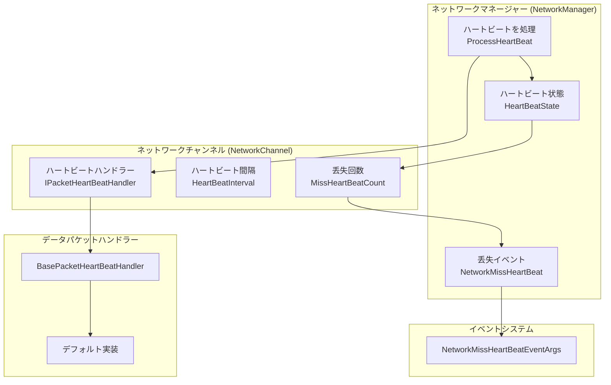
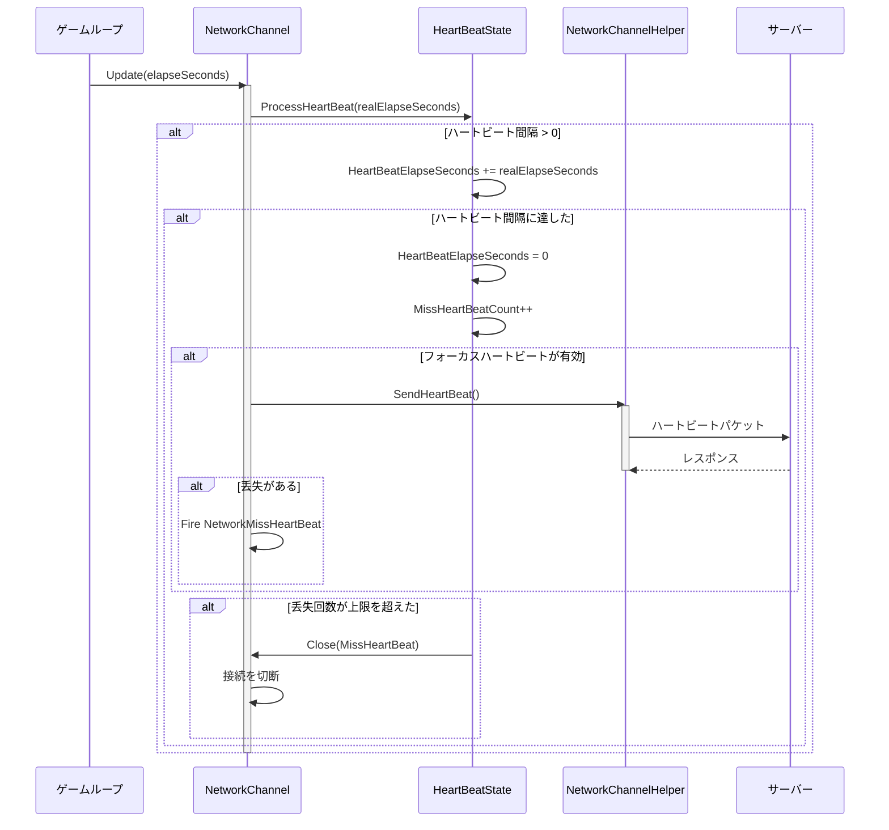

# ハートビートメカニズム

ハートビートメカニズムはネットワーク通信において接続の生存状態を検出するための重要な機能です。定期的にハートビートパケットを送信することで、ネットワークの中断や对方的到達不能な状況を及时に発見し、それに応じて処理措施を講じることができます。

## 概要

GameFrameX ネットワークモジュールは完全なハートビートメカニズムを提供し、主に以下の機能が含まれています：

1. **定期的なハートビート検出**：クライアントは固定間隔でサーバーにハートビートパケットを送信します
2. **丢失検出**：サーバー側でハートビート丢失回数を検出し、しきい値を超えると能動的に接続を切断します
3. **アプリケーションフォーカス制御**：アプリケーションがフォーカス获得または失去したかどうかに応じてハートビート送信を制御することをサポートします
4. **イベント通知**：ハートビートが丢失されたときにイベントをトリガーし、上层ロジックが処理しやすいようにします

ハートビートメカニズムの核心的な設計理念は：**保活（Keep-Alive）**です。ロングポーリング通信では、TCP プロトコルの半关闭的特性により、接続の両端は对方的が既にオフラインになったことを及时に感知できない場合があります。ハートビートメカニズムは轻量化なメッセージを定期的に交換することで、両端が接続状態异常を及时に発見できるようにします。

## アーキテクチャ設計

ハートビートメカニズムは複数のコアコンポーネントが関与し、接続保活機能を完了するために協調動作します：



### コンポーネント責務

| コンポーネント | 責務 |  ключевые 属性/メソッド |
|------|------|--------------|
| `HeartBeatState` | ハートビート状態データを管理 | `HeartBeatElapseSeconds`、`MissHeartBeatCount`、`Reset()` |
| `IPacketHeartBeatHandler` | ハートビートメッセージハンドラーインターフェースを定義 | `HeartBeatInterval`、`MissHeartBeatCountByClose`、`Handler()` |
| `BasePacketHeartBeatHandler` | ハートビートハンドラーのデフォルト実装 | デフォルトハートビート間隔5秒、5回の丢失で切断をトリガー |
| `ProcessHeartBeat()` | コアハートビート処理ロジック | タイムアウト検出、ハートビート送信、切断をトリガー |
| `NetworkMissHeartBeatEventArgs` | ハートビート丢失イベントパラメータ | `NetworkChannel`、`MissCount` |

## コアフロー

ハートビートメカニズムのコア処理フローは次のとおりです：



### 処理ステップの詳細

1. **時間累算**：毎フレーム更新時に、時間の增量を知覚ビート経過時間に累算します
2. **送信判断**：経過時間が知覚ビート間隔を超えると、知覚ビート送信をトリガーします
3. **メッセージ送信**：`IPacketHeartBeatHandler.Handler()` を呼び出してハートビットメッセージを取得し、送信します
4. **丢失カウント**：ハートビートを送信した後、丢失カウントが増加します
5. **イベントトリガー**：丢失が存在する場合、`NetworkMissHeartBeat` イベントがトリガーされます
6. **切断判断**：丢失回数がしきい値を超えると、接続が閉じられます

## 使用例

### 基本的な設定

ネットワークチャンネルを作成的时候、ハートビートハンドラーは自動的に登録されます：

```csharp
// ネットワークチャンネルを作成的时候、デフォルトのハートビートハンドラーが自動的に使用されます
var networkChannel = networkManager.CreateNetworkChannel("GameServer", networkChannelHelper, 5000);

// デフォルト設定：
// - ハートビート間隔：30秒
// - 丢失しきい値：10回
```
> Source: [NetworkManager.NetworkChannelBase.cs](https://github.com/GameFrameX/com.gameframex.unity.network/blob/main/Runtime/Network/Network/NetworkManager.NetworkChannelBase.cs#L52-L57)

### カスタムハートビートハンドラー

`IPacketHeartBeatHandler` インターフェースを実装してハートビート動作をカスタマイズできます：

```csharp
using GameFrameX.Network.Runtime;

// カスタムハートビートハンドラー
public class CustomHeartBeatHandler : BasePacketHeartBeatHandler
{
    // カスタムハートビート間隔：10秒
    public override float HeartBeatInterval => 10f;
    
    // カスタム丢失しきい値：3回
    public override int MissHeartBeatCountByClose => 3;
    
    public override MessageObject Handler()
    {
        // カスタムハートビットメッセージオブジェクトを返す
        return new HeartBeatMessage();
    }
}

// カスタムハンドラーを登録
networkChannel.RegisterHeartBeatHandler(new CustomHeartBeatHandler());
```
> Source: [BasePacketHeartBeatHandler.cs](https://github.com/GameFrameX/com.gameframex.unity.network/blob/main/Runtime/Network/Helper/DefaultPacketHeartBeatHandler.cs#L7-L26)

### ハートビート丢失イベントを監視

`NetworkMissHeartBeat` イベントを購読してハートビット丢失状況を処理できます：

```csharp
// NetworkComponent または初期化コードでイベントを購読
m_NetworkManager.NetworkMissHeartBeat += OnNetworkMissHeartBeat;

private void OnNetworkMissHeartBeat(object sender, NetworkMissHeartBeatEventArgs eventArgs)
{
    var channelName = eventArgs.NetworkChannel.Name;
    var missCount = eventArgs.MissCount;
    
    Log.Warning($"ハートビート丢失！チャンネル：{channelName}、丢失回数：{missCount}");
    
    // ここで再接続ロジック或其他処理を実装できます
    if (missCount >= 5)
    {
        // 丢失回数が多すぎる、接続を切断する準備
    }
}
```
> Source: [NetworkMissHeartBeatEventArgs.cs](https://github.com/GameFrameX/com.gameframex.unity.network/blob/main/Runtime/EventArgs/NetworkMissHeartBeatEventArgs.cs#L41-L97)

### アプリケーションフォーカス制御

`NetworkComponent` を使用してアプリケーションがフォーカスを失ったときにハートビートを送信するかどうかを構成できます：

```csharp
// NetworkComponent の Inspector パネルで：
// - "Focus Send Heartbeat" をオンにする：アプリケーションがフォーカス获得的ときにハートビートを送信
// - オフにする：アプリケーションがフォーカスを失ったときにもハートビートを送信し続けます（デフォルト動作）

// またはコードで動的に制御：
m_NetworkManager.SetFocusHeartbeat(true);  // フォーカス获得的ときに送信
m_NetworkManager.SetFocusHeartbeat(false); // フォーカスを失ったときにも送信
```
> Source: [NetworkComponent.cs](https://github.com/GameFrameX/com.gameframex.unity.network/blob/main/Runtime/Network/NetworkComponent.cs#L65-L91)

### メッセージ受信時にハートビートをリセット

デフォルトでは、任意のパケットメッセージを受信するとハートビート経過時間がリセットされます。この動作を無効にする必要がある場合：

```csharp
// メッセージ受信時にハートビットをリセットを無効にする
networkChannel.ResetHeartBeatElapseSecondsWhenReceivePacket = false;

// メッセージ受信時にハートビットをリセットを有効にする（デフォルト）
networkChannel.ResetHeartBeatElapseSecondsWhenReceivePacket = true;
```
> Source: [INetworkChannel.cs](https://github.com/GameFrameX/com.gameframex.unity.network/blob/main/Runtime/Network/Interface/INetworkChannel.cs#L79-L82)

## 設定オプション

### ハートビート関連プロパティ

| プロパティ | タイプ | デフォルト値 | 説明 |
|------|------|--------|------|
| `HeartBeatInterval` | float | 30秒 | ハートビット送信間隔、单位：秒 |
| `MissHeartBeatCount` | int | 10 | ハートビットを丢失多少次後に接続を切断するか |
| `ResetHeartBeatElapseSecondsWhenReceivePacket` | bool | false | メッセージ受信時にハートビート経過時間をリセットするかどうか |
| `PFocusHeartbeat` | bool | true | アプリケーションがフォーカス获得的ときにハートビートを送信するかどうか |

### IPacketHeartBeatHandler 設定

| プロパティ | タイプ | デフォルト値 | 説明 |
|------|------|--------|------|
| `HeartBeatInterval` | float | 5秒 | ハートビートハンドラーのハートビット間隔 |
| `MissHeartBeatCountByClose` | int | 5 | ハートビートハンドラーが定義する切断しきい値 |

### フォーカスハートビート設定

| 設定項目 | タイプ | デフォルト値 | 説明 |
|--------|------|--------|------|
| `m_FocusHeartbeat` | bool | false | NetworkComponent のシリアライズフィールド |

## API リファレンス

### `IPacketHeartBeatHandler`

ハートビットメッセージハンドラーインターフェース。

```csharp
public interface IPacketHeartBeatHandler
{
    /// <summary>
    /// 每次ハートビートの間隔
    /// </summary>
    float HeartBeatInterval { get; }

    /// <summary>
    /// ハートビット丢失 回。ネットワークを切断をトリガー
    /// </summary>
    int MissHeartBeatCountByClose { get; }

    /// <summary>
    /// ハンドラー、ハートビットメッセージオブジェクトを返します
    /// </summary>
    MessageObject Handler();
}
```

> Source: [IPacketHeartBeatHandler.cs](https://github.com/GameFrameX/com.gameframex.unity.network/blob/main/Runtime/Network/Interface/IPacketHeartBeatHandler.cs#L1-L24)

### `INetworkChannel`

ネットワークチャンネルインターフェース内のハートビート関連プロパティとメソッド：

```csharp
// メッセージパケットを受信したときにハートビート経過時間をリセットするかどうかを取得または設定
bool ResetHeartBeatElapseSecondsWhenReceivePacket { get; set; }

// ハートビット丢失回数を取得
int MissHeartBeatCount { get; }

// ハートビット間隔时长を取得または設定、秒为单位
float HeartBeatInterval { get; set; }

// ハートビット等待时长を取得、秒为单位
float HeartBeatElapseSeconds { get; }

// ハートビットメッセージハンドラーを取得
IPacketHeartBeatHandler PacketHeartBeatHandler { get; }

// ネットワークメッセージハートビート処理関数を登録
void RegisterHeartBeatHandler(IPacketHeartBeatHandler handler);
```

> Source: [INetworkChannel.cs](https://github.com/GameFrameX/com.gameframex.unity.network/blob/main/Runtime/Network/Interface/INetworkChannel.cs#L79-L174)

### `INetworkManager`

ネットワークマネージャーインターフェース内のハートビット関連メソッド：

```csharp
/// <summary>
/// ネットワークハートビットパケット丢失イベント
/// </summary>
event EventHandler<NetworkMissHeartBeatEventArgs> NetworkMissHeartBeat;

/// <summary>
/// アプリケーションがフォーカス获得的ときにハートビットパケットを送信するかどうかを設定
/// </summary>
void SetFocusHeartbeat(bool hasFocus);
```

> Source: [INetworkManager.cs](https://github.com/GameFrameX/com.gameframex.unity.network/blob/main/Runtime/Network/Interface/INetworkManager.cs#L57-L113)

### `HeartBeatState`

ハートビット状態管理クラス：

```csharp
public sealed class HeartBeatState
{
    /// <summary>
    /// ハートビット間隔时长
    /// </summary>
    public float HeartBeatElapseSeconds { get; set; }

    /// <summary>
    /// ハートビット丢失回数
    /// </summary>
    public int MissHeartBeatCount { get; set; }

    /// <summary>
    /// ハートビットデータをリセット=>保活
    /// </summary>
    /// <param name="resetHeartBeatElapseSeconds">ハートビット経過时长をリセットするかどうか</param>
    public void Reset(bool resetHeartBeatElapseSeconds);
}
```

> Source: [NetworkManager.HeartBeatState.cs](https://github.com/GameFrameX/com.gameframex.unity.network/blob/main/Runtime/Network/Network/NetworkManager.HeartBeatState.cs#L39-L82)

### `NetworkMissHeartBeatEventArgs`

ハートビット丢失イベントパラメータ：

```csharp
public sealed class NetworkMissHeartBeatEventArgs : GameEventArgs
{
    /// <summary>
    /// ネットワークハートビットパケット丢失イベント番号
    /// </summary>
    public static readonly string EventId;

    /// <summary>
    /// ネットワークチャンネルを取得
    /// </summary>
    public INetworkChannel NetworkChannel { get; }

    /// <summary>
    /// ハートビットパケットが既に丢失された回数を取得
    /// </summary>
    public int MissCount { get; }

    /// <summary>
    /// ネットワークハートビットパケット丢失イベントを作成
    /// </summary>
    public static NetworkMissHeartBeatEventArgs Create(INetworkChannel networkChannel, int missCount);
}
```

> Source: [NetworkMissHeartBeatEventArgs.cs](https://github.com/GameFrameX/com.gameframex.unity.network/blob/main/Runtime/EventArgs/NetworkMissHeartBeatEventArgs.cs#L41-L97)

## 設計考量

### なぜハートビートメカニズムが必要ですか？

1. **TCP 半关闭問題**：TCP 接続の一方は独立して書込端を閉じる一方で読込端を開き続けることができます。この状況では、底层 socket エラーによって接続断开を感知できません
2. **NAT タイムアウト**：ほとんどの NAT デバイスは接続がアイドル状态一段时间後に状態をクリアし、外部ネットワークが内部ネットワークホストにアクセスできなくなります
3. **サーバー负载**：サーバーは无效接続を及时にクリーンアップしてリソースを解放する必要があります

### なぜアプリケーションフォーカス制御が必要ですか？

モバイル端またはブラウザ環境では、アプリケーションがフォーカスを失ったとき（例：バックグラウンドに切换、电话を受けるなど）、ネットワーク通信が信頼できなくなったり、システムによって一時停止させられます。この場合：
- ハートビートを送信し続けると无效なネットワークリクエストが発生します
- バッテリー消費を引き起こす可能性があります
- サーバーによって不必要的に接続断开と再接続がトリガーされる可能性があります

`Focus Send Heartbeat` 機能により、アプリケーションがフォーカス获得的ときに直ちにハートビートを送信し、正常な検出を再開できます。

### ハートビート間隔の設定提案

- **ゲームクライアント**：5〜30秒を推奨、短すぎるとサーバー负载が増加し、長すぎると断开検出の適時性に影響します
- **高信頼性シナリオ**：3〜5秒に設定でき、接続状態を速やかに検出できます
- **低トラフィックシナリオ**：30〜60秒に設定でき、ネットワーク开销を減少させます

## 関連リンク

- [ネットワークマネージャー](./4-core-concepts.1-network-manager)
- [ネットワークチャンネル](./4-core-concepts.2-network-channel)
- [メッセージタイプ](./4-core-concepts.3-message-types)
- [パケットハンドラー](./4-core-concepts.4-packet-handlers)
- [イベントシステム](./6-events)
- [RPC リモート呼び出し](./8-rpc)
