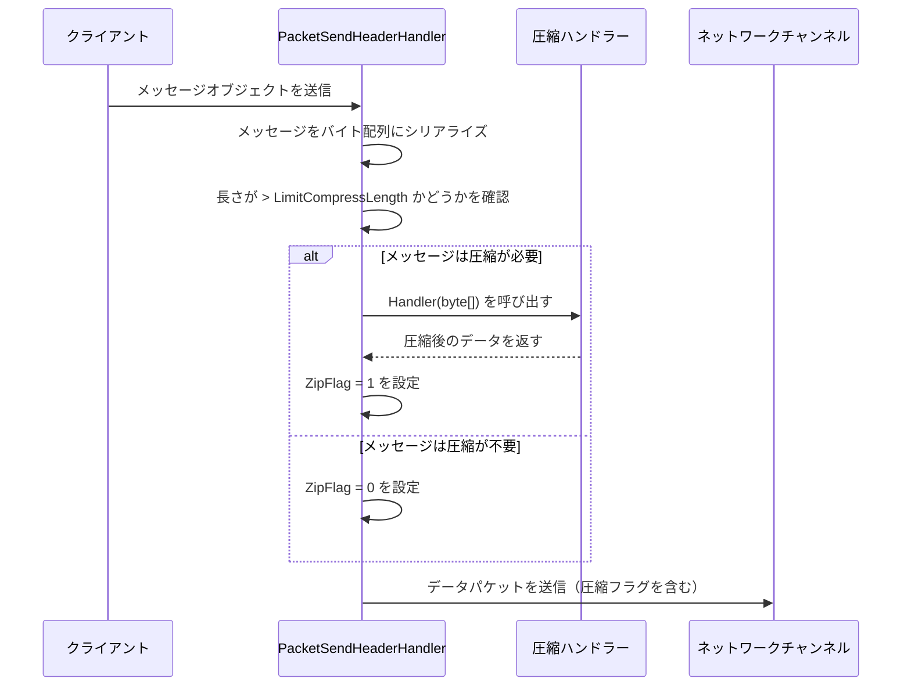
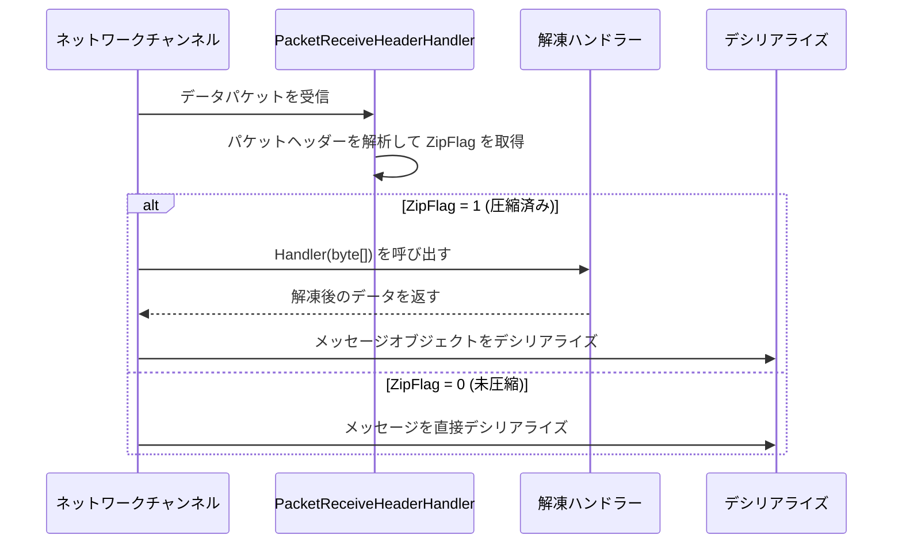

# メッセージ圧縮

メッセージ圧縮機能はネットワーク転送中にメッセージ payload を圧縮し、ネットワーク帯域幅の消費と転送時間を減少させるために使用されます。

## 概要

GameFrameX Network は拡張可能なメッセージ圧縮メカニズムを提供し、デフォルトで GZIP 圧縮アルゴリズムを使用します。圧縮システムはしきい値戦略を採用しており、指定サイズを超えるメッセージのみを圧縮し、小さなメッセージに対して不必要な圧縮処理を避けます。

### コア機能

- **自動圧縮**：メッセージ送信時に自動的に圧縮が必要かどうかを判断
- **自動解凍**：受信メッセージ時に圧縮フラグに応じて自動的に解凍
- **拡張可能なインターフェース**：カスタム圧縮アルゴリズムをサポート
- **しきい値制御**：`LimitCompressLength` で圧縮有効なしきい値を構成

## Architecture

```mermaid
flowchart TD
    subgraph Send["メッセージ送信フロー"]
        S1[メッセージをシリアライズ] --> S2{メッセージ長さ > LimitCompressLength?}
        S2 -->|はい| S3[圧縮ハンドラーを呼び出す]
        S2 -->|いいえ| S4[圧縮しない]
        S3 --> S5[圧縮フラグを設定]
        S5 --> S6[パケットヘッダーを追加して送信]
        S4 --> S6
    end

    subgraph Receive["メッセージ受信フロー"]
        R1[データパケットを受信] --> R2[パケットヘッダーを解析]
        R2 --> R3{ZipFlag = 1?}
        R3 -->|はい| R4[解凍ハンドラーを呼び出す]
        R3 -->|いいえ| R5[直接デシリアライズ]
        R4 --> R6[メッセージをデシリアライズ]
        R5 --> R6
    end

    subgraph Handlers["圧縮ハンドラー"]
        H1[IMessageCompressHandler]
        H2[IMessageDecompressHandler]
        H3[DefaultMessageCompressHandler]
        H4[DefaultMessageDecompressHandler]
    end

    H1 <|.. H3
    H2 <|.. H4
    S3 -->|呼び出し| H3
    R4 -->|呼び出し| H4
```

## コアコンポーネント

### インターフェース定義

#### IMessageCompressHandler

メッセージ圧縮ハンドラーインターフェース、メッセージデータの圧縮方法を定義します。

> Source: [IMessageCompressHandler.cs](https://github.com/GameFrameX/com.gameframex.unity.network/blob/main/Runtime/Network/Interface/IMessageCompressHandler.cs#L6-L14)

```csharp
public interface IMessageCompressHandler
{
    /// <summary>
    /// 圧縮処理
    /// </summary>
    /// <param name="message">メッセージ未圧縮の内容</param>
    /// <returns>圧縮後のバイト配列</returns>
    byte[] Handler(byte[] message);
}
```

#### IMessageDecompressHandler

メッセージ解凍ハンドラーインターフェース、圧縮メッセージを解凍する方法を定義します。

> Source: [IMessageDecompressHandler.cs](https://github.com/GameFrameX/com.gameframex.unity.network/blob/main/Runtime/Network/Interface/IMessageDecompressHandler.cs#L6-L14)

```csharp
public interface IMessageDecompressHandler
{
    /// <summary>
    /// 解凍処理
    /// </summary>
    /// <param name="message">メッセージ圧縮の内容</param>
    /// <returns>解凍後のバイト配列</returns>
    byte[] Handler(byte[] message);
}
```

### デフォルト実装

#### DefaultMessageCompressHandler

デフォルトのメッセージ圧縮ハンドラー、GZIP 圧縮アルゴリズムを使用します。

> Source: [DefaultMessageCompressHandler.cs](https://github.com/GameFrameX/com.gameframex.unity.network/blob/main/Runtime/Network/Helper/DefaultMessageCompressHandler.cs#L9-L20)

```csharp
[UnityEngine.Scripting.Preserve]
public sealed class DefaultMessageCompressHandler : IMessageCompressHandler, IPacketHandler
{
    public byte[] Handler(byte[] message)
    {
        return ZipHelper.Compress(message);
    }
}
```

#### DefaultMessageDecompressHandler

デフォルトのメッセージ解凍ハンドラー、GZIP 解凍アルゴリズムを使用します。

> Source: [DefaultMessageDecompressHandler.cs](https://github.com/GameFrameX/com.gameframex.unity.network/blob/main/Runtime/Network/Helper/DefaultMessageDecompressHandler.cs#L9-L20)

```csharp
[UnityEngine.Scripting.Preserve]
public sealed class DefaultMessageDecompressHandler : IMessageDecompressHandler, IPacketHandler
{
    public byte[] Handler(byte[] message)
    {
        return ZipHelper.Decompress(message);
    }
}
```

## 圧縮フローの詳細

### メッセージ送信時の圧縮フロー



送信フローのコアロジックは `DefaultPacketSendHeaderHandler` にあります：

> Source: [DefaultPacketSendHeaderHandler.cs#L83-L97](https://github.com/GameFrameX/com.gameframex.unity.network/blob/main/Runtime/Network/Helper/DefaultPacketSendHeaderHandler.cs#L83-L97)

```csharp
public bool Handler<T>(T messageObject, IMessageCompressHandler messageCompressHandler, 
    MemoryStream destination, out byte[] messageBodyBuffer) where T : MessageObject
{
    var messageType = messageObject.GetType();
    Id = ProtoMessageIdHandler.GetReqMessageIdByType(messageType);
    messageBodyBuffer = SerializerHelper.Serialize(messageObject);
    
    if (messageCompressHandler != null && messageBodyBuffer.Length > LimitCompressLength)
    {
        IsZip = true;
        messageBodyBuffer = messageCompressHandler.Handler(messageBodyBuffer);
    }
    else
    {
        IsZip = false;
    }
    // ... 後続の処理
}
```

### メッセージ受信時の解凍フロー

ネットワークデータパケットを受信すると、ネットワークチャンネルはパケットヘッダーの `ZipFlag` フラグに応じて解凍が必要かどうかを判断します：



TCP ネットワークチャンネルの解凍実装：

> Source: [NetworkManager.SystemTcpNetworkChannel.cs#L225-L230](https://github.com/GameFrameX/com.gameframex.unity.network/blob/main/Runtime/Network/Network/SystemSocket/NetworkManager.SystemTcpNetworkChannel.cs#L225-L230)

```csharp
if (PReceiveState.PacketHeader.ZipFlag != 0)
{
    // 解凍
    GameFrameworkGuard.NotNull(MessageDecompressHandler, nameof(MessageDecompressHandler));
    buffer = MessageDecompressHandler.Handler(buffer);
}
```

## 自動登録メカニズム

メッセージ圧縮ハンドラーは `IPacketHandler` インターフェースでマークされ、リフレクションによってネットワークチャンネル自動的に登録されます。

> Source: [DefaultNetworkChannelHelper.cs#L91-L100](https://github.com/GameFrameX/com.gameframex.unity.network/blob/main/Runtime/Network/Helper/DefaultNetworkChannelHelper.cs#L91-L100)

```csharp
// リフレクションでメッセージ圧縮ハンドラーを登録
var messageCompressHandlerBaseType = typeof(IMessageCompressHandler);
var messageDecompressHandlerBaseType = typeof(IMessageDecompressHandler);

foreach (var type in types)
{
    // ... 
    else if (type.IsImplWithInterface(messageCompressHandlerBaseType))
    {
        var handler = (IMessageCompressHandler)Activator.CreateInstance(type);
        m_NetworkChannel.RegisterMessageCompressHandler(handler);
    }
    else if (type.IsImplWithInterface(messageDecompressHandlerBaseType))
    {
        var handler = (IMessageDecompressHandler)Activator.CreateInstance(type);
        m_NetworkChannel.RegisterMessageDecompressHandler(handler);
    }
}
```

## 使用例

### デフォルト圧縮ハンドラーを使用する

デフォルトでは、システムが自動的に `DefaultMessageCompressHandler` と `DefaultMessageDecompressHandler` を登録するため、手動で構成する必要はありません：

```csharp
// メッセージは自動的に圧縮処理されます
// メッセージボディサイズが LimitCompressLength (デフォルト512バイト) を超えた場合のみ圧縮されます
networkChannel.Send(new TestMessage { Data = "Hello World" });
```

### カスタム圧縮ハンドラーを作成する

他の圧縮アルゴリズム（LZ4、Zstdなど）を使用する必要がある場合は、カスタムハンドラーを作成できます：

```csharp
// カスタム圧縮ハンドラーの例
public class LZ4CompressHandler : IMessageCompressHandler, IPacketHandler
{
    public byte[] Handler(byte[] message)
    {
        // LZ4 アルゴリズムを使用して圧縮
        return LZ4.Compress(message);
    }
}

public class LZ4DecompressHandler : IMessageDecompressHandler, IPacketHandler
{
    public byte[] Handler(byte[] message)
    {
        // LZ4 アルゴリズムを使用して解凍
        return LZ4.Decompress(message);
    }
}
```

カスタムハンドラーは自動的にシステムによって検出され登録されます、前提条件は：
1. `IMessageCompressHandler` または `IMessageDecompressHandler` インターフェースを実装
2. `IPacketHandler` インターフェースを実装（自動登録用のマーク）
3. アセンブリに配置（リフレクションでスキャン可能）

### 圧縮を無効にする

メッセージ圧縮が不要な場合、アセンブリに圧縮ハンドラーを追加しないか、手動でハンドラーを null に設定できます：

> Source: [NetworkManager.NetworkChannelBase.cs#L496-L502](https://github.com/GameFrameX/com.gameframex.unity.network/blob/main/Runtime/Network/Network/NetworkManager.NetworkChannelBase.cs#L496-L502)

```csharp
// null に設定すると圧縮を無効にできます
networkChannel.RegisterMessageCompressHandler(null);
networkChannel.RegisterMessageDecompressHandler(null);
```

## 設定オプション

### LimitCompressLength

圧縮しきい値設定、メッセージがどのサイズを超えたときに圧縮を有効にするかを制御します。

> Source: [DefaultPacketSendHeaderHandler.cs#L66-L69](https://github.com/GameFrameX/com.gameframex.unity.network/blob/main/Runtime/Network/Helper/DefaultPacketSendHeaderHandler.cs#L66-L69)

| プロパティ | タイプ | デフォルト値 | 説明 |
|------|------|--------|------|
| LimitCompressLength | uint | 512 | メッセージボディがこのサイズを超えたときに圧縮を有効化（バイト） |

### デフォルトしきい値を変更する

圧縮しきい値を変更する必要がある場合は、`DefaultPacketSendHeaderHandler` を継承できます：

```csharp
public class CustomPacketSendHeaderHandler : DefaultPacketSendHeaderHandler
{
    // 圧縮しきい値を 1024 バイトに設定
    public override uint LimitCompressLength { get; } = 1024;
}
```

## パケットヘッダー構造

メッセージパケットヘッダーにはメッセージボディが圧縮されているかどうかを示す圧縮フラグが含まれています：

| フィールド | 長さ | 説明 |
|------|------|------|
| PacketLength | 4 バイト | データパケットの総長さ |
| OperationType | 1 バイト | 操作タイプ (1=ハートビート, 4=通常メッセージ) |
| **ZipFlag** | **1 バイト** | **圧縮フラグ (0=未圧縮, 1=圧縮済み)** |
| UniqueId | 4 バイト | メッセージユニーク番号 |
| Id | 4 バイト | メッセージプロトコル番号 |

> Source: [DefaultPacketSendHeaderHandler.cs#L30-L31](https://github.com/GameFrameX/com.gameframex.unity.network/blob/main/Runtime/Network/Helper/DefaultPacketSendHeaderHandler.cs#L30-L31)

## API Reference

### IMessageCompressHandler

```csharp
byte[] Handler(byte[] message)
```

**パラメータ：**
- `message` (byte[]): 未圧縮の元のメッセージバイト配列

**返値：** 圧縮後のバイト配列

**スロー：**
- 空実装では null を返す場合があります

### IMessageDecompressHandler

```csharp
byte[] Handler(byte[] message)
```

**パラメータ：**
- `message` (byte[]): 圧縮後のメッセージバイト配列

**返値：** 解凍後の元のバイト配列

### INetworkChannel

```csharp
void RegisterMessageCompressHandler(IMessageCompressHandler handler)
```

メッセージ圧縮ハンドラーを登録します。

```csharp
void RegisterMessageDecompressHandler(IMessageDecompressHandler handler)
```

メッセージ解凍ハンドラーを登録します。

```csharp
IMessageCompressHandler MessageCompressHandler { get; }
```

現在構成されている圧縮ハンドラーを取得します。

```csharp
IMessageDecompressHandler MessageDecompressHandler { get; }
```

現在構成されている解凍ハンドラーを取得します。

## Related Links

- [ネットワークマネージャー](./4-core-concepts.1-network-manager) - ネットワークマネージャー概要
- [ネットワークチャンネル](./4-core-concepts.2-network-channel) - ネットワークチャンネル設定
- [パケットハンドラー](./4-core-concepts.4-packet-handlers) - パケットハンドラーの詳細
- [ハートビート](./5-heartbeat) - ハートビートと圧縮フラグ
- [イベントシステム](./6-events) - ネットワークイベント処理
