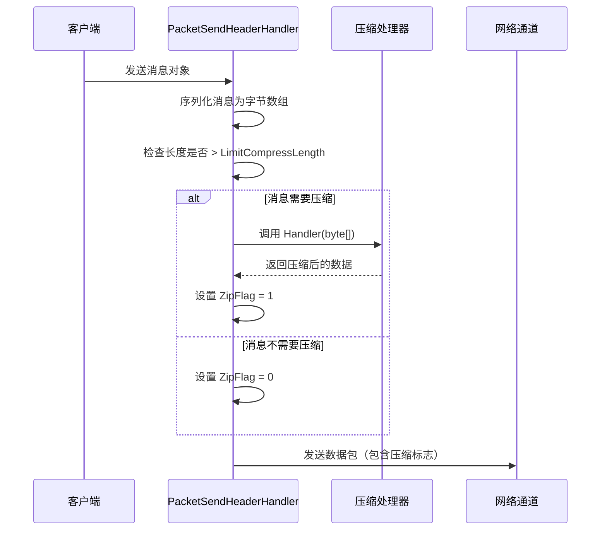
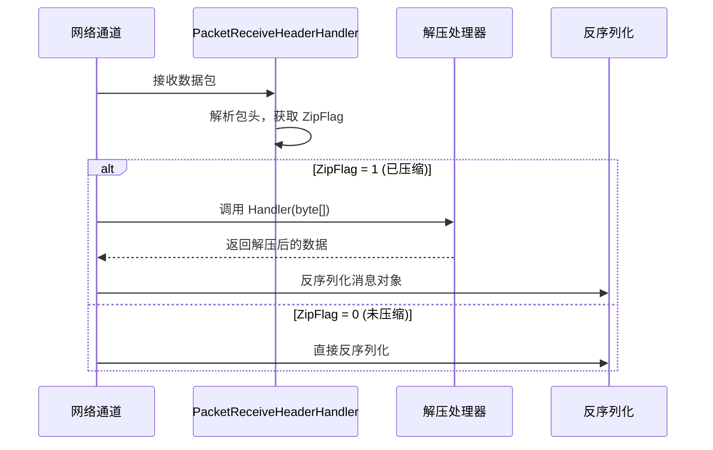

# メッセージ压缩

メッセージ压缩機能用于在网络传输过程中对メッセージ payload 进行压缩，以减少网络带宽消耗和传输时间。

## 概要

GameFrameX Network 提供します可拡張的メッセージ压缩机制，デフォルト使用 GZIP 压缩算法。压缩系统采用阈值策略，只对超过指定大小的メッセージ进行压缩，避免对小メッセージ进行不必要的压缩処理。

### コア機能

- **自动压缩**：メッセージ发送时自动判断是否〜する必要があります压缩
- **自动解压**：受信メッセージ时根据压缩标志自动解压
- **可拡張インターフェース**：サポート自定義压缩算法
- **阈值控制**：通过 `LimitCompressLength` 設定压缩启用阈值

## Architecture

```mermaid
flowchart TD
    subgraph Send["消息发送流程"]
        S1[序列化消息] --> S2{消息长度 > LimitCompressLength?}
        S2 -->|是| S3[调用压缩处理器]
        S2 -->|否| S4[不压缩]
        S3 --> S5[设置压缩标志]
        S5 --> S6[添加包头并发送]
        S4 --> S6
    end

    subgraph Receive["消息接收流程"]
        R1[接收数据包] --> R2[解析包头]
        R2 --> R3{ZipFlag = 1?}
        R3 -->|是| R4[调用解压处理器]
        R3 -->|否| R5[直接反序列化]
        R4 --> R6[反序列化消息]
        R5 --> R6
    end

    subgraph Handlers["压缩处理器"]
        H1[IMessageCompressHandler]
        H2[IMessageDecompressHandler]
        H3[DefaultMessageCompressHandler]
        H4[DefaultMessageDecompressHandler]
    end

    H1 <|.. H3
    H2 <|.. H4
    S3 -->|调用| H3
    R4 -->|调用| H4
```

## コアコンポーネント

### インターフェース定義

#### IMessageCompressHandler

メッセージ压缩処理器インターフェース，定義压缩メッセージ数据的メソッド。

> Source: [IMessageCompressHandler.cs](https://github.com/GameFrameX/com.gameframex.unity.network/blob/main/Runtime/Network/Interface/IMessageCompressHandler.cs#L6-L14)

```csharp
public interface IMessageCompressHandler
{
    /// <summary>
    /// 压缩处理
    /// </summary>
    /// <param name="message">消息未压缩内容</param>
    /// <returns>压缩后的字节数组</returns>
    byte[] Handler(byte[] message);
}
```

#### IMessageDecompressHandler

メッセージ解压器インターフェース，定義解压压缩メッセージ的メソッド。

> Source: [IMessageDecompressHandler.cs](https://github.com/GameFrameX/com.gameframex.unity.network/blob/main/Runtime/Network/Interface/IMessageDecompressHandler.cs#L6-L14)

```csharp
public interface IMessageDecompressHandler
{
    /// <summary>
    /// 解压处理
    /// </summary>
    /// <param name="message">消息压缩内容</param>
    /// <returns>解压后的字节数组</returns>
    byte[] Handler(byte[] message);
}
```

### デフォルト実装

#### DefaultMessageCompressHandler

デフォルト的メッセージ压缩処理器，使用 GZIP 压缩算法。

> Source: [DefaultMessageCompressHandler.cs](https://github.com/GameFrameX/com.gameframex.unity.network/blob/main/Runtime/Network/Helper/DefaultMessageCompressHandler.cs#L9-L20)

```csharp
[UnityEngine.Scripting.Preserve]
public sealed class DefaultMessageCompressHandler : IMessageCompressHandler, IPacketHandler
{
    public byte[] Handler(byte[] message)
    {
        return ZipHelper.Compress(message);
    }
}
```

#### DefaultMessageDecompressHandler

デフォルト的メッセージ解压処理器，使用 GZIP 解压算法。

> Source: [DefaultMessageDecompressHandler.cs](https://github.com/GameFrameX/com.gameframex.unity.network/blob/main/Runtime/Network/Helper/DefaultMessageDecompressHandler.cs#L9-L20)

```csharp
[UnityEngine.Scripting.Preserve]
public sealed class DefaultMessageDecompressHandler : IMessageDecompressHandler, IPacketHandler
{
    public byte[] Handler(byte[] message)
    {
        return ZipHelper.Decompress(message);
    }
}
```

## 压缩フロー详解

### メッセージ发送时的压缩フロー



发送フロー的コア逻辑在 `DefaultPacketSendHeaderHandler` 中：

> Source: [DefaultPacketSendHeaderHandler.cs#L83-L97](https://github.com/GameFrameX/com.gameframex.unity.network/blob/main/Runtime/Network/Helper/DefaultPacketSendHeaderHandler.cs#L83-L97)

```csharp
public bool Handler<T>(T messageObject, IMessageCompressHandler messageCompressHandler, 
    MemoryStream destination, out byte[] messageBodyBuffer) where T : MessageObject
{
    var messageType = messageObject.GetType();
    Id = ProtoMessageIdHandler.GetReqMessageIdByType(messageType);
    messageBodyBuffer = SerializerHelper.Serialize(messageObject);
    
    if (messageCompressHandler != null && messageBodyBuffer.Length > LimitCompressLength)
    {
        IsZip = true;
        messageBodyBuffer = messageCompressHandler.Handler(messageBodyBuffer);
    }
    else
    {
        IsZip = false;
    }
    // ... 后续处理
}
```

### メッセージ受信时的解压フロー

当受信到网络数据パッケージ时，网络通道根据パッケージ头中的 `ZipFlag` 标志判断是否〜する必要があります解压：



TCP 网络通道的解压実装：

> Source: [NetworkManager.SystemTcpNetworkChannel.cs#L225-L230](https://github.com/GameFrameX/com.gameframex.unity.network/blob/main/Runtime/Network/Network/SystemSocket/NetworkManager.SystemTcpNetworkChannel.cs#L225-L230)

```csharp
if (PReceiveState.PacketHeader.ZipFlag != 0)
{
    // 解压
    GameFrameworkGuard.NotNull(MessageDecompressHandler, nameof(MessageDecompressHandler));
    buffer = MessageDecompressHandler.Handler(buffer);
}
```

## 自动登録机制

メッセージ压缩処理器通过 `IPacketHandler` インターフェース标记，利用反射自动登録到网络通道中。

> Source: [DefaultNetworkChannelHelper.cs#L91-L100](https://github.com/GameFrameX/com.gameframex.unity.network/blob/main/Runtime/Network/Helper/DefaultNetworkChannelHelper.cs#L91-L100)

```csharp
// 反射注册消息压缩处理器
var messageCompressHandlerBaseType = typeof(IMessageCompressHandler);
var messageDecompressHandlerBaseType = typeof(IMessageDecompressHandler);

foreach (var type in types)
{
    // ... 
    else if (type.IsImplWithInterface(messageCompressHandlerBaseType))
    {
        var handler = (IMessageCompressHandler)Activator.CreateInstance(type);
        m_NetworkChannel.RegisterMessageCompressHandler(handler);
    }
    else if (type.IsImplWithInterface(messageDecompressHandlerBaseType))
    {
        var handler = (IMessageDecompressHandler)Activator.CreateInstance(type);
        m_NetworkChannel.RegisterMessageDecompressHandler(handler);
    }
}
```

## 使用例

### 使用デフォルト压缩処理器

デフォルト情况下，系统会自动登録 `DefaultMessageCompressHandler` 和 `DefaultMessageDecompressHandler`，无需手动設定：

```csharp
// 消息会自动进行压缩处理
// 仅当消息体大小超过 LimitCompressLength (默认512字节) 时才会压缩
networkChannel.Send(new TestMessage { Data = "Hello World" });
```

### 自定義压缩処理器

もし〜する必要があります使用其他压缩算法（如 LZ4、Zstd），〜できます作成自定義処理器：

```csharp
// 自定义压缩处理器示例
public class LZ4CompressHandler : IMessageCompressHandler, IPacketHandler
{
    public byte[] Handler(byte[] message)
    {
        // 使用 LZ4 算法压缩
        return LZ4.Compress(message);
    }
}

public class LZ4DecompressHandler : IMessageDecompressHandler, IPacketHandler
{
    public byte[] Handler(byte[] message)
    {
        // 使用 LZ4 算法解压
        return LZ4.Decompress(message);
    }
}
```

自定義処理器会自动被系统发现并登録，前提是：
1. 実装 `IMessageCompressHandler` 或 `IMessageDecompressHandler` インターフェース
2. 実装 `IPacketHandler` インターフェース（用于标记自动登録）
3. 放置在アセンブリ中（会被反射扫描到）

### 禁用压缩

もし不〜する必要がありますメッセージ压缩，〜できます不追加压缩処理器到アセンブリ中，または手动将処理器設定为 null：

> Source: [NetworkManager.NetworkChannelBase.cs#L496-L502](https://github.com/GameFrameX/com.gameframex.unity.network/blob/main/Runtime/Network/Network/NetworkManager.NetworkChannelBase.cs#L496-L502)

```csharp
// 设置为 null 可禁用压缩
networkChannel.RegisterMessageCompressHandler(null);
networkChannel.RegisterMessageDecompressHandler(null);
```

## 設定オプション

### LimitCompressLength

压缩阈值設定，控制メッセージ超过多大小时启用压缩。

> Source: [DefaultPacketSendHeaderHandler.cs#L66-L69](https://github.com/GameFrameX/com.gameframex.unity.network/blob/main/Runtime/Network/Helper/DefaultPacketSendHeaderHandler.cs#L66-L69)

| プロパティ | タイプ | デフォルト值 | 説明 |
|------|------|--------|------|
| LimitCompressLength | uint | 512 | メッセージ体超过此长度时启用压缩（字节） |

### 変更デフォルト阈值

如需変更压缩阈值，〜できます継承 `DefaultPacketSendHeaderHandler`：

```csharp
public class CustomPacketSendHeaderHandler : DefaultPacketSendHeaderHandler
{
    // 将压缩阈值设置为 1024 字节
    public override uint LimitCompressLength { get; } = 1024;
}
```

## パッケージ头结构

メッセージパッケージ头中パッケージ含压缩标志，用于标识メッセージ体是否经过压缩：

| フィールド | 长度 | 説明 |
|------|------|------|
| PacketLength | 4 字节 | 数据パッケージ总长度 |
| OperationType | 1 字节 | 操作タイプ (1=心跳, 4=普通メッセージ) |
| **ZipFlag** | **1 字节** | **压缩标志 (0=未压缩, 1=已压缩)** |
| UniqueId | 4 字节 | メッセージ唯一编号 |
| Id | 4 字节 | メッセージ协议号 |

> Source: [DefaultPacketSendHeaderHandler.cs#L30-L31](https://github.com/GameFrameX/com.gameframex.unity.network/blob/main/Runtime/Network/Helper/DefaultPacketSendHeaderHandler.cs#L30-L31)

## API Reference

### IMessageCompressHandler

```csharp
byte[] Handler(byte[] message)
```

**パラメータ：**
- `message` (byte[]): 未压缩的原始メッセージ字节数组

**返す：** 压缩后的字节数组

**抛出：**
- 空実装〜の可能性があります返す null

### IMessageDecompressHandler

```csharp
byte[] Handler(byte[] message)
```

**パラメータ：**
- `message` (byte[]): 压缩后的メッセージ字节数组

**返す：** 解压后的原始字节数组

### INetworkChannel

```csharp
void RegisterMessageCompressHandler(IMessageCompressHandler handler)
```

登録メッセージ压缩処理器。

```csharp
void RegisterMessageDecompressHandler(IMessageDecompressHandler handler)
```

登録メッセージ解压処理器。

```csharp
IMessageCompressHandler MessageCompressHandler { get; }
```

取得当前設定的压缩処理器。

```csharp
IMessageDecompressHandler MessageDecompressHandler { get; }
```

取得当前設定的解压処理器。

## Related Links

- [网络マネージャー](./4-core-concepts.1-network-manager) - 网络マネージャー概要
- [网络频道](./4-core-concepts.2-network-channel) - 网络通道設定
- [数据パッケージ処理器](./4-core-concepts.4-packet-handlers) - パッケージ処理器详解
- [心跳机制](./5-heartbeat) - 心跳与压缩标志
- [イベント系统](./6-events) - 网络イベント処理
