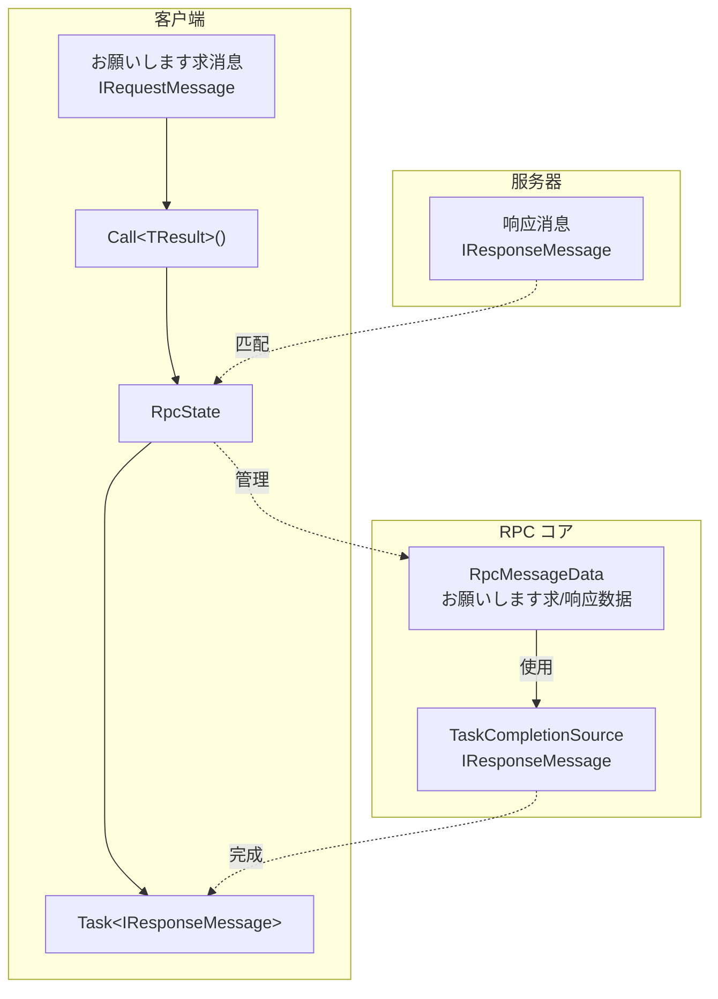
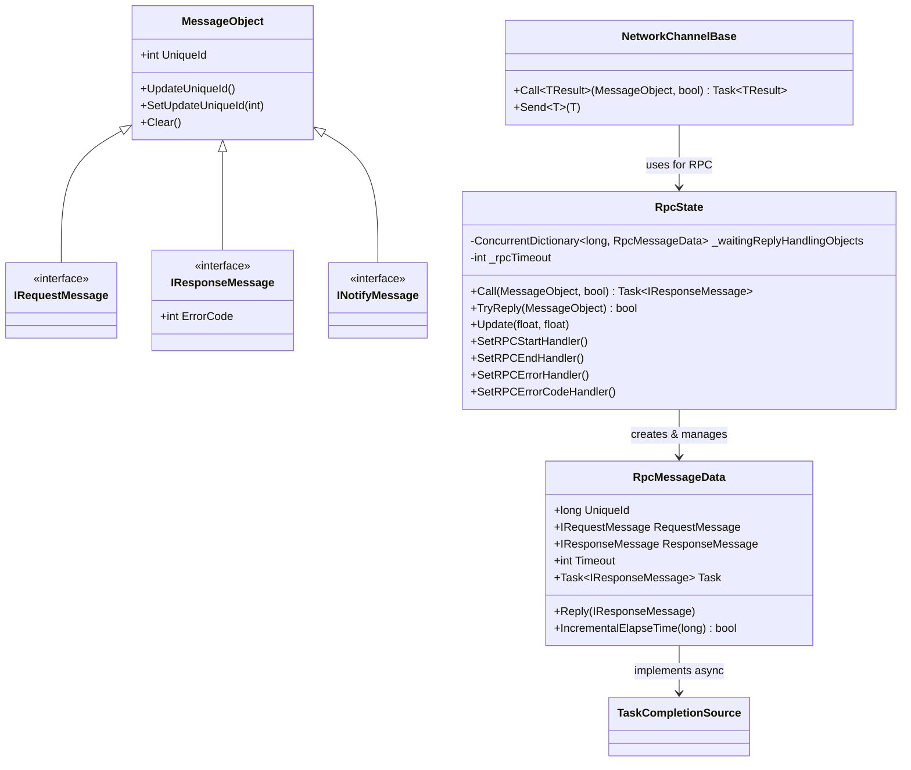
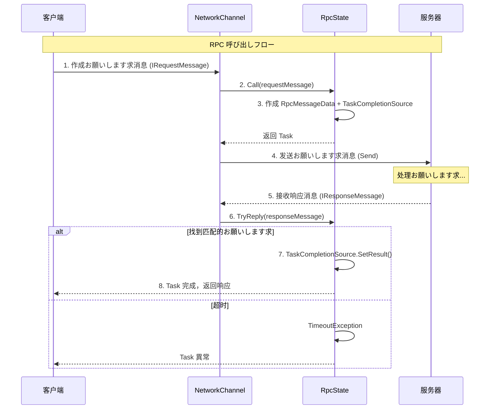

# RPC 远程呼び出し

RPC（Remote Procedure Call，远程过程呼び出し）机制允许客户端向服务器发送お願いします求并等待响应，是网络ゲーム中最常用的客户端-服务器通信方法。

## 概要

GameFrameX 网络库提供します完整的 RPC 実装，サポート：

- **同步呼び出し**：发送お願いします求后阻塞等待响应
- **异步呼び出し**：使用 async/await 模式异步等待响应
- **超时处理**：自动检测并处理 RPC 超时
- **错误处理**：サポート错误码回调和異常处理
- **イベント通知**：RPC 开始、完成、错误的全程イベント监听

### 消息クラス型

系统定义了三种消息クラス型に使用不同的通信シーン：

| クラス型 | インターフェース | 用途 |
|------|------|------|
| お願いします求消息 | `IRequestMessage` | 客户端发送给服务器的お願いします求 |
| 响应消息 | `IResponseMessage` | 服务器返回给客户端的响应，包含 ErrorCode |
| 通知消息 | `INotifyMessage` | 服务器主动发送给客户端的通知，无需响应 |

## 架构

RPC 系统由以下コアコンポーネント构成：



### コアコンポーネント



## 消息定义

在 GameFrameX 网络库中，所有网络消息都を継承 `MessageObject` 基クラス，并実装相应的インターフェース：

### お願いします求消息

```csharp
namespace GameFrameX.Network.Runtime
{
    /// <summary>
    /// 客户端发送给服务器的消息的基クラスインターフェース
    /// </summary>
    public interface IRequestMessage
    {
    }
}
```

> Source: [IRequestMessage.cs](https://github.com/GameFrameX/com.gameframex.unity.network/blob/main/Runtime/Network/Base/IRequestMessage.cs#L1-L9)

### 响应消息

```csharp
namespace GameFrameX.Network.Runtime
{
    /// <summary>
    /// 服务器返回给客户端的消息基クラスインターフェース
    /// </summary>
    public interface IResponseMessage
    {
        /// <summary>
        /// 错误码，非 0 表示错误
        /// </summary>
        int ErrorCode { get; }
    }
}
```

> Source: [IResponseMessage.cs](https://github.com/GameFrameX/com.gameframex.unity.network/blob/main/Runtime/Network/Base/IResponseMessage.cs#L1-L13)

### 通知消息

```csharp
namespace GameFrameX.Network.Runtime
{
    /// <summary>
    /// 服务器发送给客户端的消息基クラスインターフェース
    /// </summary>
    public interface INotifyMessage
    {
    }
}
```

> Source: [INotifyMessage.cs](https://github.com/GameFrameX/com.gameframex.unity.network/blob/main/Runtime/Network/Base/INotifyMessage.cs#L1-L9)

### 消息基クラス

```csharp
namespace GameFrameX.Network.Runtime
{
    public class MessageObject : IReference
    {
        /// <summary>
        /// 消息唯一编号
        /// </summary>
        public int UniqueId { get; private set; }

        protected MessageObject()
        {
            UpdateUniqueId();
        }

        public void UpdateUniqueId()
        {
            UniqueId = Utility.IdGenerator.GetNextUniqueIntId();
        }

        public virtual void Clear()
        {
        }
    }
}
```

> Source: [MessageObject.cs](https://github.com/GameFrameX/com.gameframex.unity.network/blob/main/Runtime/Network/Base/MessageObject.cs#L1-L56)

## RPC 呼び出しフロー

RPC 呼び出し的完整フロー如下：



## 使用例

### 基本 RPC 呼び出し

```csharp
using GameFrameX.Network.Runtime;

// 定义お願いします求消息
public class LoginRequest : MessageObject, IRequestMessage
{
    public string Username { get; set; }
    public string Password { get; set; }
}

// 定义响应消息
public class LoginResponse : MessageObject, IResponseMessage
{
    public int ErrorCode { get; set; }
    public string Token { get; set; }
    public long UserId { get; set; }
}

// 呼び出し RPC
var channel = networkComponent.GetNetworkChannel("Game");
var request = new LoginRequest 
{ 
    Username = "player1", 
    Password = "password123" 
};

// 异步呼び出し
var response = await channel.Call<LoginResponse>(request);

if (response.ErrorCode == 0)
{
    Debug.Log($"登录成功，用户ID: {response.UserId}");
}
else
{
    Debug.LogError($"登录失败，错误码: {response.ErrorCode}");
}
```

> Sources:
> - [NetworkChannelBase.cs](https://github.com/GameFrameX/com.gameframex.unity.network/blob/main/Runtime/Network/Network/NetworkManager.NetworkChannelBase.cs#L765-L771)
> - [RpcState.cs](https://github.com/GameFrameX/com.gameframex.unity.network/blob/main/Runtime/Network/Network/NetworkManager.RpcState.cs#L125-L144)

### 处理错误码

```csharp
// 設定错误码回调
channel.SetRPCErrorCodeHandler((sender, message) =>
{
    var response = message as IResponseMessage;
    Debug.LogError($"RPC 错误码: {response?.ErrorCode}");
});

// 呼び出し时忽略错误码（不会抛出異常）
var response = await channel.Call<LoginResponse>(request, isIgnoreErrorCode: true);
```

> Source: [NetworkChannelBase.cs](https://github.com/GameFrameX/com.gameframex.unity.network/blob/main/Runtime/Network/Network/NetworkManager.NetworkChannelBase.cs#L592-L629)

### 处理超时

```csharp
// 設定 RPC 超时错误回调
channel.SetRPCErrorHandler((sender, message) =>
{
    Debug.LogError($"RPC 超时: {message.GetType().Name}");
});
```

> Source: [RpcState.cs](https://github.com/GameFrameX/com.gameframex.unity.network/blob/main/Runtime/Network/Network/NetworkManager.RpcState.cs#L195-L232)

### 监听 RPC イベント

```csharp
// RPC 开始发送
channel.SetRPCStartHandler((sender, message) =>
{
    Debug.Log($"RPC 开始: {message.GetType().Name}");
});

// RPC 成功完成
channel.SetRPCEndHandler((sender, message) =>
{
    Debug.Log($"RPC 完成: {message.GetType().Name}");
});

// RPC 超时
channel.SetRPCErrorHandler((sender, message) =>
{
    Debug.LogError($"RPC 错误: {message.GetType().Name}");
});

// RPC 返回错误码
channel.SetRPCErrorCodeHandler((sender, message) =>
{
    var response = message as IResponseMessage;
    Debug.LogError($"RPC 错误码: {response?.ErrorCode}");
});
```

## 設定选项

### NetworkComponent 配置

在 Unity 编辑器中可能を通じて NetworkComponent 配置 RPC 超时时间：

| プロパティ | クラス型 | 默认值 | 説明 |
|------|------|--------|------|
| m_rpcTimeout | int | 5000 | RPC 超时时间（毫秒） |
| m_FocusHeartbeat | bool | false | 应用程序失去焦点时是否继续发送心跳 |

```csharp
// 作成网络频道时应用配置
public INetworkChannel CreateNetworkChannel(string channelName, INetworkChannelHelper networkChannelHelper)
{
    var networkChannel = m_NetworkManager.CreateNetworkChannel(channelName, networkChannelHelper, m_rpcTimeout);
    return networkChannel;
}
```

> Source: [NetworkComponent.cs](https://github.com/GameFrameX/com.gameframex.unity.network/blob/main/Runtime/Network/NetworkComponent.cs#L176-L182)

### RpcState 配置

RpcState 构造函数要求超时时间不能小于 3000 毫秒：

```csharp
public RpcState(int timeout)
{
    _rpcTimeout = timeout;
    if (_rpcTimeout < 3000)
    {
        throw new ArgumentOutOfRangeException(nameof(timeout), "RPC超时时间不能小于3000毫秒");
    }
}
```

> Source: [RpcState.cs](https://github.com/GameFrameX/com.gameframex.unity.network/blob/main/Runtime/Network/Network/NetworkManager.RpcState.cs#L61-L68)

## API 参考

### INetworkChannel.Call<TResult>

```csharp
Task<TResult> Call<TResult>(MessageObject messageObject, bool isIgnoreErrorCode = false) where TResult : MessageObject, IResponseMessage
```

向远程主机发送 RPC お願いします求并等待响应。

**泛型参数：**
- `TResult` : 响应消息クラス型，必須继承 MessageObject 并実装 IResponseMessage

**参数：**
- `messageObject` (MessageObject): お願いします求消息对象
- `isIgnoreErrorCode` (bool): 是否忽略错误码，默认为 false

**返回：**
- `Task<TResult>`: 异步任务，包含响应消息

**異常：**
- `ArgumentNullException`: messageObject 为 null
- `TimeoutException`: RPC 超时
- `GameFrameworkException`: 发送失败

> Source: [NetworkChannelBase.cs](https://github.com/GameFrameX/com.gameframex.unity.network/blob/main/Runtime/Network/Network/NetworkManager.NetworkChannelBase.cs#L765-L771)

### INetworkChannel.SetRPCStartHandler

```csharp
void SetRPCStartHandler(EventHandler<MessageObject> handler)
```

設定 RPC 开始发送时的回调函数。

**参数：**
- `handler` (EventHandler<MessageObject>): 回调处理函数

> Source: [NetworkChannelBase.cs](https://github.com/GameFrameX/com.gameframex.unity.network/blob/main/Runtime/Network/Network/NetworkManager.NetworkChannelBase.cs#L613-L618)

### INetworkChannel.SetRPCEndHandler

```csharp
void SetRPCEndHandler(EventHandler<MessageObject> handler)
```

設定 RPC 成功完成时的回调函数。

**参数：**
- `handler` (EventHandler<MessageObject>): 回调处理函数

> Source: [NetworkChannelBase.cs](https://github.com/GameFrameX/com.gameframex.unity.network/blob/main/Runtime/Network/Network/NetworkManager.NetworkChannelBase.cs#L624-L629)

### INetworkChannel.SetRPCErrorHandler

```csharp
void SetRPCErrorHandler(EventHandler<MessageObject> handler)
```

設定 RPC 错误（超时）的回调函数。

**参数：**
- `handler` (EventHandler<MessageObject>): 回调处理函数

> Source: [NetworkChannelBase.cs](https://github.com/GameFrameX/com.gameframex.unity.network/blob/main/Runtime/Network/Network/NetworkManager.NetworkChannelBase.cs#L602-L607)

### INetworkChannel.SetRPCErrorCodeHandler

```csharp
void SetRPCErrorCodeHandler(EventHandler<MessageObject> handler)
```

設定 RPC 返回错误码时的回调函数。

**参数：**
- `handler` (EventHandler<MessageObject>): 回调处理函数

> Source: [NetworkChannelBase.cs](https://github.com/GameFrameX/com.gameframex.unity.network/blob/main/Runtime/Network/Network/NetworkManager.NetworkChannelBase.cs#L591-L596)

## 消息处理器

对于非 RPC クラス型的消息（通知消息），使用 `MessageHandlerAttribute` 来注册消息处理器：

```csharp
public class GameMessageHandler : IMessageHandler
{
    [MessageHandler(typeof(ServerNotifyMessage), nameof(OnServerNotify))]
    private void OnServerNotify(MessageObject message)
    {
        var notify = message as ServerNotifyMessage;
        Debug.Log($"收到服务器通知: {notify.Content}");
    }
}

// 注册消息处理器
ProtoMessageHandler.Add(new GameMessageHandler());
```

> Source: [MessageHandlerAttribute.cs](https://github.com/GameFrameX/com.gameframex.unity.network/blob/main/Runtime/Network/Base/MessageHandlerAttribute.cs#L1-L195)

## 最佳实践

### 1. 合理設定超时时间

```csharp
// に基づいてビジネス要件設定合适的超时时间
// 重要业务操作（如登录、支付）: 10-30 秒
// 普通ゲーム操作: 5-10 秒
// 高频操作: 3-5 秒
var channel = networkComponent.CreateNetworkChannel("Game", helper);
// 或在 NetworkComponent 中設定 m_rpcTimeout
```

### 2. 使用错误码回调

```csharp
// 统一处理错误码
channel.SetRPCErrorCodeHandler((sender, message) =>
{
    var response = message as IResponseMessage;
    switch (response.ErrorCode)
    {
        case 1001:
            // 处理特定错误
            break;
        default:
            // 通用错误处理
            break;
    }
});
```

### 3. 避免重复お願いします求

```csharp
// 使用 CancellationToken 取消重复お願いします求
private CancellationTokenSource _loginCts;

async Task LoginAsync()
{
    // 取消之前的登录お願いします求
    _loginCts?.Cancel();
    _loginCts = new CancellationTokenSource();
    
    try
    {
        var response = await channel.Call<LoginResponse>(request);
        // 处理响应
    }
    catch (OperationCanceledException)
    {
        // お願いします求被取消
    }
}
```

### 4. 分离消息定义

```csharp
// 建议按模块分离消息定义
// Messages/LoginMessages.cs
public class LoginRequest : MessageObject, IRequestMessage { ... }
public class LoginResponse : MessageObject, IResponseMessage { ... }

// Messages/BattleMessages.cs
public class BattleStartRequest : MessageObject, IRequestMessage { ... }
public class BattleStartResponse : MessageObject, IResponseMessage { ... }
```

## 関連リンク

- [消息クラス型](./4-core-concepts.3-message-types)
- [网络管理器](./4-core-concepts.1-network-manager)
- [网络频道](./4-core-concepts.2-network-channel)
- [心跳机制](./5-heartbeat)
- [イベント系统](./6-events)
- [消息压缩](./7-message-compression)
