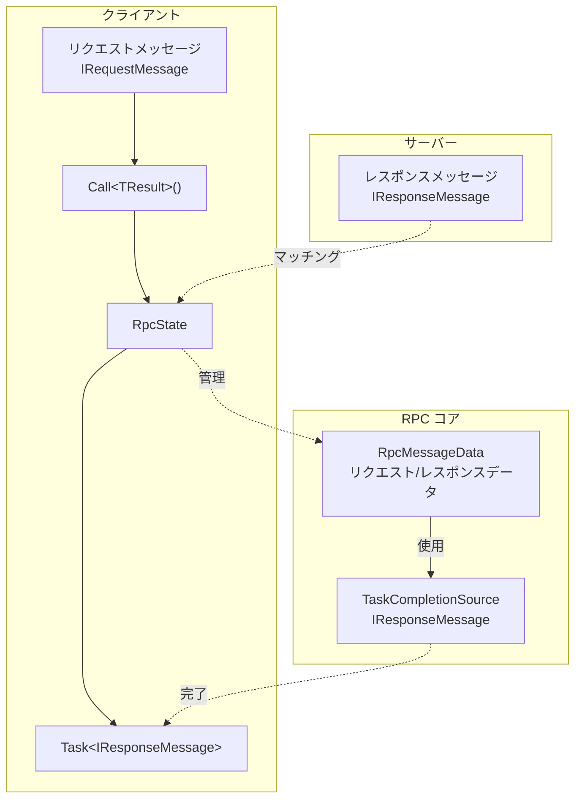
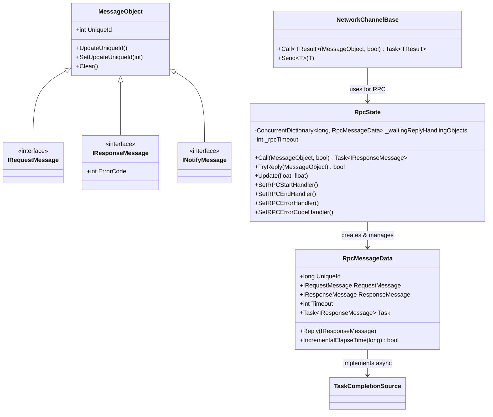
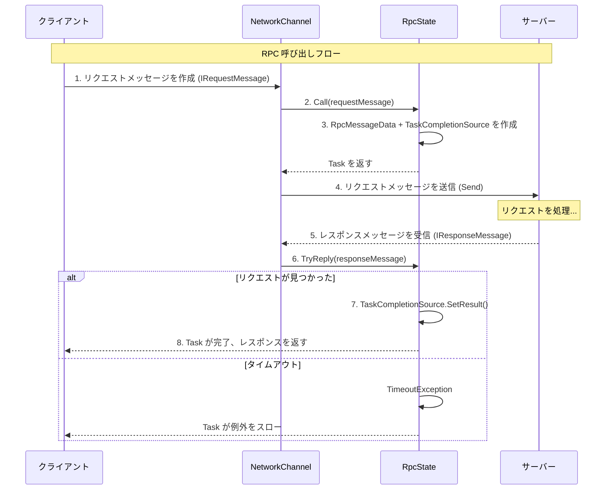

# RPC リモート呼び出し

RPC（Remote Procedure Call、リモートプロシージャ呼び出し）メカニズムはクライアントがサーバーにリクエストを送信し、レスポンスを待機することを許可し、ネットワークゲームで最も一般的に使用されるクライアント・サーバー通信方式です。

## 概要

GameFrameX ネットワークライブラリは完全な RPC 実装を提供し、以下をサポートします：

- **同期呼び出し**：リクエスト送信後にレスポンスの待機をブロック
- **非同期待ち**：async/await パターンを使用して非同期待ち
- **タイムアウト処理**：RPC タイムアウトの自動検出と処理
- **エラー処理**：エラーコードコールバックと例外処理をサポート
- **イベント通知**：RPC 開始、完了、エラーの全プロセスイベント監視

### メッセージタイプ

システムは3種類のメッセージタイプを定義して異なる通信シナリオに使用します：

| タイプ | インターフェース | 用途 |
|------|------|------|
| リクエストメッセージ | `IRequestMessage` | クライアントからサーバーへのリクエスト |
| レスポンスメッセージ | `IResponseMessage` | サーバーからクライアントへのレスポンス、ErrorCode を含む |
| 通知メッセージ | `INotifyMessage` | サーバーがクライアントに積極的に送信する通知、レスポンスが不要 |

## アーキテクチャ

RPC システムは次のコアコンポーネントで構成されています：



### コアコンポーネント



## メッセージ定義

GameFrameX ネットワークライブラリでは、すべてのネットワークメッセージは `MessageObject` 基底クラスを継承し、対応するインターフェースを実装します：

### リクエストメッセージ

```csharp
namespace GameFrameX.Network.Runtime
{
    /// <summary>
    /// クライアントからサーバーに送信されるメッセージの基底クラスインターフェース
    /// </summary>
    public interface IRequestMessage
    {
    }
}
```

> Source: [IRequestMessage.cs](https://github.com/GameFrameX/com.gameframex.unity.network/blob/main/Runtime/Network/Base/IRequestMessage.cs#L1-L9)

### レスポンスメッセージ

```csharp
namespace GameFrameX.Network.Runtime
{
    /// <summary>
    /// サーバーからクライアントに返されるメッセージ基底クラスインターフェース
    /// </summary>
    public interface IResponseMessage
    {
        /// <summary>
        /// エラーコード、0 以外の場合はエラー
        /// </summary>
        int ErrorCode { get; }
    }
}
```

> Source: [IResponseMessage.cs](https://github.com/GameFrameX/com.gameframex.unity.network/blob/main/Runtime/Network/Base/IResponseMessage.cs#L1-L13)

### 通知メッセージ

```csharp
namespace GameFrameX.Network.Runtime
{
    /// <summary>
    /// サーバーからクライアントに送信されるメッセージ基底クラスインターフェース
    /// </summary>
    public interface INotifyMessage
    {
    }
}
```

> Source: [INotifyMessage.cs](https://github.com/GameFrameX/com.gameframex.unity.network/blob/main/Runtime/Network/Base/INotifyMessage.cs#L1-L9)

### メッセージ基底クラス

```csharp
namespace GameFrameX.Network.Runtime
{
    public class MessageObject : IReference
    {
        /// <summary>
        /// メッセージユニーク番号
        /// </summary>
        public int UniqueId { get; private set; }

        protected MessageObject()
        {
            UpdateUniqueId();
        }

        public void UpdateUniqueId()
        {
            UniqueId = Utility.IdGenerator.GetNextUniqueIntId();
        }

        public virtual void Clear()
        {
        }
    }
}
```

> Source: [MessageObject.cs](https://github.com/GameFrameX/com.gameframex.unity.network/blob/main/Runtime/Network/Base/MessageObject.cs#L1-L56)

## RPC 呼び出しフロー

RPC 呼び出しの完全フローは次のとおりです：



## 使用例

### 基本的な RPC 呼び出し

```csharp
using GameFrameX.Network.Runtime;

// リクエストメッセージを定義
public class LoginRequest : MessageObject, IRequestMessage
{
    public string Username { get; set; }
    public string Password { get; set; }
}

// レスポンスメッセージを定義
public class LoginResponse : MessageObject, IResponseMessage
{
    public int ErrorCode { get; set; }
    public string Token { get; set; }
    public long UserId { get; set; }
}

// RPC を呼び出す
var channel = networkComponent.GetNetworkChannel("Game");
var request = new LoginRequest 
{ 
    Username = "player1", 
    Password = "password123" 
};

// 非同期呼び出し
var response = await channel.Call<LoginResponse>(request);

if (response.ErrorCode == 0)
{
    Debug.Log($"ログイン成功、ユーザーID: {response.UserId}");
}
else
{
    Debug.LogError($"ログイン失敗、エラーコード: {response.ErrorCode}");
}
```

> Sources:
> - [NetworkChannelBase.cs](https://github.com/GameFrameX/com.gameframex.unity.network/blob/main/Runtime/Network/Network/NetworkManager.NetworkChannelBase.cs#L765-L771)
> - [RpcState.cs](https://github.com/GameFrameX/com.gameframex.unity.network/blob/main/Runtime/Network/Network/NetworkManager.RpcState.cs#L125-L144)

### エラーコードを処理する

```csharp
// エラーコードコールバックを設定
channel.SetRPCErrorCodeHandler((sender, message) =>
{
    var response = message as IResponseMessage;
    Debug.LogError($"RPC エラーコード: {response?.ErrorCode}");
});

// 呼び出し時にエラーコードを無視（例外をスローしない）
var response = await channel.Call<LoginResponse>(request, isIgnoreErrorCode: true);
```

> Source: [NetworkChannelBase.cs](https://github.com/GameFrameX/com.gameframex.unity.network/blob/main/Runtime/Network/Network/NetworkManager.NetworkChannelBase.cs#L592-L629)

### タイムアウトを処理する

```csharp
// RPC タイムアウトエラーコールバックを設定
channel.SetRPCErrorHandler((sender, message) =>
{
    Debug.LogError($"RPC タイムアウト: {message.GetType().Name}");
});
```

> Source: [RpcState.cs](https://github.com/GameFrameX/com.gameframex.unity.network/blob/main/Runtime/Network/Network/NetworkManager.RpcState.cs#L195-L232)

### RPC イベントを監視する

```csharp
// RPC が送信を開始
channel.SetRPCStartHandler((sender, message) =>
{
    Debug.Log($"RPC 開始: {message.GetType().Name}");
});

// RPC が正常に完了
channel.SetRPCEndHandler((sender, message) =>
{
    Debug.Log($"RPC 完了: {message.GetType().Name}");
});

// RPC がタイムアウト
channel.SetRPCErrorHandler((sender, message) =>
{
    Debug.LogError($"RPC エラー: {message.GetType().Name}");
});

// RPC がエラーコードを返す
channel.SetRPCErrorCodeHandler((sender, message) =>
{
    var response = message as IResponseMessage;
    Debug.LogError($"RPC エラーコード: {response?.ErrorCode}");
});
```

## 設定オプション

### NetworkComponent 設定

Unity エディターで NetworkComponent を使用して RPC タイムアウト時間を設定できます：

| プロパティ | タイプ | デフォルト値 | 説明 |
|------|------|--------|------|
| m_rpcTimeout | int | 5000 | RPC タイムアウト時間（ミリ秒） |
| m_FocusHeartbeat | bool | false | アプリケーションがフォーカスを失ったときにハートビートを送信し続けるかどうか |

```csharp
// ネットワークチャンネル作成時に設定を適用
public INetworkChannel CreateNetworkChannel(string channelName, INetworkChannelHelper networkChannelHelper)
{
    var networkChannel = m_NetworkManager.CreateNetworkChannel(channelName, networkChannelHelper, m_rpcTimeout);
    return networkChannel;
}
```

> Source: [NetworkComponent.cs](https://github.com/GameFrameX/com.gameframex.unity.network/blob/main/Runtime/Network/NetworkComponent.cs#L176-L182)

### RpcState 設定

RpcState コンストラクターはタイムアウト時間が 3000 ミリ秒より小さくならないことを要求します：

```csharp
public RpcState(int timeout)
{
    _rpcTimeout = timeout;
    if (_rpcTimeout < 3000)
    {
        throw new ArgumentOutOfRangeException(nameof(timeout), "RPCタイムアウト時間は3000ミリ秒より小さくできません");
    }
}
```

> Source: [RpcState.cs](https://github.com/GameFrameX/com.gameframex.unity.network/blob/main/Runtime/Network/Network/NetworkManager.RpcState.cs#L61-L68)

## API リファレンス

### `INetworkChannel.Call<TResult>`

```csharp
Task<TResult> Call<TResult>(MessageObject messageObject, bool isIgnoreErrorCode = false) where TResult : MessageObject, IResponseMessage
```

リモートホストに RPC リクエストを送信し、レスポンスを待機します。

**ジェネリックパラメータ：**
- `TResult` : レスポンスメッセージタイプ、MessageObject を継承し、IResponseMessage を実装する必要があります

**パラメータ：**
- `messageObject` (MessageObject): リクエストメッセージオブジェクト
- `isIgnoreErrorCode` (bool): エラーコードを無視するかどうか、デフォルトは false

**返値：**
- `Task<TResult>`: レスポンスメッセージを含む非同期タスク

**例外：**
- `ArgumentNullException`: messageObject が null の場合
- `TimeoutException`: RPC がタイムアウトした場合
- `GameFrameworkException`: 送信に失敗した場合

> Source: [NetworkChannelBase.cs](https://github.com/GameFrameX/com.gameframex.unity.network/blob/main/Runtime/Network/Network/NetworkManager.NetworkChannelBase.cs#L765-L771)

### INetworkChannel.SetRPCStartHandler

```csharp
void SetRPCStartHandler(EventHandler<MessageObject> handler)
```

RPC が送信を開始ときのコールバック関数を設定します。

**パラメータ：**
- `handler` (`EventHandler<MessageObject>`): コールバック処理関数

> Source: [NetworkChannelBase.cs](https://github.com/GameFrameX/com.gameframex.unity.network/blob/main/Runtime/Network/NetworkManager.NetworkChannelBase.cs#L613-L618)

### INetworkChannel.SetRPCEndHandler

```csharp
void SetRPCEndHandler(EventHandler<MessageObject> handler)
```

RPC が正常に完了ときのコールバック関数を設定します。

**パラメータ：**
- `handler` (`EventHandler<MessageObject>`): コールバック処理関数

> Source: [NetworkChannelBase.cs](https://github.com/GameFrameX/com.gameframex.unity.network/blob/main/Runtime/Network/NetworkManager.NetworkChannelBase.cs#L624-L629)

### INetworkChannel.SetRPCErrorHandler

```csharp
void SetRPCErrorHandler(EventHandler<MessageObject> handler)
```

RPC エラー（タイムアウト）のコールバック関数を設定します。

**パラメータ：**
- `handler` (`EventHandler<MessageObject>`): コールバック処理関数

> Source: [NetworkChannelBase.cs](https://github.com/GameFrameX/com.gameframex.unity.network/blob/main/Runtime/Network/NetworkManager.NetworkChannelBase.cs#L602-L607)

### INetworkChannel.SetRPCErrorCodeHandler

```csharp
void SetRPCErrorCodeHandler(EventHandler<MessageObject> handler)
```

RPC がエラーコードを返すときのコールバック関数を設定します。

**パラメータ：**
- `handler` (`EventHandler<MessageObject>`): コールバック処理関数

> Source: [NetworkChannelBase.cs](https://github.com/GameFrameX/com.gameframex.unity.network/blob/main/Runtime/Network/NetworkManager.NetworkChannelBase.cs#L591-L596)

## メッセージハンドラー

RPC 以外のタイプ message（通知メッセージ）の場合、`MessageHandlerAttribute` を使用してメッセージハンドラーを登録します：

```csharp
public class GameMessageHandler : IMessageHandler
{
    [MessageHandler(typeof(ServerNotifyMessage), nameof(OnServerNotify))]
    private void OnServerNotify(MessageObject message)
    {
        var notify = message as ServerNotifyMessage;
        Debug.Log($"サーバーから通知を受信: {notify.Content}");
    }
}

// メッセージハンドラーを登録
ProtoMessageHandler.Add(new GameMessageHandler());
```

> Source: [MessageHandlerAttribute.cs](https://github.com/GameFrameX/com.gameframex.unity.network/blob/main/Runtime/Network/Base/MessageHandlerAttribute.cs#L1-L195)

## ベストプラクティス

### 1. タイムアウト時間を合理的に設定する

```csharp
// ビジネス需求に応じて適切なタイムアウト時間を設定する
// 重要なビジネス操作（ログイン、支払い）: 10-30 秒
// 通常のゲーム操作: 5-10 秒
// 高頻度操作: 3-5 秒
var channel = networkComponent.CreateNetworkChannel("Game", helper);
// または NetworkComponent で m_rpcTimeout を設定
```

### 2. エラーコードコールバックを使用する

```csharp
// エラーコードを統一して処理
channel.SetRPCErrorCodeHandler((sender, message) =>
{
    var response = message as IResponseMessage;
    switch (response.ErrorCode)
    {
        case 1001:
            // 特定のエラーを処理
            break;
        default:
            // 汎用エラーを処理
            break;
    }
});
```

### 3. 重複リクエストを避ける

```csharp
// CancellationToken を使用して重複リクエストをキャンセル
private CancellationTokenSource _loginCts;

async Task LoginAsync()
{
    // 以前のログインリクエストをキャンセル
    _loginCts?.Cancel();
    _loginCts = new CancellationTokenSource();
    
    try
    {
        var response = await channel.Call<LoginResponse>(request);
        // レスポンスを処理
    }
    catch (OperationCanceledException)
    {
        // リクエストがキャンセルされた
    }
}
```

### 4. メッセージ定義を分離する

```csharp
// モジュールごとにメッセージ定義を分離することを推奨
// Messages/LoginMessages.cs
public class LoginRequest : MessageObject, IRequestMessage { ... }
public class LoginResponse : MessageObject, IResponseMessage { ... }

// Messages/BattleMessages.cs
public class BattleStartRequest : MessageObject, IRequestMessage { ... }
public class BattleStartResponse : MessageObject, IResponseMessage { ... }
```

## 関連リンク

- [メッセージタイプ](./4-core-concepts.3-message-types)
- [ネットワークマネージャー](./4-core-concepts.1-network-manager)
- [ネットワークチャンネル](./4-core-concepts.2-network-channel)
- [ハートビート](./5-heartbeat)
- [イベントシステム](./6-events)
- [メッセージ圧縮](./7-message-compression)
