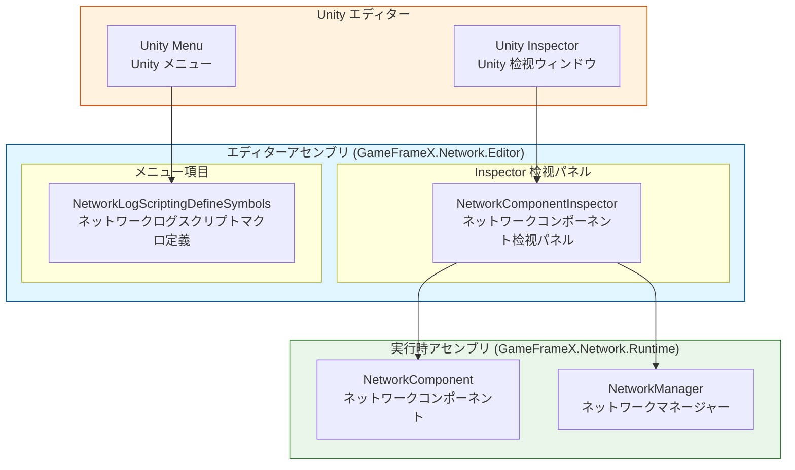
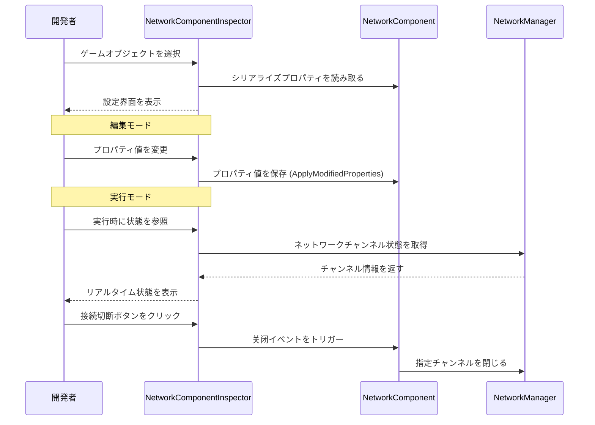
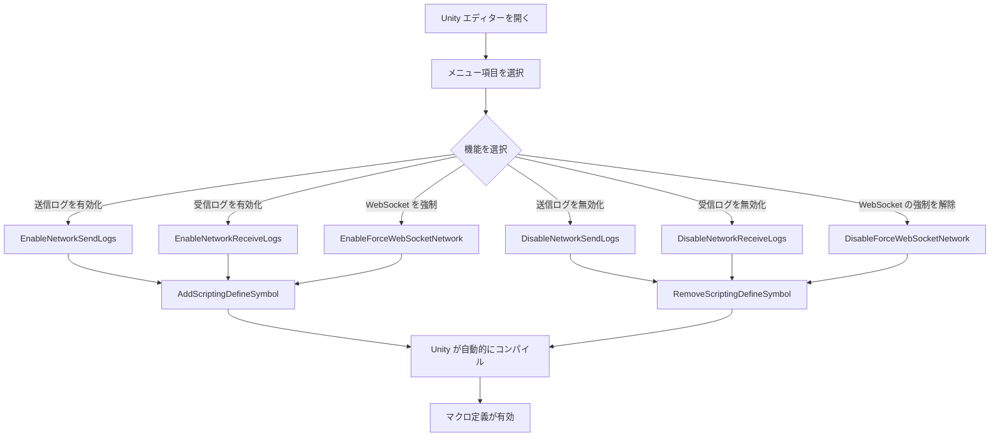

# エディター設定

GameFrameX Network プラグインは 풍부한 Unity エディター設定機能を提供し、開発者が Inspector パネルとメニュー項目を通じてネットワークモジュールの各项パラメータを灵活に設定できるようにします。

## 概要

エディター設定は GameFrameX Network フレームワークの重要な组成部分であり、主に以下の2つの方法来提供されます：

1. **Inspector パネル設定**：カスタム检视面板（Inspector）を通じて NetworkComponent の各项プロパティをリアルタイムで查看と変更
2. **メニュー項目設定**：Unity メニューを通じてスクリプトマクロ定義のクイックスイッチを提供し、ネットワークログ出力と行動を制御

これらのエディター将使ツールは开发サイクル全体を通じて开发者を支援し、ネットワーク機能のデバッグ、パフォーマンスの最適化、実行時ネットワーク状態のリアルタイム監視等功能を提供します。

## アーキテクチャ

GameFrameX Network のエディターモジュールは分层アーキテクチャ設計を採用し、コアコンポーネントは次のとおりです：



### コンポーネント責務

| コンポーネント | 責務 | ファイル位置 |
|------|------|----------|
| NetworkComponentInspector | NetworkComponent の Inspector 界面を提供、プロパティ編集と実行時状態表示をサポート | Editor/Inspector/NetworkComponentInspector.cs |
| NetworkLogScriptingDefineSymbols | メニュー項目を提供してスクリプトマクロ定義を管理、ログ出力を制御 | Editor/NetworkLogScriptingDefineSymbols.cs |
| NetworkComponent | ネットワークコアコンポーネント、設定プロパティを保存 | Runtime/Network/NetworkComponent.cs |

### アセンブリ設定

エディターアセンブリ設定ファイルは モジュールのコンパイル環境と依存関係を定義します：

> Source: [GameFrameX.Network.Editor.asmdef](https://github.com/GameFrameX/com.gameframex.unity.network/blob/main/Editor/GameFrameX.Network.Editor.asmdef#L1-L19)

```json
{
    "name": "GameFrameX.Network.Editor",
    "references": [
        "GameFrameX.Network.Runtime",
        "GameFrameX.Editor",
        "GameFrameX.Runtime"
    ],
    "includePlatforms": [
        "Editor"
    ]
}
```

**設計意図**：エディターアセンブリは Unity エディター環境でのみコンパイルされ、エディターコードをリリースバージョンに 含めないことし、リリースパッケージのサイズを減少させます。

## Inspector パネル設定

NetworkComponentInspector は NetworkComponent のカスタム检视面板であり、視覚的な設定界面を提供します。

### 設定プロパティ

| プロパティ | タイプ | デフォルト値 | 説明 |
|------|------|--------|------|
| RPC Timeout Time In Milliseconds | int | 5000 | RPC 呼び出しタイムアウト時間（ミリ秒）、範囲 3000-50000 |
| Focus Send Heartbeat | bool | false | アプリケーションがフォーカス获得的时候にハートビートパケットを送信するかどうか |
| Ignore Log Printing For Sent Message IDs | `List<int>` | 空リスト | 送信時ログ印刷を無視するメッセージIDリスト |
| Ignore Log Printing Of Received Message IDs | `List<int>` | 空リスト | 受信時ログ印刷を無視するメッセージIDリスト |

### プロパティの詳細

#### RPC タイムアウト時間

```csharp
// Source: Runtime/Network/NetworkComponent.cs#L60-L63
// RPC タイムアウト時間、ミリ秒単位、デフォルトは5秒
[SerializeField] private int m_rpcTimeout = 5000;
```

RPC タイムアウト時間はリモートプロシージャ呼び出し（RPC）の最大待機時間を決めます。リモートメソッドを呼び出すとき、この時間内にレスポンスを受信しない場合、タイムアウトコールバックがトリガーされます。この値を合理的に設定することはユーザー体験にとって重要です：

- **値が小さすぎる**：ネットワーク環境が悪いときに误ったタイムアウトが発生しやすい
- **値が大きすぎる**：ユーザーの待機時間が長くなり、体験が低下する
- **推奨値**：ネットワーク環境に応じて調整、開発環境では短く設定でき、プロ덕クション環境では 5000-10000 ミリ秒を推奨

#### フォーカスハートビート

```csharp
// Source: Runtime/Network/NetworkComponent.cs#L65-L68
// アプリケーションがフォーカス获得的ときにハートビートパケットを送信するかどうか、デフォルトは false
[SerializeField] private bool m_FocusHeartbeat = false;
```

このオプションはアプリケーションがフォーカス获得または失去的时候のハートビート戦略を調整します。ゲームがバックグラウンドに切换的时候：

- **オフの場合（デフォルト）**：元のハートビート戦略を維持します
- **オンの場合**：フォーカス获得的ときにハートビートを回復し、フォーカス失去的时候にハートビートを一時停止（リソースを節約）

#### ログ印刷を無視するメッセージID

```csharp
// Source: Runtime/Network/NetworkComponent.cs#L50-L58
// 送信ネットワークメッセージIDのログ印刷を無視
[SerializeField] private List<int> m_IgnoredSendNetworkIds = new List<int>();
// 受信ネットワークメッセージIDのログ印刷を無視
[SerializeField] private List<int> m_IgnoredReceiveNetworkIds = new List<int>();
```

ネットワーク通信は大量のログを生成します。高頻度だが注目に値しない（ハートビート、フレーム同期など）メッセージIDは忽略リストに追加でき、ログ干扰を减少させます。

### 実行時状態表示

ゲームをasternative実行的时候、Inspector パネルは現在のネットワークチャンネルのリアルタイム状態を表示します：

```csharp
// Source: Editor/Inspector/NetworkComponentInspector.cs#L95-L119
private void DrawNetworkChannel(INetworkChannel networkChannel)
{
    EditorGUILayout.BeginVertical("box");
    {
        EditorGUILayout.LabelField(networkChannel.Name, networkChannel.Connected ? "Connected" : "Disconnected");
        EditorGUILayout.LabelField("Address Family", networkChannel.AddressFamily.ToString());
        EditorGUILayout.LabelField("Local Address", networkChannel.Connected ? networkChannel.Socket.LocalEndPoint.ToString() : "Unavailable");
        EditorGUILayout.LabelField("Remote Address", networkChannel.Connected ? networkChannel.Socket.RemoteEndPoint.ToString() : "Unavailable");
        EditorGUILayout.LabelField("Send Packet", Utility.Text.Format("{0} / {1}", networkChannel.SendPacketCount, networkChannel.SentPacketCount));
        EditorGUILayout.LabelField("Miss Heart Beat Count", networkChannel.MissHeartBeatCount.ToString());
        EditorGUILayout.LabelField("Heart Beat", Utility.Text.Format("{0:F2} / {1:F2}", networkChannel.HeartBeatElapseSeconds, networkChannel.HeartBeatInterval));
        // ... 接続切断ボタン
    }
    EditorGUILayout.EndVertical();
}
```

**実行時に表示される情報：**

| 状態項目 | 説明 |
|--------|------|
| 接続状態 | 現在接続されているかどうか |
| Address Family | アドレスタイプ（IPv4/IPv6） |
| Local Address | ローカルエンドポイントアドレス |
| Remote Address | リモートエンドポイントアドレス |
| Send Packet | 送信データパケットの統計 |
| Miss Heart Beat Count | 知覚ビート丢失计数 |
| Heart Beat | 知覚ビート間隔と経過時間 |

### 使用例

NetworkComponent を Unity シーンに作成した後、Inspector パネルで構成できます：

1. Hierarchy パネルで NetworkComponent を含むゲームオブジェクトを選択
2. Inspector パネルで Network コンポーネントを查看
3. 設定プロパティを編集（一部のプロパティは実行時に読み取り専用）
4. ゲームをasternative実行的时候リアルタイムネットワーク状態を查看

```csharp
// NetworkComponent 作成コード例
// Source: Runtime/Network/NetworkComponent.cs#L42-L45
[AddComponentMenu("GameFrameX/Network")]
[UnityEngine.Scripting.Preserve]
public sealed class NetworkComponent : GameFrameworkComponent
```

## スクリプトマクロ定義設定

NetworkLogScriptingDefineSymbols はメニュー項目を提供してスクリプトマクロ定義を管理し、これらのマクロ定義はネットワークモジュールのコンパイル時行動を制御するために使用されます。

### 利用可能なマクロ定義

| マクロ定義 | メニュー項目パス | 用途 |
|--------|------------|------|
| ENABLE_GAMEFRAMEX_NETWORK_SEND_LOG | GameFrameX/Scripting Define Symbols/Enable Network Send Logs | ネットワーク送信ログを有効にする |
| ENABLE_GAMEFRAMEX_NETWORK_RECEIVE_LOG | GameFrameX/Scripting Define Symbols/Enable Network Receive Logs | ネットワーク受信ログを有効にする |
| FORCE_ENABLE_GAME_FRAME_X_WEB_SOCKET | GameFrameX/Scripting Define Symbols/Enable Force WebSocket | WebSocket ネットワークの使用を強制 |

### メニュー項目の実装

```csharp
// Source: Editor/NetworkLogScriptingDefineSymbols.cs#L42-L98
public static class NetworkLogScriptingDefineSymbols
{
    public const string EnableNetworkReceiveLogScriptingDefineSymbol = "ENABLE_GAMEFRAMEX_NETWORK_RECEIVE_LOG";
    public const string EnableNetworkSendLogScriptingDefineSymbol = "ENABLE_GAMEFRAMEX_NETWORK_SEND_LOG";
    public const string ForceEnableNetworkSendLogScriptingDefineSymbol = "FORCE_ENABLE_GAME_FRAME_X_WEB_SOCKET";

    /// <summary>
    /// ネットワーク送信ログスクリプトマクロ定義を有効にする。
    /// </summary>
    [MenuItem("GameFrameX/Scripting Define Symbols/Enable Network Send Logs(开启网络发送日志打印)", false, 201)]
    public static void EnableNetworkSendLogs()
    {
        ScriptingDefineSymbols.AddScriptingDefineSymbol(EnableNetworkSendLogScriptingDefineSymbol);
    }

    /// <summary>
    /// ネットワーク送信ログスクリプトマクロ定義を無効にする。
    /// </summary>
    [MenuItem("GameFrameX/Scripting Define Symbols/Disable Network Send Logs(关闭网络发送日志打印)", false, 200)]
    public static void DisableNetworkSendLogs()
    {
        ScriptingDefineSymbols.RemoveScriptingDefineSymbol(EnableNetworkSendLogScriptingDefineSymbol);
    }
    // ... 他のメソッドも подобные
}
```

### 使用説明

1. Unity エディターを開きます
2. メニューバーで **GameFrameX → Scripting Define Symbols** を選択
3. 有効/無効にするマクロ定義オプションを選択
4. Unity は自動的にスクリプトを再コンパイルします

### マクロ定義の詳細

#### ネットワークログマクロ

ネットワークログマクロを有効にすると、システムは詳細なネットワーク通信ログをコンソールに出力します：

- **ENABLE_GAMEFRAMEX_NETWORK_SEND_LOG**：すべての送信ネットワークメッセージを出力
- **ENABLE_GAMEFRAMEX_NETWORK_RECEIVE_LOG**：すべての受信ネットワークメッセージを出力

**適用シナリオ：**
- 開発段階でネットワーク通信をデバッグ
- ネットワーク接続問題を排查
- メッセージシリアライズと传输効率を分析

**パフォーマンス注意**：ログを有効にすると大量の出力が生成され、パフォーマンスに影響します。開発デバッグ 때 만开启することをお勧めします。

#### WebSocket 強制マクロ

- **FORCE_ENABLE_GAME_FRAME_X_WEB_SOCKET**：ネットワークモジュールに WebSocket プロトコルの使用を強制

**適用シナリオ：**
- サーバーが WebSocket プロトコルのみサポート
- ブラウザを通じてテストする必要がある
- ファイアウォール制限を回避

## コアフロー

### Inspector 設定フロー



### マクロ定義設定フロー



## 関連リンク

- [ネットワークマネージャー](./4-core-concepts.1-network-manager) - ネットワークコア管理コンポーネント
- [ネットワークチャンネル](./4-core-concepts.2-network-channel) - ネットワーク通信チャンネル
- [ハートビート](./5-heartbeat) - ハートビート検出設定
- [イベントシステム](./6-events) - ネットワークイベント処理
- [クイックスタート](./3-getting-started) - クイックスタートガイド
