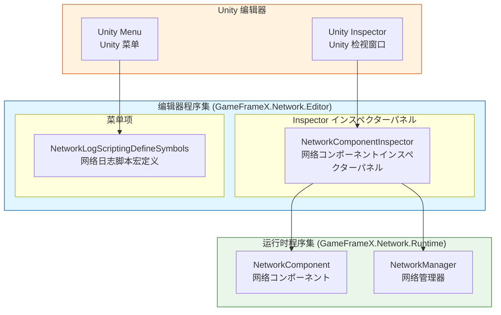
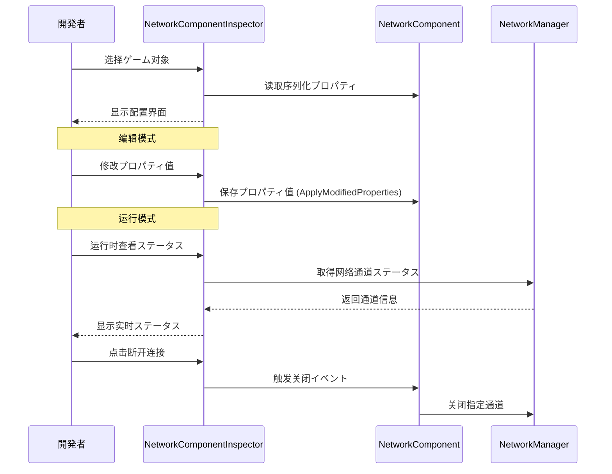
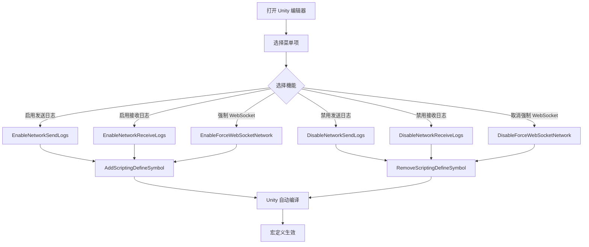

# 编辑器配置

GameFrameX Network 插件提供します丰富的 Unity 编辑器配置機能，允许開発者を通じて Inspector 面板和菜单项灵活配置网络模块的各项参数。

## 概要

编辑器配置是 GameFrameX Network フレームワーク的重要组成部分，主要を通じて以下两种方法提供：

1. **Inspector 面板配置**：を通じて自定义インスペクターパネル（Inspector）实时查看和修改 NetworkComponent 的各项プロパティ
2. **菜单项配置**：を通じて Unity 菜单提供脚本宏定义的快速开关，に使用控制网络日志输出和行为

这些编辑器工具贯穿于整个开发周期，帮助開発者调试网络機能、优化性能，并提供运行时网络ステータス的实时监控。

## 架构

GameFrameX Network 的编辑器模块采用分层アーキテクチャ設計，コアコンポーネント如下：



### コンポーネント职责

| コンポーネント | 职责 | ファイル位置 |
|------|------|----------|
| NetworkComponentInspector | 提供 NetworkComponent 的 Inspector 界面，サポートプロパティ编辑和运行时ステータス显示 | Editor/Inspector/NetworkComponentInspector.cs |
| NetworkLogScriptingDefineSymbols | 提供菜单项に使用管理脚本宏定义，控制日志输出 | Editor/NetworkLogScriptingDefineSymbols.cs |
| NetworkComponent | 网络コアコンポーネント，存储配置プロパティ | Runtime/Network/NetworkComponent.cs |

### 程序集配置

编辑器程序集配置ファイル定义了模块的编译环境和依赖关系：

> Source: [GameFrameX.Network.Editor.asmdef](https://github.com/GameFrameX/com.gameframex.unity.network/blob/main/Editor/GameFrameX.Network.Editor.asmdef#L1-L19)

```json
{
    "name": "GameFrameX.Network.Editor",
    "references": [
        "GameFrameX.Network.Runtime",
        "GameFrameX.Editor",
        "GameFrameX.Runtime"
    ],
    "includePlatforms": [
        "Editor"
    ]
}
```

**设计意图**：编辑器程序集仅在 Unity 编辑器环境下编译，避免将编辑器代码打包到发布版本中，减少发布包体积。

## Inspector 面板配置

NetworkComponentInspector 是 NetworkComponent 的自定义インスペクターパネル，提供します可视化的配置界面。

### 設定プロパティ

| プロパティ | クラス型 | 默认值 | 説明 |
|------|------|--------|------|
| RPC Timeout Time In Milliseconds | int | 5000 | RPC 呼び出し超时时间（毫秒），范围 3000-50000 |
| Focus Send Heartbeat | bool | false | 应用程序获得焦点时是否发送心跳包 |
| Ignore Log Printing For Sent Message IDs | List<int> | 空列表 | 发送时忽略日志打印的消息ID列表 |
| Ignore Log Printing Of Received Message IDs | List<int> | 空列表 | 接收时忽略日志打印的消息ID列表 |

### プロパティ详解

#### RPC 超时时间

```csharp
// Source: Runtime/Network/NetworkComponent.cs#L60-L63
// RPC超时时间，以毫秒为单位,默认为5秒
[SerializeField] private int m_rpcTimeout = 5000;
```

RPC 超时时间决定了远程过程呼び出し（RPC）的最大等待时间。当呼び出し远程メソッド时，如果在该时间内未收到响应，将触发超时回调。合理設定此值对于用户体验至关重要：

- **值过小**：在网络环境较差时容易触发误超时
- **值过大**：用户等待时间过长，体验不佳
- **建议值**：に基づいて网络环境调整，开发环境可設定较短，生产环境建议 5000-10000 毫秒

#### 焦点心跳

```csharp
// Source: Runtime/Network/NetworkComponent.cs#L65-L68
// 是否在应用程序获得焦点时发送心跳包,默认为false
[SerializeField] private bool m_FocusHeartbeat = false;
```

此选项控制应用程序在获得/失去焦点时是否调整心跳策略。当ゲーム切换到后台时：

- **关闭时（默认）**：保持原有心跳策略
- **开启时**：获得焦点时恢复心跳，失去焦点时暂停心跳（节省リソース）

#### 忽略日志消息ID

```csharp
// Source: Runtime/Network/NetworkComponent.cs#L50-L58
// 忽略发送的网络消息ID的日志打印
[SerializeField] private List<int> m_IgnoredSendNetworkIds = new List<int>();
// 忽略接收的网络消息ID的日志打印
[SerializeField] private List<int> m_IgnoredReceiveNetworkIds = new List<int>();
```

网络通信会产生大量日志，对于高频但不必要关注的（如心跳、序列帧同步）消息ID，可能添加到忽略列表中，减少日志干扰。

### 运行时ステータス显示

在ゲーム运行时，Inspector 面板会显示当前网络通道的实时ステータス：

```csharp
// Source: Editor/Inspector/NetworkComponentInspector.cs#L95-L119
private void DrawNetworkChannel(INetworkChannel networkChannel)
{
    EditorGUILayout.BeginVertical("box");
    {
        EditorGUILayout.LabelField(networkChannel.Name, networkChannel.Connected ? "Connected" : "Disconnected");
        EditorGUILayout.LabelField("Address Family", networkChannel.AddressFamily.ToString());
        EditorGUILayout.LabelField("Local Address", networkChannel.Connected ? networkChannel.Socket.LocalEndPoint.ToString() : "Unavailable");
        EditorGUILayout.LabelField("Remote Address", networkChannel.Connected ? networkChannel.Socket.RemoteEndPoint.ToString() : "Unavailable");
        EditorGUILayout.LabelField("Send Packet", Utility.Text.Format("{0} / {1}", networkChannel.SendPacketCount, networkChannel.SentPacketCount));
        EditorGUILayout.LabelField("Miss Heart Beat Count", networkChannel.MissHeartBeatCount.ToString());
        EditorGUILayout.LabelField("Heart Beat", Utility.Text.Format("{0:F2} / {1:F2}", networkChannel.HeartBeatElapseSeconds, networkChannel.HeartBeatInterval));
        // ... 断开连接按钮
    }
    EditorGUILayout.EndVertical();
}
```

**运行时显示的信息包括：**

| ステータス项 | 説明 |
|--------|------|
| 连接ステータス | 当前是否已连接 |
| Address Family | 地址クラス型（IPv4/IPv6） |
| Local Address | 本地终端地址 |
| Remote Address | 远程终端地址 |
| Send Packet | 发送数据包统计 |
| Miss Heart Beat Count | 丢失心跳计数 |
| Heart Beat | 心跳间隔与已过时间 |

### 使用例

在 Unity シーン中作成 NetworkComponent 后，可能在 Inspector 面板中进行配置：

1. 在 Hierarchy 面板中选择包含 NetworkComponent 的ゲーム对象
2. 在 Inspector 面板中查看 Network コンポーネント
3. 编辑配置プロパティ（部分プロパティ在运行时只读）
4. ゲーム运行时查看实时网络ステータス

```csharp
// NetworkComponent 作成代码示例
// Source: Runtime/Network/NetworkComponent.cs#L42-L45
[AddComponentMenu("GameFrameX/Network")]
[UnityEngine.Scripting.Preserve]
public sealed class NetworkComponent : GameFrameworkComponent
```

## 脚本宏定义配置

NetworkLogScriptingDefineSymbols 提供します菜单项来管理脚本宏定义，这些宏定义に使用控制网络模块的编译时行为。

### 可用宏定义

| 宏定义 | 菜单项路径 | 用途 |
|--------|------------|------|
| ENABLE_GAMEFRAMEX_NETWORK_SEND_LOG | GameFrameX/Scripting Define Symbols/Enable Network Send Logs | 启用网络发送日志 |
| ENABLE_GAMEFRAMEX_NETWORK_RECEIVE_LOG | GameFrameX/Scripting Define Symbols/Enable Network Receive Logs | 启用网络接收日志 |
| FORCE_ENABLE_GAME_FRAME_X_WEB_SOCKET | GameFrameX/Scripting Define Symbols/Enable Force WebSocket | 强制使用 WebSocket 网络 |

### 菜单项実装

```csharp
// Source: Editor/NetworkLogScriptingDefineSymbols.cs#L42-L98
public static class NetworkLogScriptingDefineSymbols
{
    public const string EnableNetworkReceiveLogScriptingDefineSymbol = "ENABLE_GAMEFRAMEX_NETWORK_RECEIVE_LOG";
    public const string EnableNetworkSendLogScriptingDefineSymbol = "ENABLE_GAMEFRAMEX_NETWORK_SEND_LOG";
    public const string ForceEnableNetworkSendLogScriptingDefineSymbol = "FORCE_ENABLE_GAME_FRAME_X_WEB_SOCKET";

    /// <summary>
    /// 开启网络发送日志脚本宏定义。
    /// </summary>
    [MenuItem("GameFrameX/Scripting Define Symbols/Enable Network Send Logs(开启网络发送日志打印)", false, 201)]
    public static void EnableNetworkSendLogs()
    {
        ScriptingDefineSymbols.AddScriptingDefineSymbol(EnableNetworkSendLogScriptingDefineSymbol);
    }

    /// <summary>
    /// 禁用网络发送日志脚本宏定义。
    /// </summary>
    [MenuItem("GameFrameX/Scripting Define Symbols/Disable Network Send Logs(关闭网络发送日志打印)", false, 200)]
    public static void DisableNetworkSendLogs()
    {
        ScriptingDefineSymbols.RemoveScriptingDefineSymbol(EnableNetworkSendLogScriptingDefineSymbol);
    }
    // ... 其他メソッドクラス似
}
```

### 使用説明

1. 打开 Unity 编辑器
2. 在菜单栏选择 **GameFrameX → Scripting Define Symbols**
3. 选择要启用/禁用的宏定义选项
4. Unity 会自动重新编译脚本

### 宏定义详解

#### 网络日志宏

启用网络日志宏后，系统会在控制台输出详细的网络通信日志：

- **ENABLE_GAMEFRAMEX_NETWORK_SEND_LOG**：输出所有发送的网络消息
- **ENABLE_GAMEFRAMEX_NETWORK_RECEIVE_LOG**：输出所有接收的网络消息

**适用シーン**：
- 开发阶段调试网络通信
- 排查网络连接问题
- 分析消息序列化和传输效率

**性能注意**：启用日志会产生大量输出，影响性能，建议仅在开发调试时开启。

#### 强制 WebSocket 宏

- **FORCE_ENABLE_GAME_FRAME_X_WEB_SOCKET**：强制网络模块使用 WebSocket 协议

**适用シーン**：
- 服务器仅サポート WebSocket 协议
- 必要を通じて浏览器进行测试
- 穿透防火墙限制

## コアフロー

### Inspector 配置フロー



### 宏定义配置フロー



## 関連リンク

- [网络管理器](./4-core-concepts.1-network-manager) - 网络コア管理コンポーネント
- [网络频道](./4-core-concepts.2-network-channel) - 网络通信通道
- [心跳机制](./5-heartbeat) - 心跳检测配置
- [イベント系统](./6-events) - 网络イベント处理
- [快速开始](./3-getting-started) - 快速入门指南
