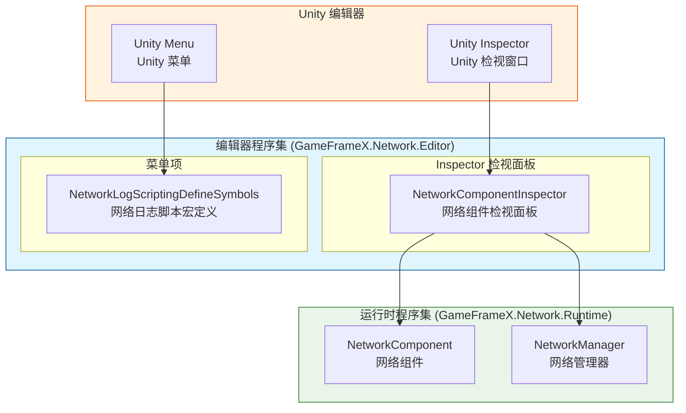
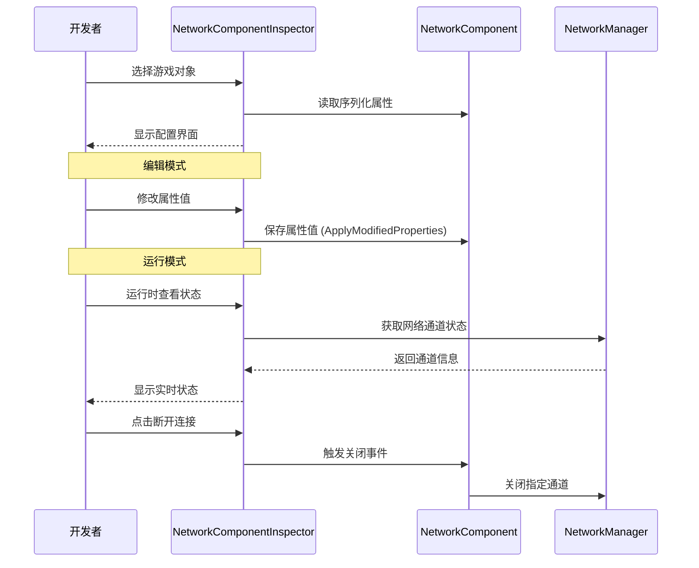

# エディタ設定

GameFrameX Network プラグイン提供します丰富的 Unity エディタ設定機能，允许開発者通过 Inspector パネル和メニュー项柔軟設定网络モジュール的各项パラメータ。

## 概要

エディタ設定是 GameFrameX Network フレームワーク的重要な组成部分，主な通过以下两种方法提供：

1. **Inspector パネル設定**：通过自定義检视パネル（Inspector）实时確認和変更 NetworkComponent 的各项プロパティ
2. **メニュー项設定**：通过 Unity メニュー提供脚本宏定義的快速开关，用于控制网络ログ输出和行为

这些エディタ工具贯穿于整个开发周期，帮助開発者デバッグ网络機能、最適化性能，并提供ランタイム网络ステータス的实时监控。

## アーキテクチャ

GameFrameX Network 的エディタモジュール采用分层アーキテクチャ設計，コアコンポーネント如下：



### コンポーネント职责

| コンポーネント | 职责 | ファイル位置 |
|------|------|----------|
| NetworkComponentInspector | 提供 NetworkComponent 的 Inspector 界面，サポートプロパティ编辑和ランタイムステータス显示 | Editor/Inspector/NetworkComponentInspector.cs |
| NetworkLogScriptingDefineSymbols | 提供メニュー项用于管理脚本宏定義，控制ログ输出 | Editor/NetworkLogScriptingDefineSymbols.cs |
| NetworkComponent | 网络コアコンポーネント，存储設定プロパティ | Runtime/Network/NetworkComponent.cs |

### アセンブリ設定

エディタアセンブリ設定ファイル定義了モジュール的コンパイル環境和依赖关系：

> Source: [GameFrameX.Network.Editor.asmdef](https://github.com/GameFrameX/com.gameframex.unity.network/blob/main/Editor/GameFrameX.Network.Editor.asmdef#L1-L19)

```json
{
    "name": "GameFrameX.Network.Editor",
    "references": [
        "GameFrameX.Network.Runtime",
        "GameFrameX.Editor",
        "GameFrameX.Runtime"
    ],
    "includePlatforms": [
        "Editor"
    ]
}
```

**設計意图**：エディタアセンブリ仅在 Unity エディタ環境下コンパイル，避免将エディタコード打パッケージ到リリースバージョン中，减少リリースパッケージ体积。

## Inspector パネル設定

NetworkComponentInspector 是 NetworkComponent 的自定義检视パネル，提供します可视化的設定界面。

### 設定プロパティ

| プロパティ | タイプ | デフォルト值 | 説明 |
|------|------|--------|------|
| RPC Timeout Time In Milliseconds | int | 5000 | RPC 呼び出し超时时间（毫秒），范围 3000-50000 |
| Focus Send Heartbeat | bool | false | 应用程序获得焦点时是否发送心跳パッケージ |
| Ignore Log Printing For Sent Message IDs | List<int> | 空列表 | 发送时忽略ログ打印的メッセージID列表 |
| Ignore Log Printing Of Received Message IDs | List<int> | 空列表 | 受信时忽略ログ打印的メッセージID列表 |

### プロパティ详解

#### RPC 超时时间

```csharp
// Source: Runtime/Network/NetworkComponent.cs#L60-L63
// RPC超时时间，以毫秒为单位,默认为5秒
[SerializeField] private int m_rpcTimeout = 5000;
```

RPC 超时时间决定了远程过程呼び出し（RPC）的最大等待时间。当呼び出し远程メソッド时，もし在该时间内未收到响应，将トリガー超时コールバック。合理設定此值对于ユーザー体验至关重要な：

- **值过小**：在网络環境较差时容易トリガー误超时
- **值过大**：ユーザー等待时间过长，体验不佳
- **お勧め值**：根据网络環境调整，开发環境可設定较短，本番環境お勧め 5000-10000 毫秒

#### 焦点心跳

```csharp
// Source: Runtime/Network/NetworkComponent.cs#L65-L68
// 是否在应用程序获得焦点时发送心跳包,默认为false
[SerializeField] private bool m_FocusHeartbeat = false;
```

此オプション控制应用程序在获得/失去焦点时是否调整心跳策略。当游戏切换到后台时：

- **閉じる时（デフォルト）**：保持原有心跳策略
- **开启时**：获得焦点时恢复心跳，失去焦点时暂停心跳（节省リソース）

#### 忽略ログメッセージID

```csharp
// Source: Runtime/Network/NetworkComponent.cs#L50-L58
// 忽略发送的网络消息ID的日志打印
[SerializeField] private List<int> m_IgnoredSendNetworkIds = new List<int>();
// 忽略接收的网络消息ID的日志打印
[SerializeField] private List<int> m_IgnoredReceiveNetworkIds = new List<int>();
```

网络通信会产生大量ログ，对于高频但不〜する必要があります关注的（如心跳、序列帧同步）メッセージID，〜できます追加到忽略列表中，减少ログ干扰。

### ランタイムステータス显示

在游戏ランタイム，Inspector パネル会显示当前网络通道的实时ステータス：

```csharp
// Source: Editor/Inspector/NetworkComponentInspector.cs#L95-L119
private void DrawNetworkChannel(INetworkChannel networkChannel)
{
    EditorGUILayout.BeginVertical("box");
    {
        EditorGUILayout.LabelField(networkChannel.Name, networkChannel.Connected ? "Connected" : "Disconnected");
        EditorGUILayout.LabelField("Address Family", networkChannel.AddressFamily.ToString());
        EditorGUILayout.LabelField("Local Address", networkChannel.Connected ? networkChannel.Socket.LocalEndPoint.ToString() : "Unavailable");
        EditorGUILayout.LabelField("Remote Address", networkChannel.Connected ? networkChannel.Socket.RemoteEndPoint.ToString() : "Unavailable");
        EditorGUILayout.LabelField("Send Packet", Utility.Text.Format("{0} / {1}", networkChannel.SendPacketCount, networkChannel.SentPacketCount));
        EditorGUILayout.LabelField("Miss Heart Beat Count", networkChannel.MissHeartBeatCount.ToString());
        EditorGUILayout.LabelField("Heart Beat", Utility.Text.Format("{0:F2} / {1:F2}", networkChannel.HeartBeatElapseSeconds, networkChannel.HeartBeatInterval));
        // ... 断开连接按钮
    }
    EditorGUILayout.EndVertical();
}
```

**ランタイム显示的情報含みます：**

| ステータス项 | 説明 |
|--------|------|
| 连接ステータス | 当前是否已连接 |
| Address Family | 地址タイプ（IPv4/IPv6） |
| Local Address | 本地终端地址 |
| Remote Address | 远程终端地址 |
| Send Packet | 发送数据パッケージ统计 |
| Miss Heart Beat Count | 丢失心跳计数 |
| Heart Beat | 心跳间隔与已过时间 |

### 使用例

在 Unity シーン中作成 NetworkComponent 后，〜できます在 Inspector パネル中进行設定：

1. 在 Hierarchy パネル中选择パッケージ含 NetworkComponent 的游戏对象
2. 在 Inspector パネル中確認 Network コンポーネント
3. 编辑設定プロパティ（部分プロパティ在ランタイム只读）
4. 游戏ランタイム確認实时网络ステータス

```csharp
// NetworkComponent 创建代码示例
// Source: Runtime/Network/NetworkComponent.cs#L42-L45
[AddComponentMenu("GameFrameX/Network")]
[UnityEngine.Scripting.Preserve]
public sealed class NetworkComponent : GameFrameworkComponent
```

## 脚本宏定義設定

NetworkLogScriptingDefineSymbols 提供しますメニュー项来管理脚本宏定義，这些宏定義用于控制网络モジュール的コンパイル时行为。

### 可用宏定義

| 宏定義 | メニュー项路径 | 用途 |
|--------|------------|------|
| ENABLE_GAMEFRAMEX_NETWORK_SEND_LOG | GameFrameX/Scripting Define Symbols/Enable Network Send Logs | 启用网络发送ログ |
| ENABLE_GAMEFRAMEX_NETWORK_RECEIVE_LOG | GameFrameX/Scripting Define Symbols/Enable Network Receive Logs | 启用网络受信ログ |
| FORCE_ENABLE_GAME_FRAME_X_WEB_SOCKET | GameFrameX/Scripting Define Symbols/Enable Force WebSocket | 强制使用 WebSocket 网络 |

### メニュー项実装

```csharp
// Source: Editor/NetworkLogScriptingDefineSymbols.cs#L42-L98
public static class NetworkLogScriptingDefineSymbols
{
    public const string EnableNetworkReceiveLogScriptingDefineSymbol = "ENABLE_GAMEFRAMEX_NETWORK_RECEIVE_LOG";
    public const string EnableNetworkSendLogScriptingDefineSymbol = "ENABLE_GAMEFRAMEX_NETWORK_SEND_LOG";
    public const string ForceEnableNetworkSendLogScriptingDefineSymbol = "FORCE_ENABLE_GAME_FRAME_X_WEB_SOCKET";

    /// <summary>
    /// 开启网络发送日志脚本宏定义。
    /// </summary>
    [MenuItem("GameFrameX/Scripting Define Symbols/Enable Network Send Logs(开启网络发送日志打印)", false, 201)]
    public static void EnableNetworkSendLogs()
    {
        ScriptingDefineSymbols.AddScriptingDefineSymbol(EnableNetworkSendLogScriptingDefineSymbol);
    }

    /// <summary>
    /// 禁用网络发送日志脚本宏定义。
    /// </summary>
    [MenuItem("GameFrameX/Scripting Define Symbols/Disable Network Send Logs(关闭网络发送日志打印)", false, 200)]
    public static void DisableNetworkSendLogs()
    {
        ScriptingDefineSymbols.RemoveScriptingDefineSymbol(EnableNetworkSendLogScriptingDefineSymbol);
    }
    // ... 其他方法类似
}
```

### 使用説明

1. 打开 Unity エディタ
2. 在メニュー栏选择 **GameFrameX → Scripting Define Symbols**
3. 选择要启用/禁用的宏定義オプション
4. Unity 会自动重新コンパイル脚本

### 宏定義详解

#### 网络ログ宏

启用网络ログ宏后，系统会在控制台输出詳細的网络通信ログ：

- **ENABLE_GAMEFRAMEX_NETWORK_SEND_LOG**：输出所有发送的网络メッセージ
- **ENABLE_GAMEFRAMEX_NETWORK_RECEIVE_LOG**：输出所有受信的网络メッセージ

**适用シーン**：
- 开发フェーズデバッグ网络通信
- 排查网络连接問題
- 分析メッセージシリアライズ和传输效率

**性能注意**：启用ログ会产生大量输出，影响性能，お勧め仅在开发デバッグ时开启。

#### 强制 WebSocket 宏

- **FORCE_ENABLE_GAME_FRAME_X_WEB_SOCKET**：强制网络モジュール使用 WebSocket 协议

**适用シーン**：
- 服务器仅サポート WebSocket 协议
- 〜する必要があります通过浏览器进行テスト
- 穿透防火墙限制

## コアフロー

### Inspector 設定フロー



### 宏定義設定フロー


## 関連リンク

- [网络マネージャー](./4-core-concepts.1-network-manager) - 网络コア管理コンポーネント
- [网络频道](./4-core-concepts.2-network-channel) - 网络通信通道
- [心跳机制](./5-heartbeat) - 心跳检测設定
- [イベント系统](./6-events) - 网络イベント処理
- [快速开始](./3-getting-started) - 快速入门ガイド
