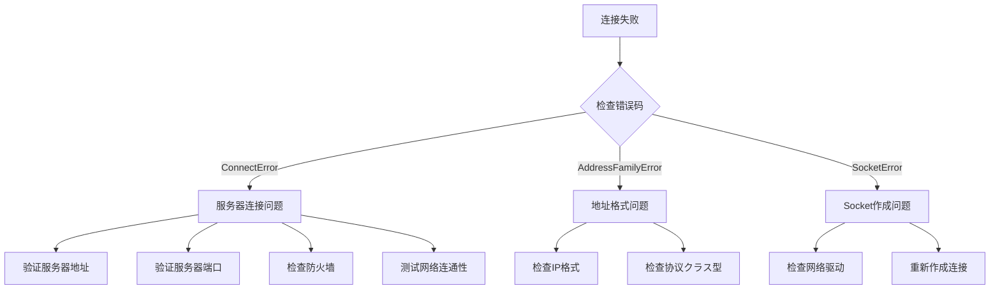

# 常见问题

本文档汇总了使用 GameFrameX Network 网络库过程中常见的错误问题、原因分析以及解決策。

## 概要

GameFrameX Network 是 Unity ゲーム引擎的长连接网络コンポーネント，提供 TCP 和 WebSocket 两种网络协议サポート。在实际使用过程中，開発者可能遇到连接失败、消息处理错误、心跳超时等问题。本文档旨在帮助開発者快速定位和解决这些常见问题。

## 常见错误码与原因分析

### 网络错误码详解

> Source: [NetworkErrorCode.cs](https://github.com/GameFrameX/com.gameframex.unity.network/blob/main/Runtime/Network/Base/NetworkErrorCode.cs#L80-L136)

| 错误码 | 説明 | 常见原因 |
|--------|------|----------|
| `Unknown` | 未知错误 | 未知異常或未捕获的错误 |
| `AddressFamilyError` | 地址族错误 | IP地址格式不正确或协议不匹配 |
| `SocketError` | Socket 错误 | 网络套接字作成或操作失败 |
| `ConnectError` | 连接错误 | 服务器未开启、防火墙阻止、网络不通 |
| `SendError` | 发送错误 | 网络中断、缓冲区满、连接已关闭 |
| `ReceiveError` | 接收错误 | 网络中断、服务器主动关闭连接 |
| `SerializeError` | 序列化错误 | 消息对象序列化失败 |
| `DeserializePacketHeaderError` | 包头解析错误 | 数据包格式不正确或被篡改 |
| `DeserializePacketError` | 包体解析错误 | 消息体解析失败 |
| `MissHeartBeatError` | 心跳丢失错误 | 长时间未收到服务器心跳响应 |
| `DisposeError` | リソース释放错误 | 重复释放或释放时机不当 |

### 网络连接关闭原因

> Source: [NetworkErrorCode.cs](https://github.com/GameFrameX/com.gameframex.unity.network/blob/main/Runtime/Network/Base/NetworkErrorCode.cs#L38-L74)

| 关闭原因 | 説明 | 处理建议 |
|----------|------|----------|
| `Normal` | 正常关闭 | 无需处理，正常业务フロー |
| `Timeout` | 超时关闭 | 检查网络状况，调整超时設定 |
| `Dispose` | 主动释放 | 检查代码中是否有误呼び出し |
| `ConnectClose` | 连接断开 | 检查服务器ステータス和网络连接 |
| `ConnectAddressError` | 地址错误 | 检查服务器地址和端口配置 |
| `ConnectAddressExceptionError` | 地址異常 | 检查DNS解析和服务器可达性 |
| `MissHeartBeat` | 心跳丢失 | 见心跳问题章节 |

## 连接问题

### 无法连接到服务器

**症状**：呼び出し连接メソッド后，触发 `NetworkError` イベント但未触发 `NetworkConnected` イベント。

**可能原因**：

1. **服务器地址错误**
   - IP 地址或域名填写错误
   - 端口号不正确
   - 防火墙阻止连接

2. **服务器未启动**
   - 后端服务未运行
   - 服务端口未正确监听

3. **网络环境问题**
   - 客户端网络不通
   - 代理或VPN干扰

**排查手順**：



**解決策**：

1. 确认服务器地址和端口正确
2. 使用 ping 或 telnet 测试服务器可达性
3. 检查防火墙和安全组配置
4. 确认服务器端已正确启动并监听相应端口

### 连接成功后又立即断开

**症状**：触发 `NetworkConnected` イベント后，很快触发 `NetworkClosed` イベント。

**可能原因**：

1. 服务器主动断开连接（认证失败等）
2. 客户端发送的数据格式错误
3. 心跳配置问题

**解決策**：

1. 检查服务器日志，了解断开原因
2. 验证消息协议格式是否与服务器一致
3. 检查心跳配置是否正确

## 消息处理问题

### 消息处理器注册失败

**症状**：应用程序启动时抛出異常，或消息无法被正确处理。

> Source: [MessageHandlerAttribute.cs](https://github.com/GameFrameX/com.gameframex.unity.network/blob/main/Runtime/Network/Base/MessageHandlerAttribute.cs#L47-L63)

**常见错误**：

1. **消息クラス型未继承 MessageObject**

```csharp
// 错误示例
[MessageHandler(typeof(MyMessage), nameof(OnReceiveMyMessage))]
public class MyMessageHandler
{
    public void OnReceiveMyMessage(MyMessage msg) { }
}

// MyMessage 定义错误 - 未继承 MessageObject
public class MyMessage  // 错误：未继承 MessageObject
{
    public int Id;
}
```

```csharp
// 正确示例
public class MyMessage : MessageObject  // 必須继承 MessageObject
{
    public int Id;
}
```

2. **消息クラス型未実装インターフェース**

```csharp
// 错误示例
public class MyMessage : MessageObject  // 缺少インターフェース実装
{
    public int Id;
}

// 正确示例 - 必要実装 INotifyMessage 或 IRequestMessage/IResponseMessage
public class MyMessage : MessageObject, INotifyMessage
{
    public int Id;
}
```

3. **处理メソッド参数错误**

> Source: [MessageHandlerAttribute.cs](https://github.com/GameFrameX/com.gameframex.unity.network/blob/main/Runtime/Network/Base/MessageHandlerAttribute.cs#L136-L144)

```csharp
// 错误示例 1：参数个数不为1
[MessageHandler(typeof(MyMessage), nameof(OnReceiveMyMessage))]
public void OnReceiveMyMessage(MyMessage msg, string extra)  // 错误：参数个数为2
{
}

// 错误示例 2：参数クラス型不匹配
[MessageHandler(typeof(MyMessage), nameof(OnReceiveMyMessage))]
public void OnReceiveMyMessage(OtherMessage msg)  // 错误：参数クラス型不匹配
{
}

// 正确示例
[MessageHandler(typeof(MyMessage), nameof(OnReceiveMyMessage))]
public void OnReceiveMyMessage(MyMessage msg)  // 正确：参数个数为1，クラス型为 MyMessage
{
}
```

### 消息处理器メソッド未找到

**症状**：运行时抛出異常 `未找到メソッド：xxx.お願いします确认是否注册成功`

> Source: [MessageHandlerAttribute.cs](https://github.com/GameFrameX/com.gameframex.unity.network/blob/main/Runtime/Network/Base/MessageHandlerAttribute.cs#L77-L80)

**排查手順**：

1. 确认メソッド名称与 `MessageHandlerAttribute` 中指定的一致
2. 确认メソッド访问修饰符正确（public 或 internal）
3. 确认メソッド在正确的クラス中
4. 确认使用了 `[MessageHandler]` 特性

```csharp
// 确保メソッド名正确匹配
[MessageHandler(typeof(LoginResponse), nameof(OnLoginResponse))]  // メソッド名必須完全匹配
public class PlayerHandler : IMessageHandler
{
    // メソッド名必須与 nameof 中的名称完全一致
    public void OnLoginResponse(LoginResponse msg) { }
}
```

### 消息ID重复冲突

**症状**：启动时抛出異常 `お願いします求Id重复` 或 `返回Id重复`

> Source: [ProtoMessageIdHandler.cs](https://github.com/GameFrameX/com.gameframex.unity.network/blob/main/Runtime/Network/ProtoMessageIdHandler.cs#L140-L161)

**原因**：同一个消息クラス型使用了重复的消息ID

**解決策**：检查消息クラス型定义，确保每个消息クラス型的ID唯一

```csharp
// 错误示例 - ID重复
[MessageTypeHandler(MessageId = 1001)]
public class LoginRequest : MessageObject, IRequestMessage { }

[MessageTypeHandler(MessageId = 1001)]  // 错误：重复的ID
public class Login2Request : MessageObject, IRequestMessage { }

// 正确示例 - ID唯一
[MessageTypeHandler(MessageId = 1001)]
public class LoginRequest : MessageObject, IRequestMessage { }

[MessageTypeHandler(MessageId = 1002)]  // 正确：使用不同的ID
public class Login2Request : MessageObject, IRequestMessage { }
```

### 心跳消息重复

**症状**：启动时抛出異常 `心跳消息重复`

> Source: [ProtoMessageIdHandler.cs](https://github.com/GameFrameX/com.gameframex.unity.network/blob/main/Runtime/Network/ProtoMessageIdHandler.cs#L126-L129)

**原因**：多个消息クラス型被标记为心跳消息

**解決策**：确保只有一个消息クラス型被标记为心跳消息

## 心跳问题

### 心跳超时断开连接

**症状**：触发 `NetworkMissHeartBeat` イベント后连接被关闭

**可能原因**：

1. 网络延迟过高
2. 服务器心跳间隔配置与客户端不一致
3. 服务器负载过高未能及时响应心跳
4. 客户端进入后台时心跳暂停（如果未配置 `FocusHeartbeat`）

> Source: [NetworkComponent.cs](https://github.com/GameFrameX/com.gameframex.unity.network/blob/main/Runtime/Network/NetworkComponent.cs#L68-L91)

**解決策**：

1. 检查网络环境，优化网络质量
2. 调整心跳超时配置，增加容忍度
3. 如果ゲームサポート后台运行，启用 `FocusHeartbeat` 选项
4. 在应用程序切换到后台时暂停心跳检测

```csharp
// 在 NetworkComponent 中启用焦点心跳
// 在 Unity 编辑器中: NetworkComponent -> Focus Send Heartbeat = true
// 或を通じて代码設定
networkChannel.SetEnableHeartbeat(true);
```

### 心跳消息未被正确处理

**症状**：心跳正常发送但服务器未响应，或客户端收到心跳但未正确处理

**解決策**：

1. 确认心跳消息クラス型実装了 `IHeartBeatMessage` インターフェース
2. 确认心跳消息ID与服务器约定一致
3. 检查心跳处理器実装

> Source: [DefaultPacketHeartBeatHandler.cs](https://github.com/GameFrameX/com.gameframex.unity.network/blob/main/Runtime/Network/Helper/DefaultPacketHeartBeatHandler.cs#L22-L25)

```csharp
// 心跳处理器必要正确実装
public class HeartBeatHandler : IPacketHeartBeatHandler
{
    public MessageObject Handler()
    {
        // 返回心跳消息对象，不应抛出 NotImplementedException
        return new HeartBeatMessage();
    }
}
```

## RPC 呼び出し问题

### RPC 超时

**症状**：RPC 呼び出し未在预期时间内收到响应

**可能原因**：

1. 网络延迟过高
2. 服务器处理超时
3. 网络连接不稳定

> Source: [NetworkManager.RpcState.cs](https://github.com/GameFrameX/com.gameframex.unity.network/blob/main/Runtime/Network/Network/NetworkManager.RpcState.cs#L64-L67)

**重要ヒント**：RPC 超时时间最小值为 3000 毫秒（3秒）

```csharp
// 错误示例 - 超时时间小于3000ms
var channel = networkManager.CreateNetworkChannel("game", helper, 1000);  // 错误：小于最小值

// 正确示例 - 超时时间大于等于3000ms
var channel = networkManager.CreateNetworkChannel("game", helper, 5000);  // 正确：5000ms
```

**解決策**：

1. 增加 RPC 超时时间配置
2. 优化网络环境
3. 检查服务器响应时间

```csharp
// 在 NetworkComponent 中配置 RPC 超时
// 默认值: 5000ms (5秒)
// 范围: 3000ms - 50000ms
```

### RPC 响应未找到

**症状**：收到响应但无法匹配到对应的お願いします求

**排查点**：

1. 确认お願いします求消息的 `UniqueId` 正确設定
2. 确认お願いします求/响应消息ID匹配
3. 检查响应消息クラス型是否与お願いします求クラス型对应

## 序列化问题

### 序列化失败

**症状**：发送消息时触发 `NetworkError` イベント，错误码为 `SerializeError`

> Source: [NetworkManager.NetworkChannelBase.cs](https://github.com/GameFrameX/com.gameframex.unity.network/blob/main/Runtime/Network/Network/NetworkManager.NetworkChannelBase.cs#L867-L870)

**可能原因**：

1. 消息对象包含不可序列化的字段
2. 自定义序列化器実装错误
3. 消息体过大超出缓冲区限制

**解決策**：

1. 检查消息クラス的字段クラス型，确保都是可序列化的
2. 验证自定义序列化逻辑
3. 检查消息大小限制

### 反序列化失败

**症状**：接收消息时触发 `NetworkError` イベント，错误码为 `DeserializePacketError` 或 `DeserializePacketHeaderError`

**可能原因**：

1. 服务器发送的数据格式与客户端预期不一致
2. 数据包被篡改或损坏
3. 客户端和服务端协议版本不匹配

**解決策**：

1. 确认服务端和客户端使用相同的消息协议
2. 检查数据包完整性
3. 确保协议版本一致

## 平台関連问题

### WebGL 平台连接问题

**症状**：在 WebGL 平台无法建立连接

**原因**：WebGL 平台只サポート WebSocket 协议，不サポート原生 TCP 连接

> Source: [NetworkManager.cs](https://github.com/GameFrameX/com.gameframex.unity.network/blob/main/Runtime/Network/Network/NetworkManager.cs#L212-L216)

**解決策**：

```csharp
// WebGL 平台会自动使用 WebSocket
// 如需强制使用 WebSocket，可添加以下宏定义
// Unity 菜单: GameFrameX -> Scripting Define Symbols -> Enable Force WebSocket
```

### 编辑器中连接问题

**症状**：在 Unity 编辑器中连接正常，但打包后无法连接

**可能原因**：

1. 打包后的平台与编辑器平台不同
2. 缺少相应的程序集定义
3. 网络权限未配置

**解決策**：

1. 检查目标平台的网络权限配置
2. 确认関連程序集已正确引用
3. 测试不同网络环境

## 调试技巧

### 启用网络日志

> Source: [Editor/NetworkLogScriptingDefineSymbols.cs](https://github.com/GameFrameX/com.gameframex.unity.network/blob/main/Editor/NetworkLogScriptingDefineSymbols.cs)

を通じて菜单启用网络调试日志：

```
GameFrameX -> Scripting Define Symbols -> Enable Network Send Log
GameFrameX -> Scripting Define Symbols -> Enable Network Receive Log
```

### イベント监听调试

监听所有网络イベント进行调试：

```csharp
private void Start()
{
    var networkManager = GameEntry.GetComponent<NetworkManager>();
    
    networkManager.NetworkConnected += OnNetworkConnected;
    networkManager.NetworkClosed += OnNetworkClosed;
    networkManager.NetworkError += OnNetworkError;
    networkManager.NetworkMissHeartBeat += OnNetworkMissHeartBeat;
}

private void OnNetworkConnected(object sender, NetworkConnectedEventArgs e)
{
    UnityEngine.Debug.Log($"连接成功: {e.NetworkChannel.Name}");
}

private void OnNetworkClosed(object sender, NetworkClosedEventArgs e)
{
    UnityEngine.Debug.Log($"连接关闭: {e.NetworkChannel.Name}, 原因: {e.Reason}, 错误码: {e.ErrorCode}");
}

private void OnNetworkError(object sender, NetworkErrorEventArgs e)
{
    UnityEngine.Debug.LogError($"网络错误: {e.ErrorCode}, Socket错误: {e.SocketErrorCode}, 消息: {e.ErrorMessage}");
}

private void OnNetworkMissHeartBeat(object sender, NetworkMissHeartBeatEventArgs e)
{
    UnityEngine.Debug.LogWarning($"心跳丢失: {e.MissCount}次");
}
```

### 忽略特定消息日志

> Source: [NetworkComponent.cs](https://github.com/GameFrameX/com.gameframex.unity.network/blob/main/Runtime/Network/NetworkComponent.cs#L73-L79)

对于高频消息，可能配置忽略日志打印：

```csharp
// 配置忽略发送日志的消息ID
networkChannel.SetIgnoreLogNetworkIds(new[] { 1001, 1002 }, new[] { 1003, 1004 });
```

## 常见错误排查清单

| 错误クラス型 | 检查项 |
|----------|--------|
| 连接失败 | 服务器地址、端口、防火墙、网络连通性 |
| 连接断开 | 心跳配置、网络质量、服务器ステータス |
| 消息处理 | 消息クラス型继承、実装インターフェース、メソッド签名 |
| 序列化失败 | 字段クラス型、协议版本、数据完整性 |
| RPC 超时 | 网络延迟、服务器响应、超时配置 |
| 平台问题 | 网络权限、协议サポート、程序集引用 |

## 関連リンク

- [网络管理器](./4-core-concepts.1-network-manager)
- [网络频道](./4-core-concepts.2-network-channel)
- [消息クラス型](./4-core-concepts.3-message-types)
- [心跳机制](./5-heartbeat)
- [イベント系统](./6-events)
- [RPC 远程呼び出し](./8-rpc)
- [编辑器配置](./9-editor-configuration)
