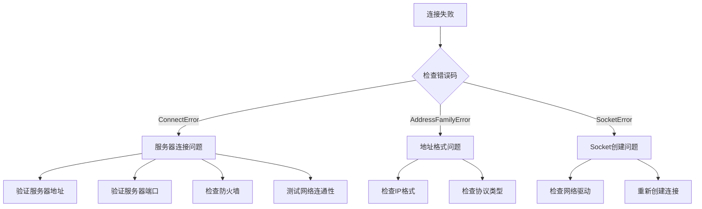

# よくある問題

このドキュメント汇总了使用 GameFrameX Network 网络库过程中常见的エラー問題、原因分析および解決策。

## 概要

GameFrameX Network 是 Unity 游戏引擎的长连接网络コンポーネント，提供 TCP 和 WebSocket 两种网络协议サポート。在实际使用过程中，開発者〜の可能性があります遇到连接失敗、メッセージ処理エラー、心跳超时等問題。このドキュメント旨在帮助開発者快速定位和解决这些常见問題。

## 常见エラー码与原因分析

### 网络エラー码详解

> Source: [NetworkErrorCode.cs](https://github.com/GameFrameX/com.gameframex.unity.network/blob/main/Runtime/Network/Base/NetworkErrorCode.cs#L80-L136)

| エラー码 | 説明 | 常见原因 |
|--------|------|----------|
| `Unknown` | 未知エラー | 未知例外或未捕获的エラー |
| `AddressFamilyError` | 地址族エラー | IP地址フォーマット不正确或协议不匹配 |
| `SocketError` | Socket エラー | 网络套接字作成或操作失敗 |
| `ConnectError` | 连接エラー | 服务器未开启、防火墙阻止、网络不通 |
| `SendError` | 发送エラー | 网络中断、缓冲区满、连接已閉じる |
| `ReceiveError` | 受信エラー | 网络中断、服务器主动閉じる连接 |
| `SerializeError` | シリアライズエラー | メッセージ对象シリアライズ失敗 |
| `DeserializePacketHeaderError` | パッケージ头解析エラー | 数据パッケージフォーマット不正确或被篡改 |
| `DeserializePacketError` | パッケージ体解析エラー | メッセージ体解析失敗 |
| `MissHeartBeatError` | 心跳丢失エラー | 长时间未收到服务器心跳响应 |
| `DisposeError` | リソース解放エラー | 重复解放或解放时机不当 |

### 网络连接閉じる原因

> Source: [NetworkErrorCode.cs](https://github.com/GameFrameX/com.gameframex.unity.network/blob/main/Runtime/Network/Base/NetworkErrorCode.cs#L38-L74)

| 閉じる原因 | 説明 | 処理お勧め |
|----------|------|----------|
| `Normal` | 正常閉じる | 无需処理，正常业务フロー |
| `Timeout` | 超时閉じる | 確認网络状况，调整超时設定 |
| `Dispose` | 主动解放 | 確認コード中是否有误呼び出し |
| `ConnectClose` | 连接断开 | 確認服务器ステータス和网络连接 |
| `ConnectAddressError` | 地址エラー | 確認服务器地址和端口設定 |
| `ConnectAddressExceptionError` | 地址例外 | 確認DNS解析和服务器可达性 |
| `MissHeartBeat` | 心跳丢失 | 见心跳問題章节 |

## 连接問題

### 无法连接到服务器

**症状**：呼び出し连接メソッド后，トリガー `NetworkError` イベント但未トリガー `NetworkConnected` イベント。

**考えられる原因**：

1. **服务器地址エラー**
   - IP 地址或域名填写エラー
   - 端口号不正确
   - 防火墙阻止连接

2. **服务器未启动**
   - 后端服务未运行
   - 服务端口未正确监听

3. **网络環境問題**
   - 客户端网络不通
   - 代理或VPN干扰

**排查ステップ**：



**解決策**：

1. 確認服务器地址和端口正确
2. 使用 ping 或 telnet テスト服务器可达性
3. 確認防火墙和安全组設定
4. 確認服务器端已正确启动并监听相应端口

### 连接成功后又立つまり断开

**症状**：トリガー `NetworkConnected` イベント后，很快トリガー `NetworkClosed` イベント。

**考えられる原因**：

1. 服务器主动断开连接（认证失敗等）
2. 客户端发送的数据フォーマットエラー
3. 心跳設定問題

**解決策**：

1. 確認服务器ログ，理解する断开原因
2. 検証メッセージ协议フォーマット是否与服务器一致
3. 確認心跳設定是否正确

## メッセージ処理問題

### メッセージ処理器登録失敗

**症状**：应用程序启动时抛出例外，或メッセージ无法被正确処理。

> Source: [MessageHandlerAttribute.cs](https://github.com/GameFrameX/com.gameframex.unity.network/blob/main/Runtime/Network/Base/MessageHandlerAttribute.cs#L47-L63)

**常见エラー**：

1. **メッセージタイプ未継承 MessageObject**

```csharp
// 错误示例
[MessageHandler(typeof(MyMessage), nameof(OnReceiveMyMessage))]
public class MyMessageHandler
{
    public void OnReceiveMyMessage(MyMessage msg) { }
}

// MyMessage 定义错误 - 未继承 MessageObject
public class MyMessage  // 错误：未继承 MessageObject
{
    public int Id;
}
```

```csharp
// 正确示例
public class MyMessage : MessageObject  // 必须继承 MessageObject
{
    public int Id;
}
```

2. **メッセージタイプ未実装インターフェース**

```csharp
// 错误示例
public class MyMessage : MessageObject  // 缺少接口实现
{
    public int Id;
}

// 正确示例 - 需要实现 INotifyMessage 或 IRequestMessage/IResponseMessage
public class MyMessage : MessageObject, INotifyMessage
{
    public int Id;
}
```

3. **処理メソッドパラメータエラー**

> Source: [MessageHandlerAttribute.cs](https://github.com/GameFrameX/com.gameframex.unity.network/blob/main/Runtime/Network/Base/MessageHandlerAttribute.cs#L136-L144)

```csharp
// 错误示例 1：参数个数不为1
[MessageHandler(typeof(MyMessage), nameof(OnReceiveMyMessage))]
public void OnReceiveMyMessage(MyMessage msg, string extra)  // 错误：参数个数为2
{
}

// 错误示例 2：参数类型不匹配
[MessageHandler(typeof(MyMessage), nameof(OnReceiveMyMessage))]
public void OnReceiveMyMessage(OtherMessage msg)  // 错误：参数类型不匹配
{
}

// 正确示例
[MessageHandler(typeof(MyMessage), nameof(OnReceiveMyMessage))]
public void OnReceiveMyMessage(MyMessage msg)  // 正确：参数个数为1，类型为 MyMessage
{
}
```

### メッセージ処理器メソッド未找到

**症状**：ランタイム抛出例外 `未找到方法：xxx.请确认是否注册成功`

> Source: [MessageHandlerAttribute.cs](https://github.com/GameFrameX/com.gameframex.unity.network/blob/main/Runtime/Network/Base/MessageHandlerAttribute.cs#L77-L80)

**排查ステップ**：

1. 確認メソッド名称与 `MessageHandlerAttribute` 中指定的一致
2. 確認メソッド访问修饰符正确（public 或 internal）
3. 確認メソッド在正确的类中
4. 確認使用了 `[MessageHandler]` 特性

```csharp
// 确保方法名正确匹配
[MessageHandler(typeof(LoginResponse), nameof(OnLoginResponse))]  // 方法名必须完全匹配
public class PlayerHandler : IMessageHandler
{
    // 方法名必须与 nameof 中的名称完全一致
    public void OnLoginResponse(LoginResponse msg) { }
}
```

### メッセージID重复冲突

**症状**：启动时抛出例外 `请求Id重复` 或 `返回Id重复`

> Source: [ProtoMessageIdHandler.cs](https://github.com/GameFrameX/com.gameframex.unity.network/blob/main/Runtime/Network/ProtoMessageIdHandler.cs#L140-L161)

**原因**：同一个メッセージタイプ使用了重复的メッセージID

**解決策**：確認メッセージタイプ定義，確認してください每个メッセージタイプ的ID唯一

```csharp
// 错误示例 - ID重复
[MessageTypeHandler(MessageId = 1001)]
public class LoginRequest : MessageObject, IRequestMessage { }

[MessageTypeHandler(MessageId = 1001)]  // 错误：重复的ID
public class Login2Request : MessageObject, IRequestMessage { }

// 正确示例 - ID唯一
[MessageTypeHandler(MessageId = 1001)]
public class LoginRequest : MessageObject, IRequestMessage { }

[MessageTypeHandler(MessageId = 1002)]  // 正确：使用不同的ID
public class Login2Request : MessageObject, IRequestMessage { }
```

### 心跳メッセージ重复

**症状**：启动时抛出例外 `心跳消息重复`

> Source: [ProtoMessageIdHandler.cs](https://github.com/GameFrameX/com.gameframex.unity.network/blob/main/Runtime/Network/ProtoMessageIdHandler.cs#L126-L129)

**原因**：多个メッセージタイプ被标记为心跳メッセージ

**解決策**：確認してください只有一个メッセージタイプ被标记为心跳メッセージ

## 心跳問題

### 心跳超时断开连接

**症状**：トリガー `NetworkMissHeartBeat` イベント后连接被閉じる

**考えられる原因**：

1. 网络延迟过高
2. 服务器心跳间隔設定与客户端不一致
3. 服务器负载过高未能及时响应心跳
4. 客户端进入后台时心跳暂停（もし未設定 `FocusHeartbeat`）

> Source: [NetworkComponent.cs](https://github.com/GameFrameX/com.gameframex.unity.network/blob/main/Runtime/Network/NetworkComponent.cs#L68-L91)

**解決策**：

1. 確認网络環境，最適化网络质量
2. 调整心跳超时設定，增加容忍度
3. もし游戏サポート后台运行，启用 `FocusHeartbeat` オプション
4. 在应用程序切换到后台时暂停心跳检测

```csharp
// 在 NetworkComponent 中启用焦点心跳
// 在 Unity 编辑器中: NetworkComponent -> Focus Send Heartbeat = true
// 或通过代码设置
networkChannel.SetEnableHeartbeat(true);
```

### 心跳メッセージ未被正确処理

**症状**：心跳正常发送但服务器未响应，或客户端收到心跳但未正确処理

**解決策**：

1. 確認心跳メッセージタイプ実装了 `IHeartBeatMessage` インターフェース
2. 確認心跳メッセージID与服务器约定一致
3. 確認心跳処理器実装

> Source: [DefaultPacketHeartBeatHandler.cs](https://github.com/GameFrameX/com.gameframex.unity.network/blob/main/Runtime/Network/Helper/DefaultPacketHeartBeatHandler.cs#L22-L25)

```csharp
// 心跳处理器需要正确实现
public class HeartBeatHandler : IPacketHeartBeatHandler
{
    public MessageObject Handler()
    {
        // 返回心跳消息对象，不应抛出 NotImplementedException
        return new HeartBeatMessage();
    }
}
```

## RPC 呼び出し問題

### RPC 超时

**症状**：RPC 呼び出し未在预期时间内收到响应

**考えられる原因**：

1. 网络延迟过高
2. 服务器処理超时
3. 网络连接不稳定

> Source: [NetworkManager.RpcState.cs](https://github.com/GameFrameX/com.gameframex.unity.network/blob/main/Runtime/Network/Network/NetworkManager.RpcState.cs#L64-L67)

**重要なヒント**：RPC 超时时间最小值为 3000 毫秒（3秒）

```csharp
// 错误示例 - 超时时间小于3000ms
var channel = networkManager.CreateNetworkChannel("game", helper, 1000);  // 错误：小于最小值

// 正确示例 - 超时时间大于等于3000ms
var channel = networkManager.CreateNetworkChannel("game", helper, 5000);  // 正确：5000ms
```

**解決策**：

1. 增加 RPC 超时时间設定
2. 最適化网络環境
3. 確認服务器响应时间

```csharp
// 在 NetworkComponent 中配置 RPC 超时
// 默认值: 5000ms (5秒)
// 范围: 3000ms - 50000ms
```

### RPC 响应未找到

**症状**：收到响应但无法匹配到对应的请求

**排查点**：

1. 確認请求メッセージ的 `UniqueId` 正确設定
2. 確認请求/响应メッセージID匹配
3. 確認响应メッセージタイプ是否与请求タイプ对应

## シリアライズ問題

### シリアライズ失敗

**症状**：发送メッセージ时トリガー `NetworkError` イベント，エラー码为 `SerializeError`

> Source: [NetworkManager.NetworkChannelBase.cs](https://github.com/GameFrameX/com.gameframex.unity.network/blob/main/Runtime/Network/Network/NetworkManager.NetworkChannelBase.cs#L867-L870)

**考えられる原因**：

1. メッセージ对象パッケージ含不可シリアライズ的フィールド
2. 自定義シリアライズ器実装エラー
3. メッセージ体过大超出缓冲区限制

**解決策**：

1. 確認メッセージ类的フィールドタイプ，確認してください都是可シリアライズ的
2. 検証自定義シリアライズ逻辑
3. 確認メッセージ大小限制

### 反シリアライズ失敗

**症状**：受信メッセージ时トリガー `NetworkError` イベント，エラー码为 `DeserializePacketError` 或 `DeserializePacketHeaderError`

**考えられる原因**：

1. 服务器发送的数据フォーマット与客户端预期不一致
2. 数据パッケージ被篡改或损坏
3. 客户端和服务端协议バージョン不匹配

**解決策**：

1. 確認服务端和客户端使用相同的メッセージ协议
2. 確認数据パッケージ完全な性
3. 確認してください协议バージョン一致

## プラットフォーム相关問題

### WebGL プラットフォーム连接問題

**症状**：在 WebGL プラットフォーム无法建立连接

**原因**：WebGL プラットフォーム只サポート WebSocket 协议，不サポート原生 TCP 连接

> Source: [NetworkManager.cs](https://github.com/GameFrameX/com.gameframex.unity.network/blob/main/Runtime/Network/Network/NetworkManager.cs#L212-L216)

**解決策**：

```csharp
// WebGL 平台会自动使用 WebSocket
// 如需强制使用 WebSocket，可添加以下宏定义
// Unity 菜单: GameFrameX -> Scripting Define Symbols -> Enable Force WebSocket
```

### エディタ中连接問題

**症状**：在 Unity エディタ中连接正常，但打パッケージ后无法连接

**考えられる原因**：

1. 打パッケージ后的プラットフォーム与エディタプラットフォーム不同
2. 缺少相应的アセンブリ定義
3. 网络权限未設定

**解決策**：

1. 確認目标プラットフォーム的网络权限設定
2. 確認相关アセンブリ已正确参照
3. テスト不同网络環境

## デバッグ技巧

### 启用网络ログ

> Source: [Editor/NetworkLogScriptingDefineSymbols.cs](https://github.com/GameFrameX/com.gameframex.unity.network/blob/main/Editor/NetworkLogScriptingDefineSymbols.cs)

通过メニュー启用网络デバッグログ：

```
GameFrameX -> Scripting Define Symbols -> Enable Network Send Log
GameFrameX -> Scripting Define Symbols -> Enable Network Receive Log
```

### イベント监听デバッグ

监听所有网络イベント进行デバッグ：

```csharp
private void Start()
{
    var networkManager = GameEntry.GetComponent<NetworkManager>();
    
    networkManager.NetworkConnected += OnNetworkConnected;
    networkManager.NetworkClosed += OnNetworkClosed;
    networkManager.NetworkError += OnNetworkError;
    networkManager.NetworkMissHeartBeat += OnNetworkMissHeartBeat;
}

private void OnNetworkConnected(object sender, NetworkConnectedEventArgs e)
{
    UnityEngine.Debug.Log($"连接成功: {e.NetworkChannel.Name}");
}

private void OnNetworkClosed(object sender, NetworkClosedEventArgs e)
{
    UnityEngine.Debug.Log($"连接关闭: {e.NetworkChannel.Name}, 原因: {e.Reason}, 错误码: {e.ErrorCode}");
}

private void OnNetworkError(object sender, NetworkErrorEventArgs e)
{
    UnityEngine.Debug.LogError($"网络错误: {e.ErrorCode}, Socket错误: {e.SocketErrorCode}, 消息: {e.ErrorMessage}");
}

private void OnNetworkMissHeartBeat(object sender, NetworkMissHeartBeatEventArgs e)
{
    UnityEngine.Debug.LogWarning($"心跳丢失: {e.MissCount}次");
}
```

### 忽略特定メッセージログ

> Source: [NetworkComponent.cs](https://github.com/GameFrameX/com.gameframex.unity.network/blob/main/Runtime/Network/NetworkComponent.cs#L73-L79)

对于高频メッセージ，〜できます設定忽略ログ打印：

```csharp
// 配置忽略发送日志的消息ID
networkChannel.SetIgnoreLogNetworkIds(new[] { 1001, 1002 }, new[] { 1003, 1004 });
```

## 常见エラー排查清单

| エラータイプ | 確認项 |
|----------|--------|
| 连接失敗 | 服务器地址、端口、防火墙、网络连通性 |
| 连接断开 | 心跳設定、网络质量、服务器ステータス |
| メッセージ処理 | メッセージタイプ継承、実装インターフェース、メソッド签名 |
| シリアライズ失敗 | フィールドタイプ、协议バージョン、数据完全な性 |
| RPC 超时 | 网络延迟、服务器响应、超时設定 |
| プラットフォーム問題 | 网络权限、协议サポート、アセンブリ参照 |

## 関連リンク

- [网络マネージャー](./4-core-concepts.1-network-manager)
- [网络频道](./4-core-concepts.2-network-channel)
- [メッセージタイプ](./4-core-concepts.3-message-types)
- [心跳机制](./5-heartbeat)
- [イベント系统](./6-events)
- [RPC 远程呼び出し](./8-rpc)
- [エディタ設定](./9-editor-configuration)
