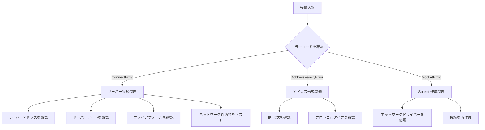

# トラブルシューティング

このドキュメントは GameFrameX Network ネットワークライブラリの使用過程でよくあるエラー、問題の分析と解決策を汇总します。

## 概要

GameFrameX Network は Unity ゲームエンジンのロングポーリングネットワークコンポーネントであり、TCP と WebSocket の2つのネットワークプロトコルをサポートしています。実際の使用 과정에서、開発者は接続失敗、メッセージ処理エラー、ハートビートタイムアウトなどの問題に直面する可能性があります。このドキュメントは開発者がこれらのよくある問題を迅速に特定して解決するのに役立つことを目的としています。

## よくあるエラーコードと原因分析

### ネットワークエラーコードの詳細

> Source: [NetworkErrorCode.cs](https://github.com/GameFrameX/com.gameframex.unity.network/blob/main/Runtime/Network/Base/NetworkErrorCode.cs#L80-L136)

| エラーコード | 説明 | よくある原因 |
|--------|------|----------|
| `Unknown` | 未知のエラー | 未知の例外またはキャッチされていないエラー |
| `AddressFamilyError` | アドレス族エラー | IP アドレス形式が正しくないまたはプロトコルが一致しない |
| `SocketError` | Socket エラー | ネットワークソケットの作成または操作に失敗 |
| `ConnectError` | 接続エラー | サーバーが起動していない、ファイアウォールが接続を阻止、ネットワークが通らない |
| `SendError` | 送信エラー | ネットワークが中断、バッファがいっぱいで、接続が閉じられた |
| `ReceiveError` | 受信エラー | ネットワークが中断、サーバーが能動的に接続を閉じた |
| `SerializeError` | シリアライズエラー | メッセージオブジェクトのシリアライズに失敗 |
| `DeserializePacketHeaderError` | パケットヘッダー解析エラー | データパケット形式が正しくないまたは改ざんされた |
| `DeserializePacketError` | パケットボディ解析エラー | メッセージボディの解析に失敗 |
| `MissHeartBeatError` | ハートビート丢失エラー | 長時間サーバーからのハートビートレスポンスを受信していない |
| `DisposeError` | リソース解放エラー | 重複して解放または解放タイミングが不適切 |

### ネットワーク接続关闭原因

> Source: [NetworkErrorCode.cs](https://github.com/GameFrameX/com.gameframex.unity.network/blob/main/Runtime/Network/Base/NetworkErrorCode.cs#L38-L74)

| 关闭原因 | 説明 | 処理提案 |
|----------|------|----------|
| `Normal` | 正常に閉じる | 処理不要、正常なビジネスプロセス |
| `Timeout` | タイムアウトで閉じる | ネットワーク状況を確認し、タイムアウト設定を調整 |
| `Dispose` | 能動的に解放 | コード内で誤って呼び出されたかどうかを確認 |
| `ConnectClose` | 接続が断开 | サーバー状態とネットワーク接続を確認 |
| `ConnectAddressError` | アドレスエラー | サーバーアドレスとポート設定を確認 |
| `ConnectAddressExceptionError` | アドレス例外 | DNS 解決とサーバー到達可能性を確認 |
| `MissHeartBeat` | ハートビート丢失 | ハートビート問題セクションを参照 |

## 接続問題

### サーバーに接続できない

**症状**：接続メソッドを呼び出した後、`NetworkError` イベントがトリガーされるが、`NetworkConnected` イベントがトリガーされない。

**考えられる原因**：

1. **サーバーアドレスが間違っている**
   - IP アドレスまたはドメイン名が間違っている
   - ポート番号が正しくない
   - ファイアウォールが接続を阻止

2. **サーバーが起動していない**
   - バックエンドサービスが実行されていない
   - サービスポートが正しく監視されていない

3. **ネットワーク環境の問題**
   - クライアントのネットワークが通らない
   - プロキシまたは VPN が干渉

**排查ステップ**：



**解決策**：

1. サーバーアドレスとポートが正しいことを確認
2. ping または telnet を使用してサーバーの到達可能性をテスト
3. ファイアウォールとセキュリティグループ設定を確認
4. サーバー端が正しく起動され、対応するポートで監視していることを確認

### 接続成功後すぐに断开

**症状**：`NetworkConnected` イベントがトリガーされた後、すぐに `NetworkClosed` イベントがトリガーされる。

**考えられる原因**：

1. サーバーが能動的に接続を断开（認証失敗など）
2. クライアントが送信したデータ形式が間違っている
3. ハートビット設定の問題

**解決策**：

1. サーバーサイドログを確認して、断开原因を理解
2. メッセージプロトコル形式がサーバーと一致することを確認
3. ハートビット設定が正しいかどうかを確認

## メッセージ処理問題

### メッセージハンドラーの登録に失敗

**症状**：アプリケーション起動時に例外がスローされるか、メッセージが正しく処理されない。

> Source: [MessageHandlerAttribute.cs](https://github.com/GameFrameX/com.gameframex.unity.network/blob/main/Runtime/Network/Base/MessageHandlerAttribute.cs#L47-L63)

**よくあるエラー**：

1. **メッセージタイプが MessageObject を継承していない**

```csharp
// 錯誤な例
[MessageHandler(typeof(MyMessage), nameof(OnReceiveMyMessage))]
public class MyMessageHandler
{
    public void OnReceiveMyMessage(MyMessage msg) { }
}

// MyMessage の定義が錯誤 - MessageObject を継承していない
public class MyMessage  // 錯誤：MessageObject を継承していない
{
    public int Id;
}
```

```csharp
// 正しい例
public class MyMessage : MessageObject  // MessageObject を継承する必要がある
{
    public int Id;
}
```

2. **メッセージタイプがインターフェースを実装していない**

```csharp
// 錯誤な例
public class MyMessage : MessageObject  // インターフェースの実装が欠けている
{
    public int Id;
}

// 正しい例 - INotifyMessage または IRequestMessage/IResponseMessage を実装する必要がある
public class MyMessage : MessageObject, INotifyMessage
{
    public int Id;
}
```

3. **処理メソッドのパラメータが錯誤**

> Source: [MessageHandlerAttribute.cs](https://github.com/GameFrameX/com.gameframex.unity.network/blob/main/Runtime/Network/Base/MessageHandlerAttribute.cs#L136-L144)

```csharp
// 錯誤な例 1：パラメータの個数が 1 ではない
[MessageHandler(typeof(MyMessage), nameof(OnReceiveMyMessage))]
public void OnReceiveMyMessage(MyMessage msg, string extra)  // 錯誤：パラメータの個数が 2
{
}

// 錯誤な例 2：パラメータタイプが一致しない
[MessageHandler(typeof(MyMessage), nameof(OnReceiveMyMessage))]
public void OnReceiveMyMessage(OtherMessage msg)  // 錯誤：パラメータタイプが一致しない
{
}

// 正しい例
[MessageHandler(typeof(MyMessage), nameof(OnReceiveMyMessage))]
public void OnReceiveMyMessage(MyMessage msg)  // 正しい：パラメータの個数が 1、タイプが MyMessage
{
}
```

### メッセージハンドラーメソッドが見つからない

**症状**：実行時に例外 `メソッドが見つかりません：xxx.登録が成功したかどうかを確認してください` がスローされる。

> Source: [MessageHandlerAttribute.cs](https://github.com/GameFrameX/com.gameframex.unity.network/blob/main/Runtime/Network/Base/MessageHandlerAttribute.cs#L77-L80)

**排查ステップ**：

1. メソッド名が `MessageHandlerAttribute` で指定されたものと一致することを確認
2. メソッドアクセス修飾子が正しいことを確認（public または internal）
3. メソッドが正しいクラスにあることを確認
4. `[MessageHandler]` 属性を使用したことを確認

```csharp
// メソッド名が nameof と完全に一致することを確認
[MessageHandler(typeof(LoginResponse), nameof(OnLoginResponse))]  // メソッド名は nameof 内の名前と完全に一致する必要がある
public class PlayerHandler : IMessageHandler
{
    // メソッド名は nameof の名前と完全に一致する必要がある
    public void OnLoginResponse(LoginResponse msg) { }
}
```

### メッセージIDが競合

**症状**：起動時に例外 `リクエストIDが競合` または `レスポンスIDが競合` がスローされる。

> Source: [ProtoMessageIdHandler.cs](https://github.com/GameFrameX/com.gameframex.unity.network/blob/main/Runtime/Network/ProtoMessageIdHandler.cs#L140-L161)

**原因**：同じメッセージタイプが競合するメッセージIDを使用しました。

**解決策**：メッセージタイプ定義を確認し、各メッセージタイプのIDが 유일であることを確認します。

```csharp
// 錯誤な例 - IDが競合
[MessageTypeHandler(MessageId = 1001)]
public class LoginRequest : MessageObject, IRequestMessage { }

[MessageTypeHandler(MessageId = 1001)]  // 錯誤：IDが競合
public class Login2Request : MessageObject, IRequestMessage { }

// 正しい例 - IDが唯一
[MessageTypeHandler(MessageId = 1001)]
public class LoginRequest : MessageObject, IRequestMessage { }

[MessageTypeHandler(MessageId = 1002)]  // 正しい：異なるIDを使用
public class Login2Request : MessageObject, IRequestMessage { }
```

### ハートビットメッセージが競合

**症状**：起動時に例外 `ハートビットメッセージが競合` がスローされる。

> Source: [ProtoMessageIdHandler.cs](https://github.com/GameFrameX/com.gameframex.unity.network/blob/main/Runtime/Network/ProtoMessageIdHandler.cs#L126-L129)

**原因**：複数のメッセージタイプがハートビットメッセージとしてマークされている。

**解決策**：ハートビットメッセージタイプは1つだけであることを確認します。

## ハートビット問題

### ハートビットタイムアウトで接続が断开

**症状**：`NetworkMissHeartBeat` イベントがトリガーされた後、接続が閉じられる。

**考えられる原因**：

1. ネットワーク遅延が高い
2. サーバーのハートビット間隔設定とクライアントが一致しない
3. サーバー负载が高く、ハートビットレスポンスが間に合わない
4. クライアントがバックグラウンドにあるときハートビットが一時停止（`FocusHeartbeat` を構成していない場合）

> Source: [NetworkComponent.cs](https://github.com/GameFrameX/com.gameframex.unity.network/blob/main/Runtime/Network/NetworkComponent.cs#L68-L91)

**解決策**：

1. ネットワーク環境を確認し、ネットワーク品質を最適化
2. ハートビットタイムアウト設定を調整して容忍度を高める
3. ゲームがバックグラウンド実行をサポートする場合、`FocusHeartbeat` オプションを有効にする
4. アプリケーションがバックグラウンドに切换的时候ハートビット検出を一時停止

```csharp
// NetworkComponent でフォーカスハートビートを有効にする
// Unity エディターで: NetworkComponent -> Focus Send Heartbeat = true
// またはコードで設定
networkChannel.SetEnableHeartbeat(true);
```

### ハートビットメッセージが正しく処理されない

**症状**：ハートビットは正常に送信されるが、サーバーがレスポンスしない、またはクライアントがハートビットを受信したが正しく処理しない。

**解決策**：

1. ハートビットメッセージタイプが `IHeartBeatMessage` インターフェースを実装することを確認
2. ハートビットメッセージIDがサーバーと合意されていることを確認
3. ハートビットハンドラーの実装を確認

> Source: [DefaultPacketHeartBeatHandler.cs](https://github.com/GameFrameX/com.gameframex.unity.network/blob/main/Runtime/Network/Helper/DefaultPacketHeartBeatHandler.cs#L22-L25)

```csharp
// ハートビットハンドラーは正しく実装する必要がある
public class HeartBeatHandler : IPacketHeartBeatHandler
{
    public MessageObject Handler()
    {
        // ハートビットメッセージオブジェクトを返す、NotImplementedException をスローしない
        return new HeartBeatMessage();
    }
}
```

## RPC 呼び出し問題

### RPC タイムアウト

**症状**：RPC 呼び出しが予想時間内にレスポンスを受信しない。

**考えられる原因**：

1. ネットワーク遅延が高い
2. サーバー処理がタイムアウト
3. ネットワーク接続が不安定

> Source: [NetworkManager.RpcState.cs](https://github.com/GameFrameX/com.gameframex.unity.network/blob/main/Runtime/Network/Network/NetworkManager.RpcState.cs#L64-L67)

**重要なヒント**：RPC タイムアウト時間の最小値は 3000 ミリ秒（3秒）です。

```csharp
// 錯誤な例 - タイムアウト時間が 3000ms より小さい
var channel = networkManager.CreateNetworkChannel("game", helper, 1000);  // 錯誤：最小値より小さい

// 正しい例 - タイムアウト時間が 3000ms 以上
var channel = networkManager.CreateNetworkChannel("game", helper, 5000);  // 正しい：5000ms
```

**解決策**：

1. RPC タイムアウト時間設定を増やす
2. ネットワーク環境を最適化
3. サーバーのレスポンス時間を確認

```csharp
// NetworkComponent で RPC タイムアウトを設定
// デフォルト値: 5000ms (5秒)
// 範囲: 3000ms - 50000ms
```

### RPC レスポンスが見つからない

**症状**：レスポンスを受信したが、対応するリクエストにマッチングできない。

**排查ポイント**：

1. リクエストメッセージの `UniqueId` が正しく設定されていることを確認
2. リクエスト/レスポンスメッセージIDが一致することを確認
3. レスポンスメッセージタイプがリクエストタイプに対応することを確認

## シリアライズ問題

### シリアライズに失敗

**症状**：メッセージを送信的时候 `NetworkError` イベントがトリガーされ、エラーコードが `SerializeError`。

> Source: [NetworkManager.NetworkChannelBase.cs](https://github.com/GameFrameX/com.gameframex.unity.network/blob/main/Runtime/Network/Network/NetworkManager.NetworkChannelBase.cs#L867-L870)

**考えられる原因**：

1. メッセージオブジェクトがシリアライズできないフィールドを含む
2. カスタムシリアライザーの実装が間違っている
3. メッセージボディが大きすぎてバッファ制限を超える

**解決策**：

1. メッセージクラスのフィールドタイプがすべてシリアライズ可能であることを確認
2. カスタムシリアライズロジックを検証
3. メッセージサイズ制限を確認

### デシリアライズに失敗

**症状**：メッセージを受信したとき `NetworkError` イベントがトリガーされ、エラーコードが `DeserializePacketError` または `DeserializePacketHeaderError`。

**考えられる原因**：

1. サーバーが送信したデータ形式がクライアントの期待と一致しない
2. データパケットが改ざんまたは破損している
3. クライアントとサーバーサイドのプロトコルバージョンが一致しない

**解決策**：

1. サーバー端とクライアント端が同じメッセージプロトコルを使用することを確認
2. データパケットの完全性を確認
3. プロトコルバージョンが一致することを確認

## プラットフォーム関連問題

### WebGL プラットフォームで接続問題

**症状**：WebGL プラットフォームで接続を確立できない。

**原因**：WebGL プラットフォームは元の TCP 接続をサポートせず、WebSocket プロトコルのみサポート。

> Source: [NetworkManager.cs](https://github.com/GameFrameX/com.gameframex.unity.network/blob/main/Runtime/Network/Network/NetworkManager.cs#L212-L216)

**解決策**：

```csharp
// WebGL プラットフォームでは自動的に WebSocket が使用されます
// WebSocket を強制的に使用する必要がある場合、以下のマクロ定義を追加できます
// Unity メニュー: GameFrameX -> Scripting Define Symbols -> Enable Force WebSocket
```

### エディターで接続問題

**症状**：Unity エディターでは接続が正常だが、パッケージ化した後接続できない。

**考えられる原因**：

1. パッケージ化した後のプラットフォームとエディタープラットフォームが異なる
2. 関連するアセンブリ定義が不足している
3. ネットワーク権限が構成されていない

**解決策**：

1. 対象プラットフォームのネットワーク権限設定を確認
2. 関連アセンブリが正しく参照されていることを確認
3. 異なるネットワーク環境でテスト

## デバッグテクニック

### ネットワークログを有効にする

> Source: [Editor/NetworkLogScriptingDefineSymbols.cs](https://github.com/GameFrameX/com.gameframex.unity.network/blob/main/Editor/NetworkLogScriptingDefineSymbols.cs)

メニューを通じてネットワークデバッグログを有効にします：

```
GameFrameX -> Scripting Define Symbols -> Enable Network Send Log
GameFrameX -> Scripting Define Symbols -> Enable Network Receive Log
```

### イベント監視デバッグ

すべてのネットワークイベントを監視してデバッグします：

```csharp
private void Start()
{
    var networkManager = GameEntry.GetComponent<NetworkManager>();
    
    networkManager.NetworkConnected += OnNetworkConnected;
    networkManager.NetworkClosed += OnNetworkClosed;
    networkManager.NetworkError += OnNetworkError;
    networkManager.NetworkMissHeartBeat += OnNetworkMissHeartBeat;
}

private void OnNetworkConnected(object sender, NetworkConnectedEventArgs e)
{
    UnityEngine.Debug.Log($"接続成功: {e.NetworkChannel.Name}");
}

private void OnNetworkClosed(object sender, NetworkClosedEventArgs e)
{
    UnityEngine.Debug.Log($"接続关闭: {e.NetworkChannel.Name}, 理由: {e.Reason}, エラーコード: {e.ErrorCode}");
}

private void OnNetworkError(object sender, NetworkErrorEventArgs e)
{
    UnityEngine.Debug.LogError($"ネットワークエラー: {e.ErrorCode}, Socketエラー: {e.SocketErrorCode}, メッセージ: {e.ErrorMessage}");
}

private void OnNetworkMissHeartBeat(object sender, NetworkMissHeartBeatEventArgs e)
{
    UnityEngine.Debug.LogWarning($"ハートビート丢失: {e.MissCount}回");
}
```

### 特定のメッセージログを無視する

> Source: [NetworkComponent.cs](https://github.com/GameFrameX/com.gameframex.unity.network/blob/main/Runtime/Network/NetworkComponent.cs#L73-L79)

高频メッセージの場合、ログ印刷を無視するように構成できます：

```csharp
// 送信ログを無視するメッセージIDを構成
networkChannel.SetIgnoreLogNetworkIds(new[] { 1001, 1002 }, new[] { 1003, 1004 });
```

## よくあるエラー排查チェックリスト

| エラータイプ | 確認項目 |
|----------|--------|
| 接続失敗 | サーバーアドレス、ポート、ファイアウォール、ネットワーク连通性 |
| 接続断开 | ハートビット設定、ネットワーク品質、サーバー状態 |
| メッセージ処理 | メッセージタイプ継承、インターフェース実装、メソッド署名 |
| シリアライズ失敗 | フィールドタイプ、プロトコルバージョン、データ完全性 |
| RPC タイムアウト | ネットワーク遅延、サーバー応答、タイムアウト設定 |
| プラットフォーム問題 | ネットワーク権限、プロトコルサポート、アセンブリ参照 |

## 関連リンク

- [ネットワークマネージャー](./4-core-concepts.1-network-manager)
- [ネットワークチャンネル](./4-core-concepts.2-network-channel)
- [メッセージタイプ](./4-core-concepts.3-message-types)
- [ハートビート](./5-heartbeat)
- [イベントシステム](./6-events)
- [RPC リモート呼び出し](./8-rpc)
- [エディター設定](./9-editor-configuration)
