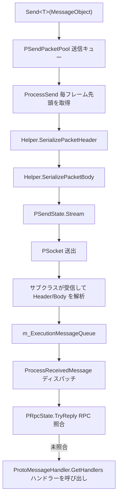

# 動作原理:ネットワークチャネルとデータ送受信フロー

ネットワークチャネル(`NetworkChannelBase`)は、`NetworkManager` 内で 1 つの接続の送受信を担当するユニットです。送信メッセージはまずキューに入り、毎フレーム `Update` によって駆動されてシリアライズ後に書き出されます。受信メッセージはサブクラス(TCP / WebSocket)で解析された後、スレッドセーフなキューに入り、メインスレッドによって RPC またはメッセージハンドラーへ一括ディスパッチされます。同時にハートビートおよびタイムアウト切断の仕組みも備えています。

## 全体のデータフロー



送信と受信の合流点はいずれも `NetworkChannelBase.Update` にあり、サブクラスの実装は具体的な Socket の送受信のみを担当します。

## チャネルのポーリング:Update の 1 フレームで行うこと

毎フレーム、送信、受信、ハートビート、メッセージのディスパッチ、RPC タイムアウトチェックを固定された順序で実行します:

```csharp
public virtual void Update(float elapseSeconds, float realElapseSeconds)
{
    if (PSocket == null || !PActive)
    {
        return;
    }

    ProcessSend();
    ProcessReceive();
    if (PSocket == null || !PActive)
    {
        return;
    }

    ProcessHeartBeat(realElapseSeconds);
    ProcessReceivedMessage();
    PRpcState.Update(elapseSeconds, realElapseSeconds);
}
```

参照: [NetworkManager.NetworkChannelBase.cs](https://github.com/GameFrameX/com.gameframex.unity.network/blob/main/Runtime/Network/Network/NetworkManager.NetworkChannelBase.cs#L378-L395)

## 送信フロー

1. `Send<T>` を呼び出して事前チェックを行った後、メッセージを送信キュー `PSendPacketPool`(`GameFrameworkLinkedList<MessageObject>`)に入れます。
2. 毎フレーム `ProcessSend` がキューの先頭からメッセージを取り出し、`ProcessSendMessage` を呼び出します。
3. `ProcessSendMessage` はチャネルヘルパー `INetworkChannelHelper.SerializePacketHeader` と `SerializePacketBody` を順に呼び出し、シリアライズ結果を `PSendState.Stream` に書き込み、その後 `ReferencePool.Release(messageObject)` でメッセージオブジェクトを回収します。
4. いずれかのステップでシリアライズに失敗すると、`NetworkChannelError`(`NetworkErrorCode.SerializeError`)をトリガーするか、`GameFrameworkException` をスローします。

```csharp
public void Send<T>(T messageObject) where T : MessageObject
{
    GameFrameworkGuard.NotNull(messageObject, nameof(messageObject));
    if (PSocket == null)
    {
        const string errorMessage = "You must connect first.";
        // ... NetworkChannelError をトリガーするか例外をスロー
    }

    if (!PActive)
    {
        const string errorMessage = "Socket is not active.";
        // ...
    }

    lock (PSendPacketPool)
    {
        PSendPacketPool.AddLast(messageObject);
    }
}
```

参照: [NetworkManager.NetworkChannelBase.cs](https://github.com/GameFrameX/com.gameframex.unity.network/blob/main/Runtime/Network/Network/NetworkManager.NetworkChannelBase.cs#L799-L830)

```csharp
protected virtual bool ProcessSendMessage(MessageObject messageObject)
{
    bool serializeResult = PNetworkChannelHelper.SerializePacketHeader(messageObject, PSendState.Stream, out var messageBodyBuffer);
    if (serializeResult)
    {
        serializeResult = PNetworkChannelHelper.SerializePacketBody(messageBodyBuffer, PSendState.Stream);
    }
    else
    {
        const string errorMessage = "Serialized packet failure.";
        throw new InvalidOperationException(errorMessage);
    }

    ReferencePool.Release(messageObject);
    return serializeResult;
}
```

参照: [NetworkManager.NetworkChannelBase.cs](https://github.com/GameFrameX/com.gameframex.unity.network/blob/main/Runtime/Network/Network/NetworkManager.NetworkChannelBase.cs#L867-L882)

## 受信フロー

受信したメッセージオブジェクトは `m_ExecutionMessageQueue`(`ConcurrentQueue<MessageObject>`、サブクラスが受信スレッドで書き込み)に入り、メインスレッドが毎フレームの `ProcessReceivedMessage` でディスパッチします:

1. まず `PRpcState.TryReply(messageObject)` を呼び出して未完了の RPC 呼び出しとの照合を試み、照合に成功した時点でこのメッセージの処理を終了します。
2. 照合に失敗した場合は、メッセージ型に対応する登録済みハンドラー `ProtoMessageHandler.GetHandlers(messageObject.GetType())` を取得し、それぞれ `SetMessageObject` した後に `Invoke()` します。
3. 個々のハンドラーがスローした例外は `Log.Fatal(e)` で記録され、同じフレーム内の他のメッセージのディスパッチは中断されません。

```csharp
private void ProcessReceivedMessage()
{
    while (m_ExecutionMessageQueue.TryDequeue(out var messageObject))
    {
        try
        {
            // RPC照合を実行
            var replySuccess = PRpcState.TryReply(messageObject);
            if (replySuccess)
            {
                continue;
            }

            // 通知メッセージを実行
            var handlers = ProtoMessageHandler.GetHandlers(messageObject.GetType());
            foreach (var handler in handlers)
            {
                handler.SetMessageObject(messageObject);
                try
                {
                    handler.Invoke();
                }
                catch (Exception e)
                {
                    Log.Fatal(e);
                }
            }
        }
        catch (Exception e)
        {
            Log.Fatal(e);
        }
    }
}
```

参照: [NetworkManager.NetworkChannelBase.cs](https://github.com/GameFrameX/com.gameframex.unity.network/blob/main/Runtime/Network/Network/NetworkManager.NetworkChannelBase.cs#L400-L433)

基底クラスの `ProcessReceive()` は現在空実装であり、実際のバイト受信と Header/Body の解析はサブクラス `SystemTcpNetworkChannel` と `WebSocketNetworkChannel` で行われ、解析成功後に `m_ExecutionMessageQueue` へまとめて書き込まれます。

## RPC 呼び出し

`Call<TResult>` は「送信 + レスポンス待機」の組み合わせです。まず `Send(messageObject)` でキューに入れ、その後 `await PRpcState.Call(messageObject, isIgnoreErrorCode)` で、同じチャネルの受信フロー内の `TryReply` がレスポンスと照合されるのを待ちます。戻り値の型が `TResult` と一致しない場合に以下がスローされます:

```
RPC response type mismatch. Expected: {0}, Actual: {1}
```

参照: [NetworkManager.NetworkChannelBase.cs](https://github.com/GameFrameX/com.gameframex.unity.network/blob/main/Runtime/Network/Network/NetworkManager.NetworkChannelBase.cs#L777-L791)

## ハートビートとタイムアウト切断

ハートビートのデフォルト値:間隔は `DefaultHeartBeatInterval = 30f` 秒、`DefaultMissHeartBeatCountByClose = 10` 回を超えてハートビートを喪失すると切断がトリガーされます。`RegisterHeartBeatHandler(IPacketHeartBeatHandler)` で上書きできます(handler の `HeartBeatInterval`、`MissHeartBeatCountByClose` が 0 より大きい場合に有効)。

`ProcessHeartBeat` の判定ロジック:

- `HeartBeatElapseSeconds` に `realElapseSeconds` を加算し、`PHeartBeatInterval` に達したら `sendHeartBeat` を立て、タイマーをゼロに戻して `MissHeartBeatCount++` とします。
- ハートビート送信(`PNetworkChannelHelper.SendHeartBeat()`)が成功し、かつそれ以前にハートビートを喪失していた場合、`NetworkChannelMissHeartBeat` コールバックをトリガーします。
- `MissHeartBeatCount > MissHeartBeatCountByClose` の場合、`Close(NetworkCloseReason.MissHeartBeat, (ushort)NetworkErrorCode.MissHeartBeatError)` を呼び出して能動的に切断します。

参照: [NetworkManager.NetworkChannelBase.cs](https://github.com/GameFrameX/com.gameframex.unity.network/blob/main/Runtime/Network/Network/NetworkManager.NetworkChannelBase.cs#L439-L488)

## 接続と切断

`Connect(Uri address, object userData = null)` は次の処理を行います:古い接続を閉じる → ホストを `IPEndPoint` に解決(解決失敗時は `NetworkCloseReason.ConnectAddressError` / `ConnectAddressExceptionError` で閉じ、`NetworkChannelError` をコールバック)→ `AddressFamily` に基づいて `PAddressFamily` を設定(IPv4/IPv6、未対応の型は `NetworkErrorCode.AddressFamilyError` を報告)→ `PSendState.Reset()`、`PReceiveState.PrepareForPacketHeader()` でパケットヘッダーの受信を準備します。

`Close(string reason, ushort code = 0)` はロック内で順に実行します:`PActive = false` → `PSocket.Shutdown()` / `Close()` → `NetworkChannelClosed` コールバックをトリガー → 送信キュー、ハートビート状態、RPC 状態、および `m_ExecutionMessageQueue` 内の未ディスパッチのメッセージをクリアします。

参照: [NetworkManager.NetworkChannelBase.cs](https://github.com/GameFrameX/com.gameframex.unity.network/blob/main/Runtime/Network/Network/NetworkManager.NetworkChannelBase.cs#L723-L768)

## チャネル上のハンドラー登録

| メソッド | ハンドラー | 役割 |
|------|--------|------|
| `RegisterHandler(IPacketSendHeaderHandler)` | 送信パケットヘッダー | メッセージヘッダーをシリアライズ |
| `RegisterHandler(IPacketSendBodyHandler)` | 送信パケットボディ | メッセージボディをシリアライズ |
| `RegisterHandler(IPacketReceiveHeaderHandler)` | 受信パケットヘッダー | メッセージヘッダーを解析 |
| `RegisterHandler(IPacketReceiveBodyHandler)` | 受信パケットボディ | メッセージボディを解析 |
| `RegisterHeartBeatHandler(IPacketHeartBeatHandler)` | ハートビート | ハートビートメッセージを定義し、間隔/切断回数を上書き |
| `RegisterMessageCompressHandler(IMessageCompressHandler)` | 圧縮 | 送信側のメッセージ圧縮、null を渡すと無効化 |
| `RegisterMessageDecompressHandler(IMessageDecompressHandler)` | 展開 | 受信側のメッセージ展開、null を渡すと無効化 |
| `SetRPCErrorHandler(EventHandler<MessageObject>)` | RPC | RPC エラーコールバック |

すべての登録メソッドの内部では `GameFrameworkGuard.NotNull` による検証が行われ、null を渡すと引数の例外がスローされます。デフォルト実装は [DefaultNetworkChannelHelper.cs](https://github.com/GameFrameX/com.gameframex.unity.network/blob/main/Runtime/Network/Helper/DefaultNetworkChannelHelper.cs#L13) を参照してください。

## よくあるエラー

| 症状 | 原因 | 対処 |
|------|------|------|
| `You must connect first.` | `Send` 時に `PSocket == null`、未接続 | 先に `Connect` を呼び出して接続成功を待つ |
| `Socket is not active.` | 接続は確立済みだが `PActive` が false | チャネルが閉じられた、またはエラーで非アクティブになっていないか確認 |
| `Serialized packet failure.` / `NetworkErrorCode.SerializeError` | Header または Body のシリアライズ失敗 | `INetworkChannelHelper` のシリアライズ実装とメッセージ定義を確認 |
| エラーなしでメッセージコールバックが届かない | レスポンスが `PRpcState.TryReply` に消費された、またはメッセージ型にハンドラーが未登録 | ハンドラーが `ProtoMessageHandler` で登録済みか確認 |
| 接続が能動的に切断され、エラーコードは `MissHeartBeatError` | ハートビート喪失回数が `MissHeartBeatCountByClose` を超過 | ハートビートハンドラーのパラメーターを調整するか、ネットワーク品質を調査 |

## 関連リンク

- チャネルのサブクラス実装:[NetworkManager.SystemTcpNetworkChannel.cs](https://github.com/GameFrameX/com.gameframex.unity.network/blob/main/Runtime/Network/Network/SystemSocket/NetworkManager.SystemTcpNetworkChannel.cs#L45)、[NetworkManager.WebSocketNetworkChannel.cs](https://github.com/GameFrameX/com.gameframex.unity.network/blob/main/Runtime/Network/Network/WebSocket/NetworkManager.WebSocketNetworkChannel.cs#L48)
- デフォルトのチャネルヘルパー:[DefaultNetworkChannelHelper.cs](https://github.com/GameFrameX/com.gameframex.unity.network/blob/main/Runtime/Network/Helper/DefaultNetworkChannelHelper.cs#L13)
- ハートビートハンドラーの基底クラス:[BasePacketHeartBeatHandler.cs](https://github.com/GameFrameX/com.gameframex.unity.network/blob/main/Runtime/Network/Helper/BasePacketHeartBeatHandler.cs)
- エラーコード定義:[NetworkErrorCode.cs](https://github.com/GameFrameX/com.gameframex.unity.network/blob/main/Runtime/Network/Base/NetworkErrorCode.cs)