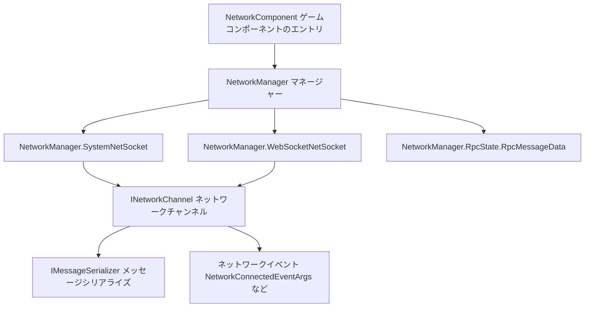

# 概要

Game Frame X Network は GameFrameX の**常時接続ネットワークコンポーネント**です(パッケージ名 `com.gameframex.unity.network`)。Unity プロジェクトに対して、TCP / WebSocket の常時接続、RPC 呼び出し、ハートビートによるキープアライブ、プラグイン可能なメッセージシリアライズ、ネットワークイベントなどの機能を提供し、Windows、macOS、Linux、Android、iOS、WebGL プラットフォームに対応しています。

## クイックスタート

### インストール

以下のいずれかの方法を選択してください(内容は公式中国語 README から抜粋):

1. Unity プロジェクトの `Packages/manifest.json` を編集し、`scopedRegistries` を追加して依存関係を宣言します:

```json
{
  "scopedRegistries": [
    {
      "name": "GameFrameX",
      "url": "https://gameframex.upm.alianblank.uk",
      "scopes": [
        "com.gameframex"
      ]
    }
  ],
  "dependencies": {
    "com.gameframex.unity.network": "2.6.6"
  }
}
```

Source: [README.zh-CN.md](https://github.com/GameFrameX/com.gameframex.unity.network/blob/main/README.zh-CN.md#L44-L59)

2. `manifest.json` の `dependencies` ノード直下に直接追加します:

```json
{
  "com.gameframex.unity.network": "https://github.com/gameframex/com.gameframex.unity.network.git"
}
```

Source: [README.zh-CN.md](https://github.com/GameFrameX/com.gameframex.unity.network/blob/main/README.zh-CN.md#L64-L69)

3. Unity の `Package Manager` で `Git URL` 方式によりリポジトリのアドレスを追加します:`https://github.com/gameframex/com.gameframex.unity.network.git`。
4. リポジトリを直接ダウンロードして Unity プロジェクトの `Packages` ディレクトリに配置すると、Unity が自動的に読み込んで認識します。

インストール完了後は、`scopedRegistries` を有効にするために Unity を再起動するか Package Manager を再読み込みする必要があります。`scopes` は `com.gameframex` で始まるパッケージにのみ有効です。

### 依存要件

| 依存パッケージ | バージョン |
|--------|------|
| `com.gameframex.unity` | 1.1.1 |
| `com.gameframex.unity.event` | 1.0.0 |

Source: [README.zh-CN.md](https://github.com/GameFrameX/com.gameframex.unity.network/blob/main/README.zh-CN.md#L97-L102)

### 主な機能

| 機能 | 説明 |
|------|------|
| 常時接続 | TCP(`SystemNetSocket`)と WebSocket(`WebSocketNetSocket`)の 2 種類の Socket 実装 |
| RPC 呼び出し | RPC 呼び出しメカニズムおよびタイムアウト処理(`RpcState` / `RpcMessageData`) |
| ハートビートパケット | ハートビートによるキープアライブ。アプリケーションのフォーカス取得/喪失時の送信設定に対応 |
| プラグイン可能なシリアライズ | `IMessageSerializer` インターフェース。2 段階の登録(グローバルデフォルト + チャンネル単位での上書き)に対応 |
| ネットワークチャンネル管理 | チャンネル単位での接続の作成と管理(`INetworkChannel`) |
| ネットワークイベント | 接続 / 切断 / エラー / ハートビート喪失などのイベントパラメータ(`NetworkConnectedEventArgs` など) |

Source: [README.zh-CN.md](https://github.com/GameFrameX/com.gameframex.unity.network/blob/main/README.zh-CN.md#L28-L36)

## 仕組みの概要

コンポーネントは `NetworkComponent`(Unity シーンにアタッチされる `GameFrameworkComponent`)を統一されたエントリポイントとし、内部では `NetworkManager` の複数の partial 実装(`SystemNetSocket` / `WebSocketNetSocket` / `RpcState`)に処理を委譲することで、さまざまなトランスポート層と RPC の状態管理を実現します:



- ソースコードのエントリ:[NetworkComponent.cs](https://github.com/GameFrameX/com.gameframex.unity.network/blob/main/Runtime/Network/NetworkComponent.cs#L45)(`public sealed class NetworkComponent : GameFrameworkComponent`)
- チャンネルインターフェース:[INetworkChannel.cs](https://github.com/GameFrameX/com.gameframex.unity.network/blob/main/Runtime/Network/Interface/INetworkChannel.cs#L42)(`public interface INetworkChannel`)
- チャンネルヘルパーインターフェース:[INetworkChannelHelper.cs](https://github.com/GameFrameX/com.gameframex.unity.network/blob/main/Runtime/Network/Interface/INetworkChannelHelper.cs#L39)(`public interface INetworkChannelHelper`)
- TCP 実装:[NetworkManager.SystemNetSocket.cs](https://github.com/GameFrameX/com.gameframex.unity.network/blob/main/Runtime/Network/Network/SystemSocket/NetworkManager.SystemNetSocket.cs#L7)
- WebSocket 実装:[NetworkManager.WebSocketNetSocket.cs](https://github.com/GameFrameX/com.gameframex.unity.network/blob/main/Runtime/Network/Network/WebSocket/NetworkManager.WebSocketNetSocket.cs#L10)
- RPC 状態:[NetworkManager.RpcState.RpcMessageData.cs](https://github.com/GameFrameX/com.gameframex.unity.network/blob/main/Runtime/Network/Network/NetworkManager.RpcState.RpcMessageData.cs#L7)

## 次のステップ

- 公式ドキュメント:https://gameframex.doc.alianblank.com
- 更新履歴:リポジトリの [CHANGELOG.md](https://github.com/GameFrameX/com.gameframex.unity.network/blob/main/CHANGELOG.md) を参照
- オープンソースライセンス:[LICENSE.md](https://github.com/GameFrameX/com.gameframex.unity.network/blob/main/LICENSE.md) を参照
- コミュニティサポート:QQ グループ 467608841 / 233840761([QR コード](https://qm.qq.com/cgi-bin/qm/qr?k=ikT9gA5m2sKwOyNOfYmQvSAPK_c3GmD6)から参加)