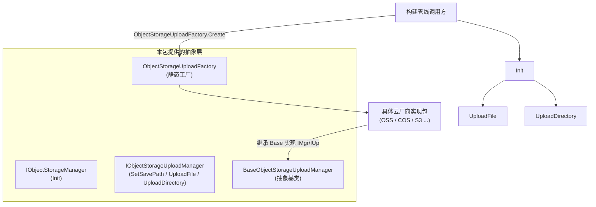

# オブジェクトストレージコンポーネントの概要

GameFrameX オブジェクトストレージコンポーネント（`com.gameframex.unity.objectstorage`）は、Unity プロジェクトに対して、ファイルとディレクトリをクラウドオブジェクトストレージサービスへアップロードするための基本的なインターフェースと抽象化を提供します。このコンポーネント自体は特定のクラウドベンダーに依存せず、`IObjectStorageManager` / `IObjectStorageUploadManager` インターフェースによって中核となる契約を定義しています。各サービスプロバイダー（OSS、COS、S3 など）の具体的な実装は、独立したパッケージとして提供されます。

## クイックスタート

1. **パッケージをインストール**。Unity プロジェクトのルートディレクトリにある `Packages/manifest.json` に依存関係を追加します（いずれかを選択）：
   - GameFrameX の scoped registry を使用する場合：
     ```json
     {
       "scopedRegistries": [
         {
           "name": "GameFrameX",
           "url": "https://gameframex.upm.alianblank.uk",
           "scopes": ["com.gameframex"]
         }
       ],
       "dependencies": {
         "com.gameframex.unity.objectstorage": "1.1.0"
       }
     }
     ```
   - Git URL の形式で直接追加する場合：
     ```json
     {
       "dependencies": {
         "com.gameframex.unity.objectstorage": "https://github.com/gameframex/com.gameframex.unity.objectstorage.git"
       }
     }
     ```
   - または、リポジトリを `Packages/` ディレクトリにクローンすると、Unity が自動的に読み込みます。

   Source: [README.md](https://github.com/GameFrameX/com.gameframex.unity.objectstorage/blob/main/README.md#L37-L68)

2. **対象プラットフォームがサポートされていることを確認**：

   | プラットフォーム | サポート |
   |------|------|
   | Windows | はい |
   | macOS | はい |
   | Linux | はい |
   | Android | はい |
   | iOS | はい |

   Source: [README.zh-CN.md](https://github.com/GameFrameX/com.gameframex.unity.objectstorage/blob/main/README.zh-CN.md#L69-L78)

3. **具体的な実装を選択**。このパッケージは抽象化とデフォルト実装のみを提供するため、OSS、COS、MinIO など、クラウドベンダーに対応する実装パッケージを別途導入する必要があります。

4. **アップロードインターフェースを呼び出す**。エディターのビルドパイプラインでは、`ObjectStorageUploadFactory` を使用してアップロードマネージャーインスタンスを取得し、`Init` で認証情報を設定した後、`UploadFile` / `UploadDirectory` を呼び出してリソースをアップロードします。

## 仕組みの概要



- `IObjectStorageManager` インターフェースは `Init` のみを公開し、認証情報とバケット名の設定を処理します。
- `IObjectStorageUploadManager` はこれを拡張し、`SetSavePath`、`UploadFile`、`UploadDirectory` を提供します。
- `BaseObjectStorageUploadManager` は抽象基底クラスです。サードパーティーの実装パッケージはこのクラスを継承し、`ObjectStorageUploadFactory` によってインスタンスが構築されます。

Source: [IObjectStorageManager.cs](https://github.com/GameFrameX/com.gameframex.unity.objectstorage/blob/main/Editor/IObjectStorageManager.cs#L1-L14)、[IObjectStorageUploadManager.cs](https://github.com/GameFrameX/com.gameframex.unity.objectstorage/blob/main/Editor/IObjectStorageUploadManager.cs#L1-L22)、[ObjectStorageUploadFactory.cs](https://github.com/GameFrameX/com.gameframex.unity.objectstorage/blob/main/Editor/ObjectStorageUploadFactory.cs)

## 次のステップ

- インターフェースの契約とシグネチャの詳細については、「[インターフェースリファレンス](reference/interfaces)」を参照してください。
- 具体的なクラウドベンダー実装の統合方法と初回アップロードの手順については、「[オブジェクトストレージへのファイルのアップロード方法](tasks/upload-file)」を参照してください。
- アップロード失敗時の調査方法については、「[アップロードに失敗した場合の対処方法](troubleshooting/upload-failures)」を参照してください。