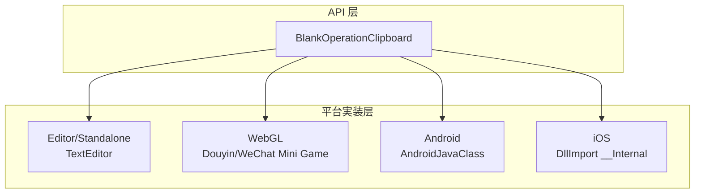
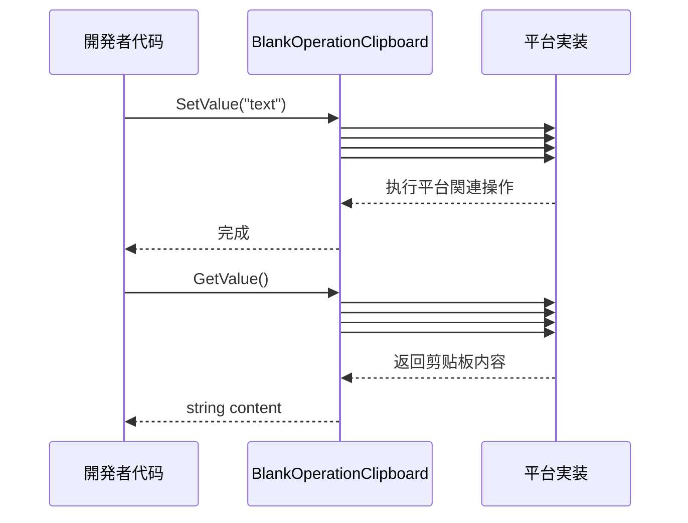

# 使用メソッド

本文档介绍如何使用 BlankOperationClipboard 插件进行剪贴板的读写操作。

## 概要

BlankOperationClipboard は跨平台的 Unity 剪贴板操作工具クラス，提供します简洁的 API インターフェースに使用取得和設定系统剪贴板内容。该库を通じて条件编译サポート多种平台，包括 Unity 编辑器、桌面平台、WebGL（抖音/微信小ゲーム）、Android 和 iOS。

**设计意图**：を通じて统一的静态メソッドインターフェース，開発者无需关心底层平台実装细节，即可完成跨平台的剪贴板操作。

## 架构



**架构説明**：
- **API 层**：提供统一的 `GetValue()` 和 `SetValue(string)` 静态メソッド
- **平台実装层**：を通じて C# 条件编译 (`#if`) 実装各平台的原生呼び出し

## コア API

### `GetValue(): string`

取得当前系统剪贴板中的文本内容。

**返回值**：剪贴板中的文本内容；如果剪贴板为空则返回空字符串。

> Source: [BlankOperationClipboard.cs](https://github.com/GameFrameX/com.gameframex.unity.operationclipboard/blob/main/Runtime/BlankOperationClipboard.cs#L31-L69)

### `SetValue(text: string): void`

将指定的文本内容設定到系统剪贴板。

**参数**：
- `text` (string)：要設定到剪贴板的文本内容

> Source: [BlankOperationClipboard.cs](https://github.com/GameFrameX/com.gameframex.unity.operationclipboard/blob/main/Runtime/BlankOperationClipboard.cs#L78-L106)

## 基本用法

### 读取剪贴板内容

```csharp
using UnityEngine;

public class ClipboardDemo : MonoBehaviour
{
    void ReadClipboard()
    {
        // 取得剪贴板内容
        string clipboardContent = BlankOperationClipboard.GetValue();
        Debug.Log("剪贴板内容: " + clipboardContent);
    }
}
```
> Source: [BlankOperationClipboardExample.cs](https://github.com/GameFrameX/com.gameframex.unity.operationclipboard/blob/main/Samples~/BlankOperationClipboardExample.cs#L46-L50)

### 写入剪贴板内容

```csharp
using UnityEngine;

public class ClipboardDemo : MonoBehaviour
{
    void WriteClipboard()
    {
        // 設定剪贴板内容
        string textToCopy = "要复制的文本内容";
        BlankOperationClipboard.SetValue(textToCopy);
        Debug.Log("已設定剪贴板内容");
    }
}
```
> Source: [BlankOperationClipboardExample.cs](https://github.com/GameFrameX/com.gameframex.unity.operationclipboard/blob/main/Samples~/BlankOperationClipboardExample.cs#L44-L47)

### 完整示例

以下は完整的 MonoBehaviour 示例，演示了如何结合读写操作：

```csharp
using UnityEngine;

public class BlankOperationClipboardExample : MonoBehaviour
{
    private string text = "AAAA";
    private string result = "";

    void OnGUI()
    {
        // 文本输入框
        text = GUILayout.TextField(text, GUILayout.Width(500), GUILayout.Height(100));

        // 設定剪贴板按钮
        if (GUILayout.Button("SetValue", GUILayout.Width(500), GUILayout.Height(100)))
        {
            BlankOperationClipboard.SetValue(text);
        }

        // 读取剪贴板按钮
        if (GUILayout.Button("GetValue", GUILayout.Width(500), GUILayout.Height(100)))
        {
            result = BlankOperationClipboard.GetValue();
        }

        // 显示读取结果
        GUILayout.Label(result);
    }
}
```
> Source: [BlankOperationClipboardExample.cs](https://github.com/GameFrameX/com.gameframex.unity.operationclipboard/blob/main/Samples~/BlankOperationClipboardExample.cs#L37-L53)

## 平台行为差异

不同平台取得剪贴板的行为存在差异：

| 平台 | 取得剪贴板 | 設定剪贴板 | 备注 |
|------|-----------|-----------|------|
| Unity Editor | 使用 TextEditor 模拟粘贴操作 | 使用 TextEditor 模拟复制操作 | 开发调试用 |
| Standalone | 使用 TextEditor 模拟粘贴操作 | 使用 TextEditor 模拟复制操作 | 桌面平台 |
| WebGL (抖音) | 异步回调取得 | 同步設定 | 必要开启 ENABLE_DOUYIN_MINI_GAME |
| WebGL (微信) | 异步回调取得 | 同步設定 | 必要开启 ENABLE_WECHAT_MINI_GAME |
| Android | 呼び出し Java メソッド GetClipBoard | 呼び出し Java メソッド SetClipBoard | 必要 Android 原生插件 |
| iOS | 呼び出し原生メソッド GetClipBoard | 呼び出し原生メソッド SetClipBoard | 必要 iOS 原生插件 |

> ⚠️ 注意：Android 和 iOS 平台必要配置对应的原生插件才能正常工作。详细配置お願いします参考 [平台配置](./5-platforms) 文档。

## コアフロー



## 注意事项

1. **空值处理**：`GetValue()` メソッド在剪贴板为空时返回空字符串 `""`，而不是 `null`。

2. **Unity 编辑器限制**：在编辑器中运行时，使用 `TextEditor` クラス模拟剪贴板操作，这意味着必要编辑器窗口处于激活ステータス才能正确取得焦点。

3. **WebGL 异步取得**：在 WebGL 平台（抖音/微信小ゲーム），取得剪贴板内容是异步操作，当前実装使用回调方法处理。

4. **平台原生插件**：Android 和 iOS 平台必要配合原生插件使用，必ず已正确配置平台関連的原生代码。

## 関連リンク

- [概述](./1-overview) - プロジェクト整体介绍
- [安装](./2-installation) - 安装指南
- [平台配置](./5-platforms) - 各平台详细配置説明
- [示例](./6-samples) - 更多使用示例
- [常见问题](./7-troubleshooting) - 常见问题与解決策
