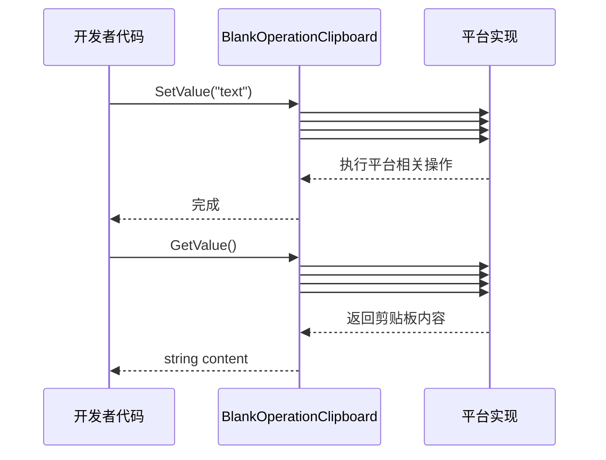

# 使用メソッド

このドキュメント介绍如何使用 BlankOperationClipboard プラグイン进行剪贴板的读写操作。

## 概要

BlankOperationClipboard は跨プラットフォーム的 Unity 剪贴板操作工具类，提供しますシンプル的 API インターフェース用于取得和設定系统剪贴板内容。该库通过条件コンパイルサポート多种プラットフォーム，含みます Unity エディタ、デスクトッププラットフォーム、WebGL（抖音/WeChatミニゲーム）、Android 和 iOS。

**設計意图**：通过統一された的静态メソッドインターフェース，開発者无需关心底层プラットフォーム実装细节，つまり可完成跨プラットフォーム的剪贴板操作。

## アーキテクチャ


**アーキテクチャ説明**：
- **API 层**：提供統一された的 `GetValue()` 和 `SetValue(string)` 静态メソッド
- **プラットフォーム実装層**：通过 C# 条件コンパイル (`#if`) 実装各プラットフォーム的原生呼び出し

## コア API

### `GetValue(): string`

取得当前系统剪贴板中的文本内容。

**戻り値**：剪贴板中的文本内容；もし剪贴板为空则返す空字符串。

> Source: [BlankOperationClipboard.cs](https://github.com/GameFrameX/com.gameframex.unity.operationclipboard/blob/main/Runtime/BlankOperationClipboard.cs#L31-L69)

### `SetValue(text: string): void`

将指定的文本内容設定到系统剪贴板。

**パラメータ**：
- `text` (string)：要設定到剪贴板的文本内容

> Source: [BlankOperationClipboard.cs](https://github.com/GameFrameX/com.gameframex.unity.operationclipboard/blob/main/Runtime/BlankOperationClipboard.cs#L78-L106)

## 基本用法

### 读取剪贴板内容

```csharp
using UnityEngine;

public class ClipboardDemo : MonoBehaviour
{
    void ReadClipboard()
    {
        // 获取剪贴板内容
        string clipboardContent = BlankOperationClipboard.GetValue();
        Debug.Log("剪贴板内容: " + clipboardContent);
    }
}
```
> Source: [BlankOperationClipboardExample.cs](https://github.com/GameFrameX/com.gameframex.unity.operationclipboard/blob/main/Samples~/BlankOperationClipboardExample.cs#L46-L50)

### 写入剪贴板内容

```csharp
using UnityEngine;

public class ClipboardDemo : MonoBehaviour
{
    void WriteClipboard()
    {
        // 设置剪贴板内容
        string textToCopy = "要复制的文本内容";
        BlankOperationClipboard.SetValue(textToCopy);
        Debug.Log("已设置剪贴板内容");
    }
}
```
> Source: [BlankOperationClipboardExample.cs](https://github.com/GameFrameX/com.gameframex.unity.operationclipboard/blob/main/Samples~/BlankOperationClipboardExample.cs#L44-L47)

### 完全な例

以下は完全な的 MonoBehaviour 例，演示了如何结合读写操作：

```csharp
using UnityEngine;

public class BlankOperationClipboardExample : MonoBehaviour
{
    private string text = "AAAA";
    private string result = "";

    void OnGUI()
    {
        // 文本输入框
        text = GUILayout.TextField(text, GUILayout.Width(500), GUILayout.Height(100));

        // 设置剪贴板按钮
        if (GUILayout.Button("SetValue", GUILayout.Width(500), GUILayout.Height(100)))
        {
            BlankOperationClipboard.SetValue(text);
        }

        // 读取剪贴板按钮
        if (GUILayout.Button("GetValue", GUILayout.Width(500), GUILayout.Height(100)))
        {
            result = BlankOperationClipboard.GetValue();
        }

        // 显示读取结果
        GUILayout.Label(result);
    }
}
```
> Source: [BlankOperationClipboardExample.cs](https://github.com/GameFrameX/com.gameframex.unity.operationclipboard/blob/main/Samples~/BlankOperationClipboardExample.cs#L37-L53)

## プラットフォーム行为差异

不同プラットフォーム取得剪贴板的行为存在差异：

| プラットフォーム | 取得剪贴板 | 設定剪贴板 | 备注 |
|------|-----------|-----------|------|
| Unity Editor | 使用 TextEditor 模拟粘贴操作 | 使用 TextEditor 模拟复制操作 | 开发デバッグ用 |
| Standalone | 使用 TextEditor 模拟粘贴操作 | 使用 TextEditor 模拟复制操作 | デスクトッププラットフォーム |
| WebGL (抖音) | 异步コールバック取得 | 同步設定 | 〜する必要があります开启 ENABLE_DOUYIN_MINI_GAME |
| WebGL (微信) | 异步コールバック取得 | 同步設定 | 〜する必要があります开启 ENABLE_WECHAT_MINI_GAME |
| Android | 呼び出し Java メソッド GetClipBoard | 呼び出し Java メソッド SetClipBoard | 〜する必要があります Android 原生プラグイン |
| iOS | 呼び出し原生メソッド GetClipBoard | 呼び出し原生メソッド SetClipBoard | 〜する必要があります iOS 原生プラグイン |

> ⚠️ 注意：Android 和 iOS プラットフォーム〜する必要があります設定对应的原生プラグイン才能正常工作。詳細設定请リファレンス [プラットフォーム設定](./5-platforms) ドキュメント。

## コアフロー



## 注意事项

1. **空值処理**：`GetValue()` メソッド在剪贴板为空时返す空字符串 `""`，而不是 `null`。

2. **Unity エディタ限制**：在エディタ中ランタイム，使用 `TextEditor` 类模拟剪贴板操作，这意味着〜する必要がありますエディタウィンドウ处于激活ステータス才能正确取得焦点。

3. **WebGL 异步取得**：在 WebGL プラットフォーム（抖音/WeChatミニゲーム），取得剪贴板内容是异步操作，当前実装使用コールバック方法処理。

4. **プラットフォーム原生プラグイン**：Android 和 iOS プラットフォーム〜する必要があります配合原生プラグイン使用，请確認してください已正确設定プラットフォーム相关的原生コード。

## 関連リンク

- [概要](./1-overview) - プロジェクト整体介绍
- [インストール](./2-installation) - インストールガイド
- [プラットフォーム設定](./5-platforms) - 各プラットフォーム詳細設定説明
- [例](./6-samples) - 更多使用例
- [常见問題](./7-troubleshooting) - 常见問題与解決策
