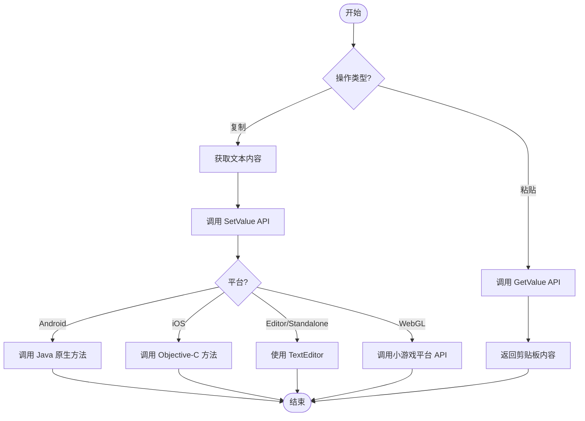

# 例

このドキュメント提供 `BlankOperationClipboard` 工具类的完全なコード例，演示如何在 Unity プロジェクト中実装剪贴板的读取和写入操作。

## 概要

`BlankOperationClipboard` は跨プラットフォーム的静态工具类，サポート在 Unity エディタ、デスクトッププラットフォーム、WebGL（ミニゲーム）、Android 和 iOS 等多种プラットフォーム上进行剪贴板操作。このクラス提供两个コア API：`GetValue()` 用于取得剪贴板内容，`SetValue(string text)` 用于設定剪贴板内容。

> 注意：完全な的 API メソッド签名和パラメータ説明请参照 [使用メソッド](./4-usage) ドキュメント。

## 基本使用例

以下例表示了最基本的剪贴板读写操作，通过 Unity 的旧版 OnGUI 系统実装シンプル的交互界面。

```csharp
using UnityEngine;

public class BlankOperationClipboardExample : MonoBehaviour
{
    private string text = "AAAA";
    private string result = "";
    void OnGUI()
    {
        // 文本输入框
        text = GUILayout.TextField(text, GUILayout.Width(500), GUILayout.Height(100));
        
        // 设置剪贴板按钮
        if (GUILayout.Button("SetValue", GUILayout.Width(500), GUILayout.Height(100)))
        {
            BlankOperationClipboard.SetValue(text);
        }
        
        // 获取剪贴板按钮
        if (GUILayout.Button("GetValue", GUILayout.Width(500), GUILayout.Height(100)))
        {
            result = BlankOperationClipboard.GetValue();
        }
        
        // 显示获取的结果
        GUILayout.Label(result);
    }
}
```

> Source: [BlankOperationClipboardExample.cs](https://github.com/GameFrameX/com.gameframex.unity.operationclipboard/blob/main/Samples~/BlankOperationClipboardExample.cs#L37-L54)

### コード解析

| コード段 | 説明 |
|--------|------|
| `private string text = "AAAA"` | 存储要复制到剪贴板的文本 |
| `private string result = ""` | 存储从剪贴板读取的結果 |
| `GUILayout.TextField()` | 作成可编辑的文本输入框 |
| `BlankOperationClipboard.SetValue(text)` | 将文本内容写入系统剪贴板 |
| `BlankOperationClipboard.GetValue()` | 从系统剪贴板读取文本内容 |
| `GUILayout.Label()` | 显示读取的文本結果 |

## 进阶使用例

### 在 UI ボタン中使用

以下例表示如何在现代 Unity UI 系统中使用剪贴板機能：

```csharp
using UnityEngine;
using UnityEngine.UI;

public class ClipboardUIExample : MonoBehaviour
{
    [SerializeField] private InputField inputField;
    [SerializeField] private Text resultText;
    [SerializeField] private Button copyButton;
    [SerializeField] private Button pasteButton;

    void Start()
    {
        // 绑定按钮点击事件
        copyButton.onClick.AddListener(OnCopyClicked);
        pasteButton.onClick.AddListener(OnPasteClicked);
    }

    private void OnCopyClicked()
    {
        // 获取输入框内容并复制到剪贴板
        string content = inputField.text;
        BlankOperationClipboard.SetValue(content);
        Debug.Log($"已复制到剪贴板: {content}");
    }

    private void OnPasteClicked()
    {
        // 从剪贴板读取内容并显示
        string content = BlankOperationClipboard.GetValue();
        resultText.text = content;
        Debug.Log($"从剪贴板读取: {content}");
    }
}
```

### 在 UGUI 中使用

对于使用 UGUI（Unity GUI）系统的プロジェクト，〜できます按以下方法集成：

```csharp
using UnityEngine;
using UnityEngine.UI;

public class UGUIClipboardExample : MonoBehaviour
{
    [SerializeField] private TMP_InputField inputField;
    [SerializeField] private TextMeshProUGUI resultText;

    public void CopyToClipboard()
    {
        if (string.IsNullOrEmpty(inputField.text))
        {
            Debug.LogWarning("输入框内容为空");
            return;
        }
        BlankOperationClipboard.SetValue(inputField.text);
    }

    public void PasteFromClipboard()
    {
        string clipboardContent = BlankOperationClipboard.GetValue();
        resultText.text = string.IsNullOrEmpty(clipboardContent) 
            ? "剪贴板为空" 
            : clipboardContent;
    }
}
```

### 在游戏逻辑中使用

以下例表示如何在游戏内购买或兑换码シーン中使用剪贴板機能：

```csharp
using UnityEngine;

public class GameClipboardExample : MonoBehaviour
{
    // 复制邀请链接
    public void CopyInviteLink(string playerId)
    {
        string inviteLink = $"https://game.example.com/invite/{playerId}";
        BlankOperationClipboard.SetValue(inviteLink);
        Debug.Log($"邀请链接已复制: {inviteLink}");
    }

    // 复制游戏内金币地址
    public void CopyWalletAddress(string walletAddress)
    {
        BlankOperationClipboard.SetValue(walletAddress);
        Debug.Log($"钱包地址已复制");
    }

    // 粘贴兑换码
    public string GetRedeemCode()
    {
        string code = BlankOperationClipboard.GetValue();
        // 简单验证兑换码格式
        if (string.IsNullOrWhiteSpace(code) || code.Length < 8)
        {
            Debug.LogWarning("无效的兑换码");
            return null;
        }
        return code.Trim().ToUpper();
    }
}
```

## 使用フロー图

以下フロー图表示了剪贴板操作的標準フロー：



## プラットフォーム注意事项

| プラットフォーム | 注意事项 |
|------|----------|
| Unity Editor | 使用 TextEditor 类，〜する必要がありますエディタウィンドウ处于激活ステータス |
| Standalone | 同样使用 TextEditor，〜する必要があります目标ウィンドウ获得焦点 |
| Android | 〜する必要があります在 Android 原生コード中実装 `GetClipBoard` 和 `SetClipBoard` メソッド |
| iOS | 〜する必要があります在 iOS 原生コード中実装对应的 C 函数 |
| WebGL (微信/抖音) | 〜する必要があります在ミニゲームプラットフォーム正确設定剪贴板权限 |

> 詳細的プラットフォーム特定設定説明请参照 [プラットフォーム設定](./5-platforms) ドキュメント。

## 常见エラー処理

### 処理空剪贴板

```csharp
public string SafeGetClipboardValue()
{
    string value = BlankOperationClipboard.GetValue();
    return value ?? string.Empty;
}
```

### 処理例外情况

```csharp
public bool TryCopyToClipboard(string text)
{
    try
    {
        if (string.IsNullOrEmpty(text))
        {
            Debug.LogWarning("复制的文本为空");
            return false;
        }
        BlankOperationClipboard.SetValue(text);
        return true;
    }
    catch (System.Exception ex)
    {
        Debug.LogError($"复制到剪贴板失败: {ex.Message}");
        return false;
    }
}
```

## 関連リンク

- [概要](./1-overview) - プロジェクト概要与機能介绍
- [インストール](./2-installation) - プラグインインストールガイド
- [使用メソッド](./4-usage) - API 詳細説明与パラメータ表
- [プラットフォーム設定](./5-platforms) - 各プラットフォーム具体設定メソッド
- [常见問題](./7-troubleshooting) - 常见問題与解決策
