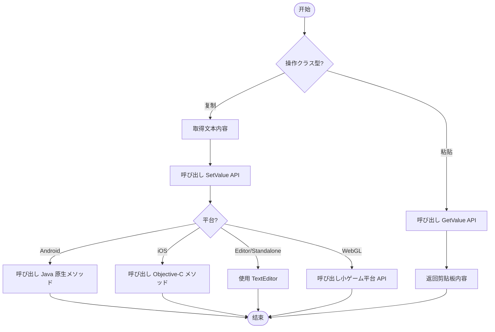

# 例

本文档提供 `BlankOperationClipboard` 工具クラス的完整代码示例，演示如何在 Unity プロジェクト中実装剪贴板的读取和写入操作。

## 概要

`BlankOperationClipboard` は跨平台的静态工具クラス，サポート在 Unity 编辑器、桌面平台、WebGL（小ゲーム）、Android 和 iOS 等多种平台上进行剪贴板操作。该クラス提供两个コア API：`GetValue()` に使用取得剪贴板内容，`SetValue(string text)` に使用設定剪贴板内容。

> 注意：完整的 API メソッド签名和参数説明お願いします参阅 [使用メソッド](./4-usage) 文档。

## 基础使用示例

以下示例展示了最基础的剪贴板读写操作，を通じて Unity 的旧版 OnGUI 系统実装简单的交互界面。

```csharp
using UnityEngine;

public class BlankOperationClipboardExample : MonoBehaviour
{
    private string text = "AAAA";
    private string result = "";
    void OnGUI()
    {
        // 文本输入框
        text = GUILayout.TextField(text, GUILayout.Width(500), GUILayout.Height(100));
        
        // 設定剪贴板按钮
        if (GUILayout.Button("SetValue", GUILayout.Width(500), GUILayout.Height(100)))
        {
            BlankOperationClipboard.SetValue(text);
        }
        
        // 取得剪贴板按钮
        if (GUILayout.Button("GetValue", GUILayout.Width(500), GUILayout.Height(100)))
        {
            result = BlankOperationClipboard.GetValue();
        }
        
        // 显示取得的结果
        GUILayout.Label(result);
    }
}
```

> Source: [BlankOperationClipboardExample.cs](https://github.com/GameFrameX/com.gameframex.unity.operationclipboard/blob/main/Samples~/BlankOperationClipboardExample.cs#L37-L54)

### 代码解析

| 代码段 | 説明 |
|--------|------|
| `private string text = "AAAA"` | 存储要复制到剪贴板的文本 |
| `private string result = ""` | 存储从剪贴板读取的结果 |
| `GUILayout.TextField()` | 作成可编辑的文本输入框 |
| `BlankOperationClipboard.SetValue(text)` | 将文本内容写入系统剪贴板 |
| `BlankOperationClipboard.GetValue()` | 从系统剪贴板读取文本内容 |
| `GUILayout.Label()` | 显示读取的文本结果 |

## 进阶使用示例

### 在 UI 按钮中使用

以下示例展示如何在现代 Unity UI 系统中使用剪贴板機能：

```csharp
using UnityEngine;
using UnityEngine.UI;

public class ClipboardUIExample : MonoBehaviour
{
    [SerializeField] private InputField inputField;
    [SerializeField] private Text resultText;
    [SerializeField] private Button copyButton;
    [SerializeField] private Button pasteButton;

    void Start()
    {
        // 绑定按钮点击イベント
        copyButton.onClick.AddListener(OnCopyClicked);
        pasteButton.onClick.AddListener(OnPasteClicked);
    }

    private void OnCopyClicked()
    {
        // 取得输入框内容并复制到剪贴板
        string content = inputField.text;
        BlankOperationClipboard.SetValue(content);
        Debug.Log($"已复制到剪贴板: {content}");
    }

    private void OnPasteClicked()
    {
        // 从剪贴板读取内容并显示
        string content = BlankOperationClipboard.GetValue();
        resultText.text = content;
        Debug.Log($"从剪贴板读取: {content}");
    }
}
```

### 在 UGUI 中使用

对于使用 UGUI（Unity GUI）系统的プロジェクト，可能按以下方法集成：

```csharp
using UnityEngine;
using UnityEngine.UI;

public class UGUIClipboardExample : MonoBehaviour
{
    [SerializeField] private TMP_InputField inputField;
    [SerializeField] private TextMeshProUGUI resultText;

    public void CopyToClipboard()
    {
        if (string.IsNullOrEmpty(inputField.text))
        {
            Debug.LogWarning("输入框内容为空");
            return;
        }
        BlankOperationClipboard.SetValue(inputField.text);
    }

    public void PasteFromClipboard()
    {
        string clipboardContent = BlankOperationClipboard.GetValue();
        resultText.text = string.IsNullOrEmpty(clipboardContent) 
            ? "剪贴板为空" 
            : clipboardContent;
    }
}
```

### 在ゲーム逻辑中使用

以下示例展示如何在ゲーム内购买或兑换码シーン中使用剪贴板機能：

```csharp
using UnityEngine;

public class GameClipboardExample : MonoBehaviour
{
    // 复制邀お願いします链接
    public void CopyInviteLink(string playerId)
    {
        string inviteLink = $"https://game.example.com/invite/{playerId}";
        BlankOperationClipboard.SetValue(inviteLink);
        Debug.Log($"邀お願いします链接已复制: {inviteLink}");
    }

    // 复制ゲーム内金币地址
    public void CopyWalletAddress(string walletAddress)
    {
        BlankOperationClipboard.SetValue(walletAddress);
        Debug.Log($"钱包地址已复制");
    }

    // 粘贴兑换码
    public string GetRedeemCode()
    {
        string code = BlankOperationClipboard.GetValue();
        // 简单验证兑换码格式
        if (string.IsNullOrWhiteSpace(code) || code.Length < 8)
        {
            Debug.LogWarning("无效的兑换码");
            return null;
        }
        return code.Trim().ToUpper();
    }
}
```

## 使用フロー图

以下フロー图展示了剪贴板操作的标准フロー：



## 平台注意事项

| 平台 | 注意事项 |
|------|----------|
| Unity Editor | 使用 TextEditor クラス，必要编辑器窗口处于激活ステータス |
| Standalone | 同样使用 TextEditor，必要目标窗口获得焦点 |
| Android | 必要在 Android 原生代码中実装 `GetClipBoard` 和 `SetClipBoard` メソッド |
| iOS | 必要在 iOS 原生代码中実装对应的 C 函数 |
| WebGL (微信/抖音) | 必要在小ゲーム平台正确配置剪贴板权限 |

> 详细的平台特定配置説明お願いします参阅 [平台配置](./5-platforms) 文档。

## 常见错误处理

### 处理空剪贴板

```csharp
public string SafeGetClipboardValue()
{
    string value = BlankOperationClipboard.GetValue();
    return value ?? string.Empty;
}
```

### 处理異常情况

```csharp
public bool TryCopyToClipboard(string text)
{
    try
    {
        if (string.IsNullOrEmpty(text))
        {
            Debug.LogWarning("复制的文本为空");
            return false;
        }
        BlankOperationClipboard.SetValue(text);
        return true;
    }
    catch (System.Exception ex)
    {
        Debug.LogError($"复制到剪贴板失败: {ex.Message}");
        return false;
    }
}
```

## 関連リンク

- [概述](./1-overview) - プロジェクト概述与機能介绍
- [安装](./2-installation) - 插件安装指南
- [使用メソッド](./4-usage) - API 詳細説明与参数表
- [平台配置](./5-platforms) - 各平台具体配置メソッド
- [常见问题](./7-troubleshooting) - 常见问题与解決策
