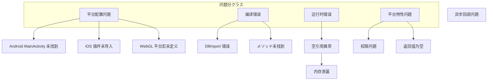

# 常见问题

本文档收集了使用 GameFrameX Unity Operation Clipboard 插件时常见的问题及其解決策。

## 概要

BlankOperationClipboard は跨平台的 Unity 粘贴板操作工具，サポート Editor、Standalone、WebGL（抖音小ゲーム、微信小ゲーム）、Android 和 iOS 平台。在实际使用过程中，開発者可能会遇到各种平台関連的问题。



## 平台配置问题

### Android 平台

#### 问题：Android MainActivity 未找到

**症状**: 在 Android 平台上呼び出し `GetValue()` 或 `SetValue()` 时，出现 `AndroidJavaException` 或メソッド找不到的错误。

**原因**: Android 原生実装依赖 `com.alianhome.operationclipboard.MainActivity` クラス，该クラス必要在 Android プロジェクト中存在。

**解決策**:

1. 确保 `Plugins/Android/com.alianhome.operationclipboard.jar` ファイル已正确放置在 Unity プロジェクト的 `Plugins/Android` ディレクトリ下

2. 在 Android プロジェクト中确保存在对应的 MainActivity クラス，実装以下メソッド：
   ```java
   public static String GetClipBoard() {
       ClipboardManager clipboard = (ClipboardManager) getSystemService(Context.CLIPBOARD_SERVICE);
       ClipData clip = clipboard.getPrimaryClip();
       if (clip != null && clip.getItemCount() > 0) {
           return clip.getItemAt(0).getText().toString();
       }
       return "";
   }
   
   public static void SetClipBoard(String text) {
       ClipboardManager clipboard = (ClipboardManager) getSystemService(Context.CLIPBOARD_SERVICE);
       ClipData clip = ClipData.newPlainText("text", text);
       clipboard.setPrimaryClip(clip);
   }
   ```

> Source: [BlankOperationClipboard.cs](https://github.com/GameFrameX/com.gameframex.unity.operationclipboard/blob/main/Runtime/BlankOperationClipboard.cs#L58-L62)

---

### iOS 平台

#### 问题：iOS 原生メソッド未找到

**症状**: 在 iOS 平台上呼び出しメソッド时出现 `EntryPointNotFoundException` 或クラス似错误。

**原因**: iOS 原生插件未正确导入或メソッド名不匹配。

**解決策**:

1. 确保 `Plugins/iOS/BlankOperationClipboard` ファイル夹已正确放置在プロジェクト中

2. 检查 Unity 的 iOS Build Settings 中是否包含了该插件

3. 验证メソッド名是否正确匹配：
   ```objc
   // iOS 原生メソッド名必須与 C# DllImport 声明一致
   extern "C" {
       char * GetClipBoard();    // 对应 C# 的 GetClipBoard
       void SetClipBoard(char * text);  // 对应 C# 的 SetClipBoard
   }
   ```

> Source: [BlankOperationClipboard.mm](https://github.com/GameFrameX/com.gameframex.unity.operationclipboard/blob/main/Plugins/iOS/BlankOperationClipboard/BlankOperationClipboard.mm#L8-L18)

---

### WebGL 平台

#### 问题：WebGL 平台剪贴板機能不工作

**症状**: 在 WebGL 平台打包后，剪贴板读取或写入機能无效。

**原因**: WebGL 平台必要启用对应小ゲーム的平台宏才能编译関連代码。

**解決策**:

1. 对于 **抖音小ゲーム**，必要在 Player Settings 中添加 `ENABLE_DOUYIN_MINI_GAME` 符号

2. 对于 **微信小ゲーム**，必要添加 `ENABLE_WECHAT_MINI_GAME` 符号

3. 添加手順：
   - 打开 Unity 菜单：`Edit > Project Settings > Player`
   - 切换到 WebGL 平台
   - 在 `Publishing Settings` > `Scripting Define Symbols` 中添加对应的宏

> Source: [BlankOperationClipboard.cs](https://github.com/GameFrameX/com.gameframex.unity.operationclipboard/blob/main/Runtime/BlankOperationClipboard.cs#L39-L57)

---

## 编译错误

### 问题：DllImport 导入失败

**症状**: 编译时出现 `DllImport` 関連的错误信息。

**原因**: Unity 在编译时无法找到对应的原生插件。

**解決策**:

1. 确认平台对应的 Plugins ファイル夹结构正确：
   ```
   Assets/
   └── Plugins/
       ├── Android/
       │   └── com.alianhome.operationclipboard.jar
       └── iOS/
           └── BlankOperationClipboard/
               ├── BlankOperationClipboard.h
               └── BlankOperationClipboard.mm
   ```

2. 检查ファイル扩展名是否正确（.jar 而不是 .zip）

3. 对于 iOS，确保 .mm 和 .h ファイル的 Metafile 也一同提交

---

## 运行时错误

### 问题：空引用異常 (NullReferenceException)

**症状**: 呼び出し `GetValue()` 或 `SetValue()` 时抛出空引用異常。

**原因**: 当前运行平台没有匹配到任何预处理器分支，导致执行到默认分支时出现问题。

**解決策**:

1. 确保在 Player Settings 中正确配置了目标平台

2. 对于不サポート的平台，代码有默认実装：
   ```csharp
   // 如果所有平台宏都不匹配，使用 GUIUtility.systemCopyBuffer
   return UnityEngine.GUIUtility.systemCopyBuffer ?? string.Empty;
   ```

3. 在呼び出し前添加平台检查：
   ```csharp
   #if UNITY_ANDROID || UNITY_IOS || UNITY_WEBGL
       string clipboardText = BlankOperationClipboard.GetValue();
   #else
       Debug.LogWarning("当前平台不サポート剪贴板操作");
   #endif
   ```

> Source: [BlankOperationClipboard.cs](https://github.com/GameFrameX/com.gameframex.unity.operationclipboard/blob/main/Runtime/BlankOperationClipboard.cs#L67-L68)

---

### 问题：iOS 内存泄漏

**症状**: 长时间在 iOS 平台上使用剪贴板機能可能导致内存持续增长。

**原因**: iOS 原生代码中 `GetClipBoard()` メソッド使用 `malloc()` 分配内存但未提供释放机制。

**问题代码**:
```objc
char * GetClipBoard(){
    UIPasteboard * pasteboard = [UIPasteboard generalPasteboard];			
    const char * a = [pasteboard.string UTF8String];
    char * b = (char*)malloc(strlen(a)+1);  // 分配内存
    strcpy(b, a);
    return b;  // 内存未被释放
}
```

**解決策**:

1. 方案一：在 C# 端使用 `Marshal.FreeHGlobal` 释放内存
   ```csharp
   [DllImport("__Internal")]
   private static extern IntPtr GetClipBoard();
   
   public static string GetValueSafe()
   {
       IntPtr ptr = GetClipBoard();
       try
       {
           return Marshal.PtrToStringAnsi(ptr);
       }
       finally
       {
           if (ptr != IntPtr.Zero)
               Marshal.FreeHGlobal(ptr);
       }
   }
   ```

2. 方案二：修改 iOS 原生代码使用autorelease
   ```objc
   char * GetClipBoard(){
       UIPasteboard * pasteboard = [UIPasteboard generalPasteboard];			
       NSString * str = pasteboard.string;
       const char * a = [str UTF8String];
       char * b = (char*)malloc(strlen(a)+1);
       strcpy(b, a);
       return b;
   }
   // 呼び出し方负责释放
   ```

> Source: [BlankOperationClipboard.mm](https://github.com/GameFrameX/com.gameframex.unity.operationclipboard/blob/main/Plugins/iOS/BlankOperationClipboard/BlankOperationClipboard.mm#L8-L14)

---

## 平台特性问题

### 问题：WebGL 异步回调导致返回值不正确

**症状**: 在抖音小ゲーム平台，使用 `GetValue()` 取得剪贴板内容返回空字符串。

**原因**: 抖音小ゲーム的剪贴板 API 是异步的，メソッド在异步回调完成前就返回了。

**问题代码**:
```csharp
// 当前実装
public static string GetValue()
{
    var content = string.Empty;
#if ENABLE_DOUYIN_MINI_GAME
    TTSDK.TT.GetClipboardData((b, text) =>
    {
        if (b)
        {
            content = text;  // 异步回调，回调完成时メソッド已返回
        }
    });
#endif
    return content;  // 总是返回空字符串
}
```

**解決策**:

使用回调函数模式替代同步返回：

```csharp
public delegate void ClipboardCallback(string text);

public static void GetValueAsync(ClipboardCallback callback)
{
#if ENABLE_DOUYIN_MINI_GAME
    TTSDK.TT.GetClipboardData((b, text) =>
    {
        callback?.Invoke(b ? text : string.Empty);
    });
#else
    callback?.Invoke(string.Empty);
#endif
}

// 使用示例
BlankOperationClipboard.GetValueAsync(result => 
{
    Debug.Log("剪贴板内容: " + result);
});
```

> Source: [BlankOperationClipboard.cs](https://github.com/GameFrameX/com.gameframex.unity.operationclipboard/blob/main/Runtime/BlankOperationClipboard.cs#L41-L49)

---

### 问题：剪贴板返回值为 null

**症状**: 呼び出し `GetValue()` 返回 `null` 而不是空字符串。

**原因**: 某些平台実装可能返回 null 而不是空字符串。

**解決策**:

使用 null 合并运算符确保返回值不为 null：

```csharp
public static string GetValue()
{
    string result = // 平台特定実装
    
    // 确保不会返回 null
    return result ?? string.Empty;
}
```

---

### 问题：Android 6.0+ 剪贴板权限

**症状**: 在 Android 6.0 及以上版本，剪贴板機能正常工作，但某些设备上可能出现权限问题。

**原因**: 从 Android 10 开始，对剪贴板访问有了更多限制。

**解決策**:

1. 对于大多数应用，剪贴板访问不必要特殊权限

2. 如果应用必要作为输入法使用，必要在 AndroidManifest.xml 中声明权限：
   ```xml
   <uses-permission android:name="android.permission.FOREGROUND_SERVICE" />
   ```

3. 对于后台服务访问剪贴板，建议使用 `ClipboardManager` 的前台服务

---

## 调试技巧

### 启用详细日志

在开发阶段，可能添加调试日志来帮助定位问题：

```csharp
public static string GetValue()
{
    string result;
    
#if UNITY_ANDROID
    using (AndroidJavaClass androidJavaClass = new AndroidJavaClass("com.alianhome.operationclipboard.MainActivity"))
    {
        result = androidJavaClass.CallStatic<string>("GetClipBoard");
        Debug.Log($"[Clipboard] Android GetValue result: {result}");
    }
#elif UNITY_IOS
    result = GetClipBoard();
    Debug.Log($"[Clipboard] iOS GetValue result: {result}");
#else
    result = UnityEngine.GUIUtility.systemCopyBuffer ?? string.Empty;
    Debug.Log($"[Clipboard] Default GetValue result: {result}");
#endif
    
    return result ?? string.Empty;
}
```

### 检查平台

使用预处理器指令确认当前编译的平台：

```csharp
void Start()
{
    Debug.Log($"当前编译平台: ");
#if UNITY_EDITOR
    Debug.Log(" - Unity Editor");
#endif
#if UNITY_ANDROID
    Debug.Log(" - Android");
#endif
#if UNITY_IOS
    Debug.Log(" - iOS");
#endif
#if UNITY_WEBGL
    Debug.Log(" - WebGL");
#if ENABLE_DOUYIN_MINI_GAME
    Debug.Log("   + 抖音小ゲーム");
#endif
#if ENABLE_WECHAT_MINI_GAME
    Debug.Log("   + 微信小ゲーム");
#endif
#endif
}
```

---

## 関連リンク

- [概述](./1-overview) - プロジェクト概述与機能介绍
- [安装](./2-installation) - 插件安装指南
- [使用メソッド](./4-usage) - API 使用説明
- [平台配置](./5-platforms) - 各平台详细配置説明
- [示例](./6-samples) - 代码示例与演示
