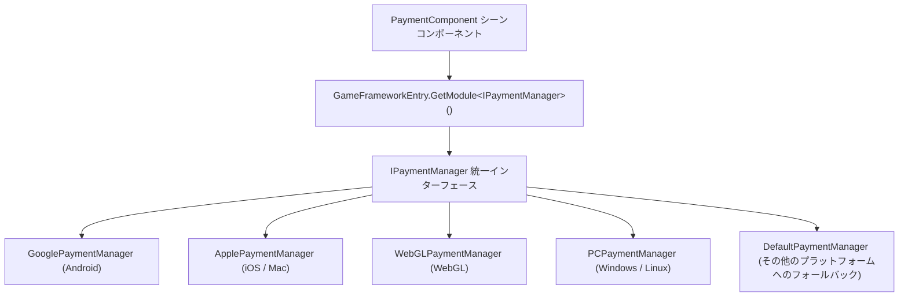

# インストールとクイックスタート

Game FrameX Payment は、アプリ内課金とサブスクリプションのための統一インターフェースを提供する Unity 決済パッケージで、Google Play と Apple App Store をサポートしています。このページでは、パッケージのインストール、コンポーネントのアタッチから初回購入の実行までを案内し、数分で完全なフローを確認できます。

## クイックスタート

### 1. 環境の確認

| 依存項目 | バージョン要件 |
|--------|----------|
| Unity | 2019.4 以上 |
| `com.gameframex.unity` | 2.5.1 |
| `com.gameframex.unity.payment.google` | 1.0.1 |

上記の依存関係宣言はパッケージの `package.json` に記載されており、インストール時に UPM によって自動的に解決されます。

Source: [package.json](https://github.com/GameFrameX/com.gameframex.unity.payment/blob/main/package.json#L24-L27)

### 2. パッケージのインストール

以下のいずれかの方法を選択してください：

**方法 1：scopedRegistries（推奨）**

Unity プロジェクトの `Packages/manifest.json` を編集し、`scopedRegistries` セクションを追加します：

```json
{
  "scopedRegistries": [
    {
      "name": "GameFrameX",
      "url": "https://gameframex.upm.alianblank.uk",
      "scopes": [
        "com.gameframex"
      ]
    }
  ],
  "dependencies": {
    "com.gameframex.unity.payment": "1.1.0"
  }
}
```

`scopes` はどのパッケージをこのレジストリ経由で解決するかを制御します。`com.gameframex` で始まるパッケージのみがこのレジストリから取得されます。

Source: [README.zh-CN.md](https://github.com/GameFrameX/com.gameframex.unity.payment/blob/main/README.zh-CN.md#L40-L58)

**方法 2：Git アドレスを直接記述**

`manifest.json` の `dependencies` ノード配下に追加します：

```json
{
   "com.gameframex.unity.payment": "https://github.com/gameframex/com.gameframex.unity.payment.git"
}
```

Source: [README.zh-CN.md](https://github.com/GameFrameX/com.gameframex.unity.payment/blob/main/README.zh-CN.md#L60-L65)

**方法 3：Package Manager で Git URL を追加**

Unity メニューの `Window > Package Manager > + > Add package from git URL` を開き、アドレスに `https://github.com/gameframex/com.gameframex.unity.payment.git` を入力します。

**方法 4：ソースコードを直接配置**

リポジトリを直接ダウンロードして Unity プロジェクトの `Packages` ディレクトリに配置すると、Unity が自動的にロードして認識します。

Source: [README.zh-CN.md](https://github.com/GameFrameX/com.gameframex.unity.payment/blob/main/README.zh-CN.md#L66-L67)

### 3. PaymentComponent コンポーネントをアタッチ

シーンに GameFrameX オブジェクトを作成し、`AddComponentMenu` のパス `GameFrameX/Payment` から `PaymentComponent` を追加します。コンポーネントには `[RequireComponent(typeof(GameFrameXPaymentCroppingHelper))]` が付いており、クロッピング補助コンポーネントが自動的に付属します。また、`[DisallowMultipleComponent]` により、同一オブジェクトには 1 つしかアタッチできません。

```csharp
[DisallowMultipleComponent]
[RequireComponent(typeof(GameFrameXPaymentCroppingHelper))]
[AddComponentMenu("GameFrameX/Payment")]
[UnityEngine.Scripting.Preserve]
public class PaymentComponent : GameFrameworkComponent
```

Source: [PaymentComponent.cs](https://github.com/GameFrameX/com.gameframex.unity.payment/blob/main/Runtime/PaymentComponent.cs#L17-L21)

コンポーネントは `Awake()` 内で、現在のコンパイルプラットフォームに応じて対応するプラットフォームの決済マネージャー実装を自動的に選択します（Android は Google、iOS/Mac は Apple、WebGL と PC はそれぞれ独立、その他のプラットフォームは `DefaultPaymentManager` にフォールバック）。手動で指定する必要はありません：

```csharp
#if UNITY_ANDROID
    componentType = m_componentAndroidType;
#elif UNITY_IOS
    componentType = m_componentIOSType;
#elif UNITY_WEBGL
    componentType = m_componentWebGLType;
#elif UNITY_STANDALONE_WIN || UNITY_STANDALONE_LINUX
    componentType = m_componentPCType;
#elif UNITY_STANDALONE_OSX
    componentType = m_componentMacType;
#else
    componentType = typeof(DefaultPaymentManager).FullName;
#endif
    ImplementationComponentType = Utility.Assembly.GetType(componentType);
    InterfaceComponentType = typeof(IPaymentManager);
    base.Awake();
```

Source: [PaymentComponent.cs](https://github.com/GameFrameX/com.gameframex.unity.payment/blob/main/Runtime/PaymentComponent.cs#L69-L86)

### 4. 決済システムの初期化

起動時に `Init` を呼び出します。パラメータ `isDebug` はサンドボックスモードを制御し、`isClientVerify` はクライアント側での購入検証を実行するかどうかを制御します：

```csharp
public void Init(bool isDebug = false, bool isClientVerify = true)
{
    _paymentManager.Init(isDebug, isClientVerify);
}
```

Source: [PaymentComponent.cs](https://github.com/GameFrameX/com.gameframex.unity.payment/blob/main/Runtime/PaymentComponent.cs#L102-L105)

商品情報を事前にロードする必要がある場合は、初期化の前に `SetPredefinedProductIds` を呼び出します（ソースコードのコメントで、このメソッドを `Initialize()` の前に呼び出すことが明示的に要求されています）。アプリ内課金商品 ID のリストとサブスクリプション商品 ID のリストをそれぞれ渡します：

```csharp
public void SetPredefinedProductIds(List<string> inAppProductIds, List<string> subsProductIds)
{
    _paymentManager.SetPredefinedProductIds(inAppProductIds, subsProductIds);
}
```

Source: [PaymentComponent.cs](https://github.com/GameFrameX/com.gameframex.unity.payment/blob/main/Runtime/PaymentComponent.cs#L122-L126)

初期化後は `IsReady()` を使用して決済システムの準備が完了しているかどうかを確認できます。戻り値は `bool` です。

### 5. イベントを購読して購入を開始

まず結果イベントを購読します（コンポーネントには 4 つのイベント `OnPurchaseSuccess`、`OnPurchaseFailed`、`OnQueryPurchasesResult`、`OnConsumePurchaseResult` が直接公開されており、いずれも `EventHandler<PaymentEventArgs>` 型です）。その後、推奨されている `Buy(PurchaseParams)` で購入を開始します：

```csharp
public void Buy(PurchaseParams purchaseParams)
```

Source: [PaymentComponent.cs](https://github.com/GameFrameX/com.gameframex.unity.payment/blob/main/Runtime/PaymentComponent.cs#L233-L238)

`PurchaseParams` には製品 ID や注文 ID などのパラメータが含まれ、各決済チャネルでは対応するサブクラスを使用してチャネル固有のパラメータを渡すことができます。なお、古い `BuyInApp` / `BuySubs` / `Buy(productId, productType, ...)` には `[Obsolete("请使用 Buy(PurchaseParams) 替代")]` のマークが付いているため、新しいコードでは使用しないでください。

Source: [PaymentComponent.cs](https://github.com/GameFrameX/com.gameframex.unity.payment/blob/main/Runtime/PaymentComponent.cs#L161-L163)

### 6. 購入結果の処理と消費

購入が成功したら、消耗型商品に対して `ConsumePurchase(purchaseToken)` を呼び出して購入を消費します（`purchaseToken` が空の場合、コンポーネントは `Log.Warning("Purchase token is null or empty.")` を出力してそのまま処理を終了します）。また、`QueryPurchases(PaymentProductType)` で購入履歴を照会できます。`productType` には `PaymentProductType` 列挙型の inapp または subs の値を指定します。

Source: [PaymentComponent.cs](https://github.com/GameFrameX/com.gameframex.unity.payment/blob/main/Runtime/PaymentComponent.cs#L133-L151)

## 動作原理の概要

コンポーネント自体は薄いラッパーにすぎません。`PaymentComponent` は `Awake()` 内でプラットフォームに応じて実装クラスの型を解決し、`GameFrameworkEntry.GetModule<IPaymentManager>()` を通じて現在のプラットフォームの決済マネージャーを取得し、以降のすべての API 呼び出しはそれに委譲されます。



## 次のステップ

- 完全な API 説明とパラメータの詳細：リポジトリの [README.zh-CN.md](https://github.com/GameFrameX/com.gameframex.unity.payment/blob/main/README.zh-CN.md#L68-L126) を参照してください
- バージョン履歴：[CHANGELOG.md](https://github.com/GameFrameX/com.gameframex.unity.payment/blob/main/CHANGELOG.md)
- 公式ドキュメントとサポート：[https://gameframex.doc.alianblank.com](https://gameframex.doc.alianblank.com)、QQ グループ 467608841 / 233840761