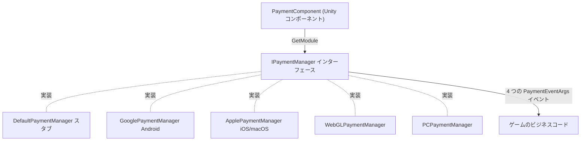

# 決済コンポーネントの概要

Payment 決済コンポーネントは GameFrameX の Unity アプリ内課金パッケージで、アプリ内購入とサブスクリプションのための統一インターフェース `IPaymentManager` を提供します。シーンに `PaymentComponent` を 1 つアタッチすれば、実行時にプラットフォームに応じて対応するチャネル実装が自動的に設定されます（Android → Google Play、iOS/macOS → App Store など）。ビジネスコードは同一の `Init` / `Buy` / `QueryPurchases` / `ConsumePurchase` API のみを扱います。

## クイックスタート

### 1. パッケージのインストール

Unity プロジェクトの `Packages/manifest.json` を編集し、いずれかの方法を選択します：

```json
{
  "scopedRegistries": [
    {
      "name": "GameFrameX",
      "url": "https://gameframex.upm.alianblank.uk",
      "scopes": [
        "com.gameframex"
      ]
    }
  ],
  "dependencies": {
    "com.gameframex.unity.payment": "1.1.0"
  }
}
```

`dependencies` の下に Git アドレス `https://github.com/gameframex/com.gameframex.unity.payment.git` を直接記述することも、Package Manager の Add package from git URL で追加することもできます。

出典：[README.zh-CN.md](https://github.com/GameFrameX/com.gameframex.unity.payment/blob/main/README.zh-CN.md#L40-L66)

### 2. 決済コンポーネントのアタッチ

Unity メニューから `GameFrameX/Payment` を選択してコンポーネントを追加すると、コードストリッピング用ヘルパーコンポーネントが強制的に付属します：

```csharp
[DisallowMultipleComponent]
[RequireComponent(typeof(GameFrameXPaymentCroppingHelper))]
[AddComponentMenu("GameFrameX/Payment")]
[UnityEngine.Scripting.Preserve]
public class PaymentComponent : GameFrameworkComponent
```

出典：[PaymentComponent.cs](https://github.com/GameFrameX/com.gameframex.unity.payment/blob/main/Runtime/PaymentComponent.cs#L17-L21)

コンポーネントは `Awake` 内でコンパイルプラットフォームに応じて実装タイプを選択し、フレームワークのモジュールシステムから `IPaymentManager` を取得します：

```csharp
#if UNITY_ANDROID
    componentType = m_componentAndroidType;
#elif UNITY_IOS
    componentType = m_componentIOSType;
#elif UNITY_WEBGL
    componentType = m_componentWebGLType;
#elif UNITY_STANDALONE_WIN || UNITY_STANDALONE_LINUX
    componentType = m_componentPCType;
#elif UNITY_STANDALONE_OSX
    componentType = m_componentMacType;
#else
    componentType = typeof(DefaultPaymentManager).FullName;
#endif
    ImplementationComponentType = Utility.Assembly.GetType(componentType);
    InterfaceComponentType = typeof(IPaymentManager);
    base.Awake();

    _paymentManager = GameFrameworkEntry.GetModule<IPaymentManager>();
```

出典：[PaymentComponent.cs](https://github.com/GameFrameX/com.gameframex.unity.payment/blob/main/Runtime/PaymentComponent.cs#L71-L93)

プラットフォームとデフォルト実装のマッピング：

| プラットフォーム | デフォルト実装タイプ（Inspector で変更可能） |
|------|------------------------------------|
| UNITY_ANDROID | `GameFrameX.Payment.Google.Runtime.GooglePaymentManager` |
| UNITY_IOS / UNITY_STANDALONE_OSX | `GameFrameX.Payment.Apple.Runtime.ApplePaymentManager` |
| UNITY_WEBGL | `GameFrameX.Payment.WebGL.Runtime.WebGLPaymentManager` |
| UNITY_STANDALONE_WIN / LINUX | `GameFrameX.Payment.PC.Runtime.PCPaymentManager` |
| その他のプラットフォーム | `DefaultPaymentManager`（スタブ、警告のみ） |

### 3. 初期化と商品のプリロード

`SetPredefinedProductIds` は商品キャッシュのプリロード用で、`Init` の前に呼び出す必要があります：

```csharp
public void Init(bool isDebug = false, bool isClientVerify = true)
{
    _paymentManager.Init(isDebug, isClientVerify);
}
```

出典：[PaymentComponent.cs](https://github.com/GameFrameX/com.gameframex.unity.payment/blob/main/Runtime/PaymentComponent.cs#L102-L105)

`isDebug` はサンドボックスモードのスイッチです。`isClientVerify` は購入をクライアント側で検証するかどうかを示し、サーバー検証（常時ネットワーク接続が前提）を採用する場合は `false` に設定する必要があります（注意：コンポーネント層の `Init` のデフォルト値は `true`、インターフェース `IPaymentManager.Init` のデフォルト値は `false` です）。

### 4. 決済イベントの購読

コンポーネントは 4 つのイベントを公開しており、現在のプラットフォームの `IPaymentManager` 実装へそのまま転送されます：`OnPurchaseSuccess`、`OnPurchaseFailed`、`OnQueryPurchasesResult`、`OnConsumePurchaseResult`。パラメータはいずれも `PaymentEventArgs` です。

出典：[PaymentComponent.cs](https://github.com/GameFrameX/com.gameframex.unity.payment/blob/main/Runtime/PaymentComponent.cs#L33-L64)

### 5. 購入の実行

`Buy(PurchaseParams)` の使用を推奨します。各チャネルでは対応するサブクラスを使ってチャネル固有のパラメータを渡します。コンポーネント層ではまずパラメータ検証が行われます（`ProductId`、`OrderId` が空の場合は `Log.Warning` を出力して即座に処理を返します）：

```csharp
public void Buy(PurchaseParams purchaseParams)
{
    if (purchaseParams == null)
    {
        Log.Warning("Purchase params is null.");
        return;
    }

    if (string.IsNullOrEmpty(purchaseParams.ProductId))
    {
        Log.Warning("Product ID is null or empty.");
        return;
    }

    if (string.IsNullOrEmpty(purchaseParams.OrderId))
    {
        Log.Warning("Order ID is null or empty.");
        return;
    }

    _paymentManager.Buy(purchaseParams);
}
```

出典：[PaymentComponent.cs](https://github.com/GameFrameX/com.gameframex.unity.payment/blob/main/Runtime/PaymentComponent.cs#L238-L259)

旧来の `BuyInApp` / `BuySubs` / `Buy(productId, productType, orderId, ...)` には `[Obsolete("请使用 Buy(PurchaseParams) 替代")]` のマークが付いており、引き続き使用できますが、新しいコードでの使用は推奨されません。

出典：[IPaymentManager.cs](https://github.com/GameFrameX/com.gameframex.unity.payment/blob/main/Runtime/IPaymentManager.cs#L79-L105)

### 6. 照会と消費

- `QueryPurchases(PaymentProductType productType)`：製品タイプごとに購入履歴を照会します。結果は `OnQueryPurchasesResult` イベントで通知されます。
- `ConsumePurchase(string purchaseToken)`：購入を消費します。`purchaseToken` が空の場合、`Purchase token is null or empty.` を出力して処理を返します。
- `IsReady()`：決済システムの初期化が完了しているかどうか。購入前にチェックすることをお勧めします。

出典：[PaymentComponent.cs](https://github.com/GameFrameX/com.gameframex.unity.payment/blob/main/Runtime/PaymentComponent.cs#L112-L152)

## 動作原理の概要

`PaymentComponent` はプラットフォームのルーティングとパラメータ検証のみを行い、実際の決済ロジックは各チャネルの `IPaymentManager` 実装の中にあります。`DefaultPaymentManager` は空のスタブで、そのメソッドを呼び出しても "You are using DefaultPaymentManager which is a stub. Please integrate a channel-specific implementation (e.g. Google, Apple)." というメッセージが出力されるだけです。



出典：[PaymentComponent.cs](https://github.com/GameFrameX/com.gameframex.unity.payment/blob/main/Runtime/PaymentComponent.cs#L23-L28)、[DefaultPaymentManager.cs](https://github.com/GameFrameX/com.gameframex.unity.payment/blob/main/Runtime/DefaultPaymentManager.cs#L17-L27)

## 次のステップ

- インターフェースの契約とイベント定義：[IPaymentManager.cs](https://github.com/GameFrameX/com.gameframex.unity.payment/blob/main/Runtime/IPaymentManager.cs#L16-L113)
- コンポーネント層の公開 API と検証ロジックのすべて：[PaymentComponent.cs](https://github.com/GameFrameX/com.gameframex.unity.payment/blob/main/Runtime/PaymentComponent.cs)
- Editor での Inspector カスタマイズ：[PaymentComponentInspector.cs](https://github.com/GameFrameX/com.gameframex.unity.payment/blob/main/Editor/PaymentComponentInspector.cs)
- バージョン履歴：[CHANGELOG.md](https://github.com/GameFrameX/com.gameframex.unity.payment/blob/main/CHANGELOG.md)
- 公式ドキュメントサイト：<https://gameframex.doc.alianblank.com>