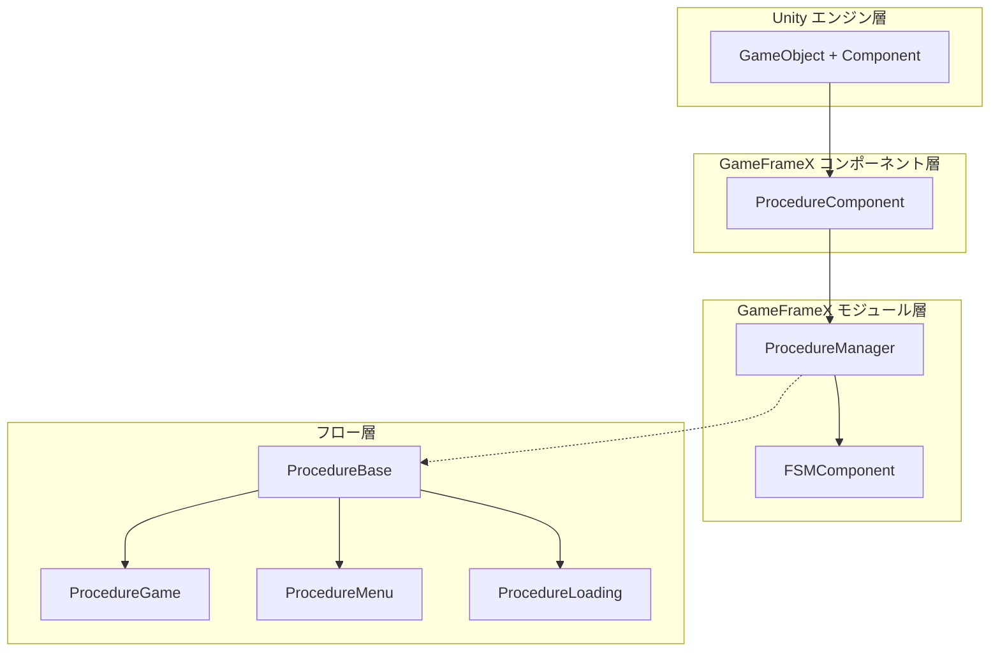
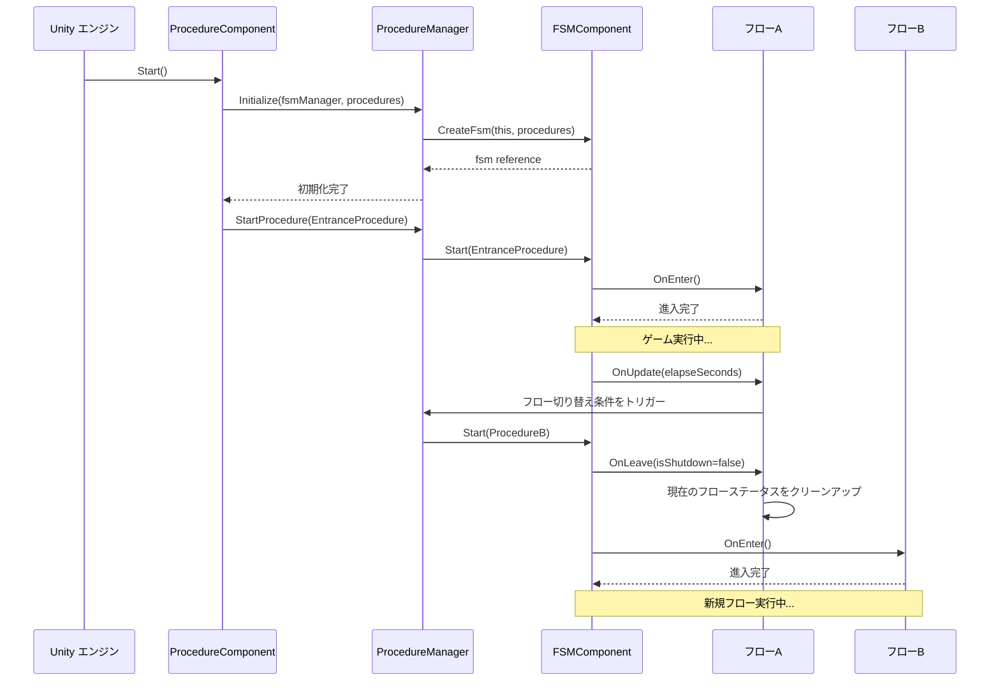

# 機能特性

GameFrameX Procedure フロー管理コンポーネントは、Unity ゲームに完全なゲームフローステータス管理ソリューションを提供し、有限状態機械（FSM）を介してゲームの各段階を管理することをサポートします。

## 概要

Procedure フロー管理コンポーネントは、GameFrameX フレームワークのコアモジュールの1つであり、ゲームのビジネスプロセスとステータス切り替えを管理するために特化しています。このコンポーネントは有限状態機械（FSM）に基づいて設計されており、開発者はゲームを起動フロー、ローディングフロー、メニュースフロー、ゲームフロー、一時停止フロー、終了フローなどの複数の独立したフロー段階に分割できます。

各フローは独立したステータスであり、完全なライフサイクル管理を持っています：初期化、進入、更新、離脱、破棄などの段階を含みます。この設計により、ゲームロジックがよりモジュール化され、保守と拡張が容易になり、チーム協力に明確な分離境界を提供します。

## コア機能

### フローステータス管理

コンポーネントは完全なフローステータス管理機能を提供し、ゲーム実行時に異なるフローステータスを動的に切り替えることをサポートします。開発者はシンプルな API 呼び出しにより、ローディング画面からゲームメニュース、そして具体的なゲームプレイへのスムーズな遷移を実現できます。フローマネージャーはすべての利用可能なフローの参照を維持し、現在のフローのクエリやフローの持続時間の取得などの実用的な機能を提供します。

```csharp
// 指定されたフローが存在するかどうかを確認
bool hasProcedure = procedureComponent.HasProcedure<ProcedureGame>();

// 現在実行中のフローを取得
ProcedureBase current = procedureComponent.CurrentProcedure;

// 現在のフローが継続している時間を取得
float elapsedTime = procedureComponent.CurrentProcedureTime;
```

> Source: [ProcedureComponent.cs](https://github.com/GameFrameX/com.gameframex.unity.procedure/blob/main/Runtime/Procedure/ProcedureComponent.cs#L114-L147)

### 自動フロー初期化

コンポーネントはゲーム起動時にすべてのフローの作成と初期化を自動的に完了します。開発者は Unity エディターで、利用可能なフローの型を構成するだけで済み、コンポーネントはリフレクション機構を自動的に使用してフローインスタンスを作成し、ゲームフレームのロード完了後にエントリーポイントフローを自動的に開始します。この設計により、ゲーム起動ロジックが大幅に簡素化され、開発者はビジネスロジックの実装に集中できます。

```csharp
// ProcedureComponent は Start メソッドでフローの初期化を自動的に完了
private IEnumerator Start()
{
    ProcedureBase[] procedures = new ProcedureBase[m_AvailableProcedureTypeNames.Length];
    for (int i = 0; i < m_AvailableProcedureTypeNames.Length; i++)
    {
        Type procedureType = Utility.Assembly.GetType(m_AvailableProcedureTypeNames[i]);
        procedures[i] = (ProcedureBase)Activator.CreateInstance(procedureType);
    }
    m_ProcedureManager.Initialize(GameFrameworkEntry.GetModule<IFsmManager>(), procedures);
    yield return new WaitForEndOfFrame();
    m_ProcedureManager.StartProcedure(m_EntranceProcedure.GetType());
}
```

> Source: [ProcedureComponent.cs](https://github.com/GameFrameX/com.gameframex.unity.procedure/blob/main/Runtime/Procedure/ProcedureComponent.cs#L71-L107)

### フローライフサイクルフック

各カスタムフローは、基底クラスメソッドをオーバーライドして特定のビジネスロジックを実装できます。コンポーネントは完全なライフサイクルフックを提供しており、フローの作成から破棄までの全過程をカバーします。これらのフックには：`OnInit`（初期化時に呼び出し）、`OnEnter`（フローに進入時に呼び出し）、`OnUpdate`（フレーム更新時に呼び出し）、`OnFixedUpdate`（固定フレームレート更新時に呼び出し）、`OnLeave`（フローを離れるときに呼び出し）、`OnDestroy`（フローが破棄されるときに呼び出し）が含まれます。

```csharp
public abstract class ProcedureBase : FsmState<IProcedureManager>
{
    // ステータスの初期化時に呼び出し
    protected override void OnInit(IFsm<IProcedureManager> procedureOwner) { }

    // ステータスに進入時に呼び出し
    protected override void OnEnter(IFsm<IProcedureManager> procedureOwner) { }

    // ステータスのポーリング時に呼び出し
    protected override void OnUpdate(IFsm<IProcedureManager> procedureOwner, float elapseSeconds, float realElapseSeconds) { }

    // 固定フレームレートの更新時に呼び出し
    protected override void OnFixedUpdate(IFsm<IProcedureManager> procedureOwner, float elapseSeconds, float realElapseSeconds) { }

    // ステータスを離れるときに呼び出し
    protected override void OnLeave(IFsm<IProcedureManager> procedureOwner, bool isShutdown) { }

    // ステータスが破棄されるときに呼び出し
    protected override void OnDestroy(IFsm<IProcedureManager> procedureOwner) { }
}
```

> Source: [ProcedureBase.cs](https://github.com/GameFrameX/com.gameframex.unity.procedure/blob/main/Runtime/Procedure/ProcedureBase.cs#L16-L76)

### フロー	queryと取得

柔軟なプログラムクエリインターフェースを提供しており、型または型名を使用してフローが存在するかどうかを確認し、特定のフローインスタンス参照を取得することをサポートします。これらの機能により、ゲームコードは実行時にフローシステムと動的に対話できます。例えば、フローではないクラスで現在のゲームステータスを確認したり、特定のフローを取得してデータ交換を行ったりできます。

```csharp
// ジェネリックメソッドでフローを確認して取得
if (procedureComponent.HasProcedure<ProcedureMenu>())
{
    var menuProcedure = procedureComponent.GetProcedure<ProcedureMenu>();
}

// Type オブジェクトでフローを確認して取得
Type menuType = typeof(ProcedureMenu);
if (procedureComponent.HasProcedure(menuType))
{
    var menuProcedure = (ProcedureMenu)procedureComponent.GetProcedure(menuType);
}
```

> Source: [IProcedureManager.cs](https://github.com/GameFrameX/com.gameframex.unity.procedure/blob/main/Runtime/Procedure/IProcedureManager.cs#L47-L73)

### エディター可視化構成

コンポーネントはカスタム Unity エディターインスペクターを提供しており、Inspector パネルで直感的に利用可能なフローリストとエントリーポイントフローを構成することをサポートします。チェックボックスを通じて、フローシステムに含まれるフロー型を便利に選択でき、ドロップダウンメニューからゲーム起動時の最初のフローを設定できます。実行ステータスでは、インスペクターが現在実行中のフロー名を表示し、デバッグに便利です。

```csharp
// エディターインスペクターの中核ロジック
foreach (string procedureTypeName in m_ProcedureTypeNames)
{
    bool selected = m_CurrentAvailableProcedureTypeNames.Contains(procedureTypeName);
    if (selected != EditorGUILayout.ToggleLeft(procedureTypeName, selected))
    {
        // フロー選択ステータスの変更を処理
    }
}

// 実行ステータスで現在のフローを表示
if (EditorApplication.isPlaying)
{
    EditorGUILayout.LabelField("Current Procedure", t.CurrentProcedure == null ? "None" : t.CurrentProcedure.GetType().ToString());
}
```

> Source: [ProcedureComponentInspector.cs](https://github.com/GameFrameX/com.gameframex.unity.procedure/blob/main/Editor/Inspector/ProcedureComponentInspector.cs#L46-L96)

## システムアーキテクチャ



上に示すように、システムは分层アーキテクチャ設計を採用しています。`ProcedureComponent` は Unity コンポーネント層として機能し、Unity エンジンと対話してパブリックインターフェースを露出します。`ProcedureManager` はコアモジュールとして、実際のフローマネジメントロジックを担当し、`FSMComponent` が提供する有限状態機械機能に依存します。`ProcedureBase` はすべてのカスタムフローの基底クラスであり、ライフサイクルの統一抽象を提供します。

## フロー切り替えメカニズム



フローの切り替えは FSM コンポーネントによって統一的に管理されます。`StartProcedure` メソッドを呼び出すと、FSM は最初に現在のフローの `OnLeave` コールバックをトリガーして、クリーンアップ作業を実行し、次にターゲットフローの `OnEnter` コールバックをトリガーして、初期化を完了します。この設計により、フロー切り替え時のステータス一貫性が確保され、リソースリークとデータ混乱が回避されます。

## 典型的な使用シナリオ

### ゲーム起動フロー

典型的なゲーム起動フローは通常、複数の段階を含みます：リソースの読み込み、データの初期化、設定の読み込み、ログイン検証などが含まれます。各段階は独立したフローとして実装でき、フローマネージャーを通じて順序正しく切り替えられます。この設計により、起動ロジックが明確で制御可能になり、各段階で異なるローディング画面を表示するのにも便利です。

### ゲームステータス管理

ゲーム進行中、フローシステムを使用して異なるゲームステータスを管理できます。例えば：ゲーム準備ステータス、游戏中ステータス、ゲーム一時停止ステータス、ゲーム精算ステータスなどが含まれます。フロー間の切り替え条件は、プレイヤー操作、timer到期、または特定のゲームイベントのトリガーである場合があります。

### シーン切り替え管理

ゲームが異なるシーン間を切り替える必要がある場合、フローシステムはローディングと初期化作業を調整できます。例えば：メニュースからゲームシーンに入る際、ローディングフローにまず切り替え、ローディング進捗バーを表示し、バックグラウンドでシーンリソースの読み込みと初期化を完了し、完了後にゲームフローに切り替えられます。

## 依存関係

このコンポーネントは、GameFrameX フレームワークの他のコアモジュールに依存しています：

| 依存コンポーネント | 説明 |
|-------------|------|
| FSMComponent | 有限状態機械機能を提供し、フローのステータス切り替えを実装 |
| GameFrameworkEntry | フレームワークエントリーポイント、各モジュールの取得と登録を提供 |
| GameFrameworkComponent | コンポーネント基底クラス、コンポーネントの共通機能を提供 |
| GameFrameworkModule | モジュール基底クラス、モジュールの共通機能を提供 |

## プラットフォームサポート

このコンポーネントは Unity エンジンに基づいて開発されており、以下のプラットフォームをサポートしています：

- **iOS**：IL2CPP または Mono スクリプトバックエンドを使用
- **Android**：IL2CPP または Mono スクリプトバックエンドを使用
- **Windows**：Editor とスタンドアロン実行バージョン
- **macOS**：Editor とスタンドアロン実行バージョン
- **Linux**：スタンドアロン実行バージョン
- **WebGL**：WebGL ビルドターゲットに基づく

## 注意事項

1. **フロ基底クラスの継承**：すべてのカスタムフローは `ProcedureBase` 基底クラスを継承する必要があります
2. **エントリーポイントフローの構成**：Inspector でエントリーポイントフローを構成する必要があります。そうでない場合はゲームが正常に起動しません
3. **フローの型登録**：すべての利用可能なフローの型を `m_AvailableProcedureTypeNames` 配列に追加する必要があります
4. **单コンポーネント制限**：同じ GameObject には `ProcedureComponent` を1つだけ追加できます（`[DisallowMultipleComponent]` 属性による制限）
5. **FSM 依存**：コンポーネントが正常に動作するには、FSMComponent を先に正しく構成して初期化する必要があります

## 関連リンク

- [プラグイン紹介](./01.overview.md) - コンポーネントの基本概念と使用前提条件を確認
- [インストールガイド](./02.installation.md) - 詳細なインストールと構成手順を確認
- [ProcedureComponent](./08.procedure-component.md) - コンポーネントの詳細な API ドキュメント
- [ProcedureBase](./06.procedure-base.md) - フローベースクラスの詳細な説明
- [IProcedureManager](./05.iprocedure-manager.md) - フローマネージャーインターフェース
- [ProcedureManager](./07.procedure-manager.md) - フローマネージャー実装
- [カスタムフロー](./09.custom-procedures.md) - カスタムフローの作成方法
- [エディター使用](./10.editor-usage.md) - エディター構成ガイド
