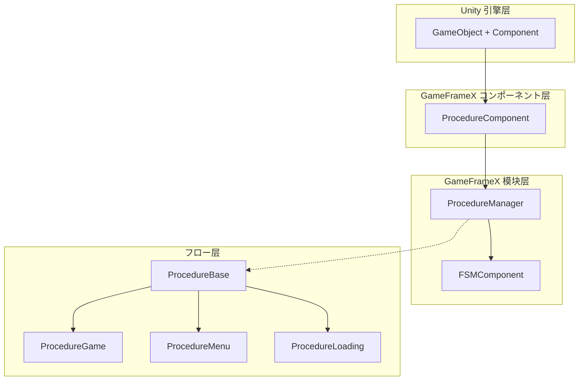
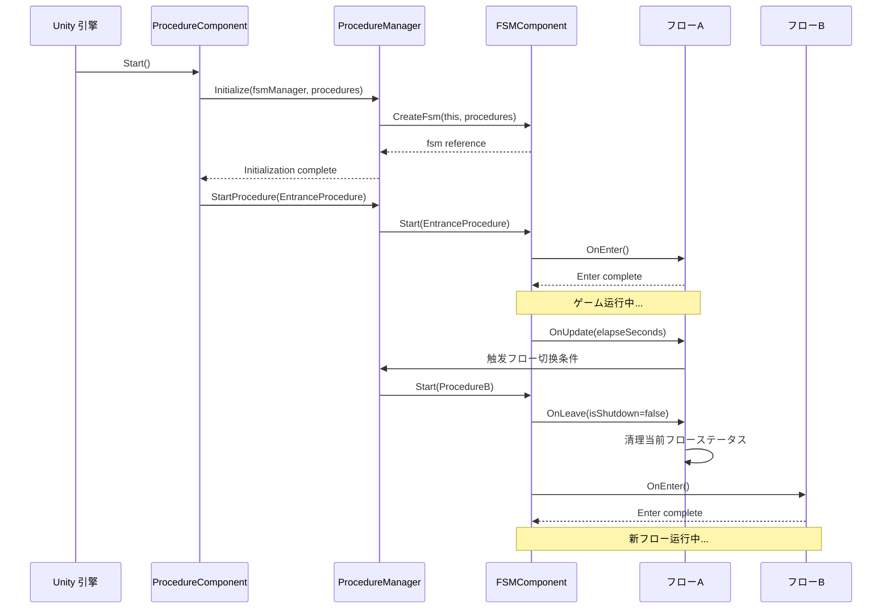

# 機能特性

GameFrameX Procedure フロー管理コンポーネント为 Unity ゲーム提供します一套完整的ゲームフローステータス管理解決策，サポートを通じて有限状態機械（FSM）管理ゲーム的各个阶段。

## 概要

Procedure フロー管理コンポーネント是 GameFrameX フレームワーク的コア模块之一，专门に使用管理ゲーム的业务フロー和ステータス切换。该コンポーネント基づく有限状態機械（FSM）设计，允许開発者将ゲーム划分为多个独立的フロー阶段，如启动フロー、加载フロー、主菜单フロー、ゲームフロー、暂停フロー和结束フロー等。

每个フロー都は独立的ステータス，拥有完整的生命周期管理，包括初期化、进入、更新、离开和销毁等阶段。这种设计使得ゲーム逻辑更加模块化，メンテナンスと拡張が容易，同时也为团队协作提供します清晰的分工边界。

## コア機能

### フローステータス管理

コンポーネント提供します完整的フローステータス管理能力，サポート在ゲーム运行时动态切换不同的フローステータス。開発者可能を通じて简单的 API 呼び出し実装从加载界面到ゲーム主菜单、再到具体ゲーム玩法的平滑过渡。フロー管理器维护了所有可用フロー的引用，并提供します查询当前フロー、取得フロー持续时间等实用機能。

```csharp
// 检查是否存在指定フロー
bool hasProcedure = procedureComponent.HasProcedure<ProcedureGame>();

// 取得当前正在执行的フロー
ProcedureBase current = procedureComponent.CurrentProcedure;

// 取得当前フロー已持续的时间
float elapsedTime = procedureComponent.CurrentProcedureTime;
```

> Source: [ProcedureComponent.cs](https://github.com/GameFrameX/com.gameframex.unity.procedure/blob/main/Runtime/Procedure/ProcedureComponent.cs#L114-L147)

### 自动フロー初期化

コンポーネント在ゲーム启动时自动完成所有フロー的作成和初期化工作。開発者只必要在 Unity 编辑器中配置好可用的フロークラス型，コンポーネント会自动使用反射机制作成フローインスタンス，并在ゲーム帧加载完成后自动启动エントリーポイントフロー。这种设计大大简化了ゲーム的启动逻辑，開発者可能专注于业务逻辑的実装。

```csharp
// ProcedureComponent 在 Start メソッド中自动完成フロー初期化
private IEnumerator Start()
{
    ProcedureBase[] procedures = new ProcedureBase[m_AvailableProcedureTypeNames.Length];
    for (int i = 0; i < m_AvailableProcedureTypeNames.Length; i++)
    {
        Type procedureType = Utility.Assembly.GetType(m_AvailableProcedureTypeNames[i]);
        procedures[i] = (ProcedureBase)Activator.CreateInstance(procedureType);
    }
    m_ProcedureManager.Initialize(GameFrameworkEntry.GetModule<IFsmManager>(), procedures);
    yield return new WaitForEndOfFrame();
    m_ProcedureManager.StartProcedure(m_EntranceProcedure.GetType());
}
```

> Source: [ProcedureComponent.cs](https://github.com/GameFrameX/com.gameframex.unity.procedure/blob/main/Runtime/Procedure/ProcedureComponent.cs#L71-L107)

### フロー生命周期钩子

每个自定义フロー都可能を通じて重写基クラスメソッド来実装特定的业务逻辑。コンポーネント提供します完整的生命周期钩子，覆盖了フロー从作成到销毁的全过程。这些钩子包括：`OnInit`（初期化时呼び出し）、`OnEnter`（进入フロー时呼び出し）、`OnUpdate`（每帧更新时呼び出し）、`OnFixedUpdate`（固定帧率更新时呼び出し）、`OnLeave`（离开フロー时呼び出し）和`OnDestroy`（フロー销毁时呼び出し）。

```csharp
public abstract class ProcedureBase : FsmState<IProcedureManager>
{
    // ステータス初期化时呼び出し
    protected override void OnInit(IFsm<IProcedureManager> procedureOwner) { }

    // 进入ステータス时呼び出し
    protected override void OnEnter(IFsm<IProcedureManager> procedureOwner) { }

    // ステータス轮询时呼び出し
    protected override void OnUpdate(IFsm<IProcedureManager> procedureOwner, float elapseSeconds, float realElapseSeconds) { }

    // 固定帧率更新时呼び出し
    protected override void OnFixedUpdate(IFsm<IProcedureManager> procedureOwner, float elapseSeconds, float realElapseSeconds) { }

    // 离开ステータス时呼び出し
    protected override void OnLeave(IFsm<IProcedureManager> procedureOwner, bool isShutdown) { }

    // ステータス销毁时呼び出し
    protected override void OnDestroy(IFsm<IProcedureManager> procedureOwner) { }
}
```

> Source: [ProcedureBase.cs](https://github.com/GameFrameX/com.gameframex.unity.procedure/blob/main/Runtime/Procedure/ProcedureBase.cs#L16-L76)

### フロー查询与取得

提供します灵活的程序化查询インターフェース，サポートを通じてクラス型或クラス型名称检查フロー是否存在，以及取得特定フロー的インスタンス引用。这些機能使得ゲーム代码可能在运行时动态与フロー系统交互，例如在非フロークラス中检查当前ゲームステータス或取得特定フロー进行数据交换。

```csharp
// を通じて泛型メソッド检查和取得フロー
if (procedureComponent.HasProcedure<ProcedureMenu>())
{
    var menuProcedure = procedureComponent.GetProcedure<ProcedureMenu>();
}

// を通じて Type 对象检查和取得フロー
Type menuType = typeof(ProcedureMenu);
if (procedureComponent.HasProcedure(menuType))
{
    var menuProcedure = (ProcedureMenu)procedureComponent.GetProcedure(menuType);
}
```

> Source: [IProcedureManager.cs](https://github.com/GameFrameX/com.gameframex.unity.procedure/blob/main/Runtime/Procedure/IProcedureManager.cs#L47-L73)

### 编辑器可视化配置

コンポーネント提供します自定义 Unity 编辑器检查器，サポート在 Inspector 面板中直观地配置可用フロー列表和エントリーポイントフロー。を通じて勾选框可能方便地选择必要包含在フロー系统中的フロークラス型，并を通じて下拉菜单設定ゲーム启动时的首个フロー。运行ステータス下，检查器还会显示当前正在执行的フロー名称，便于调试。

```csharp
// 编辑器检查器コア逻辑
foreach (string procedureTypeName in m_ProcedureTypeNames)
{
    bool selected = m_CurrentAvailableProcedureTypeNames.Contains(procedureTypeName);
    if (selected != EditorGUILayout.ToggleLeft(procedureTypeName, selected))
    {
        // 处理フロー选择ステータス变更
    }
}

// 运行ステータス下显示当前フロー
if (EditorApplication.isPlaying)
{
    EditorGUILayout.LabelField("Current Procedure", t.CurrentProcedure == null ? "None" : t.CurrentProcedure.GetType().ToString());
}
```

> Source: [ProcedureComponentInspector.cs](https://github.com/GameFrameX/com.gameframex.unity.procedure/blob/main/Editor/Inspector/ProcedureComponentInspector.cs#L46-L96)

## 系统架构



如上图所示，系统采用分层アーキテクチャ設計。`ProcedureComponent` 作为 Unity コンポーネント层，负责与 Unity 引擎交互并暴露公共インターフェース。`ProcedureManager` 作为コア模块，负责实际的フロー管理逻辑，并依赖于 `FSMComponent` 提供的有限状態機械機能。`ProcedureBase` 是所有自定义フロー的基クラス，提供します生命周期的统一抽象。

## フロー切换机制



フロー切换由 FSM コンポーネント统一管理。当呼び出し `StartProcedure` メソッド时，FSM 会先触发当前フロー的 `OnLeave` 回调，执行清理工作，然后触发目标フロー的 `OnEnter` 回调，完成初期化。这种设计确保了フロー切换时的ステータス一致性，避免了リソース泄漏和数据混乱。

## 典型使用シーン

### ゲーム启动フロー

典型的ゲーム启动フロー通常包含多个阶段：リソース加载、数据初期化、配置读取、登录验证等。每个阶段都可能作为一个独立的フロー実装，を通じてフロー管理器按顺序切换。这种设计使得启动逻辑清晰可控，也便于在每个阶段显示不同的加载界面。

### ゲームステータス管理

在ゲーム进行过程中，可能使用フロー系统管理不同的ゲームステータス。例如：ゲーム准备ステータス、ゲーム中ステータス、ゲーム暂停ステータス、ゲーム结算ステータス等。フロー之间的切换条件可能是玩家操作、タイマー到期、或者某些ゲームイベント的触发。

### シーン切换管理

当ゲーム必要在不同シーン之间切换时，フロー系统可能很好地协调加载和初期化工作。例如：从主菜单进入ゲームシーン时，可能先切换到加载フロー，显示加载进度条，后台完成シーンリソース加载和初期化，完成后再切换到ゲームフロー。

## 依赖关系

该コンポーネント依赖于 GameFrameX フレームワーク的其他コア模块：

| 依赖コンポーネント | 説明 |
|---------|------|
| FSMComponent | 提供有限状態機械機能，に使用実装フロー的ステータス转换 |
| GameFrameworkEntry | フレームワークエントリーポイント，に使用取得和注册各模块 |
| GameFrameworkComponent | コンポーネント基クラス，提供コンポーネント通用機能 |
| GameFrameworkModule | 模块基クラス，提供模块通用機能 |

## プラットフォーム対応

该コンポーネント基づく Unity 引擎开发，サポート以下平台：

- **iOS**：使用 IL2CPP 或 Mono 脚本后端
- **Android**：使用 IL2CPP 或 Mono 脚本后端
- **Windows**：Editor 和独立运行版本
- **macOS**：Editor 和独立运行版本
- **Linux**：独立运行版本
- **WebGL**：基づく WebGL 构建目标

## 注意事项

1. **フロー基クラス继承**：所有自定义フロー必須を継承 `ProcedureBase` 基クラス
2. **エントリーポイントフロー配置**：必須在 Inspector 中配置エントリーポイントフロー，否则ゲーム无法正常启动
3. **フロークラス型注册**：必要在 `m_AvailableProcedureTypeNames` 数组中添加所有可用的フロークラス型
4. **单コンポーネント限制**：同一个 GameObject 上只能添加一个 `ProcedureComponent`（由 `[DisallowMultipleComponent]` プロパティ限制）
5. **FSM 依赖**：コンポーネント正常工作必要先正确配置和初期化 FSMComponent

## 関連リンク

- [插件简介](./1-overview.introduction) - 了解コンポーネント的基本概念和使用前提
- [安装指南](./2-installation) - 详细的安装和配置手順
- [ProcedureComponent](./3-core-concepts.procedure-component) - コンポーネント的详细 API 文档
- [ProcedureBase](./3-core-concepts.procedure-base) - フロー基クラス的詳細説明
- [IProcedureManager](./3-core-concepts.iprocedure-manager) - フロー管理器インターフェース
- [ProcedureManager](./3-core-concepts.procedure-manager) - フロー管理器実装
- [自定义フロー](./4-custom-procedures) - 如何作成自定义フロー
- [编辑器使用](./5-editor-usage) - 编辑器配置指南
