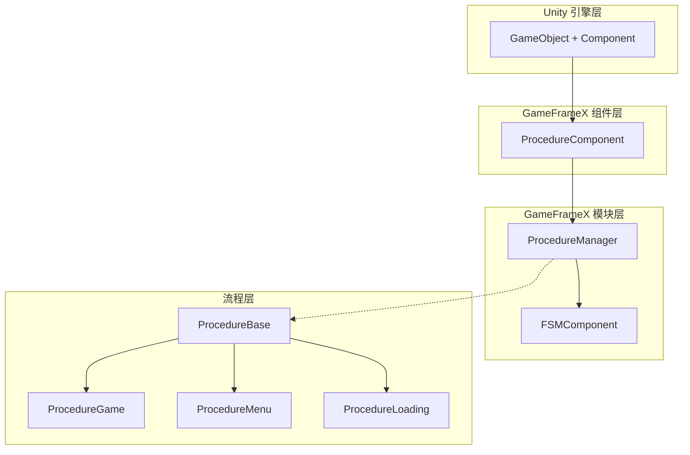
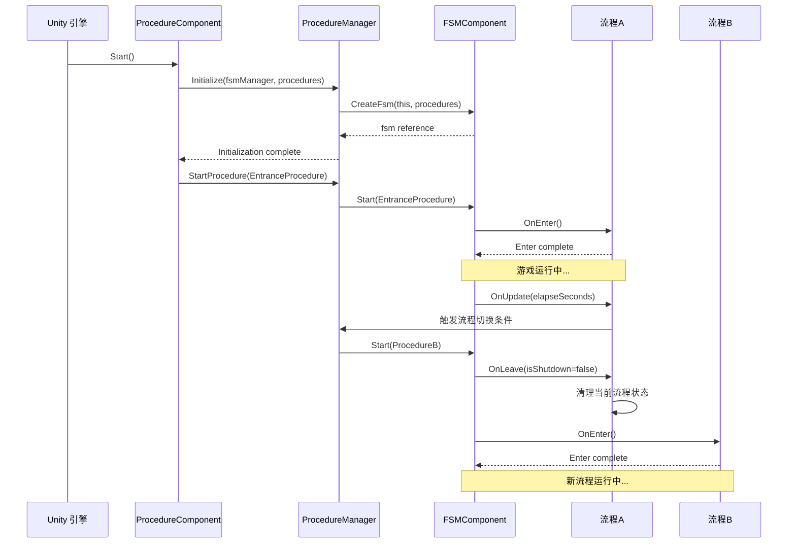

# 機能特性

GameFrameX Procedure フロー管理コンポーネント为 Unity 游戏提供します一套完全な的游戏フローステータス管理解決策，サポート通过有限ステータス机（FSM）管理游戏的各个フェーズ。

## 概要

Procedure フロー管理コンポーネント是 GameFrameX フレームワーク的コアモジュール之一，专门用于管理游戏的业务フロー和ステータス切换。该コンポーネント基于有限ステータス机（FSM）設計，允许開発者将游戏划分为多个独立的フローフェーズ，如启动フロー、ロードフロー、主メニューフロー、游戏フロー、暂停フロー和结束フロー等。

每个フロー都は独立的ステータス，拥有完全な的ライフサイクル管理，含みます初期化、进入、アップデート、离开和破棄等フェーズ。这种設計使得游戏逻辑更加モジュール化，便于维护和拡張，同時に也为团队协作提供します清晰的分工边界。

## コア機能

### フローステータス管理

コンポーネント提供します完全な的フローステータス管理能力，サポート在游戏ランタイム动态切换不同的フローステータス。開発者〜できます通过シンプル的 API 呼び出し実装从ロード界面到游戏主メニュー、再到具体游戏玩法的平滑过渡。フローマネージャー维护了所有可用フロー的参照，并提供します查询当前フロー、取得フロー持续时间等实用機能。

```csharp
// 检查是否存在指定流程
bool hasProcedure = procedureComponent.HasProcedure<ProcedureGame>();

// 获取当前正在执行的流程
ProcedureBase current = procedureComponent.CurrentProcedure;

// 获取当前流程已持续的时间
float elapsedTime = procedureComponent.CurrentProcedureTime;
```

> Source: [ProcedureComponent.cs](https://github.com/GameFrameX/com.gameframex.unity.procedure/blob/main/Runtime/Procedure/ProcedureComponent.cs#L114-L147)

### 自动フロー初期化

コンポーネント在游戏启动时自动完成所有フロー的作成和初期化工作。開発者只〜する必要があります在 Unity エディタ中設定好可用的フロータイプ，コンポーネント会自动使用反射机制作成フローインスタンス，并在游戏帧ロード完成后自动启动入口フロー。这种設計大大簡素化了游戏的启动逻辑，開発者〜できます专注于业务逻辑的実装。

```csharp
// ProcedureComponent 在 Start 方法中自动完成流程初始化
private IEnumerator Start()
{
    ProcedureBase[] procedures = new ProcedureBase[m_AvailableProcedureTypeNames.Length];
    for (int i = 0; i < m_AvailableProcedureTypeNames.Length; i++)
    {
        Type procedureType = Utility.Assembly.GetType(m_AvailableProcedureTypeNames[i]);
        procedures[i] = (ProcedureBase)Activator.CreateInstance(procedureType);
    }
    m_ProcedureManager.Initialize(GameFrameworkEntry.GetModule<IFsmManager>(), procedures);
    yield return new WaitForEndOfFrame();
    m_ProcedureManager.StartProcedure(m_EntranceProcedure.GetType());
}
```

> Source: [ProcedureComponent.cs](https://github.com/GameFrameX/com.gameframex.unity.procedure/blob/main/Runtime/Procedure/ProcedureComponent.cs#L71-L107)

### フローライフサイクル钩子

每个自定義フロー都〜できます通过オーバーライド基底クラスメソッド来実装特定的业务逻辑。コンポーネント提供します完全な的ライフサイクル钩子，覆盖了フロー从作成到破棄的全过程。这些钩子含みます：`OnInit`（初期化时呼び出し）、`OnEnter`（进入フロー时呼び出し）、`OnUpdate`（每帧アップデート时呼び出し）、`OnFixedUpdate`（固定帧率アップデート时呼び出し）、`OnLeave`（离开フロー时呼び出し）和`OnDestroy`（フロー破棄时呼び出し）。

```csharp
public abstract class ProcedureBase : FsmState<IProcedureManager>
{
    // 状态初始化时调用
    protected override void OnInit(IFsm<IProcedureManager> procedureOwner) { }

    // 进入状态时调用
    protected override void OnEnter(IFsm<IProcedureManager> procedureOwner) { }

    // 状态轮询时调用
    protected override void OnUpdate(IFsm<IProcedureManager> procedureOwner, float elapseSeconds, float realElapseSeconds) { }

    // 固定帧率更新时调用
    protected override void OnFixedUpdate(IFsm<IProcedureManager> procedureOwner, float elapseSeconds, float realElapseSeconds) { }

    // 离开状态时调用
    protected override void OnLeave(IFsm<IProcedureManager> procedureOwner, bool isShutdown) { }

    // 状态销毁时调用
    protected override void OnDestroy(IFsm<IProcedureManager> procedureOwner) { }
}
```

> Source: [ProcedureBase.cs](https://github.com/GameFrameX/com.gameframex.unity.procedure/blob/main/Runtime/Procedure/ProcedureBase.cs#L16-L76)

### フロー查询与取得

提供します柔軟的程序化查询インターフェース，サポート通过タイプ或タイプ名称確認フロー是否存在，および取得特定フロー的インスタンス参照。这些機能使得游戏コード〜できます在ランタイム动态与フロー系统交互，例えば在非フロー类中確認当前游戏ステータス或取得特定フロー进行数据交换。

```csharp
// 通过泛型方法检查和获取流程
if (procedureComponent.HasProcedure<ProcedureMenu>())
{
    var menuProcedure = procedureComponent.GetProcedure<ProcedureMenu>();
}

// 通过 Type 对象检查和获取流程
Type menuType = typeof(ProcedureMenu);
if (procedureComponent.HasProcedure(menuType))
{
    var menuProcedure = (ProcedureMenu)procedureComponent.GetProcedure(menuType);
}
```

> Source: [IProcedureManager.cs](https://github.com/GameFrameX/com.gameframex.unity.procedure/blob/main/Runtime/Procedure/IProcedureManager.cs#L47-L73)

### エディタ可视化設定

コンポーネント提供します自定義 Unity エディタ確認器，サポート在 Inspector パネル中直观地設定可用フロー列表和入口フロー。通过勾选框〜できます方便地选择〜する必要がありますパッケージ含在フロー系统中的フロータイプ，并通过下拉メニュー設定游戏启动时的首个フロー。运行ステータス下，確認器还会显示当前〜中执行的フロー名称，便于デバッグ。

```csharp
// 编辑器检查器核心逻辑
foreach (string procedureTypeName in m_ProcedureTypeNames)
{
    bool selected = m_CurrentAvailableProcedureTypeNames.Contains(procedureTypeName);
    if (selected != EditorGUILayout.ToggleLeft(procedureTypeName, selected))
    {
        // 处理流程选择状态变更
    }
}

// 运行状态下显示当前流程
if (EditorApplication.isPlaying)
{
    EditorGUILayout.LabelField("Current Procedure", t.CurrentProcedure == null ? "None" : t.CurrentProcedure.GetType().ToString());
}
```

> Source: [ProcedureComponentInspector.cs](https://github.com/GameFrameX/com.gameframex.unity.procedure/blob/main/Editor/Inspector/ProcedureComponentInspector.cs#L46-L96)

## システムアーキテクチャ



如上图所示，系统采用分层アーキテクチャ設計。`ProcedureComponent` 作为 Unity コンポーネント層，负责与 Unity 引擎交互并暴露公共インターフェース。`ProcedureManager` 作为コアモジュール，负责实际的フロー管理逻辑，并依赖于 `FSMComponent` 提供的有限ステータス机機能。`ProcedureBase` 是所有自定義フロー的基底クラス，提供しますライフサイクル的統一された抽象。

## フロー切换机制



フロー切换由 FSM コンポーネント統一された管理。当呼び出し `StartProcedure` メソッド时，FSM 会先トリガー当前フロー的 `OnLeave` コールバック，执行清理工作，次にトリガー目标フロー的 `OnEnter` コールバック，完成初期化。这种設計確認してください了フロー切换时的ステータス一致性，避免了リソース泄漏和数据混乱。

## 典型使用シーン

### 游戏启动フロー

典型的游戏启动フロー通常パッケージ含多个フェーズ：リソースロード、数据初期化、設定读取、登录検証等。每个フェーズ都〜できます作为一个独立的フロー実装，通过フローマネージャー按顺序切换。这种設計使得启动逻辑清晰可控，也便于在每个フェーズ显示不同的ロード界面。

### 游戏ステータス管理

在游戏进行过程中，〜できます使用フロー系统管理不同的游戏ステータス。例えば：游戏准备ステータス、游戏中ステータス、游戏暂停ステータス、游戏结算ステータス等。フロー之间的切换条件〜できます是プレイヤー操作、计时器到期、または某些游戏イベント的トリガー。

### シーン切换管理

当游戏〜する必要があります在不同シーン之间切换时，フロー系统〜できます很好地协调ロード和初期化工作。例えば：从主メニュー进入游戏シーン时，〜できます先切换到ロードフロー，显示ロード進捗条，后台完成シーンリソースロード和初期化，完成后再切换到游戏フロー。

## 依赖关系

该コンポーネント依赖于 GameFrameX フレームワーク的其他コアモジュール：

| 依赖コンポーネント | 説明 |
|---------|------|
| FSMComponent | 提供有限ステータス机機能，用于実装フロー的ステータス转换 |
| GameFrameworkEntry | フレームワークエントリ，用于取得和登録各モジュール |
| GameFrameworkComponent | コンポーネント基底クラス，提供コンポーネント汎用機能 |
| GameFrameworkModule | モジュール基底クラス，提供モジュール汎用機能 |

## プラットフォームサポート

该コンポーネント基于 Unity 引擎开发，サポート以下プラットフォーム：

- **iOS**：使用 IL2CPP 或 Mono 脚本后端
- **Android**：使用 IL2CPP 或 Mono 脚本后端
- **Windows**：Editor 和独立运行バージョン
- **macOS**：Editor 和独立运行バージョン
- **Linux**：独立运行バージョン
- **WebGL**：基于 WebGL ビルド目标

## 注意事项

1. **フロー基底クラス継承**：所有自定義フロー〜しなければなりません継承自 `ProcedureBase` 基底クラス
2. **入口フロー設定**：〜しなければなりません在 Inspector 中設定入口フロー，否则游戏无法正常启动
3. **フロータイプ登録**：〜する必要があります在 `m_AvailableProcedureTypeNames` 数组中追加所有可用的フロータイプ
4. **单コンポーネント限制**：同一个 GameObject 上只能追加一个 `ProcedureComponent`（由 `[DisallowMultipleComponent]` プロパティ限制）
5. **FSM 依赖**：コンポーネント正常工作〜する必要があります先正确設定和初期化 FSMComponent

## 関連リンク

- [プラグイン紹介](./1-overview.introduction) - 理解するコンポーネント的基本コンセプト和使用前提
- [インストールガイド](./2-installation) - 詳細的インストール和設定ステップ
- [ProcedureComponent](./3-core-concepts.procedure-component) - コンポーネント的詳細 API ドキュメント
- [ProcedureBase](./3-core-concepts.procedure-base) - フロー基底クラス的詳細説明
- [IProcedureManager](./3-core-concepts.iprocedure-manager) - フローマネージャーインターフェース
- [ProcedureManager](./3-core-concepts.procedure-manager) - フローマネージャー実装
- [自定義フロー](./4-custom-procedures) - 如何作成自定義フロー
- [エディタ使用](./5-editor-usage) - エディタ設定ガイド
