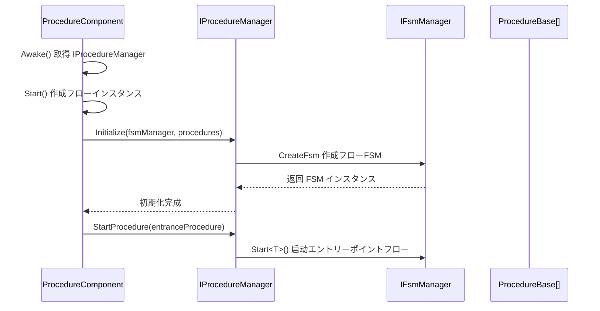
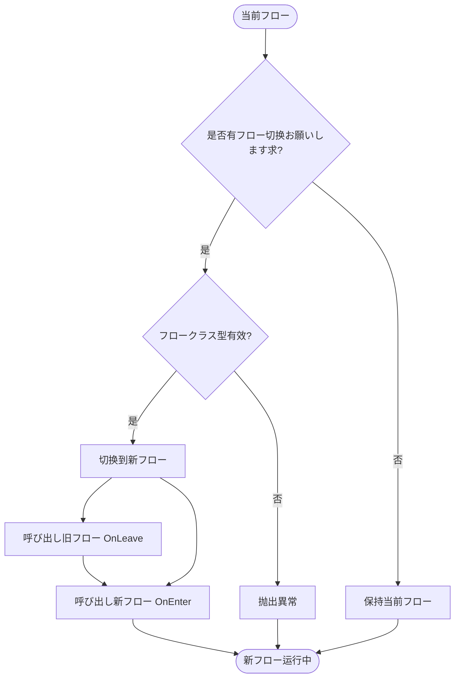

# IProcedureManager

フロー管理器インターフェース，定义了フロー管理的基本操作，に使用管理ゲーム中的各种フローステータス转换。

## 概要

IProcedureManager 是 GameFrameX フロー系统的コアインターフェース，负责管理ゲーム中的各种フロー（如登录フロー、主菜单フロー、ゲームフロー等）。它基づく有限状態機械（FSM）模式実装，提供しますフロー的初期化、切换、查询等機能。

**设计意图：**
- 提供统一的フロー管理インターフェース，屏蔽底层実装细节
- 基づく FSM 模式実装，确保フローステータス转换的可靠性和可追踪性
- サポート泛型和非泛型两种 API，满足不同的使用シーン

## 架构

```mermaid
flowchart TD
    subgraph External["外部呼び出し者"]
        User[用户代码]
    end

    subgraph Component["Unityコンポーネント层"]
        PC[ProcedureComponent]
    end

    subgraph Interface["インターフェース层"]
        IPM[IProcedureManager]
    end

    subgraph Implementation["実装层"]
        PM[ProcedureManager]
    end

    subgraph FSM["FSM子系统"]
        FSM[IFsmManager]
        FSMState[IFsm&lt;IProcedureManager&gt;]
    end

    subgraph Procedure["フロー层"]
        PB1[ProcedureBase - 登录フロー]
        PB2[ProcedureBase - 主菜单フロー]
        PB3[ProcedureBase - ゲームフロー]
    end

    User --> PC
    PC --> IPM
    IPM <|.. PM
    PM --> FSM
    FSM --> FSMState
    FSMState --> PB1
    FSMState --> PB2
    FSMState --> PB3
```

**架构説明：**

| コンポーネント | 职责 |
|------|------|
| **ProcedureComponent** | Unity コンポーネント，作为エントリーポイント点取得 IProcedureManager インスタンス |
| **IProcedureManager** | 定义フロー管理的公共インターフェース |
| **ProcedureManager** | インターフェース的具体実装，内部使用 FSM 管理フローステータス |
| **IFsmManager** | 有限状態機械管理器，由外部注入 |
| **ProcedureBase** | 所有具体フロー的基クラス，表示一个フローステータス |

## コアフロー

### 初期化フロー



### フロー切换フロー



## API 参考

### プロパティ

#### `CurrentProcedure: ProcedureBase`

取得当前正在执行的フローインスタンス。

**返回：** 当前フロー对象，如果未初期化则抛出異常

---

#### `CurrentProcedureTime: float`

取得当前フロー已持续的时间（秒）。

**返回：** フロー持续时间，如果未初期化则抛出異常

---

### メソッド

### `Initialize(fsmManager: IFsmManager, procedures: ProcedureBase[]): void`

初期化フロー管理器。

**参数：**
- `fsmManager` (IFsmManager): 有限状態機械管理器，不能为空
- `procedures` (params ProcedureBase[]): 要管理的フロー数组

**説明：** 
- 必須在呼び出し其他メソッド之前呼び出し此メソッド
- 该メソッド会作成一个内部 FSM 来管理所有フローステータス

> Source: [IProcedureManager.cs](https://github.com/GameFrameX/com.gameframex.unity.procedure/blob/main/Runtime/Procedure/IProcedureManager.cs#L28-L33)

---

### `StartProcedure<T>(): void` (泛型版本)

开始指定クラス型的フロー。

**クラス型参数：**
- `T`: 要开始的フロークラス型，必須を継承 ProcedureBase

**説明：**
- 泛型版本提供编译时クラス型检查
- 如果フロー管理器未初期化，抛出 GameFrameworkException

> Source: [IProcedureManager.cs](https://github.com/GameFrameX/com.gameframex.unity.procedure/blob/main/Runtime/Procedure/IProcedureManager.cs#L35-L39)

---

### `StartProcedure(procedureType: Type): void` (非泛型版本)

开始指定クラス型的フロー。

**参数：**
- `procedureType` (Type): 要开始的フロークラス型

**説明：**
- 非泛型版本サポート运行时动态指定フロークラス型
- 如果フロー管理器未初期化，抛出 GameFrameworkException

> Source: [IProcedureManager.cs](https://github.com/GameFrameX/com.gameframex.unity.procedure/blob/main/Runtime/Procedure/IProcedureManager.cs#L41-L45)

---

### `HasProcedure<T>(): bool` (泛型版本)

检查是否存在指定クラス型的フロー。

**クラス型参数：**
- `T`: 要检查的フロークラス型

**返回：** 是否存在该フロー

> Source: [IProcedureManager.cs](https://github.com/GameFrameX/com.gameframex.unity.procedure/blob/main/Runtime/Procedure/IProcedureManager.cs#L47-L52)

---

### `HasProcedure(procedureType: Type): bool` (非泛型版本)

检查是否存在指定クラス型的フロー。

**参数：**
- `procedureType` (Type): 要检查的フロークラス型

**返回：** 是否存在该フロー

> Source: [IProcedureManager.cs](https://github.com/GameFrameX/com.gameframex.unity.procedure/blob/main/Runtime/Procedure/IProcedureManager.cs#L54-L59)

---

### `GetProcedure<T>(): ProcedureBase` (泛型版本)

取得指定クラス型的フローインスタンス。

**クラス型参数：**
- `T`: 要取得的フロークラス型

**返回：** フローインスタンス，如果不存在则抛出異常

> Source: [IProcedureManager.cs](https://github.com/GameFrameX/com.gameframex.unity.procedure/blob/main/Runtime/Procedure/IProcedureManager.cs#L61-L66)

---

### `GetProcedure(procedureType: Type): ProcedureBase` (非泛型版本)

取得指定クラス型的フローインスタンス。

**参数：**
- `procedureType` (Type): 要取得的フロークラス型

**返回：** フローインスタンス，如果不存在则抛出異常

> Source: [IProcedureManager.cs](https://github.com/GameFrameX/com.gameframex.unity.procedure/blob/main/Runtime/Procedure/IProcedureManager.cs#L68-L73)

---

## 使用例

### 基本使用

を通じて ProcedureComponent 取得 IProcedureManager 并切换フロー：

```csharp
// 取得フローコンポーネント
var procedureComponent = UnityEngine.Object.FindObjectOfType<ProcedureComponent>();

// 取得当前フロー
var currentProcedure = procedureComponent.CurrentProcedure;

// 取得フロー管理器
var procedureManager = procedureComponent.Procedure;

// 检查是否存在某个フロー
if (procedureManager.HasProcedure<MenuProcedure>())
{
    // 切换到菜单フロー
    procedureManager.StartProcedure<MenuProcedure>();
}
```

> Source: [ProcedureComponent.cs](https://github.com/GameFrameX/com.gameframex.unity.procedure/blob/main/Runtime/Procedure/ProcedureComponent.cs#L42-L52)

### 初期化フロー

IProcedureManager 的初期化由 ProcedureComponent 自动完成：

```csharp
// ProcedureComponent.Start() メソッド中
IEnumerator Start()
{
    // ... 作成フローインスタンス ...
    
    // 初期化フロー管理器
    m_ProcedureManager.Initialize(
        GameFrameworkEntry.GetModule<IFsmManager>(), 
        procedures
    );
    
    yield return new WaitForEndOfFrame();
    
    // 启动エントリーポイントフロー
    m_ProcedureManager.StartProcedure(m_EntranceProcedure.GetType());
}
```

> Source: [ProcedureComponent.cs](https://github.com/GameFrameX/com.gameframex.unity.procedure/blob/main/Runtime/Procedure/ProcedureComponent.cs#L102-L106)

## 注意事项

1. **初期化顺序**：必須在 IFsmManager 初期化之后才能呼び出し Initialize メソッド
2. **エントリーポイントフロー**：必要指定一个エントリーポイントフロー（Entrance Procedure），ゲーム启动时自动开始执行
3. **異常处理**：大部分メソッド在未初期化时会抛出 GameFrameworkException
4. **线程安全**：フロー管理器不是线程安全的，应在主线程中操作
5. **FSM 依赖**：IProcedureManager 内部依赖 IFsmManager，必要确保 FsmModule 已注册

## 関連リンク

- [ProcedureComponent](./3-core-concepts.procedure-component) - フローコンポーネント
- [ProcedureBase](./3-core-concepts.procedure-base) - フロー基クラス
- [ProcedureManager](./3-core-concepts.procedure-manager) - フロー管理器実装
- [自定义フロー](./4-custom-procedures) - 如何作成自定义フロー
