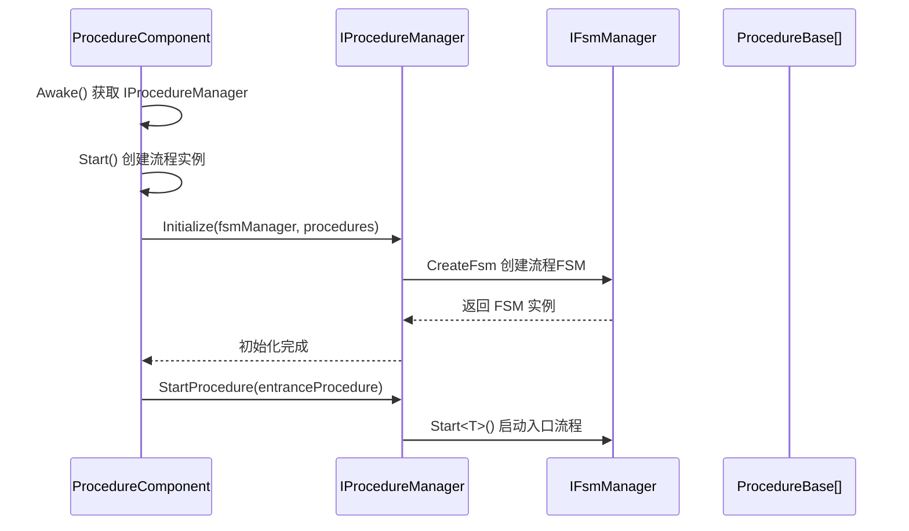
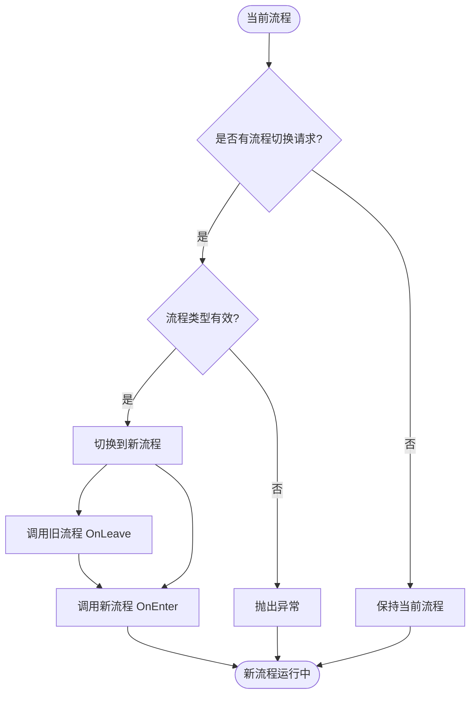

# IProcedureManager

フローマネージャーインターフェース，定義了フロー管理的基本操作，用于管理游戏中的各种フローステータス转换。

## 概要

IProcedureManager 是 GameFrameX フロー系统的コアインターフェース，负责管理游戏中的各种フロー（如登录フロー、主メニューフロー、游戏フロー等）。它基于有限ステータス机（FSM）モード実装，提供しますフロー的初期化、切换、查询等機能。

**設計意图：**
- 提供統一された的フロー管理インターフェース，屏蔽底层実装细节
- 基于 FSM モード実装，確認してくださいフローステータス转换的可靠性和可追踪性
- サポートジェネリック和非ジェネリック两种 API，满足不同的使用シーン

## アーキテクチャ

```mermaid
flowchart TD
    subgraph External["外部调用者"]
        User[用户代码]
    end

    subgraph Component["Unity组件层"]
        PC[ProcedureComponent]
    end

    subgraph Interface["接口层"]
        IPM[IProcedureManager]
    end

    subgraph Implementation["实现层"]
        PM[ProcedureManager]
    end

    subgraph FSM["FSM子系统"]
        FSM[IFsmManager]
        FSMState[IFsm&lt;IProcedureManager&gt;]
    end

    subgraph Procedure["流程层"]
        PB1[ProcedureBase - 登录流程]
        PB2[ProcedureBase - 主菜单流程]
        PB3[ProcedureBase - 游戏流程]
    end

    User --> PC
    PC --> IPM
    IPM <|.. PM
    PM --> FSM
    FSM --> FSMState
    FSMState --> PB1
    FSMState --> PB2
    FSMState --> PB3
```

**アーキテクチャ説明：**

| コンポーネント | 职责 |
|------|------|
| **ProcedureComponent** | Unity コンポーネント，作为入口点取得 IProcedureManager インスタンス |
| **IProcedureManager** | 定義フロー管理的公共インターフェース |
| **ProcedureManager** | インターフェース的具体実装，内部使用 FSM 管理フローステータス |
| **IFsmManager** | 有限ステータス机マネージャー，由外部注入 |
| **ProcedureBase** | 所有具体フロー的基底クラス，表示一个フローステータス |

## コアフロー

### 初期化フロー



### フロー切换フロー



## API リファレンス

### プロパティ

#### `CurrentProcedure: ProcedureBase`

取得当前〜中执行的フローインスタンス。

**返す：** 当前フロー对象，もし未初期化则抛出例外

---

#### `CurrentProcedureTime: float`

取得当前フロー已持续的时间（秒）。

**返す：** フロー持续时间，もし未初期化则抛出例外

---

### メソッド

### `Initialize(fsmManager: IFsmManager, procedures: ProcedureBase[]): void`

初期化フローマネージャー。

**パラメータ：**
- `fsmManager` (IFsmManager): 有限ステータス机マネージャー，不能为空
- `procedures` (params ProcedureBase[]): 要管理的フロー数组

**説明：** 
- 〜しなければなりません在呼び出し其他メソッド之前呼び出し此メソッド
- 该メソッド会作成一个内部 FSM 来管理所有フローステータス

> Source: [IProcedureManager.cs](https://github.com/GameFrameX/com.gameframex.unity.procedure/blob/main/Runtime/Procedure/IProcedureManager.cs#L28-L33)

---

### `StartProcedure<T>(): void` (ジェネリックバージョン)

开始指定タイプ的フロー。

**タイプパラメータ：**
- `T`: 要开始的フロータイプ，〜しなければなりません継承自 ProcedureBase

**説明：**
- ジェネリックバージョン提供コンパイル时タイプ確認
- もしフローマネージャー未初期化，抛出 GameFrameworkException

> Source: [IProcedureManager.cs](https://github.com/GameFrameX/com.gameframex.unity.procedure/blob/main/Runtime/Procedure/IProcedureManager.cs#L35-L39)

---

### `StartProcedure(procedureType: Type): void` (非ジェネリックバージョン)

开始指定タイプ的フロー。

**パラメータ：**
- `procedureType` (Type): 要开始的フロータイプ

**説明：**
- 非ジェネリックバージョンサポートランタイム动态指定フロータイプ
- もしフローマネージャー未初期化，抛出 GameFrameworkException

> Source: [IProcedureManager.cs](https://github.com/GameFrameX/com.gameframex.unity.procedure/blob/main/Runtime/Procedure/IProcedureManager.cs#L41-L45)

---

### `HasProcedure<T>(): bool` (ジェネリックバージョン)

確認是否存在指定タイプ的フロー。

**タイプパラメータ：**
- `T`: 要確認的フロータイプ

**返す：** 是否存在このフロー

> Source: [IProcedureManager.cs](https://github.com/GameFrameX/com.gameframex.unity.procedure/blob/main/Runtime/Procedure/IProcedureManager.cs#L47-L52)

---

### `HasProcedure(procedureType: Type): bool` (非ジェネリックバージョン)

確認是否存在指定タイプ的フロー。

**パラメータ：**
- `procedureType` (Type): 要確認的フロータイプ

**返す：** 是否存在このフロー

> Source: [IProcedureManager.cs](https://github.com/GameFrameX/com.gameframex.unity.procedure/blob/main/Runtime/Procedure/IProcedureManager.cs#L54-L59)

---

### `GetProcedure<T>(): ProcedureBase` (ジェネリックバージョン)

取得指定タイプ的フローインスタンス。

**タイプパラメータ：**
- `T`: 要取得的フロータイプ

**返す：** フローインスタンス，もし不存在则抛出例外

> Source: [IProcedureManager.cs](https://github.com/GameFrameX/com.gameframex.unity.procedure/blob/main/Runtime/Procedure/IProcedureManager.cs#L61-L66)

---

### `GetProcedure(procedureType: Type): ProcedureBase` (非ジェネリックバージョン)

取得指定タイプ的フローインスタンス。

**パラメータ：**
- `procedureType` (Type): 要取得的フロータイプ

**返す：** フローインスタンス，もし不存在则抛出例外

> Source: [IProcedureManager.cs](https://github.com/GameFrameX/com.gameframex.unity.procedure/blob/main/Runtime/Procedure/IProcedureManager.cs#L68-L73)

---

## 使用例

### 基本使用

通过 ProcedureComponent 取得 IProcedureManager 并切换フロー：

```csharp
// 获取流程组件
var procedureComponent = UnityEngine.Object.FindObjectOfType<ProcedureComponent>();

// 获取当前流程
var currentProcedure = procedureComponent.CurrentProcedure;

// 获取流程管理器
var procedureManager = procedureComponent.Procedure;

// 检查是否存在某个流程
if (procedureManager.HasProcedure<MenuProcedure>())
{
    // 切换到菜单流程
    procedureManager.StartProcedure<MenuProcedure>();
}
```

> Source: [ProcedureComponent.cs](https://github.com/GameFrameX/com.gameframex.unity.procedure/blob/main/Runtime/Procedure/ProcedureComponent.cs#L42-L52)

### 初期化フロー

IProcedureManager 的初期化由 ProcedureComponent 自动完成：

```csharp
// ProcedureComponent.Start() 方法中
IEnumerator Start()
{
    // ... 创建流程实例 ...
    
    // 初始化流程管理器
    m_ProcedureManager.Initialize(
        GameFrameworkEntry.GetModule<IFsmManager>(), 
        procedures
    );
    
    yield return new WaitForEndOfFrame();
    
    // 启动入口流程
    m_ProcedureManager.StartProcedure(m_EntranceProcedure.GetType());
}
```

> Source: [ProcedureComponent.cs](https://github.com/GameFrameX/com.gameframex.unity.procedure/blob/main/Runtime/Procedure/ProcedureComponent.cs#L102-L106)

## 注意事项

1. **初期化顺序**：〜しなければなりません在 IFsmManager 初期化之后才能呼び出し Initialize メソッド
2. **入口フロー**：〜する必要があります指定一个入口フロー（Entrance Procedure），游戏启动时自动开始执行
3. **例外処理**：大部分メソッド在未初期化时会抛出 GameFrameworkException
4. **线程安全**：フローマネージャー不是线程安全的，应在主线程中操作
5. **FSM 依赖**：IProcedureManager 内部依赖 IFsmManager，〜する必要があります確認してください FsmModule 已登録

## 関連リンク

- [ProcedureComponent](./3-core-concepts.procedure-component) - フローコンポーネント
- [ProcedureBase](./3-core-concepts.procedure-base) - フロー基底クラス
- [ProcedureManager](./3-core-concepts.procedure-manager) - フローマネージャー実装
- [自定義フロー](./4-custom-procedures) - 如何作成自定義フロー
