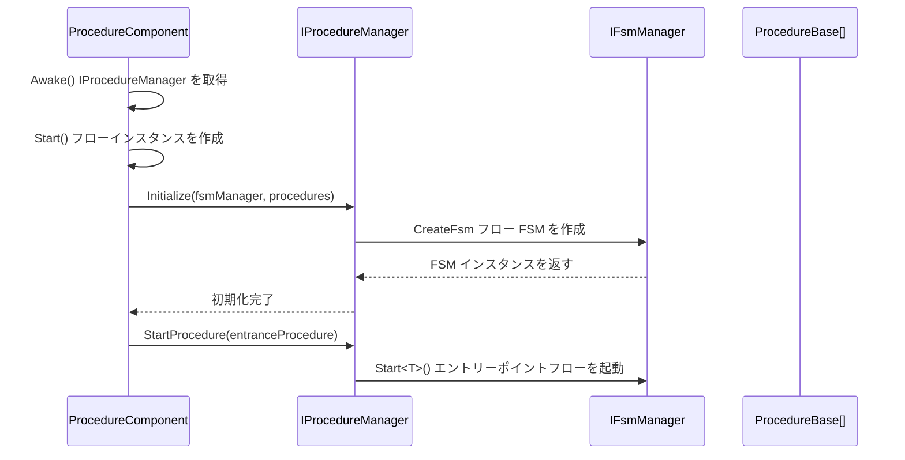
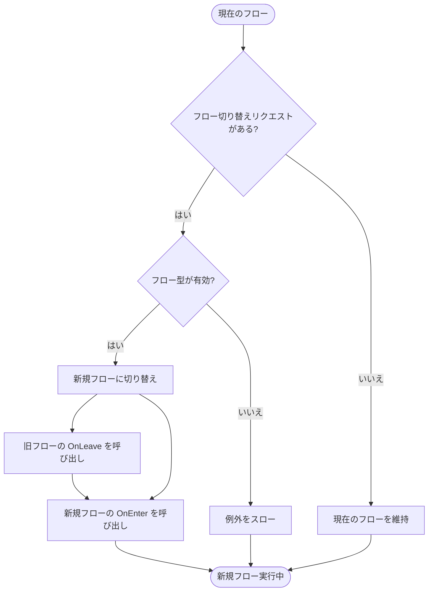

# IProcedureManager

フローマネージャーインターフェースは、フロー管理の基本操作を定義し、ゲーム内のさまざまなフローステータス切り替えを管理するために使用されます。

## 概要

IProcedureManager は GameFrameX フローシステムのコアインターフェースであり、ゲーム内のさまざまなフロー（ログインフロー、メニュースフロー、ゲームフローなど）を管理することを負責します。有限状態機械（FSM）パターンに基づいて実装されており、フローの初期化、切り替え、queryなどの機能を提供します。

**設計意図：**
- 统一されたフローマネジメントインターフェースを提供し、底層実装の詳細を屏蔽
- FSM パターンに基づいて実装し、フローステータス切り替えの信頼性とトレーサビリティを確保
- ジェネリックと非ジェネリックの2種類の API をサポートし、異なる使用シナリオに対応

## アーキテクチャ

```mermaid
flowchart TD
    subgraph External["外部呼び出し側"]
        User[ユーザーコード]
    end

    subgraph Component["Unityコンポーネント層"]
        PC[ProcedureComponent]
    end

    subgraph Interface["インターフェース層"]
        IPM[IProcedureManager]
    end

    subgraph Implementation["実装層"]
        PM[ProcedureManager]
    end

    subgraph FSM["FSMサブシステム"]
        FSM[IFsmManager]
        FSMState[IFsm&lt;IProcedureManager&gt;]
    end

    subgraph Procedure["フロー層"]
        PB1[ProcedureBase - ログインフロー]
        PB2[ProcedureBase - メニュースフロー]
        PB3[ProcedureBase - ゲームフロー]
    end

    User --> PC
    PC --> IPM
    IPM <|.. PM
    PM --> FSM
    FSM --> FSMState
    FSMState --> PB1
    FSMState --> PB2
    FSMState --> PB3
```

**アーキテクチャの説明：**

| コンポーネント | 責任 |
|------|------|
| **ProcedureComponent** | Unity コンポーネントとして、エントリーポイントで IProcedureManager インスタンスを取得 |
| **IProcedureManager** | フローマネジメントのパブリックインターフェースを定義 |
| **ProcedureManager** | インターフェースの実装、内部で FSM を使用してフローステータスを管理 |
| **IFsmManager** | 有限状態機械マネージャー、外部から注入される |
| **ProcedureBase** | すべての具体的なフローの基底クラス、1つのフローステータスを表す |

## コアフロー

### 初期化フロー



### フロー切り替えフロー



## API リファレンス

### プロパティ

#### `CurrentProcedure: ProcedureBase`

現在実行中のフローインスタンスを取得します。

**返り値：** 現在のフローオブジェクト。未初期化の場合は例外をスロー

---

#### `CurrentProcedureTime: float`

現在のフローが継続している時間（秒）を取得します。

**返り値：** フローの継続時間。未初期化の場合は例外をスロー

---

### メソッド

### `Initialize(fsmManager: IFsmManager, procedures: ProcedureBase[]): void`

フローマネージャーを初期化します。

**パラメータ：**
- `fsmManager` (IFsmManager): 有限状態機械マネージャー。null 不可
- `procedures` (params ProcedureBase[]): 管理するフロー配列

**説明：**
- 他のメソッドを呼び出す前に必ずこのメソッドを呼び出す必要があります
- このメソッドは内部 FSM を作成してすべてのフローステータスを管理します

> Source: [IProcedureManager.cs](https://github.com/GameFrameX/com.gameframex.unity.procedure/blob/main/Runtime/Procedure/IProcedureManager.cs#L28-L33)

---

### `StartProcedure<T>(): void` （ジェネリックバージョン）

指定された型のフローを開始します。

**型パラメータ：**
- `T`: 開始するフローの型。ProcedureBase から継承する必要があります

**説明：**
- ジェネリックバージョンはコンパイル時の型チェックを提供します
- フローマネージャーが未初期化の場合、GameFrameworkException をスローします

> Source: [IProcedureManager.cs](https://github.com/GameFrameX/com.gameframex.unity.procedure/blob/main/Runtime/Procedure/IProcedureManager.cs#L35-L39)

---

### `StartProcedure(procedureType: Type): void` （非ジェネリックバージョン）

指定された型のフローを開始します。

**パラメータ：**
- `procedureType` (Type): 開始するフローの型

**説明：**
- 非ジェネリックバージョンは実行時の動的指定フローの型をサポートします
- フローマネージャーが未初期化の場合、GameFrameworkException をスローします

> Source: [IProcedureManager.cs](https://github.com/GameFrameX/com.gameframex.unity.procedure/blob/main/Runtime/Procedure/IProcedureManager.cs#L41-L45)

---

### `HasProcedure<T>(): bool` （ジェネリックバージョン）

指定された型のフローが存在するかどうかを確認します。

**型パラメータ：**
- `T`: 確認するフローの型

**返り値：** 該フロー是否存在するか

> Source: [IProcedureManager.cs](https://github.com/GameFrameX/com.gameframex.unity.procedure/blob/main/Runtime/Procedure/IProcedureManager.cs#L47-L52)

---

### `HasProcedure(procedureType: Type): bool` （非ジェネリックバージョン）

指定された型のフローが存在するかどうかを確認します。

**パラメータ：**
- `procedureType` (Type): 確認するフローの型

**返り値：** 該フロー是否存在するか

> Source: [IProcedureManager.cs](https://github.com/GameFrameX/com.gameframex.unity.procedure/blob/main/Runtime/Procedure/IProcedureManager.cs#L54-L59)

---

### `GetProcedure<T>(): ProcedureBase` （ジェネリックバージョン）

指定された型のフローインスタンスを取得します。

**型パラメータ：**
- `T`: 取得するフローの型

**返り値：** フローインスタンス。存在しない場合は例外をスロー

> Source: [IProcedureManager.cs](https://github.com/GameFrameX/com.gameframex.unity.procedure/blob/main/Runtime/Procedure/IProcedureManager.cs#L61-L66)

---

### `GetProcedure(procedureType: Type): ProcedureBase` （非ジェネリックバージョン）

指定された型のフローインスタンスを取得します。

**パラメータ：**
- `procedureType` (Type): 取得するフローの型

**返り値：** フローインスタンス。存在しない場合は例外をスロー

> Source: [IProcedureManager.cs](https://github.com/GameFrameX/com.gameframex.unity.procedure/blob/main/Runtime/Procedure/IProcedureManager.cs#L68-L73)

---

## 使用例

### 基本使用

ProcedureComponent を介して IProcedureManager を取得し、フローを切り替えます：

```csharp
// フローコンポーネントを取得
var procedureComponent = UnityEngine.Object.FindObjectOfType<ProcedureComponent>();

// 現在のフローを取得
var currentProcedure = procedureComponent.CurrentProcedure;

// フローマネージャーを取得
var procedureManager = procedureComponent.Procedure;

// 特定のフローが存在するかどうかを確認
if (procedureManager.HasProcedure<MenuProcedure>())
{
    // メニュースフローに切り替え
    procedureManager.StartProcedure<MenuProcedure>();
}
```

> Source: [ProcedureComponent.cs](https://github.com/GameFrameX/com.gameframex.unity.procedure/blob/main/Runtime/Procedure/ProcedureComponent.cs#L42-L52)

### フローの初期化

IProcedureManager の初期化は ProcedureComponent によって自動的に完了します：

```csharp
// ProcedureComponent.Start() メソッド内
IEnumerator Start()
{
    // ... フローインスタンスを作成 ...

    // フローマネージャーを初期化
    m_ProcedureManager.Initialize(
        GameFrameworkEntry.GetModule<IFsmManager>(),
        procedures
    );

    yield return new WaitForEndOfFrame();

    // エントリーポイントフローを起動
    m_ProcedureManager.StartProcedure(m_EntranceProcedure.GetType());
}
```

> Source: [ProcedureComponent.cs](https://github.com/GameFrameX/com.gameframex.unity.procedure/blob/main/Runtime/Procedure/ProcedureComponent.cs#L102-L106)

## 注意事項

1. **初期化順序**：IFsmManager の初期化後にのみ Initialize メソッドを呼び出すことができます
2. **エントリーポイントフロー**：エントリーポイントフロー（Entrance Procedure）を指定する必要があります。ゲーム起動時に自動的に実行が開始されます
3. **例外処理**：大部分のメソッドは未初期化時に GameFrameworkException をスローします
4. **スレッドセーフティ**：フローマネージャーはスレッドセーフではありません。メインストレッドで操作する必要があります
5. **FSM 依存**：IProcedureManager は内部で IFsmManager に依存します。FsmModule が登録されていることを確認する必要があります

## 関連リンク

- [ProcedureComponent](./08.procedure-component.md) - フローコンポーネント
- [ProcedureBase](./06.procedure-base.md) - フローベースクラス
- [ProcedureManager](./07.procedure-manager.md) - フローマネージャー実装
- [カスタムフロー](./09.custom-procedures.md) - カスタムフローの作成方法
