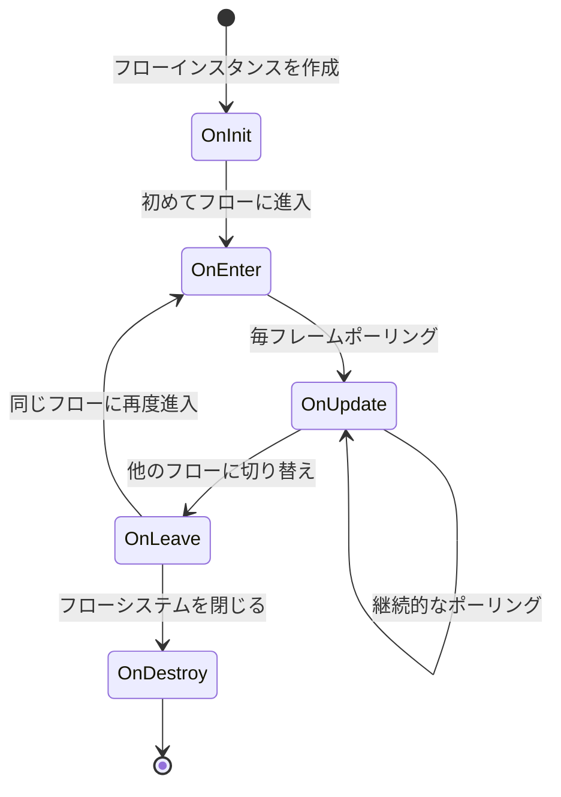

# ProcedureBase

フローベースクラスは、ゲーム内のさまざまなフローステータスを定義するために使用されます。

## 概要

`ProcedureBase` は、GameFrameX フロー管理システムのコア抽象クラスであり、`FsmState<IProcedureManager>` を継承しています。ゲームフローライフサイクルの完全なテンプレートメソッドを提供し、開発者はこのクラスを継承してカスタムゲームフローを作成できます：起動フロー、メニュースフロー、ゲームフロー、一時停止フロー、精算フローなどが含まれます。

**設計意図：**
GameFrameX のフロー管理システムは有限状態機械（FSM）パターンに従って設計されています。`ProcedureBase` はステータスの基底クラスとして、各フローステータスに対して標準的なライフサイクルフックメソッドのセットを定義します。この設計により、ゲームフローの管理が明確で制御可能になり、異なるフロー間でのスムーズな切り替えがサポートされ、フロー間のデータ передачとステータス保持がサポートされます。

**コア機能：**
- 完全なフローライフサイクル管理（初期化 → 進入 → 更新 → 離脱 → 破棄）
- フレーム更新（Update）と固定フレーム更新（FixedUpdate）のサポート
- 有限状態機械に基づくフロースイッチングメカニズム
- ProcedureManager とのシームレスな統合

## アーキテクチャ

```mermaid
graph TD
    subgraph GameFrameX コアモジュール
        FsmState[FsmState&lt;IProcedureManager&gt;]
    end

    subgraph Procedure フローモジュール
        ProcedureBase["ProcedureBase<br/>(抽象基底クラス)"]
        IProcedureManager[IProcedureManager<br/>(インターフェース)]
        ProcedureManager["ProcedureManager<br/>(フローマネージャー)"]
    end

    subgraph Unity 統合層
        ProcedureComponent["ProcedureComponent<br/>(フローコンポーネント)"]
    end

    subgraph カスタムフロー
        CustomProcedure1["カスタムフロー A<br/>(ProcedureBase を継承)"]
        CustomProcedure2["カスタムフロー B<br/>(ProcedureBase を継承)"]
        CustomProcedureN["カスタムフロー N<br/>(ProcedureBase を継承)"]
    end

    FsmState <|-- ProcedureBase
    ProcedureBase <|-- CustomProcedure1
    ProcedureBase <|-- CustomProcedure2
    ProcedureBase <|-- CustomProcedureN

    IProcedureManager <|.. ProcedureManager
    ProcedureManager --> ProcedureBase
    ProcedureComponent --> ProcedureManager
```

**アーキテクチャの説明：**

| コンポーネント | 役割 | 責任 |
|------|------|------|
| `FsmState<IProcedureManager>` | 基底クラス | 有限状態機械の基本機能を提供 |
| `ProcedureBase` | 抽象基底クラス | フローの標準ライフサイクルテンプレートを定義 |
| `IProcedureManager` | インターフェース | フローマネージャーの標準操作を定義 |
| `ProcedureManager` | 実装クラス | すべてのフローステータスの管理与り、スケジューリングを担当 |
| `ProcedureComponent` | Unityコンポーネント | Unity 環境でフローシステムを初期化 |
| カスタムフロー | 具体的な実装 | ProcedureBase を継承して具体的なビジネスロジックを実装 |

## ライフサイクル



**ライフサイクル段階の説明：**

| 段階 | メソッド | 呼び出しタイミング | 典型的な用途 |
|------|------|----------|----------|
| 初期化 | `OnInit` | フローインスタンス作成後、初めてフローに進入前 | フローデータの初期化、設定の読み込み |
| 進入 | `OnEnter` | フローステータスに進入時 | フローリソースの準備、画面の表示 |
| 更新 | `OnUpdate` | 毎フレーム呼び出し（論理フレーム） | ビジネスロジックの処理、ステータスの確認 |
| 固定更新 | `OnFixedUpdate` | 固定時間間隔で呼び出し | 物理関連のロジック |
| 離脱 | `OnLeave` | フローステータスを離れる時 | 一時リソースの解放、ステータスの保存 |
| 破棄 | `OnDestroy` | フローシステムが閉じる時 | すべてのリソースのクリーンアップ |

## コアメソッド

### OnInit - フローの初期化

```csharp
protected override void OnInit(IFsm<IProcedureManager> procedureOwner)
```
> Source: [ProcedureBase.cs](https://github.com/GameFrameX/com.gameframex.unity.procedure/blob/main/Runtime/Procedure/ProcedureBase.cs#L22-L25)

フローステータスが初めて初期化される時に呼び出されます。このメソッドは、フローインスタンス作成後、初めてフローに進入する前に呼び出されます。

**設計意図：**
一回限りの初期化の機会を提供します。フローに必要な静的データ、設定情報、またはゲームの事前作成などのために使用されます。このメソッドは、フロー全体のライフサイクル中に1回だけ呼び出されます。

**パラメータ：**
- `procedureOwner` (`IFsm<IProcedureManager>`)：フロー所有者の有限状態機械

---

### OnEnter - フローへの進入

```csharp
protected override void OnEnter(IFsm<IProcedureManager> procedureOwner)
```
> Source: [ProcedureBase.cs](https://github.com/GameFrameX/com.gameframex.unity.procedure/blob/main/Runtime/Procedure/ProcedureBase.cs#L31-L34)

フローステータスが他のステータスから現在のステータスに切り替わるときに呼び出されます。

**設計意図：**
フローに進入するたびに呼び出され、フローに必要なリソースの準備、画面に対応する UI の表示、特定のサウンドやアニメーションの開始などに適しています。フローがアクティブになるたびにトリガーされます。

**パラメータ：**
- `procedureOwner` (`IFsm<IProcedureManager>`)：フロー所有者の有限状態機械

---

### OnUpdate - フローの更新

```csharp
protected override void OnUpdate(IFsm<IProcedureManager> procedureOwner, float elapseSeconds, float realElapseSeconds)
```
> Source: [ProcedureBase.cs](https://github.com/GameFrameX/com.gameframex.unity.procedure/blob/main/Runtime/Procedure/ProcedureBase.cs#L42-L45)

フローステータスがアクティブ状態の間、毎フレーム呼び出されます。

**設計意図：**
これは、フローのコアビジネスロジックを実装する主要なフックです。フローの切り替え条件の検出、ゲームステータスの更新、ユーザー入力の処理などを здесь で実装できます。

**パラメータ：**
- `procedureOwner` (`IFsm<IProcedureManager>`)：フロー所有者の有限状態機械
- `elapseSeconds` (float)：論理経過時間（秒）。時間スケールに影響されます
- `realElapseSeconds` (float)：実際の経過時間（秒）。時間スケールに影響されません

---

### OnFixedUpdate - 固定頻度更新

```csharp
protected override void OnFixedUpdate(IFsm<IProcedureManager> procedureOwner, float elapseSeconds, float realElapseSeconds)
```
> Source: [ProcedureBase.cs](https://github.com/GameFrameX/com.gameframex.unity.procedure/blob/main/Runtime/Procedure/ProcedureBase.cs#L53-L56)

固定時間間隔で呼び出され、物理関連のロジック処理に使用されます。

**設計意図：**
Unity の FixedUpdate は固定時間間隔（デフォルト 0.02 秒）で呼び出され、物理エンジン関連のロジックを処理に適しており、ロジックの決定性を確保します。

**パラメータ：**
- `procedureOwner` (`IFsm<IProcedureManager>`)：フロー所有者の有限状態機械
- `elapseSeconds` (float)：論理経過時間（秒）
- `realElapseSeconds` (float)：実際の経過時間（秒）

---

### OnLeave - フローからの離脱

```csharp
protected override void OnLeave(IFsm<IProcedureManager> procedureOwner, bool isShutdown)
```
> Source: [ProcedureBase.cs](https://github.com/GameFrameX/com.gameframex.unity.procedure/blob/main/Runtime/Procedure/ProcedureBase.cs#L63-L66)

フローステータスが現在のステータスから他のステータスに切り替わるときに呼び出されます。

**設計意図：**
現在のフローの一時リソースのクリーンアップ、ステータスデータの保存、UI 画面の非表示などのために使用されます。注意：`isShutdown` が true の場合、フローシステムを閉じることを示しており、フローを切り替えることではありません。

**パラメータ：**
- `procedureOwner` (`IFsm<IProcedureManager>`)：フロー所有者の有限状態機械
- `isShutdown` (bool)：ステータス機械を閉じる時のトリガーかどうか

---

### OnDestroy - フローの破棄

```csharp
protected override void OnDestroy(IFsm<IProcedureManager> procedureOwner)
```
> Source: [ProcedureBase.cs](https://github.com/GameFrameX/com.gameframex.unity.procedure/blob/main/Runtime/Procedure/ProcedureBase.cs#L72-L75)

フローステータスが破棄される時に呼び出されます。

**設計意図：**
フローシステム全体が閉じる時に呼び出され、最終的なクリーンアップ作業を実行し、すべてのリソースを解放するために使用されます。これは、フローサイクルの最後の段階です。

**パラメータ：**
- `procedureOwner` (`IFsm<IProcedureManager>`)：フロー所有者の有限状態機械

## 使用例

### 基本的なカスタムフロー

シンプルな起動フローを作成します：

```csharp
using GameFrameX.Procedure.Runtime;
using GameFrameX.Fsm.Runtime;

public class ProcedureLaunch : ProcedureBase
{
    protected override void OnInit(IFsm<IProcedureManager> procedureOwner)
    {
        base.OnInit(procedureOwner);
        // 起動データの初期化
    }

    protected override void OnEnter(IFsm<IProcedureManager> procedureOwner)
    {
        base.OnEnter(procedureOwner);
        // 起動画面を表示
    }

    protected override void OnUpdate(IFsm<IProcedureManager> procedureOwner, float elapseSeconds, float realElapseSeconds)
    {
        base.OnUpdate(procedureOwner, elapseSeconds, realElapseSeconds);

        // 起動が完了したかどうかを確認し、次のフローに切り替え可能
        // procedureOwner.Owner.StartProcedure<ProcedureMenu>();
    }

    protected override void OnLeave(IFsm<IProcedureManager> procedureOwner, bool isShutdown)
    {
        base.OnLeave(procedureOwner, isShutdown);
        // 起動画面を非表示
    }
}
```

### フロー切り替え例

フロー内で別のフローに切り替えます：

```csharp
protected override void OnUpdate(IFsm<IProcedureManager> procedureOwner, float elapseSeconds, float realElapseSeconds)
{
    base.OnUpdate(procedureOwner, elapseSeconds, realElapseSeconds);

    // ある条件を満たした後、メニュースフローに切り替え
    if (someCondition)
    {
        // フローマネージャーを取得して次のフローを起動
        procedureOwner.Owner.StartProcedure<ProcedureMenu>();
    }
}
```

### 現在のフロー情報の取得

```csharp
// 任意の位置で現在のフローと継続時間を取得
var procedureComponent = UnityEngine.Object.FindObjectOfType<ProcedureComponent>();
var currentProcedure = procedureComponent.CurrentProcedure;
var elapsedTime = procedureComponent.CurrentProcedureTime;
```

## 他のコンポーネントとの関係

| コンポーネント | 関係 | 説明 |
|------|------|------|
| ProcedureComponent | 使用 | Unity コンポーネント。フローシステムを初期化するために使用 |
| ProcedureManager | 管理 | ProcedureBase ステータス変換を実際に管理するクラス |
| IProcedureManager | 実装 | ProcedureManager が実装するインターフェース |
| FsmState | 継承 | GameFrameX.Fsm からの基底クラス |

## よくある質問

### Q: なぜ Update で直接ロジックを処理しないのですか？

**A:** `ProcedureBase` は構造化されたライフサイクルメソッドを提供しており、この設計は：
- コードをより清晰に保ち、各段階の責任が明確
- デバッグと保守が容易
- ステータスの正しい進入/退出処理をサポート
- UI システムやリソースシステムなどの他のシステムと更好地統合

### Q: フロー間でデータを передачするにはどうすればいいですか？

**A:** 以下の方法で可能です：
1. 静的変数を使用（推奨되지ない。メモリリークを引き起こす可能性がある）
2. 独立した設定クラスにデータを 保存し、`procedureOwner.Owner` を介して ProcedureManager にアクセス
3. ゲームフレームワークのデータベースまたは設定システムを使用

### Q: OnInit と OnEnter の違いは何ですか？

**A:**
- `OnInit`：フローインスタンス作成後に1回だけ呼び出され、ライフサイクル中にそれ以上は呼び出されません
- `OnEnter`：該フローステータスに毎回進入する時に呼び出され、複数回呼び出される可能性があります

## 関連リンク

- [ProcedureComponent](./08.procedure-component.md) - フローコンポーネント
- [IProcedureManager](./05.iprocedure-manager.md) - フローマネージャーインターフェース
- [ProcedureManager](./07.procedure-manager.md) - フローマネージャー実装
- [カスタムフロー](./09.custom-procedures.md) - カスタムフローの作成
