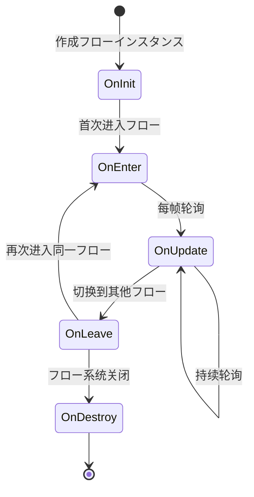

# ProcedureBase

フロー基クラス，に使用定义ゲーム中的各个フローステータス。

## 概要

`ProcedureBase` 是 GameFrameX フロー管理系统的コア抽象クラス，を継承 `FsmState<IProcedureManager>`。它提供しますゲームフロー生命周期的完整模板メソッド，開発者可能を通じて继承该クラス来作成自定义的ゲームフロー，如启动フロー、主菜单フロー、ゲームフロー、暂停フロー、结算フロー等。

**设计意图：**
GameFrameX 的フロー管理系统采用有限状態機械（FSM）模式设计。`ProcedureBase` 作为ステータス基クラス，为每个フローステータス定义了一套标准的生命周期钩子メソッド。这种设计使得ゲームフロー的管理变得清晰、可控，便于在不同フロー之间平滑切换，同时サポートフロー间的数据传递和ステータス保持。

**コア特性：**
- 完整的フロー生命周期管理（初期化 → 进入 → 更新 → 离开 → 销毁）
- サポート帧更新（Update）和固定帧更新（FixedUpdate）
- 基づく有限状態機械的フロー切换机制
- 与 ProcedureManager 无缝集成

## 架构

```mermaid
graph TD
    subgraph GameFrameX コア模块
        FsmState[FsmState&lt;IProcedureManager&gt;]
    end

    subgraph Procedure フロー模块
        ProcedureBase["ProcedureBase<br/>(抽象基底クラス)"]
        IProcedureManager[IProcedureManager<br/>(インターフェース)]
        ProcedureManager["ProcedureManager<br/>(フロー管理器)"]
    end

    subgraph Unity 集成层
        ProcedureComponent["ProcedureComponent<br/>(フローコンポーネント)"]
    end

    subgraph 自定义フロー
        CustomProcedure1["自定义フロー A<br/>(继承 ProcedureBase)"]
        CustomProcedure2["自定义フロー B<br/>(继承 ProcedureBase)"]
        CustomProcedureN["自定义フロー N<br/>(继承 ProcedureBase)"]
    end

    FsmState <|-- ProcedureBase
    ProcedureBase <|-- CustomProcedure1
    ProcedureBase <|-- CustomProcedure2
    ProcedureBase <|-- CustomProcedureN
    
    IProcedureManager <|.. ProcedureManager
    ProcedureManager --> ProcedureBase
    ProcedureComponent --> ProcedureManager
```

**架构説明：**

| コンポーネント | 角色 | 职责 |
|------|------|------|
| `FsmState<IProcedureManager>` | 基クラス | 提供有限状態機械的基础機能 |
| `ProcedureBase` | 抽象基底クラス | 定义フロー的标准生命周期模板 |
| `IProcedureManager` | インターフェース | 定义フロー管理器的标准操作 |
| `ProcedureManager` | 実装クラス | 管理和调度所有フローステータス |
| `ProcedureComponent` | Unityコンポーネント | 在 Unity 环境中初期化フロー系统 |
| 自定义フロー | 具体実装 | 继承 ProcedureBase 実装具体业务逻辑 |

## 生命周期



**生命周期阶段説明：**

| 阶段 | メソッド | 呼び出し时机 | 典型用途 |
|------|------|----------|----------|
| 初期化 | `OnInit` | フローインスタンス作成后首次进入前 | 初期化フロー数据、加载配置 |
| 进入 | `OnEnter` | 进入フローステータス时 | 准备フローリソース、显示界面 |
| 更新 | `OnUpdate` | 每帧呼び出し（逻辑帧） | 业务逻辑处理、ステータス检查 |
| 固定更新 | `OnFixedUpdate` | 固定时间间隔呼び出し | 物理関連逻辑 |
| 离开 | `OnLeave` | 离开フローステータス时 | 释放临时リソース、保存ステータス |
| 销毁 | `OnDestroy` | フロー系统关闭时 | 清理所有リソース |

## コアメソッド

### OnInit - フロー初期化

```csharp
protected override void OnInit(IFsm<IProcedureManager> procedureOwner)
```
> Source: [ProcedureBase.cs](https://github.com/GameFrameX/com.gameframex.unity.procedure/blob/main/Runtime/Procedure/ProcedureBase.cs#L22-L25)

在フローステータス首次初期化时呼び出し。此メソッド在フローインスタンス作成后、首次进入フロー前被呼び出し。

**设计意图：**
提供一次性的初期化机会，に使用加载フロー所需的静态数据、配置信息或预作成ゲーム对象。此メソッド在整个フロー生命周期中只会被呼び出し一次。

**参数：**
- `procedureOwner` (IFsm<IProcedureManager>)：フロー持有者的有限状態機械

---

### OnEnter - 进入フロー

```csharp
protected override void OnEnter(IFsm<IProcedureManager> procedureOwner)
```
> Source: [ProcedureBase.cs](https://github.com/GameFrameX/com.gameframex.unity.procedure/blob/main/Runtime/Procedure/ProcedureBase.cs#L31-L34)

当フローステータス从其他ステータス切换到当前ステータス时呼び出し。

**设计意图：**
每次进入フロー时都会呼び出し，适合に使用准备フロー所需的リソース、显示对应的 UI 界面、开始特定的サウンド或动画等。每次フロー被激活时都会触发。

**参数：**
- `procedureOwner` (IFsm<IProcedureManager>)：フロー持有者的有限状態機械

---

### OnUpdate - フロー更新

```csharp
protected override void OnUpdate(IFsm<IProcedureManager> procedureOwner, float elapseSeconds, float realElapseSeconds)
```
> Source: [ProcedureBase.cs](https://github.com/GameFrameX/com.gameframex.unity.procedure/blob/main/Runtime/Procedure/ProcedureBase.cs#L42-L45)

在フローステータス处于活动ステータス时每帧呼び出し。

**设计意图：**
这是実装フローコア业务逻辑的主要钩子。可能在这里检测フロー切换条件、更新ゲームステータス、处理用户输入等。

**参数：**
- `procedureOwner` (IFsm<IProcedureManager>)：フロー持有者的有限状態機械
- `elapseSeconds` (float)：逻辑流逝时间，以秒为单位（受时间缩放影响）
- `realElapseSeconds` (float)：真实流逝时间，以秒为单位（不受时间缩放影响）

---

### OnFixedUpdate - 固定频率更新

```csharp
protected override void OnFixedUpdate(IFsm<IProcedureManager> procedureOwner, float elapseSeconds, float realElapseSeconds)
```
> Source: [ProcedureBase.cs](https://github.com/GameFrameX/com.gameframex.unity.procedure/blob/main/Runtime/Procedure/ProcedureBase.cs#L53-L56)

以固定时间间隔呼び出し，に使用物理関連的逻辑处理。

**设计意图：**
Unity 的 FixedUpdate 以固定时间间隔（默认 0.02 秒）呼び出し，适合处理物理引擎関連逻辑，确保逻辑的确定性。

**参数：**
- `procedureOwner` (IFsm<IProcedureManager>)：フロー持有者的有限状態機械
- `elapseSeconds` (float)：逻辑流逝时间，以秒为单位
- `realElapseSeconds` (float)：真实流逝时间，以秒为单位

---

### OnLeave - 离开フロー

```csharp
protected override void OnLeave(IFsm<IProcedureManager> procedureOwner, bool isShutdown)
```
> Source: [ProcedureBase.cs](https://github.com/GameFrameX/com.gameframex.unity.procedure/blob/main/Runtime/Procedure/ProcedureBase.cs#L63-L66)

当フローステータス从当前ステータス切换到其他ステータス时呼び出し。

**设计意图：**
に使用清理当前フロー的临时リソース、保存ステータス数据、隐藏 UI 界面等。注意：如果 `isShutdown` 为 true，表示是关闭整个フロー系统而非切换フロー。

**参数：**
- `procedureOwner` (IFsm<IProcedureManager>)：フロー持有者的有限状態機械
- `isShutdown` (bool)：是否是关闭ステータス机时触发

---

### OnDestroy - フロー销毁

```csharp
protected override void OnDestroy(IFsm<IProcedureManager> procedureOwner)
```
> Source: [ProcedureBase.cs](https://github.com/GameFrameX/com.gameframex.unity.procedure/blob/main/Runtime/Procedure/ProcedureBase.cs#L72-L75)

当フローステータス被销毁时呼び出し。

**设计意图：**
在整个フロー系统关闭时呼び出し，に使用执行最终的清理工作，释放所有リソース。这是フロー生命周期的最后一个阶段。

**参数：**
- `procedureOwner` (IFsm<IProcedureManager>)：フロー持有者的有限状態機械

## 使用例

### 基本自定义フロー

作成一个简单的启动フロー：

```csharp
using GameFrameX.Procedure.Runtime;
using GameFrameX.Fsm.Runtime;

public class ProcedureLaunch : ProcedureBase
{
    protected override void OnInit(IFsm<IProcedureManager> procedureOwner)
    {
        base.OnInit(procedureOwner);
        // 初期化启动数据
    }

    protected override void OnEnter(IFsm<IProcedureManager> procedureOwner)
    {
        base.OnEnter(procedureOwner);
        // 显示启动界面
    }

    protected override void OnUpdate(IFsm<IProcedureManager> procedureOwner, float elapseSeconds, float realElapseSeconds)
    {
        base.OnUpdate(procedureOwner, elapseSeconds, realElapseSeconds);
        
        // 检查是否完成启动，可能切换到下一个フロー
        // procedureOwner.Owner.StartProcedure<ProcedureMenu>();
    }

    protected override void OnLeave(IFsm<IProcedureManager> procedureOwner, bool isShutdown)
    {
        base.OnLeave(procedureOwner, isShutdown);
        // 隐藏启动界面
    }
}
```

### フロー切换示例

在フロー中切换到另一个フロー：

```csharp
protected override void OnUpdate(IFsm<IProcedureManager> procedureOwner, float elapseSeconds, float realElapseSeconds)
{
    base.OnUpdate(procedureOwner, elapseSeconds, realElapseSeconds);
    
    // 假设满足某个条件后切换到菜单フロー
    if (someCondition)
    {
        // 取得フロー管理器并启动下一个フロー
        procedureOwner.Owner.StartProcedure<ProcedureMenu>();
    }
}
```

### 取得当前フロー信息

```csharp
// 在任意位置取得当前フロー和持续时间
var procedureComponent = UnityEngine.Object.FindObjectOfType<ProcedureComponent>();
var currentProcedure = procedureComponent.CurrentProcedure;
var elapsedTime = procedureComponent.CurrentProcedureTime;
```

## 与其他コンポーネント的关系

| コンポーネント | 关系 | 説明 |
|------|------|------|
| ProcedureComponent | 使用 | Unity コンポーネント，に使用初期化フロー系统 |
| ProcedureManager | 管理 | 实际管理 ProcedureBase ステータス转换的クラス |
| IProcedureManager | 実装 | ProcedureManager 実装的インターフェース |
| FsmState | 继承 | 来自 GameFrameX.Fsm 的基クラス |

## よくある質問

### Q: 为什么不直接在 Update 中处理逻辑？

**A:** `ProcedureBase` 提供します结构化的生命周期メソッド，这种设计：
- 使代码更清晰，每个阶段职责明确
- 便于调试和维护
- サポートステータス的正确进入/退出处理
- 与其他系统（如 UI 系统、リソース系统）更好地集成

### Q: 如何在フロー间传递数据？

**A:** 可能を通じて以下方法：
1. 使用静态变量（不推荐，可能导致内存泄漏）
2. 将数据存储在独立的配置クラス中，を通じて `procedureOwner.Owner` 取得 ProcedureManager 访问
3. 使用ゲームフレームワーク的数据库或配置系统

### Q: OnInit 和 OnEnter 有什么区别？

**A:** 
- `OnInit`：只在フローインスタンス作成后呼び出し一次，整个生命周期中不会再呼び出し
- `OnEnter`：每次进入该フローステータス时都会呼び出し，可能被呼び出し多次

## 関連リンク

- [ProcedureComponent](./3-core-concepts.procedure-component) - フローコンポーネント
- [IProcedureManager](./3-core-concepts.iprocedure-manager) - フロー管理器インターフェース
- [ProcedureManager](./3-core-concepts.procedure-manager) - フロー管理器実装
- [自定义フロー](./4-custom-procedures) - 作成自定义フロー
