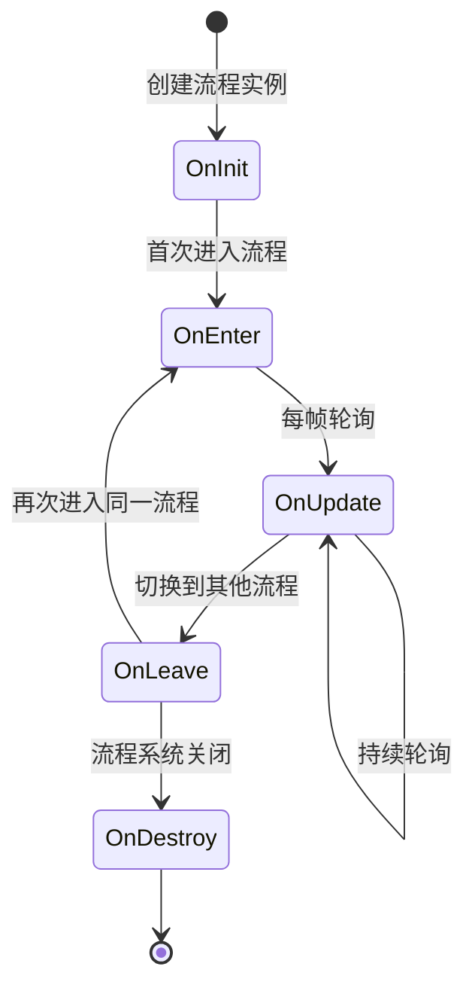

# ProcedureBase

フロー基底クラス，用于定義游戏中的各个フローステータス。

## 概要

`ProcedureBase` 是 GameFrameX フロー管理系统的コア抽象类，継承自 `FsmState<IProcedureManager>`。它提供します游戏フローライフサイクル的完全な模板メソッド，開発者〜できます通过継承このクラス来作成自定義的游戏フロー，如启动フロー、主メニューフロー、游戏フロー、暂停フロー、结算フロー等。

**設計意图：**
GameFrameX 的フロー管理系统采用有限ステータス机（FSM）モード設計。`ProcedureBase` 作为ステータス基底クラス，为每个フローステータス定義了一套標準的ライフサイクル钩子メソッド。这种設計使得游戏フロー的管理变得清晰、可控，便于在不同フロー之间平滑切换，同時にサポートフロー间的数据传递和ステータス保持。

**コア特性：**
- 完全な的フローライフサイクル管理（初期化 → 进入 → アップデート → 离开 → 破棄）
- サポート帧アップデート（Update）和固定帧アップデート（FixedUpdate）
- 基于有限ステータス机的フロー切换机制
- 与 ProcedureManager 无缝集成

## アーキテクチャ

```mermaid
graph TD
    subgraph GameFrameX 核心模块
        FsmState[FsmState&lt;IProcedureManager&gt;]
    end

    subgraph Procedure 流程模块
        ProcedureBase["ProcedureBase<br/>(抽象基类)"]
        IProcedureManager[IProcedureManager<br/>(接口)]
        ProcedureManager["ProcedureManager<br/>(流程管理器)"]
    end

    subgraph Unity 集成层
        ProcedureComponent["ProcedureComponent<br/>(流程组件)"]
    end

    subgraph 自定义流程
        CustomProcedure1["自定义流程 A<br/>(继承 ProcedureBase)"]
        CustomProcedure2["自定义流程 B<br/>(继承 ProcedureBase)"]
        CustomProcedureN["自定义流程 N<br/>(继承 ProcedureBase)"]
    end

    FsmState <|-- ProcedureBase
    ProcedureBase <|-- CustomProcedure1
    ProcedureBase <|-- CustomProcedure2
    ProcedureBase <|-- CustomProcedureN
    
    IProcedureManager <|.. ProcedureManager
    ProcedureManager --> ProcedureBase
    ProcedureComponent --> ProcedureManager
```

**アーキテクチャ説明：**

| コンポーネント | 角色 | 职责 |
|------|------|------|
| `FsmState<IProcedureManager>` | 基底クラス | 提供有限ステータス机的基本機能 |
| `ProcedureBase` | 抽象基底クラス | 定義フロー的標準ライフサイクル模板 |
| `IProcedureManager` | インターフェース | 定義フローマネージャー的標準操作 |
| `ProcedureManager` | 実装类 | 管理和调度所有フローステータス |
| `ProcedureComponent` | Unityコンポーネント | 在 Unity 環境中初期化フロー系统 |
| 自定義フロー | 具体実装 | 継承 ProcedureBase 実装具体业务逻辑 |

## ライフサイクル



**ライフサイクルフェーズ説明：**

| フェーズ | メソッド | 呼び出し时机 | 典型用途 |
|------|------|----------|----------|
| 初期化 | `OnInit` | フローインスタンス作成后首次进入前 | 初期化フロー数据、ロード設定 |
| 进入 | `OnEnter` | 进入フローステータス时 | 准备フローリソース、显示界面 |
| アップデート | `OnUpdate` | 每帧呼び出し（逻辑帧） | 业务逻辑処理、ステータス確認 |
| 固定アップデート | `OnFixedUpdate` | 固定时间间隔呼び出し | 物理相关逻辑 |
| 离开 | `OnLeave` | 离开フローステータス时 | 解放临时リソース、保存ステータス |
| 破棄 | `OnDestroy` | フロー系统閉じる时 | 清理所有リソース |

## コアメソッド

### OnInit - フロー初期化

```csharp
protected override void OnInit(IFsm<IProcedureManager> procedureOwner)
```
> Source: [ProcedureBase.cs](https://github.com/GameFrameX/com.gameframex.unity.procedure/blob/main/Runtime/Procedure/ProcedureBase.cs#L22-L25)

在フローステータス首次初期化时呼び出し。此メソッド在フローインスタンス作成后、首次进入フロー前被呼び出し。

**設計意图：**
提供一次性的初期化机会，用于ロードフロー所需的静态数据、設定情報或预作成游戏对象。此メソッド在整个フローライフサイクル中只会被呼び出し一次。

**パラメータ：**
- `procedureOwner` (IFsm<IProcedureManager>)：フロー持有者的有限ステータス机

---

### OnEnter - 进入フロー

```csharp
protected override void OnEnter(IFsm<IProcedureManager> procedureOwner)
```
> Source: [ProcedureBase.cs](https://github.com/GameFrameX/com.gameframex.unity.procedure/blob/main/Runtime/Procedure/ProcedureBase.cs#L31-L34)

当フローステータス从其他ステータス切换到当前ステータス时呼び出し。

**設計意图：**
每次进入フロー时都会呼び出し，适合用于准备フロー所需的リソース、显示对应的 UI 界面、开始特定的声音或动画等。每次フロー被激活时都会トリガー。

**パラメータ：**
- `procedureOwner` (IFsm<IProcedureManager>)：フロー持有者的有限ステータス机

---

### OnUpdate - フローアップデート

```csharp
protected override void OnUpdate(IFsm<IProcedureManager> procedureOwner, float elapseSeconds, float realElapseSeconds)
```
> Source: [ProcedureBase.cs](https://github.com/GameFrameX/com.gameframex.unity.procedure/blob/main/Runtime/Procedure/ProcedureBase.cs#L42-L45)

在フローステータス处于活动ステータス时每帧呼び出し。

**設計意图：**
这是実装フローコア业务逻辑的主な钩子。〜できます在这里检测フロー切换条件、アップデート游戏ステータス、処理ユーザー输入等。

**パラメータ：**
- `procedureOwner` (IFsm<IProcedureManager>)：フロー持有者的有限ステータス机
- `elapseSeconds` (float)：逻辑流逝时间，以秒为单位（受时间缩放影响）
- `realElapseSeconds` (float)：真实流逝时间，以秒为单位（不受时间缩放影响）

---

### OnFixedUpdate - 固定频率アップデート

```csharp
protected override void OnFixedUpdate(IFsm<IProcedureManager> procedureOwner, float elapseSeconds, float realElapseSeconds)
```
> Source: [ProcedureBase.cs](https://github.com/GameFrameX/com.gameframex.unity.procedure/blob/main/Runtime/Procedure/ProcedureBase.cs#L53-L56)

以固定时间间隔呼び出し，用于物理相关的逻辑処理。

**設計意图：**
Unity 的 FixedUpdate 以固定时间间隔（デフォルト 0.02 秒）呼び出し，适合処理物理引擎相关逻辑，確認してください逻辑的确定性。

**パラメータ：**
- `procedureOwner` (IFsm<IProcedureManager>)：フロー持有者的有限ステータス机
- `elapseSeconds` (float)：逻辑流逝时间，以秒为单位
- `realElapseSeconds` (float)：真实流逝时间，以秒为单位

---

### OnLeave - 离开フロー

```csharp
protected override void OnLeave(IFsm<IProcedureManager> procedureOwner, bool isShutdown)
```
> Source: [ProcedureBase.cs](https://github.com/GameFrameX/com.gameframex.unity.procedure/blob/main/Runtime/Procedure/ProcedureBase.cs#L63-L66)

当フローステータス从当前ステータス切换到其他ステータス时呼び出し。

**設計意图：**
用于清理当前フロー的临时リソース、保存ステータス数据、隐藏 UI 界面等。注意：もし `isShutdown` 为 true，表示是閉じる整个フロー系统而非切换フロー。

**パラメータ：**
- `procedureOwner` (IFsm<IProcedureManager>)：フロー持有者的有限ステータス机
- `isShutdown` (bool)：是否是閉じるステータス机时トリガー

---

### OnDestroy - フロー破棄

```csharp
protected override void OnDestroy(IFsm<IProcedureManager> procedureOwner)
```
> Source: [ProcedureBase.cs](https://github.com/GameFrameX/com.gameframex.unity.procedure/blob/main/Runtime/Procedure/ProcedureBase.cs#L72-L75)

当フローステータス被破棄时呼び出し。

**設計意图：**
在整个フロー系统閉じる时呼び出し，用于执行最终的清理工作，解放所有リソース。这是フローライフサイクル的最後に一个フェーズ。

**パラメータ：**
- `procedureOwner` (IFsm<IProcedureManager>)：フロー持有者的有限ステータス机

## 使用例

### 基本自定義フロー

作成一个シンプル的启动フロー：

```csharp
using GameFrameX.Procedure.Runtime;
using GameFrameX.Fsm.Runtime;

public class ProcedureLaunch : ProcedureBase
{
    protected override void OnInit(IFsm<IProcedureManager> procedureOwner)
    {
        base.OnInit(procedureOwner);
        // 初始化启动数据
    }

    protected override void OnEnter(IFsm<IProcedureManager> procedureOwner)
    {
        base.OnEnter(procedureOwner);
        // 显示启动界面
    }

    protected override void OnUpdate(IFsm<IProcedureManager> procedureOwner, float elapseSeconds, float realElapseSeconds)
    {
        base.OnUpdate(procedureOwner, elapseSeconds, realElapseSeconds);
        
        // 检查是否完成启动，可以切换到下一个流程
        // procedureOwner.Owner.StartProcedure<ProcedureMenu>();
    }

    protected override void OnLeave(IFsm<IProcedureManager> procedureOwner, bool isShutdown)
    {
        base.OnLeave(procedureOwner, isShutdown);
        // 隐藏启动界面
    }
}
```

### フロー切换例

在フロー中切换到另一个フロー：

```csharp
protected override void OnUpdate(IFsm<IProcedureManager> procedureOwner, float elapseSeconds, float realElapseSeconds)
{
    base.OnUpdate(procedureOwner, elapseSeconds, realElapseSeconds);
    
    // 假设满足某个条件后切换到菜单流程
    if (someCondition)
    {
        // 获取流程管理器并启动下一个流程
        procedureOwner.Owner.StartProcedure<ProcedureMenu>();
    }
}
```

### 取得当前フロー情報

```csharp
// 在任意位置获取当前流程和持续时间
var procedureComponent = UnityEngine.Object.FindObjectOfType<ProcedureComponent>();
var currentProcedure = procedureComponent.CurrentProcedure;
var elapsedTime = procedureComponent.CurrentProcedureTime;
```

## 与其他コンポーネント的关系

| コンポーネント | 关系 | 説明 |
|------|------|------|
| ProcedureComponent | 使用 | Unity コンポーネント，用于初期化フロー系统 |
| ProcedureManager | 管理 | 实际管理 ProcedureBase ステータス转换的类 |
| IProcedureManager | 実装 | ProcedureManager 実装的インターフェース |
| FsmState | 継承 | 来自 GameFrameX.Fsm 的基底クラス |

## よくある問題

### Q: 为什么不直接在 Update 中処理逻辑？

**A:** `ProcedureBase` 提供します结构化的ライフサイクルメソッド，这种設計：
- 使コード更清晰，每个フェーズ职责明确
- 便于デバッグ和维护
- サポートステータス的正确进入/退出処理
- 与其他系统（如 UI 系统、リソースシステム）更好地集成

### Q: 如何在フロー间传递数据？

**A:** 〜できます通过以下方法：
1. 使用静态变量（不推奨，〜の可能性があります导致内存泄漏）
2. 将数据存储在独立的設定类中，通过 `procedureOwner.Owner` 取得 ProcedureManager 访问
3. 使用游戏フレームワーク的数据库或設定系统

### Q: OnInit 和 OnEnter 有什么区别？

**A:** 
- `OnInit`：只在フローインスタンス作成后呼び出し一次，整个ライフサイクル中不会再呼び出し
- `OnEnter`：每次进入このフローステータス时都会呼び出し，〜の可能性があります被呼び出し多次

## 関連リンク

- [ProcedureComponent](./3-core-concepts.procedure-component) - フローコンポーネント
- [IProcedureManager](./3-core-concepts.iprocedure-manager) - フローマネージャーインターフェース
- [ProcedureManager](./3-core-concepts.procedure-manager) - フローマネージャー実装
- [自定義フロー](./4-custom-procedures) - 作成自定義フロー
