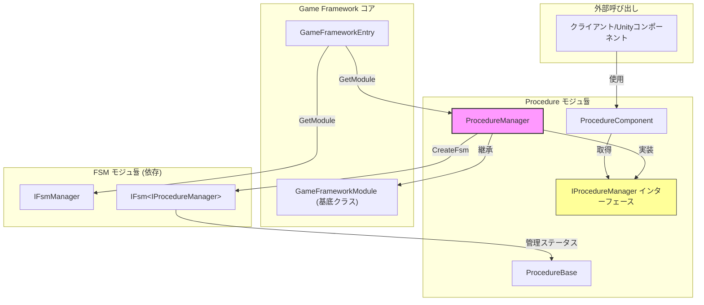

# ProcedureManager

ProcedureManager は GameFrameX フロー管理システムのコア実装クラスであり、ゲーム内のさまざまなフローステータスとその切り替えを管理することを負責します。

## 概要

ProcedureManager は `IProcedureManager` インターフェースを実装し、`GameFrameworkModule` 基底クラスを継承しており、フロー管理モジュールの主要な実装です。有限状態機械（FSM）に基づいてフローの作成、切り替え、管理機能を実装しています。

**設計意図：**
- 統一されたフローマネジメントメカニズムを提供し、ゲームが異なる段階（起動、メニュース、游戏中、一時停止、精算など）の間をスムーズに切り替えられることをサポート
- FSM の特性を活用し、フロー切り替えの信頼性とトレーサビリティを確保
- GameFramework のコアモジュールとして、ホットアップデートとモジュール化拡張をサポート

## アーキテクチャ



### コンポーネントの責任

| コンポーネント | 責任 |
|------|------|
| **ProcedureManager** | コア実装クラス。フローの作成、切り替え、查询を管理 |
| **IProcedureManager** | インターフェース定義。フロー管理操作を抽象化 |
| **ProcedureComponent** | Unity コンポーネント。シーンでフローを構成して初期化するために使用 |
| **ProcedureBase** | フローの基底クラス。各具体的なフローはこのクラスを継承 |
| **IFsmManager** | 有限状態機械マネージャー（外部依存） |

## コア機能

### 1. フローマネージャーの初期化

フローマネージャーを使用する前に、まず初期化する必要があります。初期化時に FSM マネージャーとすべての利用可能なフローの型を提供する必要があります。

```csharp
public void Initialize(IFsmManager fsmManager, params ProcedureBase[] procedures)
```

> Source: [ProcedureManager.cs](https://github.com/GameFrameX/com.gameframex.unity.procedure/blob/main/Runtime/Procedure/ProcedureManager.cs#L104-L110)

**パラメータの説明：**
- `fsmManager`: 有限状態機械マネージャー。FSM インスタンスの作成と管理を担当
- `procedures`: 利用可能なフローインスタンス配列

### 2. フローの起動

初期化完了後、フローマネージャーを起動するためにエントリーポイントフローを指定する必要があります。

```csharp
// ジェネリックメソッド
public void StartProcedure<T>() where T : ProcedureBase

// Typeメソッド
public void StartProcedure(Type procedureType)
```

> Source: [ProcedureManager.cs](https://github.com/GameFrameX/com.gameframex.unity.procedure/blob/main/Runtime/Procedure/ProcedureManager.cs#L116-L138)

### 3. フローステータスの查询

現在のフロー情報と特定のフローが存在するかどうかを確認する複数の方法を提供します。

```csharp
// 現在のフローを取得
public ProcedureBase CurrentProcedure { get; }

// 現在のフローの継続時間を取得
public float CurrentProcedureTime { get; }

// 指定されたフローが存在するかどうかを確認（ジェネリック）
public bool HasProcedure<T>() where T : ProcedureBase

// 指定されたフローが存在するかどうかを確認（Type）
public bool HasProcedure(Type procedureType)
```

> Source: [ProcedureManager.cs](https://github.com/GameFrameX/com.gameframex.unity.procedure/blob/main/Runtime/Procedure/ProcedureManager.cs#L44-L71), [L145-L168](https://github.com/GameFrameX/com.gameframex.unity.procedure/blob/main/Runtime/Procedure/ProcedureManager.cs#L145-L168)

### 4. フローインスタンスの取得

実行時に任意の 등록된 フローインスタンスを取得して操作できます。

```csharp
// ジェネリックメソッドで取得
public ProcedureBase GetProcedure<T>() where T : ProcedureBase

// Typeメソッドで取得
public ProcedureBase GetProcedure(Type procedureType)
```

> Source: [ProcedureManager.cs](https://github.com/GameFrameX/com.gameframex.unity.procedure/blob/main/Runtime/Procedure/ProcedureManager.cs#L175-L198)

## フロー切り替えフロー

```mermaid
sequenceDiagram
    participant Unity as Unityエンジン
    participant PC as ProcedureComponent
    participant PM as ProcedureManager
    participant FSM as IFsmManager
    participant PB as ProcedureBase

    Unity->>PC: Awake()
    PC->>PM: GameFrameworkEntry.GetModule&lt;IProcedureManager&gt;()
    PC->>PC: Start() コルーチン
    PC->>PM: Initialize(fsmManager, procedures)
    PM->>FSM: CreateFsm(this, procedures)
    FSM-->>PM: IFsm&lt;IProcedureManager&gt;
    PM-->>PC: 初期化完了
    PC->>PM: StartProcedure&lt;T&gt;()
    PM->>FSM: Start&lt;T&gt;()
    FSM->>PB: OnEnter() - フローに入る
    Note over FSM,PB: フロー実行中...
    PB->>FSM: フロー切り替えをトリガー
    FSM->>PB: OnLeave() - 旧フローを離れる
    FSM->>PB: OnEnter() - 新フローに進入
```

## 使用例

### 基本的な使用フロー

1. **カスタムフロークラスの作成**

```csharp
using GameFrameX.Procedure.Runtime;

public class LoginProcedure : ProcedureBase
{
    protected override void OnEnter(IFsm<IProcedureManager> procedureOwner)
    {
        base.OnEnter(procedureOwner);
        // ログインフローの初期化
    }

    protected override void OnUpdate(IFsm<IProcedureManager> procedureOwner, float elapseSeconds, float realElapseSeconds)
    {
        base.OnUpdate(procedureOwner, elapseSeconds, realElapseSeconds);
        // 切り替え条件を満たすかどうかを確認
        // 満たしていれば、次のフローに切り替え
    }
}

public class GameProcedure : ProcedureBase
{
    protected override void OnEnter(IFsm<IProcedureManager> procedureOwner)
    {
        base.OnEnter(procedureOwner);
        // ゲームを開始
    }
}
```

2. **ProcedureComponent の構成**

Unity シーンに `ProcedureComponent` コンポーネントを追加し、次のように構成します：
- `Available Procedure Type Names`: すべてのフローの型名を追加
- `Entrance Procedure Type Name`: エントリーポイントフローの型名を設定

3. **コードでフローを切り替え**

```csharp
// ある Procedure で次のフローに切り替え
public class LoginProcedure : ProcedureBase
{
    protected override void OnUpdate(IFsm<IProcedureManager> procedureOwner, float elapseSeconds, float realElapseSeconds)
    {
        base.OnUpdate(procedureOwner, elapseSeconds, realElapseSeconds);

        // ログイン完了後、ゲームフローに切り替え
        if (IsLoginSuccess)
        {
            procedureOwner.ChangeState<GameProcedure>();
        }
    }
}
```

> Source: [ProcedureBase.cs](https://github.com/GameFrameX/com.gameframex.unity.procedure/blob/main/Runtime/Procedure/ProcedureBase.cs#L1-L77)

### ProcedureManager を直接使用

ProcedureComponent を通さずに ProcedureManager を直接使用する必要がある場合：

```csharp
// フローマネージャーを取得
IProcedureManager procedureManager = GameFrameworkEntry.GetModule<IProcedureManager>();

// FSM マネージャーを取得
IFsmManager fsmManager = GameFrameworkEntry.GetModule<IFsmManager>();

// 初期化
procedureManager.Initialize(fsmManager, new LoginProcedure(), new GameProcedure());

// エントリーポイントフローを起動
procedureManager.StartProcedure<LoginProcedure>();

// ゲームループで查询
ProcedureBase current = procedureManager.CurrentProcedure;
float time = procedureManager.CurrentProcedureTime;
```

## API リファレンス

### プロパティ

| プロパティ | 型 | 説明 |
|------|------|------|
| **CurrentProcedure** | `ProcedureBase` | 現在実行中のフローインスタンスを取得 |
| **CurrentProcedureTime** | `float` | 現在のフローが継続している時間（秒）を取得 |

### メソッド

#### `Initialize(IFsmManager fsmManager, params ProcedureBase[] procedures)`

フローマネージャーを初期化します。

**パラメータ：**
- `fsmManager` (IFsmManager): 有限状態機械マネージャー
- `procedures` (params ProcedureBase[]): 利用可能なフローインスタンス配列

**例外：**
- `GameFrameworkException`: fsmManager が null の場合にスロー

---

#### `StartProcedure<T>() where T : ProcedureBase`

指定されたフローを開始（ジェネリックメソッド）。

**パラメータ：**
- なし

**例外：**
- `GameFrameworkException`: フローマネージャーが未初期化の場合にスロー

---

#### `StartProcedure(Type procedureType)`

指定されたフローを開始（Type メソッド）。

**パラメータ：**
- `procedureType` (Type): 開始するフローの型

**例外：**
- `GameFrameworkException`: フローマネージャーが未初期化の場合にスロー

---

#### `HasProcedure<T>() where T : ProcedureBase`

指定されたフローが存在するかどうかを確認。

**返り値：**
- `bool`: 存在すれば true、否则は false

**例外：**
- `GameFrameworkException`: フローマネージャーが未初期化の場合にスロー

---

#### `GetProcedure<T>() where T : ProcedureBase`

指定された型のフローインスタンスを取得。

**返り値：**
- `ProcedureBase`: フローインスタンス

**例外：**
- `GameFrameworkException`: フローマネージャーが未初期化の場合にスロー

---

### ライフサイクルメソッド

ProcedureManager は `GameFrameworkModule` を継承しており、主要なライフサイクルソッド：

| メソッド | 説明 |
|------|------|
| `Update(elapseSeconds, realElapseSeconds)` | ポーリングメソッド。現在の実装は空（FSM が自行で処理） |
| `Shutdown()` | フローマネージャーを关闭してクリーンアップし、FSM を破棄 |

> Source: [ProcedureManager.cs](https://github.com/GameFrameX/com.gameframex.unity.procedure/blob/main/Runtime/Procedure/ProcedureManager.cs#L78-L97)

## 依存関係

ProcedureManager は以下のコンポーネントに依存しています：

| 依存項目 | 説明 | ソース |
|--------|------|------|
| **IFsmManager** | 有限状態機械マネージャー | GameFrameX.Fsm.Runtime |
| **IFsm\<IProcedureManager\>** | フローステータス機械インスタンス | GameFrameX.Fsm.Runtime |
| **GameFrameworkModule** | GameFramework モジュール基底クラス | GameFrameX.Runtime |
| **ProcedureBase** | フローの基底クラス | 本モジュール |

## 関連リンク

- [IProcedureManager](./05.iprocedure-manager.md) - フローマネージャーインターフェース定義
- [ProcedureBase](./06.procedure-base.md) - フローの基底クラス
- [ProcedureComponent](./08.procedure-component.md) - Unity フローコンポーネント
- [FSM モジュ듈](https://github.com/GameFrameX/com.alianblank.gameframex.unity.fsm) - 有限状態機械モジュ듈
- [カスタムフロー](./09.custom-procedures.md) - カスタムフローの作成方法
