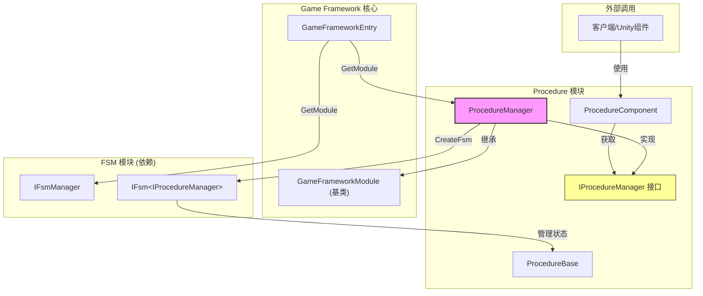

# ProcedureManager

ProcedureManager 是 GameFrameX フロー管理系统的コア実装类，负责管理游戏中的各种フローステータス及其切换。

## 概要

ProcedureManager 実装了 `IProcedureManager` インターフェース，継承自 `GameFrameworkModule` 基底クラス，是フロー管理モジュール的主な実装。它基于有限ステータス机（FSM）来実装フロー的作成、切换和管理機能。

**設計意图：**
- 提供統一された的フロー管理机制，サポート游戏在不同フェーズ（如启动、メニュー、游戏中、暂停、结算等）之间平滑切换
- 利用 FSM 的特性，確認してくださいフロー切换的可靠性和可追踪性
- 作为 GameFramework 的コアモジュール，サポートホットアップデート和モジュール化拡張

## アーキテクチャ



### コンポーネント职责

| コンポーネント | 职责 |
|------|------|
| **ProcedureManager** | コア実装类，管理フロー的作成、切换、查询 |
| **IProcedureManager** | インターフェース定義，抽象フロー管理操作 |
| **ProcedureComponent** | Unity コンポーネント，用于在シーン中設定和初期化フロー |
| **ProcedureBase** | フロー基底クラス，每个具体フロー継承此类 |
| **IFsmManager** | 有限ステータス机マネージャー（外部依赖） |

## コア機能

### 1. 初期化フローマネージャー

在使用フローマネージャー之前，〜する必要があります先进行初期化。初期化时〜する必要があります提供 FSM マネージャー和所有可用的フロータイプ。

```csharp
public void Initialize(IFsmManager fsmManager, params ProcedureBase[] procedures)
```

> Source: [ProcedureManager.cs](https://github.com/GameFrameX/com.gameframex.unity.procedure/blob/main/Runtime/Procedure/ProcedureManager.cs#L104-L110)

**パラメータ説明：**
- `fsmManager`: 有限ステータス机マネージャー，负责作成和管理 FSM インスタンス
- `procedures`: 可用的フローインスタンス数组

### 2. 启动フロー

初期化完成后，〜する必要があります指定一个入口フロー来启动フローマネージャー。

```csharp
// 泛型方式
public void StartProcedure<T>() where T : ProcedureBase

// Type方式
public void StartProcedure(Type procedureType)
```

> Source: [ProcedureManager.cs](https://github.com/GameFrameX/com.gameframex.unity.procedure/blob/main/Runtime/Procedure/ProcedureManager.cs#L116-L138)

### 3. 查询フローステータス

提供多种方法查询当前フロー情報和確認特定フロー是否存在。

```csharp
// 获取当前流程
public ProcedureBase CurrentProcedure { get; }

// 获取当前流程持续时间
public float CurrentProcedureTime { get; }

// 检查是否存在指定流程（泛型）
public bool HasProcedure<T>() where T : ProcedureBase

// 检查是否存在指定流程（Type）
public bool HasProcedure(Type procedureType)
```

> Source: [ProcedureManager.cs](https://github.com/GameFrameX/com.gameframex.unity.procedure/blob/main/Runtime/Procedure/ProcedureManager.cs#L44-L71), [L145-L168](https://github.com/GameFrameX/com.gameframex.unity.procedure/blob/main/Runtime/Procedure/ProcedureManager.cs#L145-L168)

### 4. 取得フローインスタンス

〜できます在ランタイム取得任意已登録的フローインスタンス进行操作。

```csharp
// 泛型方式获取
public ProcedureBase GetProcedure<T>() where T : ProcedureBase

// Type方式获取
public ProcedureBase GetProcedure(Type procedureType)
```

> Source: [ProcedureManager.cs](https://github.com/GameFrameX/com.gameframex.unity.procedure/blob/main/Runtime/Procedure/ProcedureManager.cs#L175-L198)

## フロー切换フロー

```mermaid
sequenceDiagram
    participant Unity as Unity引擎
    participant PC as ProcedureComponent
    participant PM as ProcedureManager
    participant FSM as IFsmManager
    participant PB as ProcedureBase

    Unity->>PC: Awake()
    PC->>PM: GameFrameworkEntry.GetModule&lt;IProcedureManager&gt;()
    PC->>PC: Start() 协程
    PC->>PM: Initialize(fsmManager, procedures)
    PM->>FSM: CreateFsm(this, procedures)
    FSM-->>PM: IFsm&lt;IProcedureManager&gt;
    PM-->>PC: 初始化完成
    PC->>PM: StartProcedure&lt;T&gt;()
    PM->>FSM: Start&lt;T&gt;()
    FSM->>PB: OnEnter() - 进入流程
    Note over FSM,PB: 流程运行中...
    PB->>FSM: 触发流程切换
    FSM->>PB: OnLeave() - 离开旧流程
    FSM->>PB: OnEnter() - 进入新流程
```

## 使用例

### 基本使用フロー

1. **作成自定義フロー类**

```csharp
using GameFrameX.Procedure.Runtime;

public class LoginProcedure : ProcedureBase
{
    protected override void OnEnter(IFsm<IProcedureManager> procedureOwner)
    {
        base.OnEnter(procedureOwner);
        // 初始化登录流程
    }

    protected override void OnUpdate(IFsm<IProcedureManager> procedureOwner, float elapseSeconds, float realElapseSeconds)
    {
        base.OnUpdate(procedureOwner, elapseSeconds, realElapseSeconds);
        // 检查是否满足切换条件
        // 如果满足，切换到下一个流程
    }
}

public class GameProcedure : ProcedureBase
{
    protected override void OnEnter(IFsm<IProcedureManager> procedureOwner)
    {
        base.OnEnter(procedureOwner);
        // 开始游戏
    }
}
```

2. **設定 ProcedureComponent**

在 Unity シーン中追加 `ProcedureComponent` コンポーネント，并設定：
- `Available Procedure Type Names`: 追加所有フロー的タイプ名称
- `Entrance Procedure Type Name`: 設定入口フロータイプ名称

3. **在コード中切换フロー**

```csharp
// 假设在某个 Procedure 中切换到下一个流程
public class LoginProcedure : ProcedureBase
{
    protected override void OnUpdate(IFsm<IProcedureManager> procedureOwner, float elapseSeconds, float realElapseSeconds)
    {
        base.OnUpdate(procedureOwner, elapseSeconds, realElapseSeconds);
        
        // 登录完成后，切换到游戏流程
        if (IsLoginSuccess)
        {
            procedureOwner.ChangeState<GameProcedure>();
        }
    }
}
```

> Source: [ProcedureBase.cs](https://github.com/GameFrameX/com.gameframex.unity.procedure/blob/main/Runtime/Procedure/ProcedureBase.cs#L1-L77)

### 直接使用 ProcedureManager

もし〜する必要があります直接使用 ProcedureManager 而非通过 ProcedureComponent：

```csharp
// 获取流程管理器
IProcedureManager procedureManager = GameFrameworkEntry.GetModule<IProcedureManager>();

// 获取 FSM 管理器
IFsmManager fsmManager = GameFrameworkEntry.GetModule<IFsmManager>();

// 初始化
procedureManager.Initialize(fsmManager, new LoginProcedure(), new GameProcedure());

// 启动入口流程
procedureManager.StartProcedure<LoginProcedure>();

// 在游戏循环中查询
ProcedureBase current = procedureManager.CurrentProcedure;
float time = procedureManager.CurrentProcedureTime;
```

## API リファレンス

### プロパティ

| プロパティ | タイプ | 説明 |
|------|------|------|
| **CurrentProcedure** | `ProcedureBase` | 取得当前〜中执行的フローインスタンス |
| **CurrentProcedureTime** | `float` | 取得当前フロー已持续的时间（秒） |

### メソッド

#### `Initialize(IFsmManager fsmManager, params ProcedureBase[] procedures)`

初期化フローマネージャー。

**パラメータ：**
- `fsmManager` (IFsmManager): 有限ステータス机マネージャー
- `procedures` (params ProcedureBase[]): 可用的フローインスタンス数组

**例外：**
- `GameFrameworkException`: 当 fsmManager 为 null 时抛出

---

#### `StartProcedure<T>() where T : ProcedureBase`

开始指定的フロー（ジェネリック方法）。

**パラメータ：**
- 无

**例外：**
- `GameFrameworkException`: 当フローマネージャー未初期化时抛出

---

#### `StartProcedure(Type procedureType)`

开始指定的フロー（Type 方法）。

**パラメータ：**
- `procedureType` (Type): 要开始的フロータイプ

**例外：**
- `GameFrameworkException`: 当フローマネージャー未初期化时抛出

---

#### `HasProcedure<T>() where T : ProcedureBase`

確認是否存在指定的フロー。

**返す：** 
- `bool`: もし存在返す true，否则返す false

**例外：**
- `GameFrameworkException`: 当フローマネージャー未初期化时抛出

---

#### `GetProcedure<T>() where T : ProcedureBase`

取得指定タイプ的フローインスタンス。

**返す：** 
- `ProcedureBase`: フローインスタンス

**例外：**
- `GameFrameworkException`: 当フローマネージャー未初期化时抛出

---

### ライフサイクルメソッド

ProcedureManager 継承自 `GameFrameworkModule`，主なライフサイクルメソッド：

| メソッド | 説明 |
|------|------|
| `Update(elapseSeconds, realElapseSeconds)` | 轮询メソッド，当前実装为空（由 FSM 自行処理） |
| `Shutdown()` | 閉じる并清理フローマネージャー，破棄 FSM |

> Source: [ProcedureManager.cs](https://github.com/GameFrameX/com.gameframex.unity.procedure/blob/main/Runtime/Procedure/ProcedureManager.cs#L78-L97)

## 依赖关系

ProcedureManager 依赖以下コンポーネント：

| 依赖项 | 説明 | 来源 |
|--------|------|------|
| **IFsmManager** | 有限ステータス机マネージャー | GameFrameX.Fsm.Runtime |
| **IFsm\<IProcedureManager\>** | フローステータス机インスタンス | GameFrameX.Fsm.Runtime |
| **GameFrameworkModule** | GameFramework モジュール基底クラス | GameFrameX.Runtime |
| **ProcedureBase** | フロー基底クラス | 本モジュール |

## 関連リンク

- [IProcedureManager](./3-core-concepts.iprocedure-manager) - フローマネージャーインターフェース定義
- [ProcedureBase](./3-core-concepts.procedure-base) - フロー基底クラス
- [ProcedureComponent](./3-core-concepts.procedure-component) - Unity フローコンポーネント
- [FSM モジュール](https://github.com/GameFrameX/com.alianblank.gameframex.unity.fsm) - 有限ステータス机モジュール
- [自定義フロー](./4-custom-procedures) - 如何作成自定義フロー
