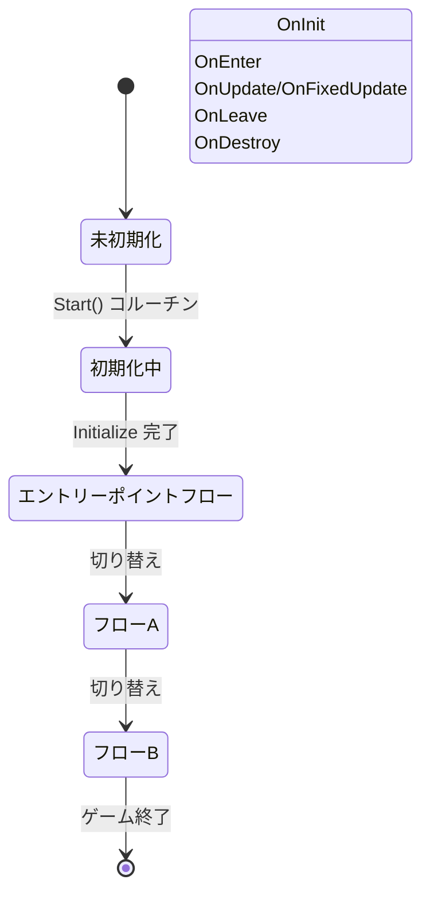

# ProcedureComponent

ProcedureComponent は GameFrameX フローシステムのコア Unity コンポーネントであり、ゲーム内のさまざまなフローステータスの管理与り調整を負責します。

## 概要

ProcedureComponent は Unity MonoBehaviour コンポーネントであり、ゲームフロ管理のエントリーポイントです。IProcedureManager インターフェースを캡슐화 し、Unity 向けのコンポーネント化されたインターフェースを提供し、Unity エディターでの構成と管理を便利にします。

このコンポーネントの主な責任は次のとおりです：
- ゲーム起動時にフローマネージャーを初期化
- リフレクションを通じてすべての利用可能なフローインスタンスを作成
- エントリーポイントフローを自動的に起動
- フローの查询と取得のためのパブリックインターフェースを提供

### コアコンセプト

| コンセプト | 説明 |
|------|------|
| **フロー (Procedure)** | ゲーム内の異なる段階またはステータス。起動フロー、メニュースフロー、ゲームフローなど |
| **エントリーポイントフロー (Entrance Procedure)** | ゲーム起動時に最初に実行されるフロー |
| **フローマネージャー (ProcedureManager)** | すべてのフローの作成、切り替え、破棄を管理することを負責 |

## アーキテクチャ

```mermaid
flowchart TD
    subgraph Unity["Unity 層面"]
        PC[ProcedureComponent]
        Inspector[ProcedureComponentInspector]
    end

    subgraph GameFramework["Game Framework コア"]
        GFC[GameFrameworkComponent]
        GFE[GameFrameworkEntry]
    end

    subgraph Procedure["フローシステム"]
        IPM[IProcedureManager]
        PM[ProcedureManager]
        PB[ProcedureBase]
    end

    subgraph FSM["ステータス機械システム"]
        FSMComp[FSMComponent]
        FSM[IFsmManager]
    end

    PC -->|継承| GFC
    PC -->|モジュールを取得| GFE
    GFE -->|返す| IPM
    IPM -->|実装| PM
    PM -->|使用| FSM
    FSM -->|依存| FSMComp
    PB -->|ステータス| PM
    Inspector -->|編集| PC
```

### コンポーネント関係の説明

- **ProcedureComponent**: GameFrameworkComponent を継承。Unity 層のエントリーポイントコンポーネント
- **IProcedureManager**: フロー管理インターフェースを定義し、すべてのフロー操作を캡슐화
- **ProcedureManager**: IProcedureManager の具体的な実装。内部で FSM を使用してフローを管理
- **ProcedureBase**: すべてのカスタムフローの基底クラス。`FsmState<IProcedureManager>` を継承
- **FSMComponent**: 底層の有限状態機械機能を提供。フローシステムの依存

## コア機能

### フローの初期化

ProcedureComponent はコンポーネントの Awake と Start 段階で初期化を完了します：

```csharp
protected override void Awake()
{
    ImplementationComponentType = Utility.Assembly.GetType(componentType);
    InterfaceComponentType = typeof(IProcedureManager);
    base.Awake();
    m_ProcedureManager = GameFrameworkEntry.GetModule<IProcedureManager>();
    // ...
}
```

> Source: [ProcedureComponent.cs](https://github.com/GameFrameX/com.gameframex.unity.procedure/blob/main/Runtime/Procedure/ProcedureComponent.cs#L58-L69)

```csharp
private IEnumerator Start()
{
    ProcedureBase[] procedures = new ProcedureBase[m_AvailableProcedureTypeNames.Length];
    for (int i = 0; i < m_AvailableProcedureTypeNames.Length; i++)
    {
        Type procedureType = Utility.Assembly.GetType(m_AvailableProcedureTypeNames[i]);
        // ... エラー检查 ...
        procedures[i] = (ProcedureBase)Activator.CreateInstance(procedureType);
        // ... エントリーポイントフローを記録 ...
    }

    m_ProcedureManager.Initialize(GameFrameworkEntry.GetModule<IFsmManager>(), procedures);
    yield return new WaitForEndOfFrame();
    m_ProcedureManager.StartProcedure(m_EntranceProcedure.GetType());
}
```

> Source: [ProcedureComponent.cs](https://github.com/GameFrameX/com.gameframex.unity.procedure/blob/main/Runtime/Procedure/ProcedureComponent.cs#L71-L107)

**設計意図**: Start() コルーチンを使用して、すべてのコンポーネントの Awake が完了後にフローの初期化と起動を実行することを確保。WaitForEndOfFrame は Unity が完全に初期化された後にフローを起動することを確保します。

### フローの查询

ProcedureComponent は現在のフローステータスを查询するための複数のインターフェースを提供します：

```csharp
/// <summary>
/// 現在のフローマネージャーを取得。
/// </summary>
public IProcedureManager Procedure
{
    get { return m_ProcedureManager; }
}

/// <summary>
/// 現在実行中のフローを取得。
/// </summary>
public ProcedureBase CurrentProcedure
{
    get { return m_ProcedureManager.CurrentProcedure; }
}

/// <summary>
/// 現在のフローが継続している時間を取得。
/// </summary>
public float CurrentProcedureTime
{
    get { return m_ProcedureManager.CurrentProcedureTime; }
}
```

> Source: [ProcedureComponent.cs](https://github.com/GameFrameX/com.gameframex.unity.procedure/blob/main/Runtime/Procedure/ProcedureComponent.cs#L31-L53)

### フローの存在性检查

```csharp
/// <summary>
/// 指定された型のフローが存在するかどうかを確認。
/// </summary>
public bool HasProcedure<T>() where T : ProcedureBase
{
    return m_ProcedureManager.HasProcedure<T>();
}

public bool HasProcedure(Type procedureType)
{
    return m_ProcedureManager.HasProcedure(procedureType);
}
```

> Source: [ProcedureComponent.cs](https://github.com/GameFrameX/com.gameframex.unity.procedure/blob/main/Runtime/Procedure/ProcedureComponent.cs#L109-L127)

### フローインスタンスの取得

```csharp
/// <summary>
/// 指定された型のフローインスタンスを取得。
/// </summary>
public ProcedureBase GetProcedure<T>() where T : ProcedureBase
{
    return m_ProcedureManager.GetProcedure<T>();
}

public ProcedureBase GetProcedure(Type procedureType)
{
    return m_ProcedureManager.GetProcedure(procedureType);
}
```

> Source: [ProcedureComponent.cs](https://github.com/GameFrameX/com.gameframex.unity.procedure/blob/main/Runtime/Procedure/ProcedureComponent.cs#L129-L147)

## フローライフサイクル



### フローカallbackメソッド

ProcedureBase は完全なライフサイクル callback を提供します：

| callbackメソッド | 呼び出しタイミング | 用途 |
|----------|----------|------|
| OnInit | フローステータスの初期化時 | フローデータを初期化 |
| OnEnter | フローに入る時 | フローリソースを準備 |
| OnUpdate | 毎フレーム更新時 | フローロジックを更新 |
| OnFixedUpdate | 物理更新時 | 物理関連のロジック |
| OnLeave | フローを離れる時 | フローリソースをクリーンアップ |
| OnDestroy | フローの破棄時 | すべてのリソースを解放 |

> Source: [ProcedureBase.cs](https://github.com/GameFrameX/com.gameframex.unity.procedure/blob/main/Runtime/Procedure/ProcedureBase.cs#L16-L76)

## 使用例

### Unity エディターで構成

1. シーンで空の GameObject を作成
2. `Procedure` コンポーネントを追加（メニュー：`Game Framework` → `Procedure`）
3. Inspector パネルで構成：
   - **Available Procedures**: 管理するフローの型を選択
   - **Entrance Procedure**: ゲーム起動時のエントリーポイントフローを選択

### コードで現在のフローを取得

```csharp
// ProcedureComponent インスタンスを取得
var procedureComponent = UnityEngine.Object.FindObjectOfType<ProcedureComponent>();

// 現在のフローを取得
var currentProcedure = procedureComponent.CurrentProcedure;

// 現在のフローの継続時間を取得
float elapsedTime = procedureComponent.CurrentProcedureTime;

// 指定されたフローが存在するかどうかを確認
if (procedureComponent.HasProcedure<MenuProcedure>())
{
    // 指定されたフローインスタンスを取得
    var menuProcedure = procedureComponent.GetProcedure<MenuProcedure>();
}
```

### フローの切り替え

フローの切り替えは通常 ProcedureBase の OnUpdate メソッド中で条件判断に基づきます：

```csharp
public class MenuProcedure : ProcedureBase
{
    protected override void OnUpdate(IFsm<IProcedureManager> procedureOwner,
        float elapseSeconds, float realElapseSeconds)
    {
        base.OnUpdate(procedureOwner, elapseSeconds, realElapseSeconds);

        // 開始ボタンをクリック後にゲームフローに切り替えと仮定
        if (Input.GetMouseButtonUp(0))
        {
            // フローマネージャーを取得してフローを切り替え
            procedureOwner.GetComponent<ProcedureManager>()
                .StartProcedure<GameProcedure>();
        }
    }
}
```

> Source: [ProcedureManager.cs](https://github.com/GameFrameX/com.gameframex.unity.procedure/blob/main/Runtime/Procedure/ProcedureManager.cs#L112-L138)

## 設定の説明

| プロパティ | 型 | 説明 |
|------|------|------|
| m_AvailableProcedureTypeNames | string[] | 利用可能なフローの型名配列 |
| m_EntranceProcedureTypeName | string | エントリーポイントフローの型名 |

### 設定の制約

- `[DisallowMultipleComponent]`: 各 GameObject には ProcedureComponent を1つだけ追加可能
- `[AddComponentMenu("Game Framework/Procedure")]`: Unity メニューで быстро 添加可能

## 注意事項

1. **実行順序**: ProcedureComponent は FSMComponent に依存。FSMComponent が正しく構成されていることを確認
2. **エントリーポイントフロー**: 有効なエントリーポイントフローを設定する必要があります。そうでない場合はゲームが起動しません
3. **フローの型**: すべてのフロークラスは ProcedureBase を継承する必要があります
4. **エディター設定**: Play モードでは利用可能なフローリストを変更できません

## 関連リンク

- [ProcedureBase](./06.procedure-base.md) - フローの基底クラス
- [IProcedureManager](./05.iprocedure-manager.md) - フローマネージャーインターフェース
- [ProcedureManager](./07.procedure-manager.md) - フローマネージャー実装
- [カスタムフロー](./09.custom-procedures.md) - カスタムフローの作成方法
- [エディター使用](./10.editor-usage.md) - エディター設定ガイド
