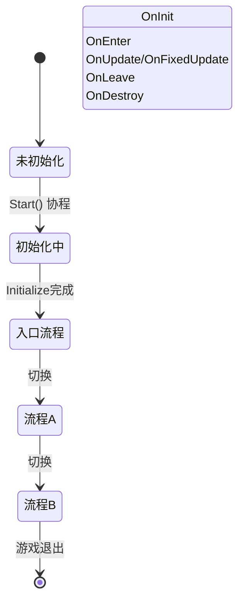

# ProcedureComponent

 ProcedureComponent 是 GameFrameX フロー系统的コア Unity コンポーネント，负责管理和协调游戏中的各种フローステータス。

## 概要

ProcedureComponent は Unity MonoBehaviour コンポーネント，作为游戏フロー管理的入口点。它カプセル化了 IProcedureManager インターフェース，提供します面向 Unity 的コンポーネント化インターフェース，方便在 Unity エディタ中进行設定和管理。

该コンポーネント的主な职责含みます：
- 在游戏启动时初期化フローマネージャー
- 通过反射作成所有可用的フローインスタンス
- 自动启动入口フロー
- 提供フロー查询和取得的公共インターフェース

### コアコンセプト

| コンセプト | 説明 |
|------|------|
| **フロー (Procedure)** | 游戏中的不同フェーズ或ステータス，如启动フロー、メニューフロー、游戏フロー等 |
| **入口フロー (Entrance Procedure)** | 游戏启动时まず执行的フロー |
| **フローマネージャー (ProcedureManager)** | 负责管理所有フロー的作成、切换和破棄 |

## アーキテクチャ

```mermaid
flowchart TD
    subgraph Unity["Unity 层面"]
        PC[ProcedureComponent]
        Inspector[ProcedureComponentInspector]
    end

    subgraph GameFramework["Game Framework 核心"]
        GFC[GameFrameworkComponent]
        GFE[GameFrameworkEntry]
    end

    subgraph Procedure["流程系统"]
        IPM[IProcedureManager]
        PM[ProcedureManager]
        PB[ProcedureBase]
    end

    subgraph FSM["状态机系统"]
        FSMComp[FSMComponent]
        FSM[IFsmManager]
    end

    PC -->|继承| GFC
    PC -->|获取模块| GFE
    GFE -->|返回| IPM
    IPM -->|实现| PM
    PM -->|使用| FSM
    FSM -->|依赖| FSMComp
    PB -->|状态| PM
    Inspector -->|编辑| PC
```

### コンポーネント关系説明

- **ProcedureComponent**: 継承自 GameFrameworkComponent，是 Unity 层面的入口コンポーネント
- **IProcedureManager**: 定義フロー管理インターフェース，カプセル化了所有フロー操作
- **ProcedureManager**: IProcedureManager 的具体実装，内部使用 FSM 管理フロー
- **ProcedureBase**: 所有自定義フロー的基底クラス，継承自 FsmState<IProcedureManager>
- **FSMComponent**: 提供底层有限ステータス机機能，是フロー系统的依赖

## コア機能

### 初期化フロー

ProcedureComponent 在コンポーネントAwake和Startフェーズ完成初期化：

```csharp
protected override void Awake()
{
    ImplementationComponentType = Utility.Assembly.GetType(componentType);
    InterfaceComponentType = typeof(IProcedureManager);
    base.Awake();
    m_ProcedureManager = GameFrameworkEntry.GetModule<IProcedureManager>();
    // ...
}
```

> Source: [ProcedureComponent.cs](https://github.com/GameFrameX/com.gameframex.unity.procedure/blob/main/Runtime/Procedure/ProcedureComponent.cs#L58-L69)

```csharp
private IEnumerator Start()
{
    ProcedureBase[] procedures = new ProcedureBase[m_AvailableProcedureTypeNames.Length];
    for (int i = 0; i < m_AvailableProcedureTypeNames.Length; i++)
    {
        Type procedureType = Utility.Assembly.GetType(m_AvailableProcedureTypeNames[i]);
        // ... 错误检查 ...
        procedures[i] = (ProcedureBase)Activator.CreateInstance(procedureType);
        // ... 记录入口流程 ...
    }
    
    m_ProcedureManager.Initialize(GameFrameworkEntry.GetModule<IFsmManager>(), procedures);
    yield return new WaitForEndOfFrame();
    m_ProcedureManager.StartProcedure(m_EntranceProcedure.GetType());
}
```

> Source: [ProcedureComponent.cs](https://github.com/GameFrameX/com.gameframex.unity.procedure/blob/main/Runtime/Procedure/ProcedureComponent.cs#L71-L107)

**設計意图**: 使用 Start() 协程確認してください在所有コンポーネントAwake完成后，再进行フロー的初期化和启动。WaitForEndOfFrame 確認してくださいUnity完全初期化后再启动フロー。

### フロー查询

ProcedureComponent 提供します多种查询当前フローステータス的インターフェース：

```csharp
/// <summary>
/// 获取当前流程管理器。
/// </summary>
public IProcedureManager Procedure
{
    get { return m_ProcedureManager; }
}

/// <summary>
/// 获取当前正在执行的流程。
/// </summary>
public ProcedureBase CurrentProcedure
{
    get { return m_ProcedureManager.CurrentProcedure; }
}

/// <summary>
/// 获取当前流程已持续的时间。
/// </summary>
public float CurrentProcedureTime
{
    get { return m_ProcedureManager.CurrentProcedureTime; }
}
```

> Source: [ProcedureComponent.cs](https://github.com/GameFrameX/com.gameframex.unity.procedure/blob/main/Runtime/Procedure/ProcedureComponent.cs#L31-L53)

### フロー存在性確認

```csharp
/// <summary>
/// 检查是否存在指定类型的流程。
/// </summary>
public bool HasProcedure<T>() where T : ProcedureBase
{
    return m_ProcedureManager.HasProcedure<T>();
}

public bool HasProcedure(Type procedureType)
{
    return m_ProcedureManager.HasProcedure(procedureType);
}
```

> Source: [ProcedureComponent.cs](https://github.com/GameFrameX/com.gameframex.unity.procedure/blob/main/Runtime/Procedure/ProcedureComponent.cs#L109-L127)

### 取得フローインスタンス

```csharp
/// <summary>
/// 获取指定类型的流程实例。
/// </summary>
public ProcedureBase GetProcedure<T>() where T : ProcedureBase
{
    return m_ProcedureManager.GetProcedure<T>();
}

public ProcedureBase GetProcedure(Type procedureType)
{
    return m_ProcedureManager.GetProcedure(procedureType);
}
```

> Source: [ProcedureComponent.cs](https://github.com/GameFrameX/com.gameframex.unity.procedure/blob/main/Runtime/Procedure/ProcedureComponent.cs#L129-L147)

## フローライフサイクル



### フローコールバックメソッド

ProcedureBase 提供します完全な的ライフサイクルコールバック：

| コールバックメソッド | 呼び出し时机 | 用途 |
|----------|----------|------|
| OnInit | フローステータス初期化时 | 初期化フロー数据 |
| OnEnter | 进入フロー时 | 准备フローリソース |
| OnUpdate | 每帧アップデート时 | フロー逻辑アップデート |
| OnFixedUpdate | 物理アップデート时 | 物理相关逻辑 |
| OnLeave | 离开フロー时 | 清理フローリソース |
| OnDestroy | フロー破棄时 | 解放所有リソース |

> Source: [ProcedureBase.cs](https://github.com/GameFrameX/com.gameframex.unity.procedure/blob/main/Runtime/Procedure/ProcedureBase.cs#L16-L76)

## 使用例

### 在 Unity エディタ中設定

1. 在シーン中作成一个空的 GameObject
2. 追加 `Procedure` コンポーネント（メニュー：`Game Framework` → `Procedure`）
3. 在 Inspector パネル中設定：
   - **Available Procedures**: 选择〜する必要があります管理的フロータイプ
   - **Entrance Procedure**: 选择游戏启动时的入口フロー

### コード中取得当前フロー

```csharp
// 获取 ProcedureComponent 实例
var procedureComponent = UnityEngine.Object.FindObjectOfType<ProcedureComponent>();

// 获取当前流程
var currentProcedure = procedureComponent.CurrentProcedure;

// 获取当前流程持续时间
float elapsedTime = procedureComponent.CurrentProcedureTime;

// 检查是否存在指定流程
if (procedureComponent.HasProcedure<MenuProcedure>())
{
    // 获取指定流程实例
    var menuProcedure = procedureComponent.GetProcedure<MenuProcedure>();
}
```

### フロー切换

フロー的切换通常在 ProcedureBase 的 OnUpdate メソッド中根据条件判断：

```csharp
public class MenuProcedure : ProcedureBase
{
    protected override void OnUpdate(IFsm<IProcedureManager> procedureOwner, 
        float elapseSeconds, float realElapseSeconds)
    {
        base.OnUpdate(procedureOwner, elapseSeconds, realElapseSeconds);
        
        // 假设点击开始按钮后切换到游戏流程
        if (Input.GetMouseButtonUp(0))
        {
            // 获取流程管理器并切换流程
            procedureOwner.GetComponent<ProcedureManager>()
                .StartProcedure<GameProcedure>();
        }
    }
}
```

> Source: [ProcedureManager.cs](https://github.com/GameFrameX/com.gameframex.unity.procedure/blob/main/Runtime/Procedure/ProcedureManager.cs#L112-L138)

## 設定説明

| プロパティ | タイプ | 説明 |
|------|------|------|
| m_AvailableProcedureTypeNames | string[] | 可用フロー的タイプ名称数组 |
| m_EntranceProcedureTypeName | string | 入口フロー的タイプ名称 |

### 設定约束

- `[DisallowMultipleComponent]`: 每个 GameObject 只能追加一个 ProcedureComponent
- `[AddComponentMenu("Game Framework/Procedure")]`：在 Unity メニュー中可快速追加

## 注意事项

1. **执行顺序**: ProcedureComponent 依赖 FSMComponent，確認してください FSMComponent 已正确設定
2. **入口フロー**: 〜しなければなりません設定有效的入口フロー，否则游戏无法启动
3. **フロータイプ**: 所有フロー类〜しなければなりません継承自 ProcedureBase
4. **エディタ設定**: 在 Play モード下无法変更可用フロー列表

## 関連リンク

- [ProcedureBase](./3-core-concepts.procedure-base) - フロー基底クラス
- [IProcedureManager](./3-core-concepts.iprocedure-manager) - フローマネージャーインターフェース
- [ProcedureManager](./3-core-concepts.procedure-manager) - フローマネージャー実装
- [自定義フロー](./4-custom-procedures) - 如何作成自定義フロー
- [エディタ使用](./5-editor-usage) - エディタ設定ガイド
