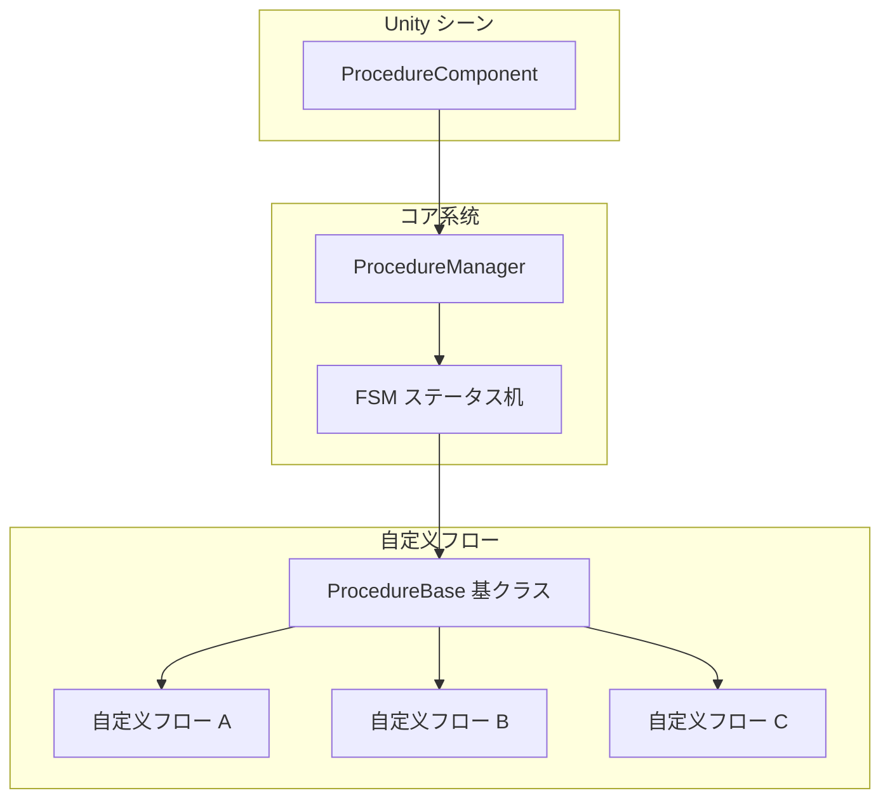
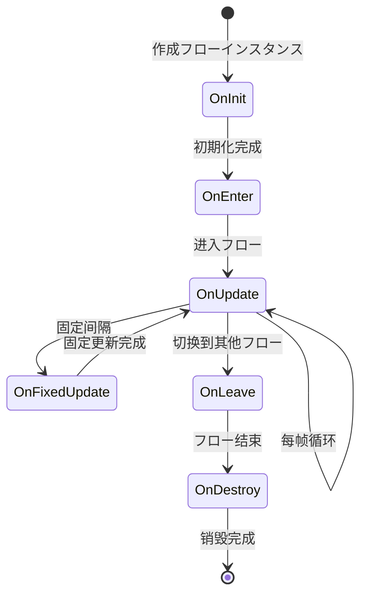

# 自定义フロー

自定义フロー是 GameFrameX フロー系统的コア扩展机制。を通じて继承 `ProcedureBase` 基クラス并重写相应的生命周期メソッド，開発者可能作成适に使用ゲーム各种阶段的自定义フロー，如启动フロー、菜单フロー、ゲームフロー等。

## 概要

GameFrameX 的フロー系统基づく有限状態機械（FSM）设计，每个フロー（Procedure）代表ゲーム中的一个独立ステータス或阶段。系统を通じて `ProcedureComponent` コンポーネント在 Unity シーン中管理所有フロー，而具体的フロー逻辑则を通じて自定义クラス実装。



### 设计意图

采用 FSM 模式管理フロー的优势：
- **ステータス明确**：每个フロー代表ゲーム的明确阶段，便于管理和调试
- **解耦逻辑**：各フロー相互独立，便于单独开发和测试
- **平滑过渡**：サポートフロー间的平滑切换和过渡动画
- **可扩展性**：新增フロー只需作成新クラス，无需修改现有代码

## 作成自定义フロー

### 基础结构

作成自定义フロー必要继承 `ProcedureBase` クラス并重写必要的生命周期メソッド。

```csharp
using GameFrameX.Procedure.Runtime;
using GameFrameX.Fsm.Runtime;

namespace MyGame.Procedure
{
    /// <summary>
    /// 示例自定义フロー。
    /// </summary>
    public class DemoProcedure : ProcedureBase
    {
        /// <summary>
        /// フロー初期化时呼び出し。
        /// </summary>
        protected override void OnInit(IFsm<IProcedureManager> procedureOwner)
        {
            base.OnInit(procedureOwner);
            // 初期化代码，如加载配置、预加载リソース等
        }

        /// <summary>
        /// 进入フロー时呼び出し。
        /// </summary>
        protected override void OnEnter(IFsm<IProcedureManager> procedureOwner)
        {
            base.OnEnter(procedureOwner);
            // 进入フロー的逻辑，如显示界面、播放音乐等
        }

        /// <summary>
        /// フロー更新时每帧呼び出し。
        /// </summary>
        protected override void OnUpdate(IFsm<IProcedureManager> procedureOwner, float elapseSeconds, float realElapseSeconds)
        {
            base.OnUpdate(procedureOwner, elapseSeconds, realElapseSeconds);
            // 每帧执行的逻辑
            
            // 示例：满足条件后切换到下一个フロー
            // if (someCondition)
            // {
            //     ChangeState<NextProcedure>(procedureOwner);
            // }
        }

        /// <summary>
        /// フロー固定更新时呼び出し。
        /// </summary>
        protected override void OnFixedUpdate(IFsm<IProcedureManager> procedureOwner, float elapseSeconds, float realElapseSeconds)
        {
            base.OnFixedUpdate(procedureOwner, elapseSeconds, realElapseSeconds);
            // 物理関連的固定更新逻辑
        }

        /// <summary>
        /// 离开フロー时呼び出し。
        /// </summary>
        protected override void OnLeave(IFsm<IProcedureManager> procedureOwner, bool isShutdown)
        {
            base.OnLeave(procedureOwner, isShutdown);
            // 离开フロー的清理工作，如隐藏界面、停止音效等
        }

        /// <summary>
        /// フロー销毁时呼び出し。
        /// </summary>
        protected override void OnDestroy(IFsm<IProcedureManager> procedureOwner)
        {
            base.OnDestroy(procedureOwner);
            // リソース释放、内存清理等
        }
    }
}
```
> Source: [ProcedureBase.cs](https://github.com/GameFrameX/com.gameframex.unity.procedure/blob/main/Runtime/Procedure/ProcedureBase.cs#L1-L77)

## 生命周期详解

### フローステータス流转



### 各生命周期メソッド説明

| メソッド | 呼び出し时机 | 典型用途 |
|------|----------|----------|
| `OnInit` | フローステータス首次被作成时 | 预加载数据、初期化数据结构 |
| `OnEnter` | 进入该フローステータス时 | 显示界面、播放音效、リソース加载 |
| `OnUpdate` | 每帧更新时 | 业务逻辑检查、超时检测、条件判断 |
| `OnFixedUpdate` | 固定时间间隔更新 | 物理计算、输入处理 |
| `OnLeave` | 离开该フローステータス时 | 隐藏界面、保存ステータス、清理リソース |
| `OnDestroy` | フローステータス被销毁时 | 释放引用、内存清理 |

### フロー参数説明

`OnUpdate` 和 `OnFixedUpdate` メソッド提供两个时间参数：

- **`elapseSeconds`**：逻辑流逝时间（受ゲーム暂停、时间缩放影响）
- **`realElapseSeconds`**：真实流逝时间（不受ゲーム暂停影响）

```csharp
protected override void OnUpdate(IFsm<IProcedureManager> procedureOwner, float elapseSeconds, float realElapseSeconds)
{
    base.OnUpdate(procedureOwner, elapseSeconds, realElapseSeconds);
    
    // 使用 elapseSeconds 计算受时间缩放影响的计时
    // 使用 realElapseSeconds 计算真实超时
}
```

## フロー间切换

### 切换到下一フロー

在 `OnUpdate` メソッド中に基づいて业务条件切换フロー：

```csharp
using GameFrameX.Fsm.Runtime;

protected override void OnUpdate(IFsm<IProcedureManager> procedureOwner, float elapseSeconds, float realElapseSeconds)
{
    base.OnUpdate(procedureOwner, elapseSeconds, realElapseSeconds);
    
    // 示例：超时自动切换
    if (procedureOwner.CurrentStateTime >= 3.0f)
    {
        // 切换到下一个フロー
        ChangeState<MenuProcedure>(procedureOwner);
    }
}
```

### 取得当前フロー信息

```csharp
protected override void OnUpdate(IFsm<IProcedureManager> procedureOwner, float elapseSeconds, float realElapseSeconds)
{
    base.OnUpdate(procedureOwner, elapseSeconds, realElapseSeconds);
    
    // 取得当前フロー
    ProcedureBase current = procedureOwner.CurrentState;
    
    // 取得当前フロー已运行时间
    float time = procedureOwner.CurrentStateTime;
    
    // 示例：运行5秒后切换
    if (time > 5.0f)
    {
        ChangeState<NextProcedure>(procedureOwner);
    }
}
```

## 注册自定义フロー

### を通じて Editor 注册

1. 在 Unity シーン中作成或选择带有 `ProcedureComponent` 的 GameObject
2. 在 Inspector 面板中，可能看到 "Available Procedures" 列表
3. 勾选必要包含的自定义フロークラス型
4. 在 "Entrance Procedure" 下拉菜单中选择エントリーポイントフロー

```csharp
// ProcedureComponent 在 Unity 编辑器中的配置
// 源码位置: Runtime/Procedure/ProcedureComponent.cs
[SerializeField] private string[] m_AvailableProcedureTypeNames = null;
[SerializeField] private string m_EntranceProcedureTypeName = null;
```
> Source: [ProcedureComponent.cs](https://github.com/GameFrameX/com.gameframex.unity.procedure/blob/main/Runtime/Procedure/ProcedureComponent.cs#L27-L29)

### 运行时注册

如果必要在运行时动态注册フロー，可能使用反射或直接を通じて代码：

```csharp
// を通じて代码初期化フロー管理器
IProcedureManager procedureManager = GameFrameworkEntry.GetModule<IProcedureManager>();
procedureManager.Initialize(fsmManager, 
    new ProcedureA(), 
    new ProcedureB(), 
    new ProcedureC());

// 启动エントリーポイントフロー
procedureManager.StartProcedure<EntranceProcedure>();
```
> Source: [ProcedureManager.cs](https://github.com/GameFrameX/com.gameframex.unity.procedure/blob/main/Runtime/Procedure/ProcedureManager.cs#L104-L124)

## 完整示例

以下は典型的ゲームフロー実装示例：

```csharp
using GameFrameX.Procedure.Runtime;
using GameFrameX.Fsm.Runtime;
using UnityEngine;

namespace MyGame.Procedure
{
    /// <summary>
    /// 启动フロー - 负责ゲーム初期化和リソース加载。
    /// </summary>
    public class LaunchProcedure : ProcedureBase
    {
        private float _loadingDuration = 2.0f; // 模拟加载时间
        
        protected override void OnEnter(IFsm<IProcedureManager> procedureOwner)
        {
            base.OnEnter(procedureOwner);
            Debug.Log("进入启动フロー，开始初期化...");
            // 显示加载界面
        }

        protected override void OnUpdate(IFsm<IProcedureManager> procedureOwner, float elapseSeconds, float realElapseSeconds)
        {
            base.OnUpdate(procedureOwner, elapseSeconds, realElapseSeconds);
            
            // 模拟加载进度
            float progress = procedureOwner.CurrentStateTime / _loadingDuration;
            
            if (procedureOwner.CurrentStateTime >= _loadingDuration)
            {
                Debug.Log("加载完成，切换到菜单フロー");
                ChangeState<MenuProcedure>(procedureOwner);
            }
        }

        protected override void OnLeave(IFsm<IProcedureManager> procedureOwner, bool isShutdown)
        {
            base.OnLeave(procedureOwner, isShutdown);
            // 隐藏加载界面
            Debug.Log("离开启动フロー");
        }
    }

    /// <summary>
    /// 菜单フロー - 负责显示主菜单和处理菜单交互。
    /// </summary>
    public class MenuProcedure : ProcedureBase
    {
        private bool _startGameRequested = false;
        
        protected override void OnEnter(IFsm<IProcedureManager> procedureOwner)
        {
            base.OnEnter(procedureOwner);
            Debug.Log("メニューを開くフロー");
            // 显示主菜单界面
            // 绑定开始ゲーム按钮イベント
        }

        protected override void OnUpdate(IFsm<IProcedureManager> procedureOwner, float elapseSeconds, float realElapseSeconds)
        {
            base.OnUpdate(procedureOwner, elapseSeconds, realElapseSeconds);
            
            // 检查是否お願いします求开始ゲーム
            if (_startGameRequested)
            {
                ChangeState<GameProcedure>(procedureOwner);
            }
        }

        protected override void OnLeave(IFsm<IProcedureManager> procedureOwner, bool isShutdown)
        {
            base.OnLeave(procedureOwner, isShutdown);
            // 隐藏菜单界面
            Debug.Log("离开菜单フロー");
        }

        // 供外部呼び出し的メソッド
        public void RequestStartGame()
        {
            _startGameRequested = true;
        }
    }

    /// <summary>
    /// ゲームフロー - 负责ゲームコア逻辑。
    /// </summary>
    public class GameProcedure : ProcedureBase
    {
        protected override void OnEnter(IFsm<IProcedureManager> procedureOwner)
        {
            base.OnEnter(procedureOwner);
            Debug.Log("进入ゲームフロー");
            // 初期化ゲームシーン、加载ゲーム数据等
        }

        protected override void OnUpdate(IFsm<IProcedureManager> procedureOwner, float elapseSeconds, float realElapseSeconds)
        {
            base.OnUpdate(procedureOwner, elapseSeconds, realElapseSeconds);
            
            // ゲーム主循环逻辑
            // 检测ゲーム是否结束、是否暂停等
            
            // 示例：按 ESC 返回菜单
            // if (Input.GetKeyDown(KeyCode.Escape))
            // {
            //     ChangeState<MenuProcedure>(procedureOwner);
            // }
        }

        protected override void OnLeave(IFsm<IProcedureManager> procedureOwner, bool isShutdown)
        {
            base.OnLeave(procedureOwner, isShutdown);
            // 保存ゲーム数据、清理ゲームシーン
            Debug.Log("离开ゲームフロー");
        }
    }
}
```

## 最佳实践

### 1. 单一职责原则

每个フローべき只负责一个明确的ゲーム阶段，不要在一个フロー中混合多个機能：

```csharp
// ✅ 好的设计
public class LoadingProcedure : ProcedureBase { /* 负责加载 */ }
public class MenuProcedure : ProcedureBase { /* 负责菜单 */ }
public class GameProcedure : ProcedureBase { /* 负责ゲーム逻辑 */ }

// ❌ 避免的设计
public class LoadingAndMenuAndGameProcedure : ProcedureBase { /* 混合多种機能 */ }
```

### 2. フロー间通信

使用イベント或数据容器进行フロー间的数据传递：

```csharp
// を通じて自定义数据クラス传递数据
public class ProcedureData
{
    public string PlayerName;
    public int LevelId;
}

// 在フロー中取得数据
protected override void OnEnter(IFsm<IProcedureManager> procedureOwner)
{
    base.OnEnter(procedureOwner);
    
    // 取得传入的数据
    var data = procedureOwner.GetData<ProcedureData>("Key");
    if (data != null)
    {
        Debug.Log($"玩家: {data.PlayerName}, 关卡: {data.LevelId}");
    }
}
```

### 3. リソース管理

在 `OnLeave` 和 `OnDestroy` 中正确清理リソース：

```csharp
protected override void OnLeave(IFsm<IProcedureManager> procedureOwner, bool isShutdown)
{
    base.OnLeave(procedureOwner, isShutdown);
    
    // 取消所有异步加载
    // 释放本フロー使用的リソース
}

protected override void OnDestroy(IFsm<IProcedureManager> procedureOwner)
{
    base.OnDestroy(procedureOwner);
    
    // 彻底清理引用
}
```

### 4. 调试技巧

利用 `CurrentStateTime` 进行超时检测和进度显示：

```csharp
protected override void OnUpdate(IFsm<IProcedureManager> procedureOwner, float elapseSeconds, float realElapseSeconds)
{
    base.OnUpdate(procedureOwner, elapseSeconds, realElapseSeconds);
    
    // 显示加载进度
    float progress = Mathf.Clamp01(procedureOwner.CurrentStateTime / 3.0f);
    Debug.Log($"加载进度: {progress * 100}%");
}
```

## 関連リンク

- [ProcedureComponent フローコンポーネント](./3-core-concepts.procedure-component)
- [ProcedureBase フロー基クラス](./3-core-concepts.procedure-base)
- [IProcedureManager インターフェース](./3-core-concepts.iprocedure-manager)
- [ProcedureManager 管理器](./3-core-concepts.procedure-manager)
- [编辑器使用指南](./5-editor-usage)
- [安装指南](./2-installation)
