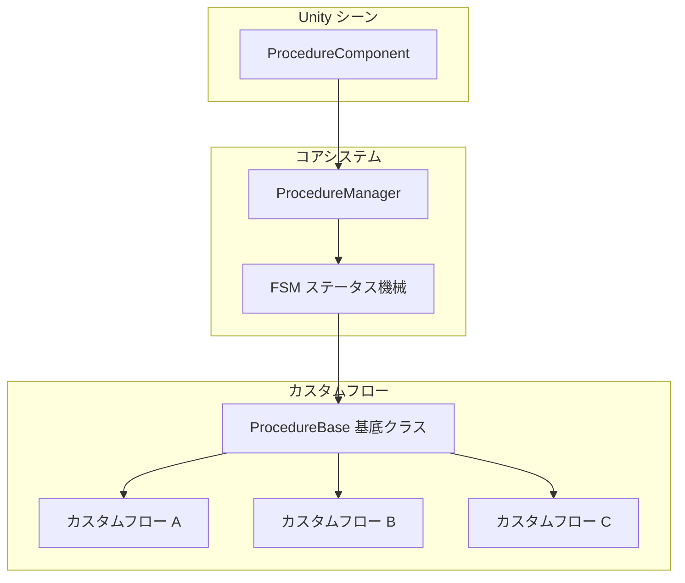
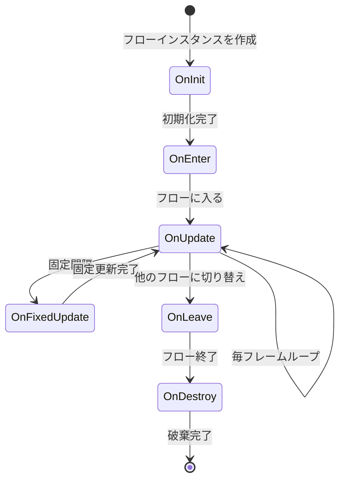

# カスタムフロー

カスタムフローは、GameFrameX フローシステムのコア拡張メカニズムです。`ProcedureBase` 基底クラスを継承して対応するライフサイクルメソッドをオーバーライドすることで、開発者はゲームのさまざまな段階に適したカスタムフローを作成できます：起動フロー、メニュースフロー、ゲームフローなどが含まれます。

## 概要

GameFrameX のフローシステムは有限状態機械（FSM）に基づいて設計されており、各フロー（Procedure）はゲーム内の独立したステータスまたは段階を表します。システムは `ProcedureComponent` コンポーネント介して Unity シーンで 모든 フローを管理し、具体的なフローロジックはカスタムクラス介して実装されます。



### 設計意図

FSM モードを使用してフローを管理する利点は次のとおりです：
- **ステータスが明確**: 各フローはゲームの明確な段階を表し、管理とデバッグが容易
- **ロジックの decoupling**: 各フローは互いに独立しており、個別开发和テストが可能
- **スムーズな过渡**: フロー間のスムーズな切り替えと过渡アニメーションをサポート
- **拡張性**: 新しいフローは新しいクラスを作成するだけでよく、既存のコードを変更する必要がありません

## カスタムフローの作成

### 基本的な構造

カスタムフローを作成するには、`ProcedureBase` クラスを継承して必要なライフサイクルメソッドをオーバーライドする必要があります。

```csharp
using GameFrameX.Procedure.Runtime;
using GameFrameX.Fsm.Runtime;

namespace MyGame.Procedure
{
    /// <summary>
    /// サンプルカスタムフロー。
    /// </summary>
    public class DemoProcedure : ProcedureBase
    {
        /// <summary>
        /// フローの初期化時に呼び出し。
        /// </summary>
        protected override void OnInit(IFsm<IProcedureManager> procedureOwner)
        {
            base.OnInit(procedureOwner);
            // 初期化コード。設定の読み込み、リソースのプリロードなど
        }

        /// <summary>
        /// フローに入る時に呼び出し。
        /// </summary>
        protected override void OnEnter(IFsm<IProcedureManager> procedureOwner)
        {
            base.OnEnter(procedureOwner);
            // フローに入るロジック。画面の表示、サウンドの再生など
        }

        /// <summary>
        /// フローの更新時に毎フレーム呼び出し。
        /// </summary>
        protected override void OnUpdate(IFsm<IProcedureManager> procedureOwner, float elapseSeconds, float realElapseSeconds)
        {
            base.OnUpdate(procedureOwner, elapseSeconds, realElapseSeconds);
            // 毎フレーム実行するロジック

            // 例：条件を満たした後、次のフローに切り替え
            // if (someCondition)
            // {
            //     ChangeState<NextProcedure>(procedureOwner);
            // }
        }

        /// <summary>
        /// フローの固定更新時に呼び出し。
        /// </summary>
        protected override void OnFixedUpdate(IFsm<IProcedureManager> procedureOwner, float elapseSeconds, float realElapseSeconds)
        {
            base.OnFixedUpdate(procedureOwner, elapseSeconds, realElapseSeconds);
            // 物理関連の固定更新ロジック
        }

        /// <summary>
        /// フローを離れる時に呼び出し。
        /// </summary>
        protected override void OnLeave(IFsm<IProcedureManager> procedureOwner, bool isShutdown)
        {
            base.OnLeave(procedureOwner, isShutdown);
            // フローを離れるクリーンアップ作業。画面の非表示、サウンドの停止など
        }

        /// <summary>
        /// フローの破棄時に呼び出し。
        /// </summary>
        protected override void OnDestroy(IFsm<IProcedureManager> procedureOwner)
        {
            base.OnDestroy(procedureOwner);
            // リソースの解放、メモリのクリーンアップなど
        }
    }
}
```
> Source: [ProcedureBase.cs](https://github.com/GameFrameX/com.gameframex.unity.procedure/blob/main/Runtime/Procedure/ProcedureBase.cs#L1-L77)

## ライフサイクルの詳細

### フローステータスのフロー



### 各ライフサイクルメソッドの説明

| メソッド | 呼び出しタイミング | 典型的な用途 |
|------|----------|----------|
| `OnInit` | フローステータスが初めて作成された時 | データのプリロード、 数据構造の初期化 |
| `OnEnter` | 该フローステータスに入る時 | 画面の表示、サウンドの再生、リソースの読み込み |
| `OnUpdate` | 毎フレーム更新時 | ビジネスロジックの检查、タイムアウト検出、条件判断 |
| `OnFixedUpdate` | 固定時間間隔の更新 | 物理計算、入力処理 |
| `OnLeave` | 该フローステータスを離れる時 | 画面の非表示、ステータスの保存、リソースのクリーンアップ |
| `OnDestroy` | フローステータスが破棄される時 | 参照の解放、メモリのクリーンアップ |

### フローパラメータの説明

`OnUpdate` と `OnFixedUpdate` メソッドは2つの時間パラメータを提供します：

- **`elapseSeconds`**：論理経過時間（ゲームの一時停止、時間スケールに影響されます）
- **`realElapseSeconds`**：実際の経過時間（ゲームの一時停止に影響されません）

```csharp
protected override void OnUpdate(IFsm<IProcedureManager> procedureOwner, float elapseSeconds, float realElapseSeconds)
{
    base.OnUpdate(procedureOwner, elapseSeconds, realElapseSeconds);

    // elapseSeconds を使用して時間スケールに影響されるタイマーを計算
    // realElapseSeconds を使用して実際のタイムアウトを計算
}
```

## フロー間の切り替え

### 次のフローに切り替え

`OnUpdate` メソッド中でビジネス条件に基づいてフローを切り替え：

```csharp
using GameFrameX.Fsm.Runtime;

protected override void OnUpdate(IFsm<IProcedureManager> procedureOwner, float elapseSeconds, float realElapseSeconds)
{
    base.OnUpdate(procedureOwner, elapseSeconds, realElapseSeconds);

    // 例：タイムアウト後に自動的に切り替え
    if (procedureOwner.CurrentStateTime >= 3.0f)
    {
        // 次のフローに切り替え
        ChangeState<MenuProcedure>(procedureOwner);
    }
}
```

### 現在のフロー情報の取得

```csharp
protected override void OnUpdate(IFsm<IProcedureManager> procedureOwner, float elapseSeconds, float realElapseSeconds)
{
    base.OnUpdate(procedureOwner, elapseSeconds, realElapseSeconds);

    // 現在のフローを取得
    ProcedureBase current = procedureOwner.CurrentState;

    // 現在のフローの実行時間を取得
    float time = procedureOwner.CurrentStateTime;

    // 例：5秒後に切り替え
    if (time > 5.0f)
    {
        ChangeState<NextProcedure>(procedureOwner);
    }
}
```

## カスタムフローの登録

### Editor を介して登録

1. Unity シーンで `ProcedureComponent` を持つ GameObject を作成または選択
2. Inspector パネルで「Available Procedures」リストを確認
3. 含めたいカスタムフローの型にチェックを入れる
4. 「Entrance Procedure」ドロップダウンメニューでエントリーポイントフローを選択

```csharp
// ProcedureComponent の Unity エディターでの設定
// ソースコード位置: Runtime/Procedure/ProcedureComponent.cs
[SerializeField] private string[] m_AvailableProcedureTypeNames = null;
[SerializeField] private string m_EntranceProcedureTypeName = null;
```
> Source: [ProcedureComponent.cs](https://github.com/GameFrameX/com.gameframex.unity.procedure/blob/main/Runtime/Procedure/ProcedureComponent.cs#L27-L29)

### 実行時の登録

実行時にフローを動的に登録する必要がある場合、リフレクションまたは直接コード介して使用できます：

```csharp
// コード介してフローマネージャーを初期化
IProcedureManager procedureManager = GameFrameworkEntry.GetModule<IProcedureManager>();
procedureManager.Initialize(fsmManager,
    new ProcedureA(),
    new ProcedureB(),
    new ProcedureC());

// エントリーポイントフローを起動
procedureManager.StartProcedure<EntranceProcedure>();
```
> Source: [ProcedureManager.cs](https://github.com/GameFrameX/com.gameframex.unity.procedure/blob/main/Runtime/Procedure/ProcedureManager.cs#L104-L124)

## 完全な例

以下は典型的なゲームフローの実装例です：

```csharp
using GameFrameX.Procedure.Runtime;
using GameFrameX.Fsm.Runtime;
using UnityEngine;

namespace MyGame.Procedure
{
    /// <summary>
    /// 起動フロー - ゲームの初期化とリソースの読み込みを 담당。
    /// </summary>
    public class LaunchProcedure : ProcedureBase
    {
        private float _loadingDuration = 2.0f; // ローディング時間をシミュレート

        protected override void OnEnter(IFsm<IProcedureManager> procedureOwner)
        {
            base.OnEnter(procedureOwner);
            Debug.Log("起動フローに入ります。初期化を開始...");
            // ローディング画面を表示
        }

        protected override void OnUpdate(IFsm<IProcedureManager> procedureOwner, float elapseSeconds, float realElapseSeconds)
        {
            base.OnUpdate(procedureOwner, elapseSeconds, realElapseSeconds);

            // ローディング進捗をシミュレート
            float progress = procedureOwner.CurrentStateTime / _loadingDuration;

            if (procedureOwner.CurrentStateTime >= _loadingDuration)
            {
                Debug.Log("ローディング完了。メニュースフローに切り替え");
                ChangeState<MenuProcedure>(procedureOwner);
            }
        }

        protected override void OnLeave(IFsm<IProcedureManager> procedureOwner, bool isShutdown)
        {
            base.OnLeave(procedureOwner, isShutdown);
            // ローディング画面を非表示
            Debug.Log("起動フローを離れます");
        }
    }

    /// <summary>
    /// メニュースフロー - メインメニューの表示とメニューインタラクティブ的处理を 담당。
    /// </summary>
    public class MenuProcedure : ProcedureBase
    {
        private bool _startGameRequested = false;

        protected override void OnEnter(IFsm<IProcedureManager> procedureOwner)
        {
            base.OnEnter(procedureOwner);
            Debug.Log("メニュースフローに入ります");
            // メインメニュー画面を表示
            // ゲーム開始ボタンのイベントをバインド
        }

        protected override void OnUpdate(IFsm<IProcedureManager> procedureOwner, float elapseSeconds, float realElapseSeconds)
        {
            base.OnUpdate(procedureOwner, elapseSeconds, realElapseSeconds);

            // ゲーム開始がリクエストされたかどうかを確認
            if (_startGameRequested)
            {
                ChangeState<GameProcedure>(procedureOwner);
            }
        }

        protected override void OnLeave(IFsm<IProcedureManager> procedureOwner, bool isShutdown)
        {
            base.OnLeave(procedureOwner, isShutdown);
            // メニュー画面を非表示
            Debug.Log("メニュースフローを離れます");
        }

        // 外部呼び出し用のメソッド
        public void RequestStartGame()
        {
            _startGameRequested = true;
        }
    }

    /// <summary>
    /// ゲームフロー - ゲームのコアロジックを 담당。
    /// </summary>
    public class GameProcedure : ProcedureBase
    {
        protected override void OnEnter(IFsm<IProcedureManager> procedureOwner)
        {
            base.OnEnter(procedureOwner);
            Debug.Log("ゲームフローに入ります");
            // ゲームシーンを初期化、ゲームデータを読み込むなど
        }

        protected override void OnUpdate(IFsm<IProcedureManager> procedureOwner, float elapseSeconds, float realElapseSeconds)
        {
            base.OnUpdate(procedureOwner, elapseSeconds, realElapseSeconds);

            // ゲームメインループロジック
            // ゲームが終了したかどうか、一時停止したかどうかなどを検出

            // 例：ESC キーを押してメニューに戻る
            // if (Input.GetKeyDown(KeyCode.Escape))
            // {
            //     ChangeState<MenuProcedure>(procedureOwner);
            // }
        }

        protected override void OnLeave(IFsm<IProcedureManager> procedureOwner, bool isShutdown)
        {
            base.OnLeave(procedureOwner, isShutdown);
            // ゲームデータを保存、ゲームシーンをクリーンアップ
            Debug.Log("ゲームフローを離れます");
        }
    }
}
```

## ベストプラクティス

### 1. 単一責任原則

各フローは1つの明確なゲーム段階のみを担当し、1つのフローに複数の機能を混在させないでください：

```csharp
// ✅ 良い設計
public class LoadingProcedure : ProcedureBase { /* ローディングを担当 */ }
public class MenuProcedure : ProcedureBase { /* メニューを担当 */ }
public class GameProcedure : ProcedureBase { /* ゲームロジックを担当 */ }

// ❌ 避けるべき設計
public class LoadingAndMenuAndGameProcedure : ProcedureBase { /* 複数の機能を混合 */ }
```

### 2. フロー間通信

イベントまたはデータコンテナを使用してフロー間のデータ передачを行います：

```csharp
// カスタムデータクラス介してデータを передач
public class ProcedureData
{
    public string PlayerName;
    public int LevelId;
}

// フローでデータを取得
protected override void OnEnter(IFsm<IProcedureManager> procedureOwner)
{
    base.OnEnter(procedureOwner);

    // 渡されたデータを取得
    var data = procedureOwner.GetData<ProcedureData>("Key");
    if (data != null)
    {
        Debug.Log($"プレイヤー: {data.PlayerName}, ステージ: {data.LevelId}");
    }
}
```

### 3. リソース管理

`OnLeave` と `OnDestroy` で正しくリソースをクリーンアップ：

```csharp
protected override void OnLeave(IFsm<IProcedureManager> procedureOwner, bool isShutdown)
{
    base.OnLeave(procedureOwner, isShutdown);

    // すべての非同期読み込みをキャンセル
    // このフローが使用するリソースを解放
}

protected override void OnDestroy(IFsm<IProcedureManager> procedureOwner)
{
    base.OnDestroy(procedureOwner);

    // 参照を徹底的にクリーンアップ
}
```

### 4. デバッグ技巧

`CurrentStateTime` を使用してタイムアウト検出と進捗表示を行います：

```csharp
protected override void OnUpdate(IFsm<IProcedureManager> procedureOwner, float elapseSeconds, float realElapseSeconds)
{
    base.OnUpdate(procedureOwner, elapseSeconds, realElapseSeconds);

    // ローディング進捗を表示
    float progress = Mathf.Clamp01(procedureOwner.CurrentStateTime / 3.0f);
    Debug.Log($"ローディング進捗: {progress * 100}%");
}
```

## 関連リンク

- [ProcedureComponent フローコンポーネント](./08.procedure-component.md)
- [ProcedureBase フローの基底クラス](./06.procedure-base.md)
- [IProcedureManager インターフェース](./05.iprocedure-manager.md)
- [ProcedureManager 管理器](./07.procedure-manager.md)
- [エディター使用ガイド](./10.editor-usage.md)
- [インストールガイド](./02.installation.md)
