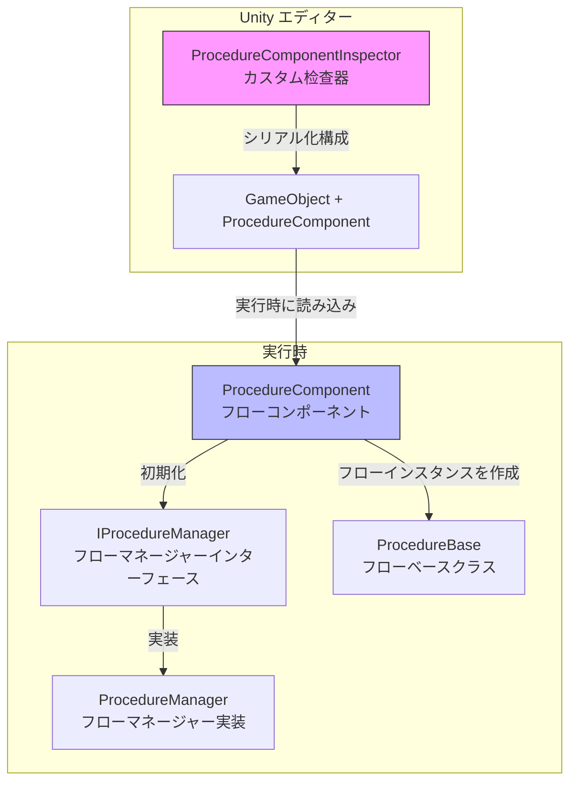
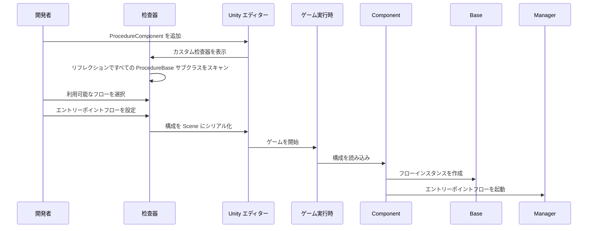

# エディター使用

このドキュメントでは、Unity エディターで Procedure フロー管理コンポーネントを構成して使用方法について説明します。

## 概要

`ProcedureComponentInspector` は GameFrameX Procedure フロー管理システムのエディター拡張であり、可視化されたフロー構成インターフェースを提供します。この检查器介して、開発者は次のことができます：

- プロジェクト内のすべての `ProcedureBase` を継承するフロークラスを自動検出
- ゲームが利用可能なフローを可視的に選択
- ゲーム起動時のエントリーポイントフローを構成
- 実行時に現在実行中のフローを表示

## アーキテクチャ



### ワークフロー



## シーンにフローコンポーネントを追加

### 手順 1：コンポーネントの追加

Unity シーンで空のオブジェクトを作成するか、既存のオブジェクトを選択し、`Procedure` コンポーネントを追加します：

1. Hierarchy パネルで対象の GameObject を選択
2. Inspector パネルで **Add Component** ボタンをクリック
3. **Game Framework / Procedure** 」を検索して追加

> Source: [ProcedureComponent.cs](https://github.com/GameFrameX/com.gameframex.unity.procedure/blob/main/Runtime/Procedure/ProcedureComponent.cs#L20-L21)

```csharp
[DisallowMultipleComponent]
[AddComponentMenu("Game Framework/Procedure")]
public sealed class ProcedureComponent : GameFrameworkComponent
```

**注意：** このコンポーネントは `[DisallowMultipleComponent]` 属性を使用しており、各 GameObject には `ProcedureComponent` を1つだけ追加できます。

### 手順 2：コンポーネントの構成

コンポーネントを追加後、检查器インターフェースは自動的に次の内容を表示します：

| エリア | 説明 |
|------|------|
| **Available Procedures** | 利用可能なすべてのフローの型を一覧表示（自動検出） |
| **Entrance Procedure** | ゲーム起動時の最初のフローを設定 |

## 检查器インターフェースの詳細

### 実行時情報の表示

ゲーム実行時（Play モード）では、检查器は追加で次を表示します：

- **Current Procedure**: 現在実行中のフローの型名

```csharp
if (EditorApplication.isPlaying)
{
    EditorGUILayout.LabelField("Current Procedure", t.CurrentProcedure == null ? "None" : t.CurrentProcedure.GetType().ToString());
}
```
> Source: [ProcedureComponentInspector.cs](https://github.com/GameFrameX/com.gameframex.unity.procedure/blob/main/Editor/Inspector/ProcedureComponentInspector.cs#L39-L42)

### 利用可能なフローリスト

检查器は `ProcedureBase` を継承するすべての型を自動的にスキャンします：

```csharp
m_ProcedureTypeNames = Type.GetRuntimeTypeNames(typeof(ProcedureBase));
```
> Source: [ProcedureComponentInspector.cs](https://github.com/GameFrameX/com.gameframex.unity.procedure/blob/main/Editor/Inspector/ProcedureComponentInspector.cs#L121)

開発者はチェックボックス介してゲームに含まれるフローを選択できます。

### エントリーポイントフローの構成

エントリーポイントフローはゲーム起動時に最初に実行されるフローであり、選択した利用可能なフローから選択する必要があります：

```csharp
int selectedIndex = EditorGUILayout.Popup("Entrance Procedure", m_EntranceProcedureIndex, m_CurrentAvailableProcedureTypeNames.ToArray());
```
> Source: [ProcedureComponentInspector.cs](https://github.com/GameFrameX/com.gameframex.unity.procedure/blob/main/Editor/Inspector/ProcedureComponentInspector.cs#L80)

## 構成の例

### 基本的な構成フロー

1. **カスタムフロークラスの作成**

まず、`ProcedureBase` を継承するフロークラスを作成します：

```csharp
public class ProcedureLaunch : ProcedureBase
{
    protected override void OnEnter(IFsm<IProcedureManager> procedureOwner)
    {
        base.OnEnter(procedureOwner);
        // 初期化操作
    }

    protected override void OnUpdate(IFsm<IProcedureManager> procedureOwner, float elapseSeconds, float realElapseSeconds)
    {
        base.OnUpdate(procedureOwner, elapseSeconds, realElapseSeconds);
        // 次のフローに切り替え
    }
}
```

   > Source: [ProcedureBase.cs](https://github.com/GameFrameX/com.gameframex.unity.procedure/blob/main/Runtime/Procedure/ProcedureBase.cs#L16)

2. **シーンで ProcedureComponent を構成**

- ProcedureComponent をシーンに追加
- 检查器で `ProcedureLaunch` を利用可能なフローとしてチェック
- `ProcedureLaunch` をエントリーポイントフローに設定

3. **ゲームを実行**

ゲーム起動後に自動的に `ProcedureLaunch` フローが実行されます。

### フローの切り替え

カスタムフローでは、`IProcedureManager` を使用して他のフローに切り替えできます：

```csharp
// フローマネージャーを取得
var procedureManager = Owner.GetComponent<ProcedureComponent>().Procedure;

// 次のフローに切り替え
procedureManager.StartProcedure<ProcedureMenu>();
```

## コンポーネントプロパティの説明

| プロパティ | 型 | 説明 |
|------|------|------|
| m_AvailableProcedureTypeNames | string[] | 利用可能なフローの型名配列 |
| m_EntranceProcedureTypeName | string | エントリーポイントフローの型名 |

> Source: [ProcedureComponent.cs](https://github.com/GameFrameX/com.gameframex.unity.procedure/blob/main/Runtime/Procedure/ProcedureComponent.cs#L27-L29)

## よくある質問

### 检查器に「利用可能なフローがありません」と表示される

**原因**：プロジェクトに `ProcedureBase` を継承するクラスがありません

**解決方法**：`ProcedureBase` を継承するフロークラスを少なくとも1つ作成し、そのクラスが正常にコンパイルされていることを確認してください。

### エントリーポイントフローが無効と表示される

**原因**：エントリーポイントフローが設定されていないか、設定したフローが利用可能なフローリストにありません

**解決方法**：检查器でまず利用可能なフローを選択し、次にドロップダウンメニューからエントリーポイントフローを選択してください。

### 実行時に現在のフローが表示されない

**原因**：ゲームが正しく起動していないか、ProcedureComponent が正しく初期化されていません

**解決方法**：ProcedureComponent がシーンに追加されていること、Start() メソッドで正しく初期化されていることを確認してください。

## 関連リンク

- [プラグイン紹介](./01.overview.md)
- [機能特性](./04.features.md)
- [インストールガイド](./02.installation.md)
- [ProcedureComponent コアコンセプト](./08.procedure-component.md)
- [ProcedureBase コアコンセプト](./06.procedure-base.md)
- [IProcedureManager コアコンセプト](./05.iprocedure-manager.md)
- [ProcedureManager コアコンセプト](./07.procedure-manager.md)
- [カスタムフロー](./09.custom-procedures.md)
- [よくある質問](./11.troubleshooting.md)
