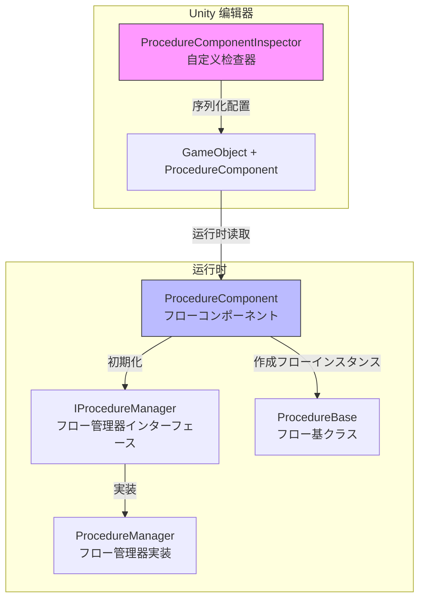
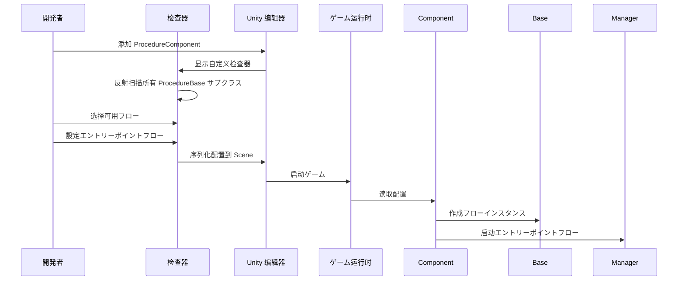

# 编辑器使用

本文档介绍如何在 Unity 编辑器中配置和使用 Procedure フロー管理コンポーネント。

## 概要

`ProcedureComponentInspector` 是 GameFrameX Procedure フロー管理系统的エディター拡張，提供します可视化的フロー配置界面。を通じて该检查器，開発者可能：

- 自动发现プロジェクト中所有を継承 `ProcedureBase` 的フロークラス
- 可视化选择ゲーム可用的フロー
- 配置ゲーム启动时的エントリーポイントフロー
- 在运行时查看当前执行的フロー

## 架构



### 工作フロー



## 在シーン中添加フローコンポーネント

### 手順 1：添加コンポーネント

在 Unity シーン中作成一个空物体或选择现有物体，然后添加 `Procedure` コンポーネント：

1. 在 Hierarchy 面板中选择目标 GameObject
2. 在 Inspector 面板中点击 **Add Component** 按钮
3. 搜索 **Game Framework / Procedure** 并添加

> Source: [ProcedureComponent.cs](https://github.com/GameFrameX/com.gameframex.unity.procedure/blob/main/Runtime/Procedure/ProcedureComponent.cs#L20-L21)

```csharp
[DisallowMultipleComponent]
[AddComponentMenu("Game Framework/Procedure")]
public sealed class ProcedureComponent : GameFrameworkComponent
```

**注意：** 该コンポーネント使用了 `[DisallowMultipleComponent]` プロパティ，意味着每个 GameObject 只能添加一个 `ProcedureComponent`。

### 手順 2：配置コンポーネント

添加コンポーネント后，检查器界面会自动显示以下の内容：

| 区域 | 説明 |
|------|------|
| **Available Procedures** | 列出所有可用的フロークラス型（自动发现） |
| **Entrance Procedure** | 設定ゲーム启动时的第一个フロー |

## 检查器界面详解

### 运行时信息显示

在ゲーム运行时（Play 模式下），检查器会额外显示：

- **Current Procedure**: 当前正在执行的フロークラス型名称

```csharp
if (EditorApplication.isPlaying)
{
    EditorGUILayout.LabelField("Current Procedure", t.CurrentProcedure == null ? "None" : t.CurrentProcedure.GetType().ToString());
}
```
> Source: [ProcedureComponentInspector.cs](https://github.com/GameFrameX/com.gameframex.unity.procedure/blob/main/Editor/Inspector/ProcedureComponentInspector.cs#L39-L42)

### 可用フロー列表

检查器会自动扫描所有を継承 `ProcedureBase` 的クラス型：

```csharp
m_ProcedureTypeNames = Type.GetRuntimeTypeNames(typeof(ProcedureBase));
```
> Source: [ProcedureComponentInspector.cs](https://github.com/GameFrameX/com.gameframex.unity.procedure/blob/main/Editor/Inspector/ProcedureComponentInspector.cs#L121)

開発者可能を通じて复选框选择必要包含在ゲーム中的フロー。

### エントリーポイントフロー配置

エントリーポイントフロー是ゲーム启动时首先执行的フロー，必須从已选择的可用フロー中选择：

```csharp
int selectedIndex = EditorGUILayout.Popup("Entrance Procedure", m_EntranceProcedureIndex, m_CurrentAvailableProcedureTypeNames.ToArray());
```
> Source: [ProcedureComponentInspector.cs](https://github.com/GameFrameX/com.gameframex.unity.procedure/blob/main/Editor/Inspector/ProcedureComponentInspector.cs#L80)

## 設定示例

### 基本配置フロー

1. **作成自定义フロークラス**

   首先，作成を継承 `ProcedureBase` 的フロークラス：

   ```csharp
   public class ProcedureLaunch : ProcedureBase
   {
       protected override void OnEnter(IFsm<IProcedureManager> procedureOwner)
       {
           base.OnEnter(procedureOwner);
           // 初期化操作
       }

       protected override void OnUpdate(IFsm<IProcedureManager> procedureOwner, float elapseSeconds, float realElapseSeconds)
       {
           base.OnUpdate(procedureOwner, elapseSeconds, realElapseSeconds);
           // 切换到下一个フロー
       }
   }
   ```

   > Source: [ProcedureBase.cs](https://github.com/GameFrameX/com.gameframex.unity.procedure/blob/main/Runtime/Procedure/ProcedureBase.cs#L16)

2. **在シーン中配置 ProcedureComponent**

   - 添加 ProcedureComponent 到シーン
   - 在检查器中勾选 `ProcedureLaunch` 作为可用フロー
   - 将 `ProcedureLaunch` 設定为エントリーポイントフロー

3. **运行ゲーム**

   ゲーム启动后会自动执行 `ProcedureLaunch` フロー。

### フロー切换

在自定义フロー中，可能使用 `IProcedureManager` 切换到其他フロー：

```csharp
// 取得フロー管理器
var procedureManager = Owner.GetComponent<ProcedureComponent>().Procedure;

// 切换到下一个フロー
procedureManager.StartProcedure<ProcedureMenu>();
```

## コンポーネントプロパティ説明

| プロパティ | クラス型 | 説明 |
|------|------|------|
| m_AvailableProcedureTypeNames | string[] | 可用的フロークラス型名称数组 |
| m_EntranceProcedureTypeName | string | エントリーポイントフロー的クラス型名称 |

> Source: [ProcedureComponent.cs](https://github.com/GameFrameX/com.gameframex.unity.procedure/blob/main/Runtime/Procedure/ProcedureComponent.cs#L27-L29)

## よくある質問

### 检查器显示"没有可用フロー"

**原因**：プロジェクト中没有を継承 `ProcedureBase` 的クラス

**解决メソッド**：确保已作成至少一个を継承 `ProcedureBase` 的フロークラス，并且该クラス编译无误。

### エントリーポイントフロー显示无效

**原因**：エントリーポイントフロー未設定或設定的フロー不在可用フロー列表中

**解决メソッド**：在检查器中先选择可用フロー，然后从下拉菜单中选择エントリーポイントフロー。

### 运行时不显示当前フロー

**原因**：ゲーム未正确启动或 ProcedureComponent 未正确初期化

**解决メソッド**：确保 ProcedureComponent 已添加到シーン中，且在 Start() メソッド中已正确初期化。

## 関連リンク

- [插件简介](./1-overview.introduction)
- [機能特性](./1-overview.features)
- [安装指南](./2-installation)
- [ProcedureComponent コア概念](./3-core-concepts.procedure-component)
- [ProcedureBase コア概念](./3-core-concepts.procedure-base)
- [IProcedureManager コア概念](./3-core-concepts.iprocedure-manager)
- [ProcedureManager コア概念](./3-core-concepts.procedure-manager)
- [自定义フロー](./4-custom-procedures)
- [常见问题](./6-troubleshooting)
