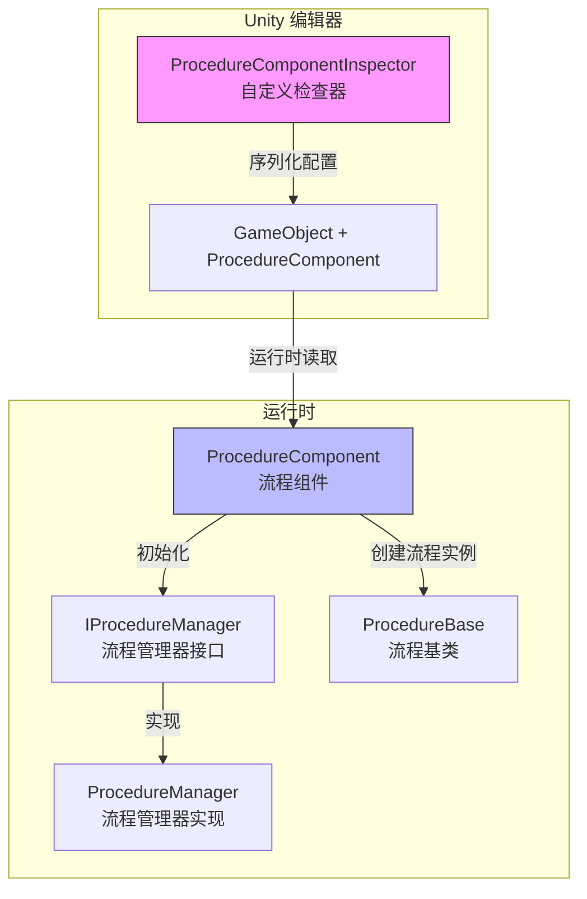
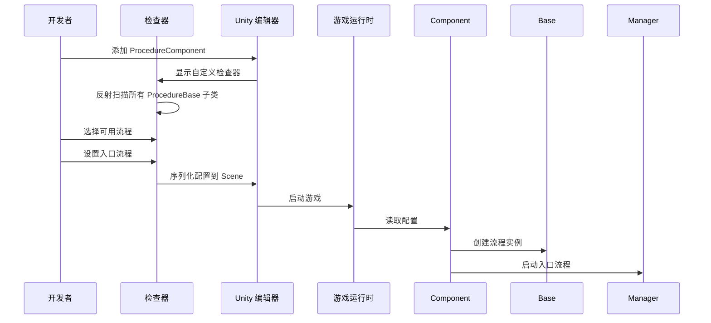

# エディタ使用

このドキュメント介绍如何在 Unity エディタ中設定和使用 Procedure フロー管理コンポーネント。

## 概要

`ProcedureComponentInspector` 是 GameFrameX Procedure フロー管理系统的エディタ拡張，提供します可视化的フロー設定界面。通过该確認器，開発者〜できます：

- 自动发现プロジェクト中所有継承自 `ProcedureBase` 的フロー类
- 可视化选择游戏可用的フロー
- 設定游戏启动时的入口フロー
- 在ランタイム確認当前执行的フロー

## アーキテクチャ



### ワークフロー



## 在シーン中追加フローコンポーネント

### ステップ 1：追加コンポーネント

在 Unity シーン中作成一个空物体或选择现有物体，次に追加 `Procedure` コンポーネント：

1. 在 Hierarchy パネル中选择目标 GameObject
2. 在 Inspector パネル中点击 **Add Component** ボタン
3. 検索 **Game Framework / Procedure** 并追加

> Source: [ProcedureComponent.cs](https://github.com/GameFrameX/com.gameframex.unity.procedure/blob/main/Runtime/Procedure/ProcedureComponent.cs#L20-L21)

```csharp
[DisallowMultipleComponent]
[AddComponentMenu("Game Framework/Procedure")]
public sealed class ProcedureComponent : GameFrameworkComponent
```

**注意：** 该コンポーネント使用了 `[DisallowMultipleComponent]` プロパティ，意味着每个 GameObject 只能追加一个 `ProcedureComponent`。

### ステップ 2：設定コンポーネント

追加コンポーネント后，確認器界面会自动显示以下内容：

| 区域 | 説明 |
|------|------|
| **Available Procedures** | 列出所有可用的フロータイプ（自动发现） |
| **Entrance Procedure** | 設定游戏启动时的第1个フロー |

## 確認器界面详解

### ランタイム情報显示

在游戏ランタイム（Play モード下），確認器会额外显示：

- **Current Procedure**: 当前〜中执行的フロータイプ名称

```csharp
if (EditorApplication.isPlaying)
{
    EditorGUILayout.LabelField("Current Procedure", t.CurrentProcedure == null ? "None" : t.CurrentProcedure.GetType().ToString());
}
```
> Source: [ProcedureComponentInspector.cs](https://github.com/GameFrameX/com.gameframex.unity.procedure/blob/main/Editor/Inspector/ProcedureComponentInspector.cs#L39-L42)

### 可用フロー列表

確認器会自动扫描所有継承自 `ProcedureBase` 的タイプ：

```csharp
m_ProcedureTypeNames = Type.GetRuntimeTypeNames(typeof(ProcedureBase));
```
> Source: [ProcedureComponentInspector.cs](https://github.com/GameFrameX/com.gameframex.unity.procedure/blob/main/Editor/Inspector/ProcedureComponentInspector.cs#L121)

開発者〜できます通过复选框选择〜する必要がありますパッケージ含在游戏中的フロー。

### 入口フロー設定

入口フロー是游戏启动时まず执行的フロー，〜しなければなりません从已选择的可用フロー中选择：

```csharp
int selectedIndex = EditorGUILayout.Popup("Entrance Procedure", m_EntranceProcedureIndex, m_CurrentAvailableProcedureTypeNames.ToArray());
```
> Source: [ProcedureComponentInspector.cs](https://github.com/GameFrameX/com.gameframex.unity.procedure/blob/main/Editor/Inspector/ProcedureComponentInspector.cs#L80)

## 設定例

### 基本設定フロー

1. **作成自定義フロー类**

   まず，作成継承自 `ProcedureBase` 的フロー类：

   ```csharp
   public class ProcedureLaunch : ProcedureBase
   {
       protected override void OnEnter(IFsm<IProcedureManager> procedureOwner)
       {
           base.OnEnter(procedureOwner);
           // 初始化操作
       }

       protected override void OnUpdate(IFsm<IProcedureManager> procedureOwner, float elapseSeconds, float realElapseSeconds)
       {
           base.OnUpdate(procedureOwner, elapseSeconds, realElapseSeconds);
           // 切换到下一个流程
       }
   }
   ```

   > Source: [ProcedureBase.cs](https://github.com/GameFrameX/com.gameframex.unity.procedure/blob/main/Runtime/Procedure/ProcedureBase.cs#L16)

2. **在シーン中設定 ProcedureComponent**

   - 追加 ProcedureComponent 到シーン
   - 在確認器中勾选 `ProcedureLaunch` 作为可用フロー
   - 将 `ProcedureLaunch` 設定为入口フロー

3. **运行游戏**

   游戏启动后会自动执行 `ProcedureLaunch` フロー。

### フロー切换

在自定義フロー中，〜できます使用 `IProcedureManager` 切换到其他フロー：

```csharp
// 获取流程管理器
var procedureManager = Owner.GetComponent<ProcedureComponent>().Procedure;

// 切换到下一个流程
procedureManager.StartProcedure<ProcedureMenu>();
```

## コンポーネントプロパティ説明

| プロパティ | タイプ | 説明 |
|------|------|------|
| m_AvailableProcedureTypeNames | string[] | 可用的フロータイプ名称数组 |
| m_EntranceProcedureTypeName | string | 入口フロー的タイプ名称 |

> Source: [ProcedureComponent.cs](https://github.com/GameFrameX/com.gameframex.unity.procedure/blob/main/Runtime/Procedure/ProcedureComponent.cs#L27-L29)

## よくある問題

### 確認器显示"没有可用フロー"

**原因**：プロジェクト中没有継承自 `ProcedureBase` 的类

**解决メソッド**：確認してください已作成至少一个継承自 `ProcedureBase` 的フロー类，かつこのクラスコンパイル无误。

### 入口フロー显示无效

**原因**：入口フロー未設定或設定的フロー不在可用フロー列表中

**解决メソッド**：在確認器中先选择可用フロー，次に从下拉メニュー中选择入口フロー。

### ランタイム不显示当前フロー

**原因**：游戏未正确启动或 ProcedureComponent 未正确初期化

**解决メソッド**：確認してください ProcedureComponent 已追加到シーン中，且在 Start() メソッド中已正确初期化。

## 関連リンク

- [プラグイン紹介](./1-overview.introduction)
- [機能特性](./1-overview.features)
- [インストールガイド](./2-installation)
- [ProcedureComponent コアコンセプト](./3-core-concepts.procedure-component)
- [ProcedureBase コアコンセプト](./3-core-concepts.procedure-base)
- [IProcedureManager コアコンセプト](./3-core-concepts.iprocedure-manager)
- [ProcedureManager コアコンセプト](./3-core-concepts.procedure-manager)
- [自定義フロー](./4-custom-procedures)
- [常见問題](./6-troubleshooting)
