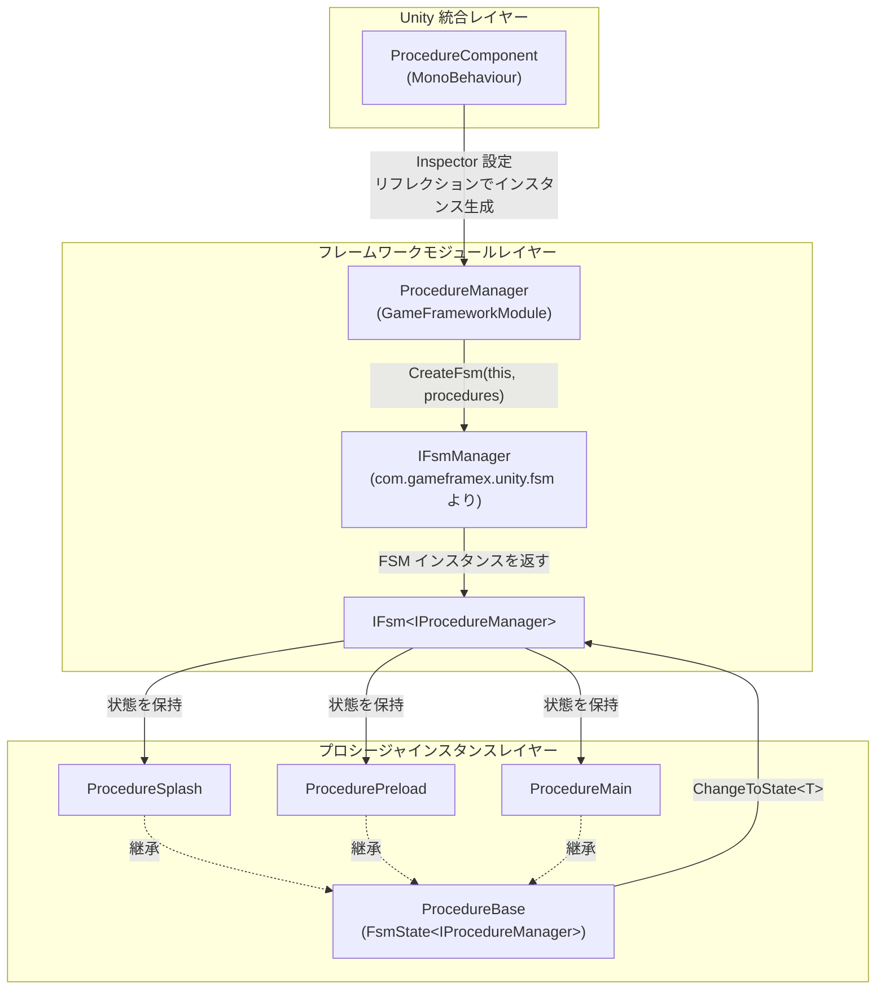

# 動作原理の概要

GameFrameX Procedure は有限状態機械（FSM）をベースとした Unity ゲームフロー管理パッケージです。切り替え可能な「プロシージャ状態」でゲームライフサイクルの各フェーズ（スプラッシュ、プリロード、ログイン、メインメニューなど）を駆動し、各フェーズで完全なライフサイクルコールバックを提供します。基盤は [com.gameframex.unity.fsm](https://github.com/GameFrameX/com.gameframex.unity.fsm) に依存しており、本パッケージは FSM を「プロシージャ」のセマンティクスでラップし、GameFrameX フレームワークに組み込む役割を担います。

## クイックスタート

最小限の利用可能なプロシージャは3ステップで構成されます：

1. **`ProcedureBase` を継承してプロシージャクラスを作成**し、ライフサイクルコールバックにビジネスロジックを配置します。

   ```csharp
   using GameFrameX.Fsm.Runtime;
   using GameFrameX.Procedure.Runtime;

   public class ProcedurePreload : ProcedureBase
   {
       protected internal override void OnEnter(IFsm<IProcedureManager> procedureOwner)
       {
           // リソースや設定などを読み込む
       }

       protected internal override void OnUpdate(IFsm<IProcedureManager> procedureOwner, float elapseSeconds, float realElapseSeconds)
       {
           // 読み込み進捗を確認し、完了後に次のプロシージャへ切り替える
           ChangeToState<ProcedureMain>(procedureOwner);
       }
   }

   public class ProcedureMain : ProcedureBase
   {
       protected internal override void OnEnter(IFsm<IProcedureManager> procedureOwner)
       {
           // メインメニューを表示
       }
   }
   ```

   出典: [README.zh-CN.md](https://github.com/GameFrameX/com.gameframex.unity.procedure/blob/main/README.zh-CN.md#L88-L110)

2. **`ProcedureComponent` をアタッチ**：ゲームオブジェクトに `GameFrameX/Procedure` コンポーネントを追加します（メニュー `GameFrameX > Procedure` から）。出典: [ProcedureComponent.cs](https://github.com/GameFrameX/com.gameframex.unity.procedure/blob/main/Runtime/Procedure/ProcedureComponent.cs#L43-L46)

3. **Inspector で** `Available Procedures`（利用可能なプロシージャ型名の配列）と `Entrance Procedure`（エントリープロシージャ）を設定し、ゲームを実行するとエントリープロシージャから自動的に進行を開始します。出典: [ProcedureComponent.cs](https://github.com/GameFrameX/com.gameframex.unity.procedure/blob/main/Runtime/Procedure/ProcedureComponent.cs#L51-L53)

## 動作原理の概要

全体メカニズムは3つのレイヤーで構成されています：`ProcedureComponent`（Unity 統合レイヤー）→ `ProcedureManager`（フレームワークモジュールレイヤー）→ `ProcedureBase`（プロシージャインスタンスレイヤー）。コンポーネントが Inspector からプロシージャタイプリストを読み取り、リフレクションでインスタンスを生成してマネージャーに初期化を渡します。マネージャーは内部で FSM マネージャーを通じて状態機械を作成し、各プロシージャが FSM 状態に対応し、状態間の切り替えは `ChangeToState<T>` によってトリガーされます。



重要なポイント：

- **統合エントリーポイント**：`ProcedureComponent` には `[GameFrameXAutoComponent(-1000)]` が付与されており、フレームワークが優先度に従って自動的にマウントします。出典: [ProcedureComponent.cs](https://github.com/GameFrameX/com.gameframex.unity.procedure/blob/main/Runtime/Procedure/ProcedureComponent.cs#L43-L46)
- **マネージャーインスタンス**：`ProcedureManager` は `GameFrameworkModule` で、`Priority` は `-2` です。すべての通常の業務モジュールより先にポーリングされ、最後にシャットダウンされます。出典: [ProcedureManager.cs](https://github.com/GameFrameX/com.gameframex.unity.procedure/blob/main/Runtime/Procedure/ProcedureManager.cs#L59-L62)
- **状態機械の作成**：`Initialize` はすべてのプロシージャを状態として `IFsmManager.CreateFsm` に渡し、`IProcedureManager` をオーナーとする FSM を取得します。出典: [ProcedureManager.cs](https://github.com/GameFrameX/com.gameframex.unity.procedure/blob/main/Runtime/Procedure/ProcedureManager.cs#L130-L141)
- **プロシージャ基底クラス**：`ProcedureBase : FsmState<IProcedureManager>` で、FSM の6つのライフサイクルコールバックを直接再利用します：`OnInit` / `OnEnter` / `OnUpdate` / `OnFixedUpdate` / `OnLeave` / `OnDestroy`。出典: [ProcedureBase.cs](https://github.com/GameFrameX/com.gameframex.unity.procedure/blob/main/Runtime/Procedure/ProcedureBase.cs#L38-L79)
- **状態切り替えエントリーポイント**：`ProcedureBase` は `ChangeToState<T>(procedureOwner)` を公開し、同一 FSM 内の状態遷移をトリガーします。FSM は自動的に旧状態の `OnLeave` と新状態の `OnEnter` を呼び出します。出典: [ProcedureManager.cs](https://github.com/GameFrameX/com.gameframex.unity.procedure/blob/main/Runtime/Procedure/ProcedureManager.cs#L130-L156)

## 起動と実行フロー

1. コンポーネントの `Awake`/`Start` 段階で `m_AvailableProcedureTypeNames` と `m_EntranceProcedureTypeName` を読み取り、リフレクションで `ProcedureBase` 配列を取得します。出典: [ProcedureComponent.cs](https://github.com/GameFrameX/com.gameframex.unity.procedure/blob/main/Runtime/Procedure/ProcedureComponent.cs#L51-L53)
2. フレームワーク内部で `GameEntry` から `IFsmManager` を取得し、`ProcedureManager.Initialize(fsmManager, procedures)` を呼び出します。出典: [ProcedureManager.cs](https://github.com/GameFrameX/com.gameframex.unity.procedure/blob/main/Runtime/Procedure/ProcedureManager.cs#L130-L141)
3. `StartProcedure<T>()` を呼び出すと、FSM が現在の状態をエントリープロシージャに切り替え、最初の `OnEnter` をトリガーします。出典: [ProcedureManager.cs](https://github.com/GameFrameX/com.gameframex.unity.procedure/blob/main/Runtime/Procedure/ProcedureManager.cs#L148-L156)
4. 実行中、FSM は毎フレーム現在のプロシージャの `OnUpdate` / `OnFixedUpdate` をポーリングし、各プロシージャは条件を満たした際に `ChangeToState<T>` を呼び出して状態遷移を推進します。
5. シャットダウン時には `ProcedureManager.Shutdown` が FSM を破棄し、参照を解放します。出典: [ProcedureManager.cs](https://github.com/GameFrameX/com.gameframex.unity.procedure/blob/main/Runtime/Procedure/ProcedureManager.cs#L110-L122)

### `UseStartupRunner` モード

デフォルト（`m_UseStartupRunner = false`）では、`ProcedureComponent.Start` が独自に Inspector 設定を読み取ってプロシージャを起動します。有効化すると：

- コンポーネントは `Awake` で `IProcedureManager` を登録するのみで、**プロシージャの自動初期化や起動は行いません**。
- 起動は `ApplicationStartupEntry` が `StartupRunner.Run` を通じて引き継ぎます。これは複数モジュールの統一起動シーケンスや、プロシージャ起動前に他の初期化を完了させる必要があるシナリオに適しています。出典: [ProcedureComponent.cs](https://github.com/GameFrameX/com.gameframex.unity.procedure/blob/main/Runtime/Procedure/ProcedureComponent.cs#L56-L66)

## 次に進む

- 独自のプロシージャを作成して統合したい：`ProcedureBase` サブクラスの定義から始め、README の「使用例」を参照してください。
- 各ライフサイクルコールバックの詳細を知りたい：`ProcedureBase` の6つのコールバックのセマンティクスを参照してください（`OnInit` → `OnEnter` → `OnUpdate` / `OnFixedUpdate` → `OnLeave` → `OnDestroy`）。
- 「FSM がすでに存在する / 重複起動」などの問題を排查したい：`UseStartupRunner` モードとデフォルトモードを同時に使用していないか確認してください。
- 基盤となる FSM の動作を知りたい：依存パッケージ [com.gameframex.unity.fsm](https://github.com/GameFrameX/com.gameframex.unity.fsm) を参照してください。